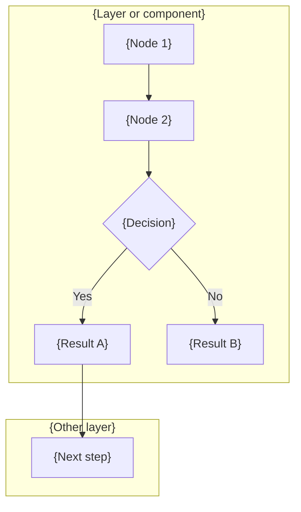
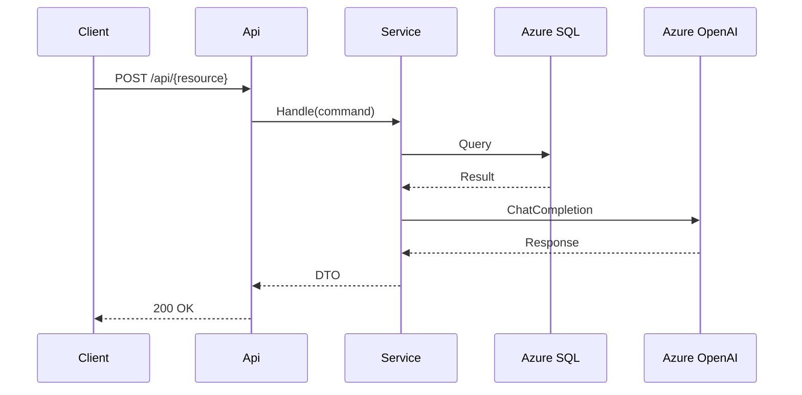

# Doc Standards — Legal Ai Ar

Templates and conventions for the project's three documentation formats.

## 1. Markdown documents

### Locations

| Type | Folder | Naming |
|------|--------|--------|
| **Architecture standard** | `docs/standards/` | `pwc-internal-app-architecture.md` (single reference for internal PwC apps) |
| Technical doc | `docs/technical/` | `{NN}-{kebab-title}.md` (sequential from 01) |
| ADR | `docs/adr/` | `ADR-{NNN}-{kebab-title}.md` |
| Guide | `docs/` | `guide-{topic}.md` |
| Work item | `docs/roadmap/{Feature}/` | `F{XX} - W{YY} - {Title}.md` |

### Technical document template

```markdown
# {NN} — {Title}

> Technical document — Legal Ai Ar

## Executive summary

{2-3 paragraphs: context, problem, adopted solution}

## Context and motivation

{Why it is needed. What problem it solves.}

## Design

### {Subsection}

{Detail. Include Mermaid diagrams where they add clarity.}

## Design decisions

| Decision | Alternatives | Chosen | Reason |
|----------|-------------|--------|--------|
| ... | ... | ... | ... |

## System impact

{Affected components. Required changes.}

## References

- {Internal or external links}

---

*{NN} — {Title} — Legal Ai Ar*
```

### ADR template

```markdown
# ADR-{NNN}: {Title}

> Architecture Decision Record — Legal Ai Ar

**Date**: {YYYY-MM-DD}
**Status**: Proposed | Accepted | Rejected | Superseded by ADR-{XXX}

## Context

{Situation that motivates the decision. 1-2 paragraphs.}

## Decision

{The decision made. Be specific.}

## Consequences

### Positive
- {Benefit 1}

### Negative
- {Trade-off 1}

### Risks
- {Risk and mitigation}

## Alternatives considered

### {Alternative 1}
- **Description**: {what it is}
- **Rejected because**: {reason}

### {Alternative 2}
- **Description**: {what it is}
- **Rejected because**: {reason}

---

*ADR-{NNN}: {Title} — Legal Ai Ar*
```

### Markdown conventions

- Language: English
- Headings: `#` for title, `##` for sections, `###` for subsections
- Tables: for comparisons and decisions
- Inline code: backticks for class names, files, commands
- Code blocks: with the language specified (```csharp, ```typescript, ```bash)
- Internal links: relative to the repo root (`docs/technical/01-rag-retrieval.md`)
- Footer: always in italics with the document name and "Legal Ai Ar"

---

## 2. Mermaid diagrams

Two types: flowchart (data/process flows) and sequence (communication between components).

### Flowchart — architecture flows



**Flowchart conventions:**
- `TD` (top-down) for pipelines and vertical flows
- `LR` (left-right) for horizontal data flows
- `subgraph` to group by layer (Api, Application, Infrastructure, Agents)
- Rectangular nodes `[]` for processes, diamonds `{}` for decisions, cylinders `[()]` for storage
- Labels in English, no cryptic abbreviations
- Max ~15 nodes per diagram. If more, split into sub-diagrams.

### Sequence — communication between components



**Sequence conventions:**
- Participants with a short alias (A, S, DB, AI) and a readable name
- Solid arrows `->>` for calls, dashed `-->>` for responses
- Include the HTTP method and route in API calls
- `alt`/`opt`/`loop` for conditional flows
- Max ~8 participants. If more, split by scope.

### Diagram location

- **Inline in docs**: inside the .md using ```mermaid blocks
- **Separate file**: `docs/{context}/{name}.mermaid` when the diagram is standalone
- Separate diagram only if it is referenced from multiple documents

### Validation

Before delivering, verify the diagram renders correctly. Common errors:
- Special characters in labels (use quotes: `A["Text with (parentheses)"]`)
- Missing spaces around arrows
- subgraph without a closing `end`

---

## 3. When to use each format

| Need | Format |
|------|--------|
| Explain a design decision | ADR |
| Document a component/system | Technical doc (.md) |
| Show data flow or pipeline | Flowchart (Mermaid) |
| Show interaction between services | Sequ