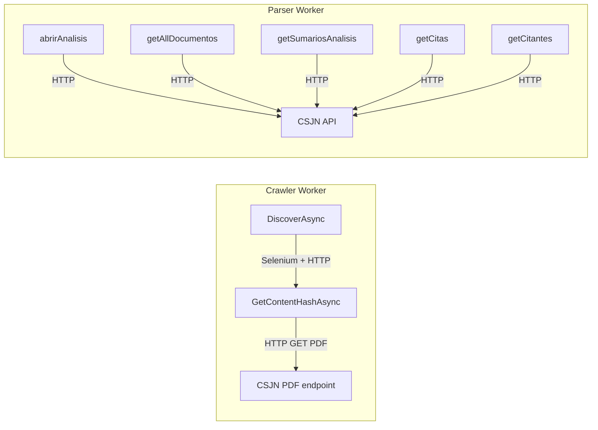
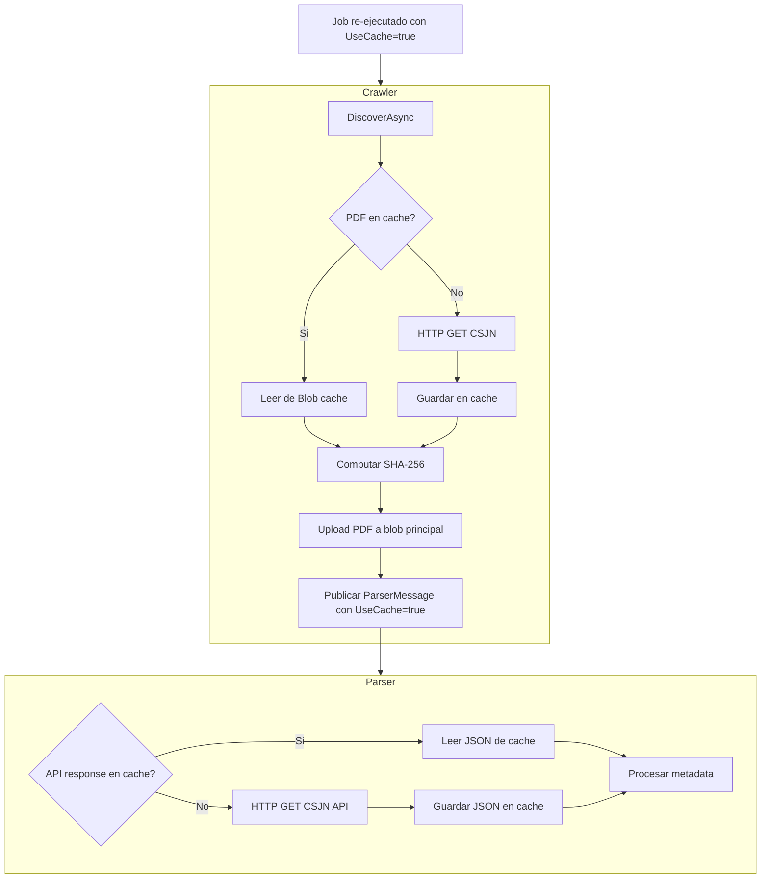

# External Download Cache (Cache de Descargas Externas)

## Problema actual

Al re-ejecutar un job, las descargas externas a CSJN se repiten innecesariamente:

- **Crawler** (`CsjnCrawlerSource`): re-descarga PDFs via `verDocumentoById.html` (aunque ya los tenemos en Blob).
- **Parser** (`CsjnApiParser`): re-llama a 5 endpoints CSJN (`abrirAnalisis`, `getAllDocumentos`, `getSumariosAnalisis`, `getCitas`, `getCitantes`) para obtener metadata JSON.
- Ademas, el dedup del crawler (`ExistsByExternalIdAsync`) hace skip total del documento, impidiendo reprocesar con reglas de negocio nuevas.

## Flujo de descargas externas a cachear




## Solucion: Blob-backed External Download Cache

### 1. Nuevo servicio `IExternalDownloadCache`

Nueva interfaz en [LegalAiAr.Core/Interfaces/Services/](backend/src/shared/LegalAiAr.Core/Interfaces/Services/):

```csharp
public interface IExternalDownloadCache
{
    Task<byte[]?> GetAsync(string cacheKey, CancellationToken ct = default);
    Task SetAsync(string cacheKey, byte[] content, CancellationToken ct = default);
    Task<bool> ExistsAsync(string cacheKey, CancellationToken ct = default);
}
```

Implementacion `BlobExternalDownloadCache` en [LegalAiAr.Infrastructure/Blob/](backend/src/shared/LegalAiAr.Infrastructure/Blob/): usa el mismo `BlobContainerClient` del container `rulings-pdfs` pero con prefijo `_cache/`.

### 2. Convencion de paths de cache (`CachePathHelper`)

Nuevo helper en [LegalAiAr.Core/Blob/CachePathHelper.cs](backend/src/shared/LegalAiAr.Core/Blob/CachePathHelper.cs):

```
_cache/{source}/pdf/{documentId}.pdf
_cache/{source}/api/abrirAnalisis/{analysisId}.json
_cache/{source}/api/getAllDocumentos/{analysisId}.json
_cache/{source}/api/getSumariosAnalisis/{analysisId}.json
_cache/{source}/api/getCitas/{documentId}.json
_cache/{source}/api/getCitantes/{documentId}.json
```

El prefijo `_cache/` asegura separacion del contenido de pipeline (`legal-ai-ar-kb/...`). Clave inmutable por `sourceId + documentId/analysisId`, independiente del path final del PDF (que el parser mueve segun fecha).

### 3. Integracion en `CsjnCrawlerSource` (PDF download)

En [CsjnCrawlerSource.cs](backend/src/workers/LegalAiAr.Worker.Crawler/Sources/CsjnCrawlerSource.cs), metodo `GetContentHashAsync`:

- **Antes del HTTP GET**: si `UseCache`, llamar `cache.GetAsync(CachePathHelper.PdfCacheKey(sourceId, documentId))`
- Si existe en cache: computar SHA-256 de los bytes cacheados, retornar `CrawlerDocumentContent` sin HTTP
- Si no existe: descargar normalmente via HTTP, guardar en cache via `cache.SetAsync(...)`, retornar

### 4. Integracion en `CsjnApiParser` (5 API endpoints)

En [CsjnApiParser.cs](backend/src/workers/LegalAiAr.Worker.Parser/Parsers/CsjnApiParser.cs), metodo `GetWithRetryAsync`:

- **Antes del HTTP GET**: si `UseCache`, llamar `cache.GetAsync(cacheKey)`
- Si existe: deserializar JSON del byte[] cacheado, retornar `JsonElement`
- Si no existe: llamar HTTP normalmente, guardar respuesta raw en cache, retornar
- El `cacheKey` se construye via `CachePathHelper.ApiCacheKey(sourceId, endpoint, id)`

### 5. Flag `UseCache` en mensajes de cola

Modificar [CrawlerMessage.cs](backend/src/shared/LegalAiAr.Core/Messages/CrawlerMessage.cs):

```csharp
public record CrawlerMessage(
    int SourceId,
    string DocumentType = "ruling",
    string Type = "incremental",
    DateOnly? Since = null,
    DateOnly? DateFrom = null,
    DateOnly? DateTo = null,
    Guid? IngestionJobId = null,
    bool UseCache = false);       // <-- nuevo
```

Modificar [ParserMessage.cs](backend/src/shared/LegalAiAr.Core/Messages/ParserMessage.cs):

```csharp
public record ParserMessage(
    int SourceId,
    string DocumentId,
    string? AnalysisId,
    string BlobPathPdf,
    string ContentHash,
    CsjnApiMetadata? ApiMetadata,
    Guid? IngestionJobId = null,
    bool UseCache = false);       // <-- nuevo
```

- `UseCache = false` (default): descarga normal, pero **siempre escribe al cache** (write-through). Asi el cache se va poblando automaticamente.
- `UseCache = true`: busca en cache primero; si no existe, descarga y cachea igualmente.

### 6. Propagacion del flag

En [CrawlerWorkerService.cs](backend/src/workers/LegalAiAr.Worker.Crawler/CrawlerWorkerService.cs), al construir `ParserMessage`:

- Propagar `UseCache` del `CrawlerMessage` al `ParserMessage`

En `CsjnCrawlerSource` y `CsjnApiParser`:

- Recibir `useCache` como parametro en los metodos de descarga, o inyectarlo como config de sesion

### 7. Flujo con cache




### 8. Modo reprocess en crawler (complementario)

Para el escenario "quiero reprocesar los mismos documentos con nuevas reglas", tambien se necesita que el crawler no haga skip por dedup. Agregar `Reprocess: bool` a `CrawlerMessage`:

- `Reprocess = true`: skip de `ExistsByExternalIdAsync` y `ExistsByContentHashAsync`, permite reprocesar documentos ya existentes.
- Combinado con `UseCache = true`: reprocesa todo sin descargar nada de CSJN.

### 9. Admin API y UI

Exponer en el endpoint de "Run Crawler" ([JobsAdminController.cs](backend/src/api/LegalAiAr.Api/Controllers/Admin/JobsAdminController.cs)) los nuevos flags:

- Checkbox "Usar cache de descargas" y "Modo reprocesamiento" en la UI de admin

### 10. Registracion DI

- Registrar `IExternalDownloadCache` como singleton en [ServiceCollectionExtensions.cs](backend/src/shared/LegalAiAr.Infrastructure/ServiceCollectionExtensions.cs)
- Inyectar en `CsjnCrawlerSource` (via constructor o factory) y en `CsjnApiParser`

## Archivos principales a crear/modificar

**Nuevos:**

- `backend/src/shared/LegalAiAr.Core/Interfaces/Services/IExternalDownloadCache.cs`
- `backend/src/shared/LegalAiAr.Core/Blob/CachePathHelper.cs`
- `backend/src/shared/LegalAiAr.Infrastructure/Blob/BlobExternalDownloadCache.cs`

**Modificar:**

- `backend/src/shared/LegalAiAr.Core/Messages/CrawlerMessage.cs` — agregar `UseCache`, `Reprocess`
- `backend/src/shared/LegalAiAr.Core/Messages/ParserMessage.cs` — agregar `UseCache`
- `backend/src/workers/LegalAiAr.Worker.Crawler/Sources/CsjnCrawlerSource.cs` — integrar cache en `GetContentHashAsync`
- `backend/src/workers/LegalAiAr.Worker.Parser/Parsers/CsjnApiParser.cs` — integrar cache en `GetWithRetryAsync`
- `backend/src/workers/LegalAiAr.Worker.Crawler/CrawlerWorkerService.cs` — propagar flags, skip dedup en modo reprocess
- `backend/src/shared/LegalAiAr.Infrastructure/ServiceCollectionExtensions.cs` — registrar cache
- `backend/src/workers/LegalAiAr.Worker.Crawler/Extensions/CrawlerServiceExtensions.cs` — DI
- `backend/src/workers/LegalAiAr.Worker.Parser/Extensions/ParserServiceExtensions.cs` — DI
- Admin API y modelos de request — exponer flags

