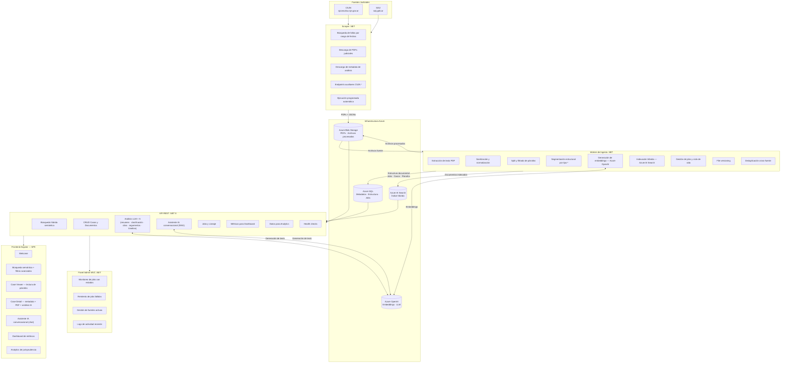

# FEATURES-BASELINE — Legal AI AR

> **Versión:** 1.0
> **Fecha:** Marzo 2026
> **Autor:** Análisis funcional sobre POC (backend Python + frontend Angular + scraper .NET)
> **Estado:** Borrador — pendiente de aprobación

---

## 1. Funcionalidades confirmadas (del POC)

Todo lo que figura aquí fue validado end-to-end durante el POC con datos
reales de CSJN (≈1.370 fallos de diciembre 2024).

---

### 1.1 Scraper de fuente judicial (.NET — CSJN)

Fuente validada: **sjconsulta.csjn.gov.ar** (Corte Suprema de Justicia de la Nación).

- Búsqueda de fallos por rango de fechas, con paginación automática (Selenium
  Chrome + fallback HTTP sin Selenium).
- Extracción de metadatos por fallo: caratula, expediente, fecha, materia,
  tipo de recurso, competencia, sentido del pronunciamiento, flags
  (inconstitucional, sentencia arbitraria, tiene votos, tiene control, etc.).
- Generación de índice JSON mensual por rango de fechas.
- Descarga de PDF judicial por ID de documento.
- Descarga de metadata de análisis estructurado (`abrirAnalisis`) por ID de
  análisis.
- Tolerancia a errores: reintentos con backoff exponencial, registro de
  errores en JSON, sanitización de XML malformado, detección de respuestas
  HTML de error en lugar de datos.
- Detección de descargas ya realizadas (idempotencia por archivo).

---

### 1.2 Pipeline de ingesta de casos (Worker Python)

- Registro de job de ingesta (CASES_INGESTA) con ciclo de vida completo:
  PENDING → PROCESSING → COMPLETED / FAILED.
- Resolución y carga de archivos fuente (PDF + JSON de análisis) desde Azure
  Blob Storage con versionado automático (FileVersioningService).
- Extracción de texto de PDF (PdfTextExtractor).
- Sanitización y normalización del texto extraído (CaseTextSanitizer).
- Split de párrafos y filtrado de bloques de baja utilidad (ParagraphSplitter
  + ParagraphFilter).
- Persistencia de estructura documental plana en Azure SQL: 1 documento →
  1 sección DOCUMENT_BODY → N párrafos ordenados (FLAT_STRUCTURE_V1).
- Generación de embeddings por párrafo vía Azure OpenAI.
- Indexación híbrida (vectorial + keyword) en Azure AI Search con metadatos
  del caso (caratula, año, fuente, IDs de referencia).
- Actualización de estado del caso (CaseStatus) al finalizar.
- Bootstrap script de carga masiva inicial desde Azure Blob Storage
  (cases_bootstrap.py), con deduplicación por external_document_id.

---

### 1.3 API REST de Knowledge Base (FastAPI Python)

| Recurso | Operaciones validadas |
|---|---|
| `/cases` | Listar (paginado, filtros por estado/fuente), obtener por ID |
| `/documents` | Listar por caso, obtener por ID |
| `/documents/{id}/sections` | Listar secciones de un documento |
| `/sections/{id}/paragraphs` | Listar párrafos paginados de una sección |
| `/judges` | Listar jueces |
| `/jobs` | Listar (paginado, filtros), obtener por ID con archivos |
| `/jobs/thesaurus-ingesta` | Crear job de ingesta de tesauro (carga de PDFs) |
| `/search` | Búsqueda híbrida semántica, agrupada por caso, con score |
| `/lineage/jobs/{id}` | Trazabilidad de archivos generados por un job |
| `/lineage/entities/{id}/versions` | Historial de versiones de archivos por entidad |
| `/health` | Health checks de dependencias |

---

### 1.4 Análisis con LLM (Azure OpenAI)

Los 5 análisis siguientes fueron probados con casos reales y devolvieron
resultados de calidad aceptable:

- **Resumen estructurado:** hechos relevantes, cuestión jurídica principal,
  fundamentos clave, decisión final, impacto jurídico potencial.
- **Clasificación jurídica:** rama del derecho, submateria, tipo de decisión,
  nivel de precedente (bajo / medio / alto / leading_case).
- **Extracción de citas:** normativa citada (tipo, nombre, artículo,
  relevancia) y jurisprudencia citada (tribunal, caso, año, doctrina aplicada).
- **Mapa argumentativo:** tesis principal, argumentos a favor y en contra,
  estándar de prueba aplicado, tipo de control.
- **Timeline procesal:** línea de tiempo con fecha, evento y tipo
  (procesal / material).
- **Análisis completo:** orquestador que ejecuta los 5 análisis anteriores
  en secuencia y consolida los resultados.

---

### 1.5 Frontend SPA (Angular 17)

- **Welcome page:** landing con acceso rápido a búsqueda y casos recientes.
- **Búsqueda semántica:** campo de texto libre con resultados que muestran
  score de relevancia, extracto del párrafo, caratula, año y fuente. Conectada
  al endpoint de búsqueda híbrida del backend.
- **Case Viewer:** lectura del texto completo del fallo con virtual scroll
  de párrafos. Permite navegación por secciones y deep link a párrafo específico.
- **Case Detail:** ficha de metadatos del caso + visor de PDF (iframe) +
  panel completo de análisis IA con 5 pestañas (resumen, clasificación, citas,
  argumentos, timeline). Conectada al backend real.
- **Shell de aplicación:** header fijo con logo PwC + glassmorphism, sidebar
  de 280px con grupos de navegación, sistema de tokens AppKit4 de PwC.

---

## 2. Funcionalidades requeridas (nuevas)

Features que el sistema debe tener en v1 según la arquitectura definida
y que no estaban presentes en el POC.

---

### 2.1 Reescritura completa del backend en C# / .NET 8

El POC validó la lógica de negocio con Python/FastAPI. Para v1, toda la
capa de backend se reescribe en C# / .NET 8:

- **API REST pública** en ASP.NET Core (Web API): endpoints de búsqueda,
  casos, documentos, análisis IA, asistente conversacional y jobs. Los
  contratos se rediseñan desde cero sin obligación de compatibilidad con
  el POC.
- **Worker de ingesta** en C# (reemplaza el worker Python): scraper,
  pipeline de procesamiento de PDFs, generación de embeddings e indexación
  en Azure AI Search.
- **Panel de Administración MVC** en ASP.NET Core MVC (ver 2.2).
- Stack de dependencias: Azure.AI.OpenAI, Azure.Search.Documents,
  Azure.Storage.Blobs, Entity Framework Core + Azure SQL.

---

### 2.2 Panel de Administración MVC (Must Have)

Interfaz web para operación y monitoreo del sistema, integrada en el
proyecto .NET:

- Listado y detalle de jobs de ingesta con estado (PENDING / PROCESSING /
  COMPLETED / FAILED), timestamps y mensajes de error.
- Posibilidad de reintentar un job fallido manualmente.
- Vista de casos en el sistema: total, por estado, por fuente.
- Vista del estado del índice de búsqueda (Azure AI Search): documentos
  indexados, última actualización.
- Gestión básica de fuentes: habilitar / deshabilitar fuentes de ingesta.
- Logs de actividad reciente (últimas N ejecuciones del scraper y del worker).

---

### 2.3 Asistente IA Conversacional (Must Have)

Feature central del producto: permite consultar la base de jurisprudencia
en lenguaje natural.

- Página "Asistente IA" en el frontend (actualmente sin implementar).
- Patrón RAG (Retrieval-Augmented Generation): el asistente recupera
  párrafos relevantes de Azure AI Search y los usa como contexto para
  generar la respuesta vía Azure OpenAI.
- Soporte de conversación multi-turno (memoria de contexto dentro de la
  sesión).
- Indicación de fuentes utilizadas en cada respuesta (caso, tribunal,
  fecha) para trazabilidad legal.
- Endpoint en la API .NET: `POST /chat` con historial de mensajes y
  respuesta generada.
- Scope restringido: el asistente responde exclusivamente sobre la
  jurisprudencia indexada.

---

### 2.4 Scraper SAIJ

Incorporar el portal SAIJ (saij.gob.ar) como segunda fuente de fallos,
en paralelo a CSJN. El scraper se reescribe en C# como parte del worker:

- Servicio de búsqueda y descarga de fallos desde el portal SAIJ.
- Extracción de metadatos en el formato propio de SAIJ.
- Mapeo al modelo de dominio unificado para que el pipeline de ingesta
  sea agnóstico a la fuente.
- Estrategia de deduplicación entre fuentes (un mismo fallo puede
  aparecer en CSJN y SAIJ).

---

### 2.5 Orquestación automática de ingesta (End-to-End)

En el POC, el proceso es completamente manual y desconectado. Para v1 se
requiere un flujo automatizado sin intervención del equipo:

- Ejecución programada del scraper (CSJN + SAIJ) según frecuencia
  configurable.
- Carga directa de los archivos descargados a Azure Blob Storage.
- Disparo automático del job de ingesta en el worker al detectar nuevos
  archivos.
- Notificación ante fallos críticos del pipeline (email o canal de
  mensajería).

---

### 2.6 Reestructuración del frontend Angular

El frontend del POC se reestructura completamente. Se preserva el sistema
de diseño PwC AppKit4 (paleta de colores, tipografía, tokens SCSS) pero
se rediseña la arquitectura de páginas y componentes para reflejar las
funcionalidades de v1:

- Nuevas páginas: Dashboard, Analytics, Asistente IA conversacional.
- Reestructuración de la navegación del sidebar según las secciones
  definitivas del producto.
- Rediseño de la búsqueda con filtros avanzados (fuente, tribunal, materia,
  rango de fechas).
- Rediseño de la vista de caso integrando el nuevo contrato de la API .NET.
- Componentes reutilizables alineados con el design system PwC (cards,
  badges, stats, tablas, chat bubble).

---

### 2.7 Dashboard de métricas

- KPIs de la knowledge base: total de fallos indexados, desglose por
  fuente (CSJN / SAIJ) y por año.
- Estado del pipeline: jobs en las últimas 24/48 hs, tasa de éxito/error.
- Métricas de uso: queries ejecutadas, temas más consultados.
- Tendencias: evolución temporal del corpus (fallos ingresados por mes).

---

### 2.8 Analytics de jurisprudencia

- Distribución de fallos por materia / rama del derecho.
- Ranking de normas más citadas (basado en extracción de citas LLM).
- Evolución temporal de materias (qué temas ganan o pierden volumen).
- Filtros interactivos por fuente, tribunal y rango de fechas.

---

### 2.9 Segmentación estructural de documentos (nuevo enfoque)

El objetivo es clasificar cada fallo en secciones semánticas según su
tipo de documento (sentencia completa, resolución breve, sentencia con
dictamen) para habilitar una búsqueda más precisa y análisis
diferenciados por sección.

El primer enfoque (pipeline LLM classifier/proposer/judge) fue descartado
por inconsistencia de resultados. Para v1 se requiere definir e implementar
una nueva estrategia, que puede incluir:

- Reglas deterministas basadas en patrones léxicos del texto judicial.
- Fine-tuning o few-shot prompting con ejemplos anotados por tipo de fallo.
- Segmentación híbrida: reglas como primera pasada, LLM para casos ambiguos.

**Precondición:** Requiere un spike técnico para comparar enfoques y definir
el conjunto de tipos de documento antes de comprometer implementación.

---

## 3. Funcionalidades descartadas

Features que fueron construidos o explorados durante el POC y se decide
explícitamente no incluir en v1, con justificación.

---

### 3.1 Primer intento de segmentación estructural con LLM
(classifier → proposer → judge)

**Qué era:** Un pipeline de tres etapas que usaba Azure OpenAI para
segmentar semánticamente cada fallo en secciones tipificadas: HEADER,
FACTS, PROCEDURAL_HISTORY, LEGAL_ISSUES, LEGAL_REASONING, HOLDING,
DISPOSITION.

**Por qué se descarta este enfoque:** Los resultados fueron inconsistentes
entre distintos tipos de fallos. La variabilidad de formato en los
documentos judiciales argentinos dificulta un segmentador confiable sin
un dataset de entrenamiento anotado. El costo en tokens y latencia fue
desproporcionado para la calidad obtenida.

**Qué persiste:** El objetivo de segmentar cada documento según su tipo
para habilitar una búsqueda más inteligente se mantiene como requerimiento
de v1. Se requiere definir un nuevo enfoque (ver Sección 2.9).

---

### 3.2 Stack Python / FastAPI

**Qué era:** Todo el backend del POC — API REST, worker de ingesta,
servicios de análisis LLM — construido en Python con FastAPI,
SQLAlchemy y Alembic.

**Por qué se descarta:** La decisión arquitectural de v1 es consolidar
todo el backend en C# / .NET 8, alineando la plataforma con el stack
de PwC y habilitando el Panel de Administración MVC en el mismo proyecto.

**Decisión:** El código Python queda archivado como referencia de la
lógica de negocio validada en el POC. Toda la lógica se re-implementa
en C# / .NET 8.

---

## 4. Gaps detectados

Áreas que el diseño actual no cubre y que deberían discutirse y resolverse
antes o durante el desarrollo de v1.

---

### 4.1 Persistencia de resultados de análisis LLM

**Gap:** Los 5 endpoints de análisis re-ejecutan el LLM cada vez que se
los llama. No existe almacenamiento de resultados previos.

**Impacto:** Alto costo en tokens de Azure OpenAI, alta latencia para el
usuario (~10–30 segundos por análisis completo) y comportamiento no
determinista ante la misma consulta.

**A discutir:** ¿Se persisten los resultados en Azure SQL al primer
análisis y se sirven desde caché en adelante? ¿Con qué estrategia de
invalidación (ej: nueva versión del documento)?

---

### 4.2 Deduplicación de fallos entre fuentes

**Gap:** CSJN y SAIJ pueden publicar el mismo fallo. El modelo de dominio
no define una estrategia de deduplicación cross-fuente.

**Impacto:** El mismo fallo podría ser indexado dos veces con distinto ID
interno, degradando la calidad de búsqueda y duplicando el costo de
procesamiento.

**A discutir:** ¿Se usa el número de expediente como clave de
deduplicación? ¿Se define una fuente "canónica" por tribunal? ¿Se
fusionan registros o se descarta el duplicado al ingestar?

---

### 4.3 Estrategia de actualización del corpus

**Gap:** No existe un proceso definido para detectar y re-ingestar fallos
que fueron modificados o corregidos en la fuente. El sistema de versioning
de archivos existe en el dominio pero no hay ningún trigger que lo active.

**Impacto:** El corpus puede quedar desactualizado silenciosamente respecto
a la fuente oficial.

**A discutir:** ¿Con qué frecuencia se re-consulta la fuente en busca de
actualizaciones? ¿Se compara por hash o por fecha de modificación?
¿Se re-indexa el caso completo o solo los párrafos modificados?

---

### 4.4 Cobertura histórica del corpus

**Gap:** El POC procesó solo diciembre 2024. CSJN tiene décadas de
jurisprudencia acumulada. No hay una estrategia definida para el backfill
histórico.

**Impacto:** Sin datos históricos, la plataforma tiene valor limitado para
el análisis de precedentes y tendencias.

**A discutir:** ¿Hasta qué año se hace backfill? ¿En qué orden (más
reciente primero)? ¿Qué volumen estimado de fallos existe en CSJN y SAIJ
históricamente? ¿Cuánto tiempo/costo implica la ingesta inicial completa?

---

### 4.5 Escalabilidad del worker de ingesta

**Gap:** El worker actual procesa jobs de manera secuencial en un único
proceso. No hay paralelismo, ni cola de mensajes, ni mecanismo de
backpressure.

**Impacto:** Con un corpus histórico de miles de fallos, el tiempo de
ingesta inicial puede ser prohibitivo. Ante picos de nuevos documentos,
el worker no puede escalar horizontalmente.

**A discutir:** ¿Se incorpora Azure Service Bus o Azure Queue Storage
como bus de mensajes? ¿Se escala el worker con múltiples instancias?
¿Qué nivel de paralelismo tolera Azure AI Search en operaciones de
indexación masiva?

---

### 4.6 Enriquecimiento con endpoints auxiliares del scraper CSJN

**Gap:** El scraper actual descarga solo el PDF y el `abrirAnalisis.json`
por cada fallo. Existen 7 endpoints adicionales en el portal CSJN que
proveen información potencialmente valiosa y son técnicamente accesibles
con el scraper actual:

| Endpoint | Contenido |
|---|---|
| `getSumariosAnalisis` | Sumarios jurídicos redactados por CSJN |
| `getSintesisAnalisis` | Síntesis del fallo |
| `getDictamenesAnalisis` | Dictámenes del Procurador General |
| `getCitantes` | Fallos que citan a este documento |
| `getCitas` | Normas y fallos citados por este documento |
| `getEnlacesAnalisis` | Documentos relacionados |
| `getAllDocumentos` | Todos los archivos del análisis |

**A discutir:** ¿Qué endpoints agregan valor real para v1? Los de
`getCitantes` y `getCitas` son candidatos directos para una etapa de
enriquecimiento de relaciones (grafo de citas). Los sumarios y síntesis
podrían complementar o validar los análisis generados por el LLM. Se
recomienda un spike de análisis antes de decidir cuáles integrar.

---

### 4.7 Definición del nuevo enfoque de segmentación estructural

**Gap:** Se descartó el pipeline LLM (classifier/proposer/judge) por
inconsistencia, pero aún no se definió el enfoque alternativo para
segmentar documentos por tipo (ver Sección 2.9). Sin esta definición,
no se puede estimar el esfuerzo ni incluirlo en el sprint plan de v1.

**A discutir:** ¿Se hace un spike técnico para comparar enfoques (reglas
deterministas vs. few-shot LLM vs. híbrido) antes de comprometerse con
una implementación? ¿Quién anota los ejemplos si se elige un enfoque
supervisado?

---

### 4.8 Roles de usuario y gestión de acceso

**Gap:** Se decidió no implementar autenticación en v1, pero tampoco
existe una definición de qué roles tendrá el sistema a futuro
(administrador, analista, lector, etc.) ni qué acciones podrá realizar
cada uno.

**Impacto:** Sin un modelo de roles definido ahora, la arquitectura de
permisos deberá diseñarse a posteriori, potencialmente obligando a
refactors costosos en v2.

**A discutir:** Aunque auth no se implementa en v1, se recomienda definir
el modelo de roles y anotarlo en el diseño de la API para que los
endpoints queden preparados para recibir claims de autorización.

---

### 4.9 Feedback de calidad y mejora continua del LLM

**Gap:** No existe ningún mecanismo para que el usuario indique si un
análisis o un resultado de búsqueda es relevante o incorrecto.

**Impacto:** Sin señales de calidad, no hay forma de detectar degradación
en los prompts ni de mejorar los análisis iterativamente.

**A discutir:** ¿Se agrega un mecanismo simple de thumbs up/down en los
resultados de búsqueda y análisis? ¿Se registran las interacciones del
asistente conversacional para evaluación posterior?

---

## 5. Mapa de funcionalidades por componente

> ¹ Gap 4.6 — endpoints auxiliares a analizar antes de decidir integración.
> ² Feature 2.9 — nuevo enfoque a definir; spike previo requerido.

---

## 6. Priorización para Fase 1

La tabla incluye todas las funcionalidades de v1 ordenadas por prioridad
dentro de cada componente. Las funcionalidades del POC migradas a .NET se
marcan como tal.

| # | Funcionalidad | Componente | Prioridad | Notas |
|---|---|---|---|---|
| **SCRAPER** | | | | |
| 1 | Búsqueda de fallos por rango de fechas (CSJN) | Scraper .NET | Must Have | Validado en POC, migrar a .NET |
| 2 | Descarga de PDFs judiciales (CSJN) | Scraper .NET | Must Have | Validado en POC, migrar a .NET |
| 3 | Descarga de metadata abrirAnalisis (CSJN) | Scraper .NET | Must Have | Validado en POC, migrar a .NET |
| 4 | Ejecución programada automática | Scraper .NET | Must Have | Nuevo |
| 5 | Scraper SAIJ | Scraper .NET | Should Have | Nueva fuente; puede lanzarse post-CSJN |
| 6 | Endpoints auxiliares CSJN (enriquecimiento) | Scraper .NET | Should Have | Requiere spike de análisis previo (Gap 4.6) |
| **WORKER DE INGESTA** | | | | |
| 7 | Extracción de texto PDF | Worker .NET | Must Have | Validado en POC, migrar a .NET |
| 8 | Sanitización y normalización de texto | Worker .NET | Must Have | Validado en POC, migrar a .NET |
| 9 | Split y filtrado de párrafos | Worker .NET | Must Have | Validado en POC, migrar a .NET |
| 10 | Generación de embeddings — Azure OpenAI | Worker .NET | Must Have | Validado en POC, migrar a .NET |
| 11 | Indexación híbrida — Azure AI Search | Worker .NET | Must Have | Validado en POC, migrar a .NET |
| 12 | Gestión de jobs y ciclo de vida | Worker .NET | Must Have | Validado en POC, migrar a .NET |
| 13 | File versioning | Worker .NET | Must Have | Validado en POC, migrar a .NET |
| 14 | Deduplicación cross-fuente | Worker .NET | Should Have | Necesario al incorporar SAIJ (Gap 4.2) |
| 15 | Segmentación estructural por tipo de documento | Worker .NET | Should Have | Nuevo enfoque a definir; spike previo requerido (2.9 / Gap 4.7) |
| 16 | Persistencia de resultados de análisis LLM | Worker .NET | Should Have | Evita re-ejecución costosa del LLM (Gap 4.1) |
| 17 | Backfill histórico del corpus | Worker .NET | Should Have | Requiere estrategia de cobertura histórica (Gap 4.4) |
| **API REST .NET 8** | | | | |
| 18 | CRUD Casos y Documentos | API .NET 8 | Must Have | Validado en POC; rediseñar contrato |
| 19 | Búsqueda híbrida semántica | API .NET 8 | Must Have | Validado en POC; rediseñar contrato |
| 20 | Análisis LLM × 5 (resumen, clasificación, citas, argumentos, timeline) | API .NET 8 | Must Have | Validado en POC, migrar a .NET |
| 21 | Asistente IA conversacional — RAG | API .NET 8 | Must Have | Nuevo; feature central del producto |
| 22 | Jobs y Lineaje | API .NET 8 | Must Have | Validado en POC; rediseñar contrato |
| 23 | Health checks | API .NET 8 | Must Have | Validado en POC, migrar a .NET |
| 24 | Endpoints de métricas para Dashboard | API .NET 8 | Should Have | Nuevo |
| 25 | Endpoints de datos para Analytics | API .NET 8 | Nice to Have | Nuevo; depende de volumen de corpus |
| **PANEL ADMIN MVC** | | | | |
| 26 | Monitoreo de jobs con estados | Admin MVC | Must Have | Nuevo |
| 27 | Reintento de jobs fallidos | Admin MVC | Must Have | Nuevo |
| 28 | Gestión de fuentes activas | Admin MVC | Must Have | Nuevo |
| 29 | Logs de actividad reciente | Admin MVC | Should Have | Nuevo |
| **FRONTEND ANGULAR** | | | | |
| 30 | Welcome page | Frontend | Must Have | Reestructurar desde POC |
| 31 | Búsqueda semántica con filtros avanzados | Frontend | Must Have | Reestructurar desde POC |
| 32 | Case Viewer — lectura de párrafos | Frontend | Must Have | Reestructurar desde POC |
| 33 | Case Detail — metadata + PDF + análisis IA | Frontend | Must Have | Reestructurar desde POC |
| 34 | Asistente IA conversacional (chat) | Frontend | Must Have | Nuevo |
| 35 | Dashboard de métricas | Frontend | Should Have | Nuevo |
| 36 | Analytics de jurisprudencia | Frontend | Nice to Have | Nuevo; depende de volumen de corpus |

---

### Resumen por prioridad

| Prioridad | Cantidad | Descripción |
|---|---|---|
| **Must Have** | 22 | Core del producto. Sin estas funcionalidades v1 no puede lanzarse. |
| **Should Have** | 10 | Importantes para calidad y completitud. Se incluyen si el sprint lo permite. |
| **Nice to Have** | 3 | Agregan valor diferencial pero pueden diferirse a v1.1 sin impacto en el lanzamiento. |

---

### Dependencias críticas de Fase 1

- **Spike de segmentación estructural** (Gap 4.7) debe resolverse antes de
  comprometer el ítem 15 en un sprint.
- **Spike de endpoints auxiliares CSJN** (Gap 4.6) debe resolverse antes de
  comprometer el ítem 6.
- El ítem 14 (deduplicación) se activa al incorporar SAIJ (ítem 5).
  Si SAIJ se pospone, la deduplicación también puede postergarse.
- La persistencia de análisis LLM (ítem 16) es precondición recomendada
  para el Asistente IA (ítem 21) en entornos de producción.
