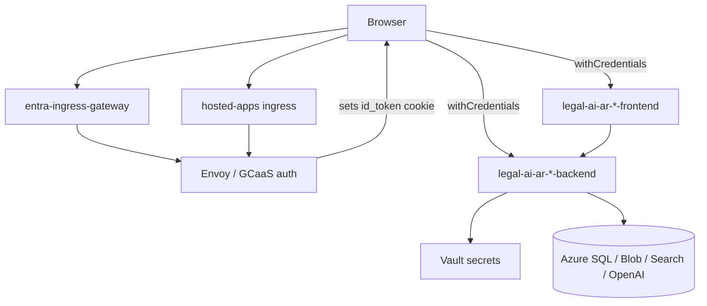

# GCaaS Hosting — Legal Ai Ar

> Hosting document — Legal Ai Ar
>
> **Scope:** Corporate hosting (PwC GCaaS), Entra SSO, Helm/Knative deploy, session model
> **Last updated:** 2026-05-28

---

## 1. Purpose

**GCaaS** (Global Container as a Service) is PwC's corporate Kubernetes-based platform used to host Legal Ai Ar for internal users. It provides:

- **Compute:** Knative services for the API and SPA containers
- **Ingress:** Istio `VirtualService` routing (legacy host + Entra/`global-caas-*` host)
- **Identity:** Microsoft Entra ID SSO via Envoy; session JWT in the **`id_token`** HTTP-only cookie
- **Secrets:** HashiCorp Vault keys mapped into the release
- **Observability:** Optional Datadog via platform labels

The GitHub-based Azure staging deploy is documented separately in [`github-delivery.md`](github-delivery.md).

---

## 2. Architecture overview



**URL pattern** (Entra host): `https://{entraHostName}/{engagementId}/{releaseName}-{appName}/`

Example:

- Host: `https://global-caas-us.pwcglb.com`
- Engagement: `ddf6b108-ced9-4827-a133-9c82141ebf29`
- Release: `legal-ai-ar-main`
- Frontend: `.../legal-ai-ar-main-frontend/` · Backend: `.../legal-ai-ar-main-backend`

A **legacy** hostname (e.g. `hosted-apps-us.pwclabs.pwcglb.com`) remains configured until PWC Identity is decommissioned.

---

## 3. Deployment on GCaaS (Helm)

Helm chart root: `mvp/deployment/`. Images are built by the **GCaaS platform** (`experimentalBuild: true`, language hints `dotnet` / `angular`), not by GitHub Actions.

| File | Role |
|------|------|
| `mvp/deployment/Chart.yaml` | Chart metadata (`legal-ai`) |
| `mvp/deployment/values.yaml` | Apps, auth, secret keys, configMap, metadata placeholders |
| `mvp/deployment/templates/ksvc.yaml` | Knative Service + Istio VirtualServices |
| `mvp/deployment/templates/configmap.yaml` | Non-secret env injection |
| `mvp/deployment/templates/secrets.yaml` | Secret references |
| `mvp/deployment/templates/daemonset.yaml` | Optional image preloader |

### Applications in `values.yaml`

| App | Image | Ingress | Notes |
|-----|-------|---------|-------|
| `backend` | `legal-ai-api` (.NET, port 8080) | enabled | API |
| `frontend` | `legal-ai-ui` (Angular, port 8081) | enabled | `minScale: 1` |
| Workers (`crawler`, `parser`, etc.) | Commented out | — | Future / optional on GCaaS |

### Runtime metadata (platform-injected, `runtimeReplaced`)

| Key | Purpose |
|-----|---------|
| `metadata.engagementId` | Engagement UUID in URLs and config |
| `metadata.hostName` | Legacy ingress host |
| `metadata.entraHostName` | Entra ingress host (e.g. `global-caas-us.pwcglb.com`) |
| `metadata.commitHash` | Knative revision suffix (`{release}-{app}-{commitHash}`) |

### Authentication flag

```yaml
authentication:
  entra: true
```

When `true` and `metadata.entraHostName` is set, `ksvc.yaml` emits a second **VirtualService** (`*-vs-entra`) bound to `istio-system/entra-ingress-gateway` in addition to the default Knative gateway on `metadata.hostName`.

### Secrets (Vault)

Keys in `values.yaml` `secrets:` must exist in Vault; values use `wrappingReplaced` placeholders:

| Vault / env key | Purpose |
|-----------------|---------|
| `AzureSql__ConnectionString` | Database |
| `AzureBlob__ConnectionString` | Blob storage |
| `AzureSearch__ApiKey` | AI Search |
| `AzureOpenAI__ApiKey` | OpenAI |
| `Auth__Platform__TenantId` | Entra tenant for `id_token` validation |
| `Auth__Platform__ValidAudience` | App Registration client id (`aud` claim) |

ConfigMap entries wire Azure endpoints, model deployment names, `ENGAGEMENT_ID`, and `BACKEND_ROOT_URL` / `BACKEND_ROOT_URL_ENTRA`.

### Observability

When `persistentLogging.enabled` is true, pod templates set `gcaas_datadog_enabled: "true"`.

---

## 4. Identity and session model

### Rule (`id_token`-only)

**Only** users presenting a valid **`id_token`** session cookie are authenticated. The API does **not** accept:

- `X-User-Email` / `X-User-Jwt` headers
- `access_token` for API authorization
- Application-owned login endpoints or Bearer tokens in `localStorage`

### GCaaS / production flow

1. User opens the frontend URL on the Entra host.
2. GCaaS Envoy completes Microsoft Entra SSO.
3. Browser receives cookies: `id_token`, `access_token`, `refresh_token` (platform-managed).
4. SPA calls `GET /api/auth/me` with **`withCredentials: true`** so `id_token` is sent to the API.
5. API validates the JWT (issuer/audience from Vault `TenantId` + `ValidAudience`).
6. SPA refreshes the platform session periodically (see §6).

### API configuration (`Auth:Platform`)

| Setting | Env var | Description |
|---------|---------|-------------|
| `TenantId` | `Auth__Platform__TenantId` | Entra tenant → OIDC metadata |
| `ValidAudience` | `Auth__Platform__ValidAudience` | Expected `aud` in `id_token` |
| `IdTokenCookie` | `Auth__Platform__IdTokenCookie` | Cookie name (default `id_token`) |
| `MetadataAddress` | `Auth__Platform__MetadataAddress` | Optional explicit OIDC discovery URL |
| `SigningKeyBase64` | `Auth__Platform__SigningKeyBase64` | Local dev / tests only |
| `DefaultRole` | `Auth__Platform__DefaultRole` | Fallback role if the JWT has none |
| `EmailClaim` / `RolesClaimType` | — | Claim mapping (default `email`, `roles`) |

### Local development (simulated GCaaS)

When `ASPNETCORE_ENVIRONMENT=Development` and `Auth:Development:InjectIdentity=true`:

- `DevelopmentPlatformAuthMiddleware` issues a signed `id_token` cookie if missing.
- `DevelopmentSessionTokenIssuer` signs the dev JWT (`SigningKeyBase64` in `appsettings.Development.json`).

Set `Auth:Development:InjectIdentity=false` to test 401 responses locally.

---

## 5. API endpoints (auth-related)

| Endpoint | Auth | Behavior |
|----------|------|----------|
| `GET /api/auth/me` | Required | Returns email, display name, role, groups from the validated principal |
| `POST /api/auth/logout` | Required | API ack; **GCaaS logout** is an SPA redirect to the platform URL |
| `GET /api/health/live` | Anonymous | Liveness |
| `GET /api/health` | Required | Health with auth |

The worker SignalR hub `/hubs/worker-control` uses policy **`WorkerControlHub`**: authenticated user **or** header `X-Worker-Hub-Key` matching `WorkerControl:HubAccessKey`.

---

## 6. Angular SPA (GCaaS builds)

### Build configurations

| Angular config | Environment file | Use case |
|----------------|------------------|----------|
| `development` | `environment.development.ts` | GCaaS cloud build (explicit `global-caas` URLs + `baseHref`) |
| `production` | `environment.prod.ts` | GCaaS production (same-origin relative `apiUrl`) |
| `staging` | `environment.staging.ts` | **Azure** staging via GitHub CD — **not** GCaaS |
| `local` | `environment.ts` | Local `ng serve` |

`angular.json` — `development` sets `baseHref` to `/{engagementId}/{release}-frontend/`.

### Environment fields (`LegalAiArEnvironment`)

| Field | GCaaS typical value | Purpose |
|-------|---------------------|---------|
| `usePlatformCredentials` | `true` | Enable `withCredentials` on HTTP calls |
| `gcaasEngagementId` | Engagement UUID | Refresh/logout path construction |
| `platformLoginUrl` | Full Entra frontend URL | SSO button on the session gate |
| `platformSessionRefreshPath` | `/{engagementId}/refresh` | Session refresh (relative to origin) |
| `platformLogoutPath` | `/{engagementId}/logout` | Logout redirect |
| `platformSessionRefreshIntervalMs` | `2700000` (45 min) | Refresh interval |
| `platformAuthFailurePath` | `sesion-requerida` | Route when the session is invalid |
| `apiUrl` | Sibling backend URL or `''` (same origin) | API base |

### Startup and session lifecycle

1. **`APP_INITIALIZER`** → `AuthService.bootstrapSession()` → `GET /api/auth/me` (20s timeout).
2. **`platformCredentialsInterceptor`** — adds `withCredentials: true` when `usePlatformCredentials` is true.
3. **`startGcaasSessionRefresh()`** — every 45 minutes (default), `GET /{engagementId}/refresh` with `credentials: 'include'`. GCaaS does **not** auto-refresh; the `id_token` lifetime is ~1 hour.
4. On refresh **401**, clear the local session and navigate to `sesion-requerida`.
5. **Logout** — if the GCaaS logout URL is set, redirect to the platform logout; else `POST /api/auth/logout`.

### Session-required gate

Route `sesion-requerida` → `session-required.component.ts`: a branded page with a link to `platformLoginUrl` for corporate SSO. No `/login` route; no Bearer token storage.

> Note: `sesion-requerida` is an end-user-facing route slug and stays in Spanish (UI contact layer), consistent with the project language rule.

---

## 7. Post-deploy verification checklist

1. Open: `https://{entraHostName}/{engagementId}/{release}-frontend/`
2. Complete Microsoft Entra login (stage may require `@testenv.pwc.com`).
3. Confirm the browser cookies: `id_token`, `access_token`, `refresh_token`.
4. Confirm `GET .../api/auth/me` returns **200** (browser Network tab).
5. Confirm the legacy URL on `hosted-apps-*` still works until PWC Identity decommission.
6. If **503** on the Entra domain: verify the `*-vs-entra` VirtualService exists in the namespace.

### Platform session URLs

| Action | Method | Path |
|--------|--------|------|
| Refresh session | `GET` | `/{engagementId}/refresh` |
| Logout | `GET` | `/{engagementId}/logout` |

---

## 8. GCaaS vs Azure staging (GitHub CD)

| Aspect | GCaaS | Azure staging (GHA) |
|--------|-------|---------------------|
| Deploy | Helm / platform pipeline | `.github/workflows/cd.yml` |
| SPA config | `development` / `production` | `staging` |
| Auth | `id_token` cookie + Entra | `usePlatformCredentials: false` |
| API URL | Under the engagement path on the corporate host | `*.azurewebsites.net` |

Both may share the same Azure SQL, Blob, Search, and OpenAI backends.

---

## 9. Troubleshooting

| Symptom | Likely cause | Action |
|---------|--------------|--------|
| 401 on `/api/auth/me` | Missing or expired `id_token` | Re-login via `platformLoginUrl`; check the refresh timer |
| Invalid or expired `id_token` | Wrong `TenantId` / `ValidAudience` in Vault | Decode the browser cookie; align Vault with `aud` / tenant |
| Missing `id_token` session cookie | Cookie not sent cross-origin | Ensure `usePlatformCredentials` and a same-site corporate host |
| 503 on Entra URL | Missing `*-vs-entra` VirtualService | Check `authentication.entra` and `entraHostName` in the release |
| Session drops after ~1 h | Refresh not running | Verify `gcaasEngagementId` and the refresh path; check Network for `/refresh` |

---

## 10. Relevant files

### Helm / platform deployment

| Path | Description |
|------|-------------|
| `mvp/deployment/Chart.yaml` | Helm chart metadata |
| `mvp/deployment/values.yaml` | Apps, Entra flag, secrets, configMap, metadata |
| `mvp/deployment/templates/ksvc.yaml` | Knative Service, VirtualServices (legacy + Entra) |
| `mvp/deployment/templates/configmap.yaml` | ConfigMap template |
| `mvp/deployment/templates/secrets.yaml` | Secrets template |
| `mvp/deployment/templates/daemonset.yaml` | Preloader / Datadog-related daemonset |

### Backend — platform authentication

| Path | Description |
|------|-------------|
| `mvp/backend/src/api/LegalAiAr.Api/Program.cs` | Registers the platform auth scheme |
| `mvp/backend/src/api/LegalAiAr.Api/Services/PlatformAuthenticationHandler.cs` | ASP.NET Core auth handler |
| `mvp/backend/src/api/LegalAiAr.Api/Services/PlatformGatewayTokenResolver.cs` | Reads the `id_token` cookie |
| `mvp/backend/src/api/LegalAiAr.Api/Services/PlatformUserJwtValidator.cs` | JWT validation |
| `mvp/backend/src/api/LegalAiAr.Api/Services/PlatformRoleResolver.cs` | Entra/platform role → app role |
| `mvp/backend/src/api/LegalAiAr.Api/Controllers/AuthController.cs` | `/api/auth/me`, `/logout` |

### Frontend — GCaaS session and environments

| Path | Description |
|------|-------------|
| `mvp/frontend/src/environments/environment.development.ts` | GCaaS cloud build (Entra host URLs) |
| `mvp/frontend/src/environments/environment.prod.ts` | GCaaS production (same-origin) |
| `mvp/frontend/angular.json` | `development` / `production` configs and `baseHref` |
| `mvp/frontend/src/app/services/auth.service.ts` | Bootstrap, refresh, logout |
| `mvp/frontend/src/app/interceptors/platform-credentials.interceptor.ts` | `withCredentials` for API calls |
| `mvp/frontend/src/app/features/auth/session-required/session-required.component.ts` | SSO gate UI |

### Related

| Path | Description |
|------|-------------|
| [`github-delivery.md`](github-delivery.md) | GitHub / Azure path (complementary) |
| `docs/roadmap/features.md` §2.3 | Deployment and hosting model in the plan |

---

## 11. References

- [GCaaS](https://docs.github.com/en/actions) — internal PwC platform documentation
- Microsoft Entra ID (OIDC) — `id_token` validation
- HashiCorp Vault — secret injection
- Knative / Istio — serverless runtime and ingress

---

*GCaaS Hosting — Legal Ai Ar*
