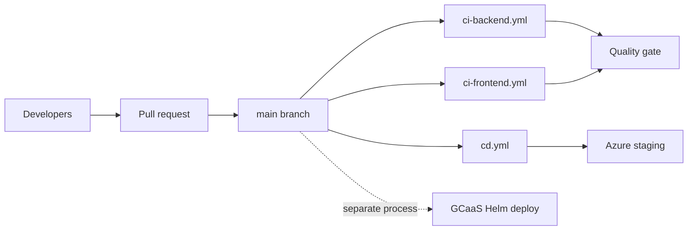

# GitHub Delivery — Legal Ai Ar

> Delivery document — Legal Ai Ar
>
> **Scope:** Source control, CI quality gates, CD to Azure staging
> **Last updated:** 2026-06-01

---

## 1. Purpose

This document describes how Legal Ai Ar uses **GitHub**: branching, automation workflows, secrets, and how that pipeline relates to (and differs from) **GCaaS** corporate hosting. For GCaaS runtime, auth, and Helm deployment, see [`gcaas-hosting.md`](gcaas-hosting.md).

---

## 2. Role in the overall delivery model

GitHub is the **canonical source of truth** for application code. Two automation workflows run on GitHub-hosted runners:

| Workflow | File | Trigger | Outcome |
|----------|------|---------|---------|
| **CI Backend** | `.github/workflows/ci-backend.yml` | Push or PR to `main` (paths: `backend/**`) | .NET build, test, format check — no deploy |
| **CI Frontend** | `.github/workflows/ci-frontend.yml` | Push or PR to `main` (paths: `frontend/**`) | lint, production build, Jest — no deploy |
| **CD** | `.github/workflows/cd.yml` | Push to `main` (merge) | Build artifacts and deploy API + SPA to **Azure staging** |

GitHub Actions **does not deploy to GCaaS**. GCaaS releases use the Helm chart under `deployment/` and the platform's own deployment pipeline (see [`gcaas-hosting.md`](gcaas-hosting.md)).

---

## 3. Repository and branching

| Branch / pattern | Purpose |
|------------------|---------|
| `main` | Production-ready code. Triggers CI on PR/push and CD on push. |
| `feature/*` | Feature work; merge into `main` via pull request. |
| `develop` | Not used as an integration branch (trunk-based); Phase 1 uses `main` only. |

**Trunk-based model.** `main` is the single integration branch and must stay stable and deployable
at all times. Feature branches are short-lived (days, not weeks), one per feature/fix, created from
`main` and merged back to `main`. Long release branches are not maintained — deploy is direct from
`main` via CD.

**Branch naming:** `feature/{feature-id}-{short-description}` (e.g. `feature/F01-02-crawler-csjn`),
or `fix/{short-description}` for fixes.

### Pull request policy

- **CI must pass** — both **CI Backend** and **CI Frontend** status checks (when triggered by path
  filters) plus `dotnet format` on backend changes — and there must be **no conflicts** with `main`
  before merge (branch protection).
- **Review:** minimum **1 approver** before merge; the author cannot approve their own PR.
  **Single-contributor waiver** — when only one person is active on the repo, the external-approval
  requirement is waived (merge allowed after green CI and the prerequisites above).
- **Merge strategy:** **squash merge** to `main`.
- **Size:** keep PRs focused (**< 400 lines of diff** when possible); split very large features into
  incremental PRs.
- **Description:** state the feature/work item (e.g. `Closes F08-W03`) and the main changes.

### Commit messages

Use **Conventional Commits** scoped by feature: `feat(F08): …`, `fix(F01): …`,
`refactor(F12): …`, `docs: …`, `chore: …`. This is the canonical convention (see the
[Developer Guide](../onboarding/developer-guide.md)). The squash-merge commit follows the same format.

---

## 4. CI pipelines

Two separate workflows run on path-filtered changes. Each only executes when files under its scope
change, so a backend-only PR does not run the frontend pipeline (and vice versa).

### 4.1 CI Backend (`ci-backend.yml`)

**Name:** `CI Backend` · **Runner:** `ubuntu-latest` · **Working directory:** `backend/`

**Triggers:** `push` to `main` or `pull_request` targeting `main`, when paths match:

- `backend/**`
- `.github/workflows/ci-backend.yml`

**Steps** (job `build-and-test`):

1. **Checkout** — `actions/checkout@v4`
2. **Setup .NET** — `actions/setup-dotnet@v4`, SDK `10.0.x`
3. **Cache NuGet** — keyed on `Directory.Packages.props`
4. **Restore** — `dotnet restore LegalAiAr.sln`
5. **Build** — `dotnet build LegalAiAr.sln -c Release --no-restore`
6. **Test** — `dotnet test LegalAiAr.sln -c Release --no-build` (all test projects in the solution)
7. **Lint** — `dotnet format LegalAiAr.sln --verbosity diagnostic` (enforce `--verify-no-changes` in **F0.0-W08**)
8. **Coverage** — optional upload to Codecov (`fail_ci_if_error: false`)
9. **Artifact** (push to `main` only) — publish API to `backend/publish/`, upload as `backend-{sha}`

**Branch protection check name:** `CI Backend / build-and-test`

### 4.2 CI Frontend (`ci-frontend.yml`)

**Name:** `CI Frontend` · **Runner:** `ubuntu-latest` · **Working directory:** `frontend/`

**Triggers:** `push` to `main` or `pull_request` targeting `main`, when paths match:

- `frontend/**`
- `.github/workflows/ci-frontend.yml`

**Steps** (job `build-and-test`):

1. **Checkout** — `actions/checkout@v4`
2. **Setup Node** — `actions/setup-node@v4`, Node `22`, npm cache
3. **Install** — `npm ci`
4. **Lint** — `npm run lint:ci` (workspace libraries only; app-level lint debt → **F0.0-W08**)
5. **Build** — `npm run build:prod`
6. **Test** — `npm run test:coverage -- --ci --passWithNoTests`
7. **Coverage** — optional upload to Codecov (`fail_ci_if_error: false`)
8. **Artifact** (push to `main` only) — upload `frontend/dist/legal-ai-ar` as `frontend-{sha}`

**Branch protection check name:** `CI Frontend / build-and-test`

### 4.3 Branch protection (`main`)

Configure under **Settings → Branches → Branch protection rules**:

| Setting | Value |
|---------|-------|
| Require a pull request before merging | ✅ |
| Required approving reviews | 1 |
| Require status checks to pass | ✅ |
| Required checks | `CI Backend / build-and-test`, `CI Frontend / build-and-test` |
| Require branches to be up to date | ✅ |
| Allow squash merging | ✅ (this one only) |
| Allow merge commits | ❌ |
| Allow rebase merging | ❌ |

> **Note:** Required checks appear in GitHub only after each workflow has run at least once on the
> repository. Merge the first CI PR, then enable the checks above.

---

## 5. CD pipeline (`cd.yml`)

**Name:** `CD` · **Trigger:** `push` to `main` only.

### Jobs overview

| Job | Depends on | Deploy target |
|-----|------------|---------------|
| `build-and-test` | — | Publishes the API artifact |
| `build-spa` | — | Publishes the SPA artifact (`--configuration=staging`) |
| `deploy-api` | `build-and-test` | Azure App Service **staging** slot |
| `deploy-spa` | `build-spa` | Azure Static Web Apps |

Deploy jobs run only when `github.ref == 'refs/heads/main'` and use the GitHub **environment** named `staging`.

### `build-and-test`

Same .NET steps as CI, plus:

- `dotnet publish backend/src/api/LegalAiAr.Api/LegalAiAr.Api.csproj -c Release -o api-publish`
- Upload artifact `api-publish`

### `build-spa`

- Node `20`, `npm ci` in `frontend/`
- `npm run build --prefix frontend -- --configuration=staging`
- Upload artifact `spa-dist` from `frontend/dist/legal-ai-ar`

The **staging** Angular configuration uses `environment.staging.ts`: API at `legal-ai-ar-api-staging.azurewebsites.net`, `usePlatformCredentials: false` (no GCaaS cookie flow).

### `deploy-api`

- Download the `api-publish` artifact
- `azure/login@v2` with `secrets.AZURE_CREDENTIALS`
- `azure/webapps-deploy@v3` to App Service: app name `vars.APP_SERVICE_NAME` (default `legal-ai-ar-api`), slot `staging`

### `deploy-spa`

- Download the `spa-dist` artifact
- `Azure/static-web-apps-deploy@v1` with `secrets.AZURE_STATIC_WEB_APPS_API_TOKEN`
- Uses `secrets.GITHUB_TOKEN` as `repo_token`

### Current scope vs target

The **implemented** `cd.yml` deploys **API + SPA to staging only**. The broader target flow (worker images to ACR, Container Apps, smoke test, slot swap to production) is not in the workflow file yet and is tracked in feature **FT.5**.

---

## 6. GitHub configuration (secrets and environments)

Configure under **Settings → Secrets and variables → Actions** and **Settings → Environments**.

| Name | Type | Used by | Purpose |
|------|------|---------|---------|
| `AZURE_CREDENTIALS` | Secret | `deploy-api` | Service principal JSON for `azure/login` |
| `AZURE_STATIC_WEB_APPS_API_TOKEN` | Secret | `deploy-spa` | Static Web Apps deployment token |
| `GITHUB_TOKEN` | Built-in | `deploy-spa` | SWA deploy action `repo_token` |
| `ACR_LOGIN_SERVER`, `ACR_USERNAME`, `ACR_PASSWORD` | Secret (reserved) | Not used in current jobs | Reserved for container image push |
| `APP_SERVICE_NAME` | Variable (optional) | `deploy-api` | Override default `legal-ai-ar-api` |

**Environment:** create `staging` under **Environments** (optional protection rules / required reviewers).

---

## 7. Azure resources touched by GitHub CD

| Component | Staging target | Provisioning |
|-----------|----------------|--------------|
| API | App Service staging slot | `infra/scripts/create-app-service.ps1` |
| SPA | Azure Static Web Apps | `infra/scripts/create-static-web-app.ps1`, Portal/CLI |
| Workers | Container Apps (design) | Not deployed by the current `cd.yml` |
| Data plane | Azure SQL, Blob, Search, OpenAI | Shared; configured in App Service settings, not by GHA |

---

## 8. Relationship to GCaaS

| Aspect | GitHub / Azure path | GCaaS path |
|--------|---------------------|------------|
| Deploy trigger | Merge to `main` → GitHub Actions | Platform Helm deploy (separate) |
| SPA build config | `staging` | `development` or `production` (Angular) |
| Auth | Staging API without platform cookies | Entra + `id_token` cookie |
| Infra | `infra/scripts/*.ps1` | `deployment/` Helm chart |

Both paths can target the **same Azure data services**; compute and identity boundaries differ. See [`gcaas-hosting.md`](gcaas-hosting.md).

---

## 9. Operational checklist

### Enable CD for a new fork or org

1. Create the Azure App Service (with staging slot) and Static Web App.
2. Add secrets `AZURE_CREDENTIALS`, `AZURE_STATIC_WEB_APPS_API_TOKEN`.
3. Create the GitHub environment `staging`.
4. Merge to `main` and confirm the workflow runs in the **Actions** tab.

### Rollback (Azure staging)

- **API:** redeploy a previous commit via workflow re-run, or swap App Service slots.
- **SPA:** restore the previous deployment in the Static Web Apps portal or redeploy from pipeline history.

---

## 10. Relevant files

| Path | Description |
|------|-------------|
| `.github/workflows/ci-backend.yml` | CI: .NET build, test, format |
| `.github/workflows/ci-frontend.yml` | CI: Angular lint, build, unit tests |
| `.github/workflows/cd.yml` | CD: Azure staging deploy |
| `infra/scripts/create-app-service.ps1` | App Service + staging slot |
| `infra/scripts/create-static-web-app.ps1` | Static Web Apps |
| `infra/scripts/create-container-registry.ps1` | ACR (workers / future CD) |
| `frontend/src/environments/environment.staging.ts` | API URL for the Azure staging build |
| `frontend/angular.json` | `staging` build configuration |
| [`gcaas-hosting.md`](gcaas-hosting.md) | GCaaS platform (not deployed via GitHub Actions) |

---

## 11. References

- [GitHub Actions documentation](https://docs.github.com/en/actions)
- [Azure/login action](https://github.com/Azure/login)
- [Azure Web Apps deploy action](https://github.com/Azure/webapps-deploy)
- [Azure Static Web Apps deploy action](https://github.com/Azure/static-web-apps-deploy)

---

*GitHub Delivery — Legal Ai Ar*
