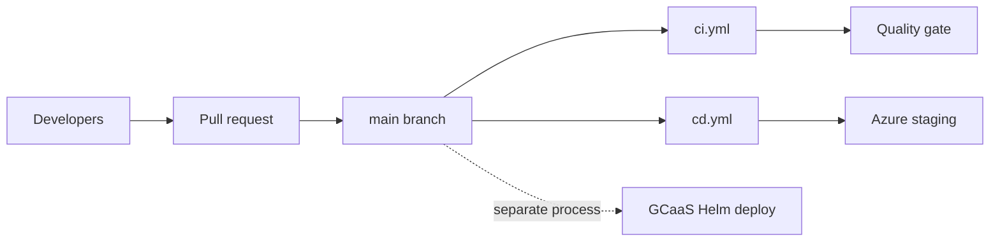

# GitHub Delivery — Legal Ai Ar

> Delivery document — Legal Ai Ar
>
> **Scope:** Source control, CI quality gates, CD to Azure staging
> **Last updated:** 2026-05-28

---

## 1. Purpose

This document describes how Legal Ai Ar uses **GitHub**: branching, automation workflows, secrets, and how that pipeline relates to (and differs from) **GCaaS** corporate hosting. For GCaaS runtime, auth, and Helm deployment, see [`gcaas-hosting.md`](gcaas-hosting.md).

---

## 2. Role in the overall delivery model

GitHub is the **canonical source of truth** for application code. Two automation workflows run on GitHub-hosted runners:

| Workflow | File | Trigger | Outcome |
|----------|------|---------|---------|
| **CI** | `.github/workflows/ci.yml` | Push or PR to `main` | Build, test, format check — no deploy |
| **CD** | `.github/workflows/cd.yml` | Push to `main` (merge) | Build artifacts and deploy API + SPA to **Azure staging** |

GitHub Actions **does not deploy to GCaaS**. GCaaS releases use the Helm chart under `mvp/deployment/` and the platform's own deployment pipeline (see [`gcaas-hosting.md`](gcaas-hosting.md)).

---

## 3. Repository and branching

| Branch / pattern | Purpose |
|------------------|---------|
| `main` | Production-ready code. Triggers CI on PR/push and CD on push. |
| `feature/*` | Feature work; merge into `main` via pull request. |
| `develop` | Optional integration branch; Phase 1 can use `main` only. |

**Pull requests:** CI must pass (build, tests, `dotnet format`) before merge to `main` (branch protection).

---

## 4. CI pipeline (`ci.yml`)

**Name:** `CI` · **Runner:** `ubuntu-latest`

**Triggers:** `push` to `main`; `pull_request` targeting `main`.

**Steps** (single job `build-and-test`):

1. **Checkout** — `actions/checkout@v4`
2. **Setup .NET** — `actions/setup-dotnet@v4`, SDK `10.0.x`
3. **Restore** — `dotnet restore mvp/backend/LegalAiAr.sln`
4. **Build** — `dotnet build mvp/backend/LegalAiAr.sln -c Release --no-restore`
5. **Test** — `dotnet test mvp/backend/LegalAiAr.sln -c Release --no-build`
6. **Lint** — `dotnet format mvp/backend/LegalAiAr.sln --verify-no-changes`

**Scope note:** CI covers the **backend solution only**. The Angular SPA is not built or tested in this workflow.

---

## 5. CD pipeline (`cd.yml`)

**Name:** `CD` · **Trigger:** `push` to `main` only.

### Jobs overview

| Job | Depends on | Deploy target |
|-----|------------|---------------|
| `build-and-test` | — | Publishes the API artifact |
| `build-spa` | — | Publishes the SPA artifact (`--configuration=staging`) |
| `deploy-api` | `build-and-test` | Azure App Service **staging** slot |
| `deploy-spa` | `build-spa` | Azure Static Web Apps |

Deploy jobs run only when `github.ref == 'refs/heads/main'` and use the GitHub **environment** named `staging`.

### `build-and-test`

Same .NET steps as CI, plus:

- `dotnet publish mvp/backend/src/api/LegalAiAr.Api/LegalAiAr.Api.csproj -c Release -o api-publish`
- Upload artifact `api-publish`

### `build-spa`

- Node `20`, `npm ci` in `mvp/frontend/`
- `npm run build --prefix mvp/frontend -- --configuration=staging`
- Upload artifact `spa-dist` from `mvp/frontend/dist/legal-ai-ar`

The **staging** Angular configuration uses `environment.staging.ts`: API at `legal-ai-ar-api-staging.azurewebsites.net`, `usePlatformCredentials: false` (no GCaaS cookie flow).

### `deploy-api`

- Download the `api-publish` artifact
- `azure/login@v2` with `secrets.AZURE_CREDENTIALS`
- `azure/webapps-deploy@v3` to App Service: app name `vars.APP_SERVICE_NAME` (default `legal-ai-ar-api`), slot `staging`

### `deploy-spa`

- Download the `spa-dist` artifact
- `Azure/static-web-apps-deploy@v1` with `secrets.AZURE_STATIC_WEB_APPS_API_TOKEN`
- Uses `secrets.GITHUB_TOKEN` as `repo_token`

### Current scope vs target

The **implemented** `cd.yml` deploys **API + SPA to staging only**. The broader target flow (worker images to ACR, Container Apps, smoke test, slot swap to production) is not in the workflow file yet and is tracked in feature **FT05**.

---

## 6. GitHub configuration (secrets and environments)

Configure under **Settings → Secrets and variables → Actions** and **Settings → Environments**.

| Name | Type | Used by | Purpose |
|------|------|---------|---------|
| `AZURE_CREDENTIALS` | Secret | `deploy-api` | Service principal JSON for `azure/login` |
| `AZURE_STATIC_WEB_APPS_API_TOKEN` | Secret | `deploy-spa` | Static Web Apps deployment token |
| `GITHUB_TOKEN` | Built-in | `deploy-spa` | SWA deploy action `repo_token` |
| `ACR_LOGIN_SERVER`, `ACR_USERNAME`, `ACR_PASSWORD` | Secret (reserved) | Not used in current jobs | Reserved for container image push |
| `APP_SERVICE_NAME` | Variable (optional) | `deploy-api` | Override default `legal-ai-ar-api` |

**Environment:** create `staging` under **Environments** (optional protection rules / required reviewers).

---

## 7. Azure resources touched by GitHub CD

| Component | Staging target | Provisioning |
|-----------|----------------|--------------|
| API | App Service staging slot | `mvp/infra/scripts/create-app-service.ps1` |
| SPA | Azure Static Web Apps | `mvp/infra/scripts/create-static-web-app.ps1`, Portal/CLI |
| Workers | Container Apps (design) | Not deployed by the current `cd.yml` |
| Data plane | Azure SQL, Blob, Search, OpenAI | Shared; configured in App Service settings, not by GHA |

---

## 8. Relationship to GCaaS

| Aspect | GitHub / Azure path | GCaaS path |
|--------|---------------------|------------|
| Deploy trigger | Merge to `main` → GitHub Actions | Platform Helm deploy (separate) |
| SPA build config | `staging` | `development` or `production` (Angular) |
| Auth | Staging API without platform cookies | Entra + `id_token` cookie |
| Infra | `mvp/infra/scripts/*.ps1` | `mvp/deployment/` Helm chart |

Both paths can target the **same Azure data services**; compute and identity boundaries differ. See [`gcaas-hosting.md`](gcaas-hosting.md).

---

## 9. Operational checklist

### Enable CD for a new fork or org

1. Create the Azure App Service (with staging slot) and Static Web App.
2. Add secrets `AZURE_CREDENTIALS`, `AZURE_STATIC_WEB_APPS_API_TOKEN`.
3. Create the GitHub environment `staging`.
4. Merge to `main` and confirm the workflow runs in the **Actions** tab.

### Rollback (Azure staging)

- **API:** redeploy a previous commit via workflow re-run, or swap App Service slots.
- **SPA:** restore the previous deployment in the Static Web Apps portal or redeploy from pipeline history.

---

## 10. Relevant files

| Path | Description |
|------|-------------|
| `.github/workflows/ci.yml` | CI: build, test, format |
| `.github/workflows/cd.yml` | CD: Azure staging deploy |
| `mvp/infra/scripts/create-app-service.ps1` | App Service + staging slot |
| `mvp/infra/scripts/create-static-web-app.ps1` | Static Web Apps |
| `mvp/infra/scripts/create-container-registry.ps1` | ACR (workers / future CD) |
| `mvp/frontend/src/environments/environment.staging.ts` | API URL for the Azure staging build |
| `mvp/frontend/angular.json` | `staging` build configuration |
| [`gcaas-hosting.md`](gcaas-hosting.md) | GCaaS platform (not deployed via GitHub Actions) |

---

## 11. References

- [GitHub Actions documentation](https://docs.github.com/en/actions)
- [Azure/login action](https://github.com/Azure/login)
- [Azure Web Apps deploy action](https://github.com/Azure/webapps-deploy)
- [Azure Static Web Apps deploy action](https://github.com/Azure/static-web-apps-deploy)

---

*GitHub Delivery — Legal Ai Ar*
