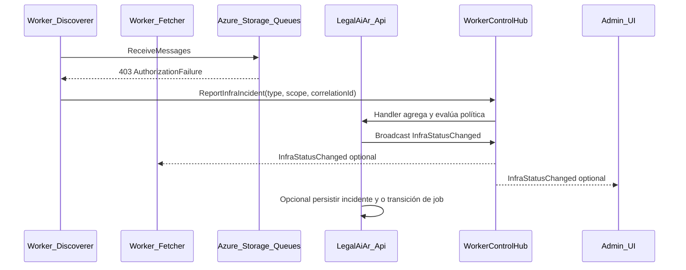

# Pipeline: salud de infra compartida vía SignalR (API como orquestador)

## Problema

Los workers comparten **Storage (colas), red y VPN**. Si uno recibe **403 / red** al leer colas, **todos** tenderán a fallar de forma correlacionada. El modelo de negocio actual puede dejar un **IngestionJob** en estado “activo” mientras **nadie consume** colas, y el Discoverer **no inicia** trabajo nuevo por el candado “ya existe job activo”, sin señal clara de que el sistema está **bloqueado por infra**, no por backlog normal.

## Objetivo

1. Que los workers **comuniquen incidentes de infra** de forma centralizada.
2. Que la **API** agregue, deduplique y **defina política** (notificar, opcionalmente marcar degradación / pausa lógica).
3. Que **interesados** reciban el mismo hecho: **otros workers** (coherencia de comportamiento) y **UI admin** (banner / estado visible), sin depender solo de logs locales.

## Base existente (no partir de cero)

- **SignalR** ya está en el API (`AddSignalR`, hub en `/hubs/worker-control`).
- Hub actual: [`WorkerControlHub`](../../backend/src/api/LegalAiAr.Api/Hubs/WorkerControlHub.cs) con grupos por `workerType`, presencia vía [`IWorkerSignalRPresenceTracker`](../../backend/src/shared/LegalAiAr.Core/Interfaces/Services/IWorkerSignalRPresenceTracker.cs).
- Contrato servidor → worker: [`IWorkerControlClient`](../../backend/src/api/LegalAiAr.Api/Hubs/IWorkerControlClient.cs) (`PauseAsync` / `ResumeAsync`).
- Cliente en workers: [`WorkerControlService`](../../backend/src/shared/LegalAiAr.Infrastructure/Control/WorkerControlService.cs) (SignalR client).
- La auditoría de job ya relaciona **SignalR** con riesgos de documentos en `Processing` ([`GetJobAuditHandler`](../../backend/src/api/LegalAiAr.Application/Admin/Jobs/Queries/GetJobAudit/GetJobAuditHandler.cs)).

El plan **extiende** este canal; no reemplaza la pausa en BD ni la cola Azure.

## Arquitectura propuesta (alto nivel)

**Principio:** un solo lugar (API) decide qué significa “infra caída” (N errores, ventana de tiempo, mismo `ErrorCode`, etc.) y qué hacer.

## Contratos sugeridos (borrador)

### Worker → API (invocación al hub)

- `ReportInfraIncident(InfraIncidentDto dto)` con campos mínimos:
  - `category`: `StorageQueue` | `StorageBlob` | `Other`
  - `errorCode`: p. ej. `AuthorizationFailure`, `Timeout`, `Unknown`
  - `target`: nombre lógico (prefijo de cola, cuenta, endpoint host si seguro)
  - `workerType`, `instanceId` / hostname
  - `utcOccurred`, `correlationId` (opcional traza)
- Rate limiting en el hub: **no** spamear la API (p. ej. una ventana por worker+categoría).

### API → clientes (workers + UI)

Opciones (elegir una en implementación):

1. **Ampliar `IWorkerControlClient`** con métodos nuevos (`InfraDegradedAsync`, `InfraRecoveredAsync`) para workers; **segundo hub** o **mismo hub** con grupo `admins` para UI.
2. **Hub dedicado** `PipelineHealthHub` solo para eventos de salud (menos mezcla con pausa), misma autenticación y CORS.

La UI admin se conectaría con el **mismo mecanismo de auth** que el resto del panel (token), no con el secreto de workers (definir esquema: rol admin vs conexión worker).

## Política en API (fases)

| Fase | Comportamiento |
|------|----------------|
| **Fase 1 – Observabilidad** | Persistir incidente (tabla o App Insights), broadcast a UI: banner “Infra: colas no autorizadas desde …”. **Sin** cambiar estado de `IngestionJob`. |
| **Fase 2 – Señal fuerte** | Si M workers reportan el mismo `category`+`errorCode` en T minutos, marcar **flag global** `InfrastructureBlocked` (config/cache) que el Discoverer consulte antes del candado “active job”, o exponer en auditoría. |
| **Fase 3 – Transición de job (opcional)** | Tras umbral, API ejecuta comando de dominio: `MarkJobDegraded` / `RequestPauseAllWorkers` (ya existe pausa vía admin) / notificación. **Requiere** reglas claras de salida (`InfraRecovered` cuando vuelva el primer receive OK). |

**Evitar falsos positivos:** un timeout puntual no debe pausar el mundo; correlación + contador + ventana temporal.

## Workers: dónde enganchar

Punto común: receptor de colas ([`StorageQueueReceiver`](../../backend/src/shared/LegalAiAr.Infrastructure/Queue/StorageQueueReceiver.cs)) o capa que envuelve `ReceiveAsync`, clasificando `RequestFailedException` (403, red). Un solo informe por ventana por proceso evita ruido.

**Coherencia “si uno falla, fallan todos”:** basta con que **cualquier** worker reporte; la API puede tratar el primer informe como incidente global de Storage para ese entorno.

## UI

- Cliente SignalR en el módulo admin (ingesta): suscripción a `InfraStatusChanged`, estado en signal o servicio singleton, banner no intrusivo + link a “Auditar” / documentación.
- Reutilizar o complementar el polling actual (los contadores HTTP siguen siendo válidos; SignalR es para **eventos** y **estado de infra**).

## Seguridad y operación

- Autenticación del hub para workers (API key / token de servicio) vs usuarios admin (JWT); revisar `MapHub` y políticas CORS.
- Límites de tamaño de payload y validación de `dto`.
- **Runbook** (operación, fuera de código): VPN/firewall Storage, reinicio de workers, cancelación o cierre de job zombie; se detalla en una sesión aparte (“cómo levantar la situación”).

## Entregables sugeridos (implementación futura)

1. DTO + método hub `ReportInfraIncident` + tests de contrato.
2. Servicio de dominio `IInfraIncidentAggregator` (singleton) con ventana y umbral.
3. Broadcast + (opcional) persistencia.
4. Cliente Angular + banner en ingesta.
5. Documento de runbook enlazado desde el banner.

## Relación con el incidente VPN

Este diseño **no** sustituye arreglar firewall/IP en Azure Storage; da **visibilidad y decisión centralizada** para que un corte de red no deje el sistema en un estado mentalmente “running” sin ejecutores efectivos, y para que la UI y los operadores vean el mismo incidente correlacionado.

---

*Documento de diseño ajustado a la conversación; la implementación y el runbook de recuperación se continúan por fases.*
