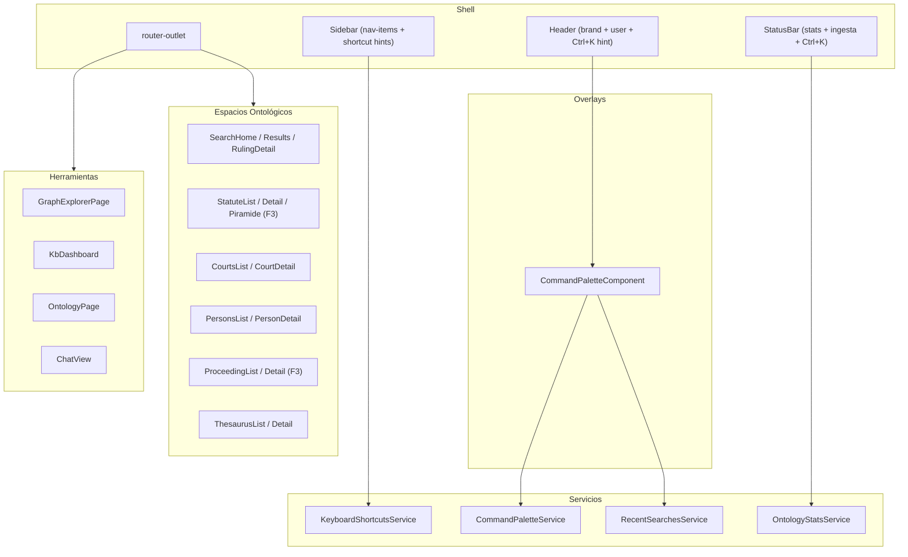

# F2-1 — Reestructuración de UI + UX Fundacional

| Campo | Valor |
|---|---|
| **Versión** | 1.0 |
| **Fecha** | 2026-04-30 |
| **Fase** | F2 del plan de convergencia ontológica |
| **Dependencia** | F0 completada (documentos de diseño actualizados) |
| **Inputs** | [Parte A del plan de convergencia](../../.cursor/plans/kb_ontology_gap_analysis_46778103.plan.md), [UX Differentiators Analysis](../mockups/ux-differentiators-analysis.md) |

---

## 1. Principio rector

La UI refleja la ontología, no las herramientas. Cada clase ontológica de primer nivel se convierte en un **espacio** navegable. Las herramientas (búsqueda, chat, grafo) son **modos de interacción** dentro de cada espacio, no destinos independientes.

---

## 2. Mapa de rutas: anterior vs nuevo

### 2.1 Rutas actuales

```
/bienvenida                    WelcomeComponent
/buscar                        SearchHomeComponent
/buscar/resultados             SearchResultsComponent
/fallos/:id                    RulingDetailComponent
/chat                          ChatViewComponent
/dashboard                     KbDashboardComponent
/catalogos                     CatalogsLayoutComponent
/catalogos/tribunales          CourtsListComponent
/catalogos/tribunales/:id      CourtDetailComponent
/catalogos/personas            PersonsListComponent
/catalogos/personas/:id        PersonDetailComponent
/catalogos/tesauro             ThesaurusListComponent
/catalogos/tesauro/:id         ThesaurusDetailComponent
/ontologia                     OntologyPageComponent (lazy)
/explorador                    GraphExplorerPageComponent (lazy)
/admin/...                     AdminLayoutComponent + hijos
```

### 2.2 Rutas nuevas

| Ruta nueva | Componente | Origen |
|---|---|---|
| `/jurisprudencia` | SearchHomeComponent (reubicado) | era `/buscar` |
| `/jurisprudencia/resultados` | SearchResultsComponent (reubicado) | era `/buscar/resultados` |
| `/jurisprudencia/:id` | RulingDetailComponent (reubicado) | era `/fallos/:id` |
| `/asistente` | ChatViewComponent (reubicado) | era `/chat` |
| `/organismos` | CourtsListComponent (reubicado) | era `/catalogos/tribunales` |
| `/organismos/:id` | CourtDetailComponent (reubicado) | era `/catalogos/tribunales/:id` |
| `/sujetos` | PersonsListComponent (reubicado) | era `/catalogos/personas` |
| `/sujetos/:id` | PersonDetailComponent (reubicado) | era `/catalogos/personas/:id` |
| `/vocabulario` | ThesaurusListComponent (reubicado) | era `/catalogos/tesauro` |
| `/vocabulario/:id` | ThesaurusDetailComponent (reubicado) | era `/catalogos/tesauro/:id` |
| `/estadisticas` | KbDashboardComponent (reubicado) | era `/dashboard` |
| `/ordenamiento` | *StatuteListComponent* (nueva, F3) | — |
| `/ordenamiento/:id` | *StatuteDetailComponent* (nueva, F3) | — |
| `/ordenamiento/piramide` | *NormativePyramidComponent* (nueva, F3) | — |
| `/procesos` | *ProceedingListComponent* (nueva, F3) | — |
| `/procesos/:id` | *ProceedingDetailComponent* (nueva, F3) | — |

*Las rutas en cursiva se registran como placeholder (disabled en sidebar) hasta F3.*

### 2.3 Redirects de compatibilidad

```typescript
{ path: 'buscar', redirectTo: '/jurisprudencia', pathMatch: 'full' },
{ path: 'buscar/resultados', redirectTo: '/jurisprudencia/resultados', pathMatch: 'full' },
{ path: 'fallos/:id', redirectTo: '/jurisprudencia/:id' },
{ path: 'chat', redirectTo: '/asistente', pathMatch: 'full' },
{ path: 'catalogos', redirectTo: '/organismos', pathMatch: 'full' },
{ path: 'catalogos/tribunales', redirectTo: '/organismos', pathMatch: 'full' },
{ path: 'catalogos/tribunales/:id', redirectTo: '/organismos/:id' },
{ path: 'catalogos/personas', redirectTo: '/sujetos', pathMatch: 'full' },
{ path: 'catalogos/personas/:id', redirectTo: '/sujetos/:id' },
{ path: 'catalogos/tesauro', redirectTo: '/vocabulario', pathMatch: 'full' },
{ path: 'catalogos/tesauro/:id', redirectTo: '/vocabulario/:id' },
{ path: 'dashboard', redirectTo: '/estadisticas', pathMatch: 'full' },
```

### 2.4 Eliminaciones

- `CatalogsLayoutComponent`: ya no es necesario, cada espacio es independiente
- Rutas anidadas bajo `/catalogos/*`: reemplazadas por rutas de primer nivel

---

## 3. Sidebar con grupos ontológicos + shortcuts (T1-E)

### 3.1 Estructura

```
┌──────────────────────────────┐
│  PRINCIPAL                   │
│  🏠 Inicio              G H │
│  💬 Asistente            G A │
│                              │
│  DOMINIO JURÍDICO            │
│  ⚖️  Jurisprudencia      G J │
│  📜 Ordenamiento         G O │  ← disabled hasta F3
│  🏛️  Organismos           G R │
│  👤 Sujetos              G S │
│  📋 Procesos             G P │  ← disabled hasta F3
│  📚 Vocabulario          G V │
│                              │
│  HERRAMIENTAS                │
│  🔗 Explorador           G E │
│  📊 Estadísticas         G D │
│                              │
│  META                        │
│  🧩 Ontología            G N │
│  ⚙️  Admin                G M │
│                              │
│  ────────────────────────    │
│  ⌨  Ctrl+K  Command Palette │
└──────────────────────────────┘
```

### 3.2 Keyboard shortcuts

**Esquema `G` + letra = Go to:**

| Shortcut | Destino | Ruta |
|---|---|---|
| `G H` | Inicio | `/bienvenida` |
| `G A` | Asistente | `/asistente` |
| `G J` | Jurisprudencia | `/jurisprudencia` |
| `G O` | Ordenamiento | `/ordenamiento` |
| `G R` | Organismos | `/organismos` |
| `G S` | Sujetos | `/sujetos` |
| `G P` | Procesos | `/procesos` |
| `G V` | Vocabulario | `/vocabulario` |
| `G E` | Explorador | `/explorador` |
| `G D` | Estadísticas | `/estadisticas` |
| `G N` | Ontología | `/ontologia` |
| `G M` | Admin | `/admin` |

**Shortcuts globales:**

| Shortcut | Acción |
|---|---|
| `Ctrl+K` / `Cmd+K` | Abrir Command Palette |
| `/` | Focus en input de búsqueda de la pantalla actual |
| `Esc` | Cerrar modal / panel / overlay |

### 3.3 Implementación

- `KeyboardShortcutsService`: listener global `keydown`, buffer de 2 teclas con timeout de 500ms para secuencias `G+X`
- Shortcut hints: badges `<kbd>` junto a cada nav-item, `font-size: 0.6875rem`, `background: var(--color-bg-subtle)`, `border-radius: 4px`, `padding: 0.125rem 0.375rem`
- Los hints se ocultan en pantallas < 768px (mobile)
- Los shortcuts disabled (Ordenamiento, Procesos) no navegan hasta que se habiliten en F3

---

## 4. Command Palette `Ctrl+K` (T1-A)

### 4.1 Descripción

Overlay modal con búsqueda fuzzy que reemplaza la barra de búsqueda del header como punto de entrada unificado. Inspirado en Linear, Raycast y Arc.

### 4.2 Wireframe

```
┌────────────────────────────────────────────┐
│  🔍  Buscar en Legal AI AR...        Esc   │
├────────────────────────────────────────────┤
│  RECIENTES                                 │
│    📄 CSJN - Libertad de expresión    →    │
│    📄 Cámara Civil Sala A - Daños     →    │
│                                            │
│  NAVEGACIÓN                                │
│    🏠 Inicio                         G H   │
│    ⚖️  Jurisprudencia                 G J   │
│    💬 Asistente                       G A   │
│    📊 Estadísticas                    G D   │
│                                            │
│  ACCIONES                                  │
│    ➕ Nueva búsqueda                       │
│    📋 Copiar última cita                   │
└────────────────────────────────────────────┘
```

### 4.3 Secciones

1. **Recientes** (T3-C): últimas 10 búsquedas del usuario desde `localStorage`
2. **Navegación**: todas las rutas del sidebar, filtradas por fuzzy match
3. **Acciones rápidas**: "Nueva búsqueda", "Limpiar filtros", etc.
4. **Resultados de búsqueda**: al escribir 3+ caracteres, ejecuta búsqueda contra API (fase inicial: solo rulings)

### 4.4 Implementación

- **Componente**: `CommandPaletteComponent` (standalone)
- **Service**: `CommandPaletteService` — registro de commands desde features, API: `register(commands)`, `open()`, `close()`
- **Fuzzy search**: `fuse.js` (~2KB gzipped) — `npm install fuse.js`
- **Trigger**: listener global `Ctrl+K` / `Cmd+K` en `ShellComponent`
- **Animación**: backdrop fade-in 150ms, panel scale(0.98→1) + opacity(0→1) 150ms ease
- **Estilos PwC**:
  - Backdrop: `rgba(0,0,0,0.5)`
  - Surface: `#ffffff`, `border-radius: 12px`, `box-shadow: 0 16px 48px rgba(0,0,0,0.16)`
  - Input: sin borde, `font-size: 1.125rem`, placeholder en `#696969`
  - Item activo: `background: rgba(208, 74, 2, 0.06)`, left border `3px solid #D04A02`
  - Shortcut badges: `background: #f3f3f3`, `border-radius: 4px`, `font-size: 0.6875rem`
- **Keyboard navigation**: `ArrowUp/Down` para moverse, `Enter` para ejecutar, `Esc` para cerrar

---

## 5. Status Bar con métricas vivas (T1-D)

### 5.1 Descripción

Reemplaza el footer estático actual por una barra informativa contextual. Inspirado en Superhuman y Figma.

### 5.2 Wireframe

```
┌─────────────────────────────────────────────────────────────────┐
│ ⚖️  12,847 fallos │ 🏛️  342 tribunales │ 🕐 Última sync: 2h │ ⌨ Ctrl+K │
└─────────────────────────────────────────────────────────────────┘
```

### 5.3 Comportamiento

- Polling cada 60s a `GET /api/ontology/stats`
- Indicador de ingesta activa: dot pulsante verde + "Ingesta en progreso" cuando hay jobs running
- Click en contador de fallos navega a `/estadisticas`
- El hint `Ctrl+K` recuerda la existencia del Command Palette
- En mobile (< 768px): solo muestra el hint `Ctrl+K` y el indicador de ingesta

### 5.4 Implementación

- **Componente**: `StatusBarComponent` (standalone)
- **Service**: reutiliza datos de `OntologyStatsService` (ya existe)
- Reemplaza el bloque `<footer>` actual en `ShellComponent`

---

## 6. Page Transitions + Microinteracciones (T1-B)

### 6.1 Descripción

Animaciones CSS sutiles que dan sensación de fluidez. Sin dependencias JS. Inspirado en Linear, Vercel y Arc.

### 6.2 Patrones

| Patrón | Selector | Animación | Duración |
|---|---|---|---|
| Route enter | `.content router-outlet + *` | fade-in + translateY(8px→0) | 200ms ease-out |
| Card hover | `.feature-card, .ruling-card` | translateY(-2px) + shadow elevation | 150ms ease |
| Button press | `.btn-primary:active` | scale(0.97) | 100ms ease |
| List stagger | `.stagger-item:nth-child(n)` | fade-in + translateY(6px→0), delay 50ms*n | 200ms ease |
| Collapse/expand | `.collapsible-content` | max-height transition | 200ms ease |

### 6.3 Implementación

CSS global en `styles.scss`:

```css
@keyframes page-enter {
  from { opacity: 0; transform: translateY(8px); }
  to   { opacity: 1; transform: translateY(0); }
}

.content router-outlet + * {
  animation: page-enter 0.2s ease-out;
}

.feature-card, .ruling-card {
  transition: transform 0.15s ease, box-shadow 0.15s ease;
}
.feature-card:hover, .ruling-card:hover {
  transform: translateY(-2px);
  box-shadow: 0 8px 24px rgba(0,0,0,0.08);
}

@keyframes stagger-in {
  from { opacity: 0; transform: translateY(6px); }
  to   { opacity: 1; transform: translateY(0); }
}
```

---

## 7. Skeleton Loaders universales (T1-C)

### 7.1 Descripción

Reemplazar todos los spinners por skeleton placeholders que imitan la forma del contenido. Inspirado en Linear, Notion y Stripe.

### 7.2 Variantes

| Componente | Uso | Dimensiones |
|---|---|---|
| `skeleton-card` | Ruling cards en resultados de búsqueda | 100% x 120px |
| `skeleton-table-row` | Filas de tablas en catálogos | 100% x 48px |
| `skeleton-detail` | Vista de detalle de fallo | Header + 3 blocks |
| `skeleton-stat` | KPI cards del dashboard | 200px x 100px |
| `skeleton-chat-message` | Mensajes del chat | 80% x 60px |

### 7.3 Base CSS

```css
.skeleton {
  background: linear-gradient(90deg, #e8e8e8 25%, #f3f3f3 50%, #e8e8e8 75%);
  background-size: 200% 100%;
  animation: shimmer 1.5s ease-in-out infinite;
  border-radius: var(--radius-sm);
}

@keyframes shimmer {
  0%   { background-position: 200% 0; }
  100% { background-position: -200% 0; }
}
```

### 7.4 Implementación

- `SkeletonLoaderComponent` ya existe (`frontend/src/app/shared/components/skeleton-loader/skeleton-loader.component.ts`)
- Extender con las variantes via `@Input() variant: 'card' | 'table-row' | 'detail' | 'stat' | 'chat-message'`
- Cada variante replica dimensiones del componente real

---

## 8. Búsquedas recientes persistidas (T3-C)

### 8.1 Descripción

Las últimas 10 búsquedas del usuario se guardan en `localStorage`. Inspirado en Raycast y Notion.

### 8.2 Ubicaciones

- **SearchHomeComponent** (`/jurisprudencia`): debajo de búsquedas sugeridas
- **Command Palette**: sección "Recientes"

### 8.3 Implementación

- **Service**: `RecentSearchesService`
  - `add(query: string): void` — agrega, deduplicando
  - `getAll(): string[]` — devuelve las últimas 10
  - `clear(): void` — limpia todo
- **Storage key**: `legal-ai-ar:recent-searches`
- Cada item almacena: `{ query, timestamp, resultCount? }`

---

## 9. Eliminación de CatalogsLayoutComponent

### 9.1 Cambio

El componente `CatalogsLayoutComponent` (con tabs horizontales Tribunales/Personas/Tesauro) se elimina. Cada espacio pasa a ser independiente con su propia ruta de primer nivel.

### 9.2 Archivos afectados

- `frontend/src/app/features/catalogs/catalogs-layout/catalogs-layout.component.ts` → eliminar
- `frontend/src/app/app.routes.ts` → reestructurar (ver sección 2)
- `frontend/src/app/layout/shell/shell.component.ts` → actualizar sidebar (ver sección 3)

---

## 10. Diagrama de componentes



---

## 11. Patrones transversales para F3

Los siguientes patrones se definen aquí pero se implementan en F3 cuando los espacios nuevos existan:

### 11.1 Hover Previews de entidades (T2-B)

- **Directiva**: `[entityPreview]` aplicable a cualquier link a entidad
- **Variantes**: tribunal (nombre, fuero, total fallos), fallo (carátula, tribunal, fecha, keywords), persona (nombre, tipo, oficios), norma (número, tipo, vigencia)
- **UX**: delay 300ms, posicionamiento inteligente, fade-in 150ms, datos lazy via servicios existentes

### 11.2 Empty States diseñados (T3-A)

| Pantalla | Empty state |
|---|---|
| Búsqueda sin resultados | Sugerencias de búsquedas relacionadas + tips de filtros |
| Chat sin historial | "Haga su primera consulta" con 3-4 ejemplos clickeables |
| Dashboard KB vacía | Progreso de ingesta + qué datos esperar |
| Ordenamiento vacío | Explicación + estado de ingesta SAIJ |
| Procesos vacío | Explicación + dependencia de datos |

### 11.3 Onboarding contextual (T3-B)

- Tooltips guiados en primera visita a cada sección
- Persistencia en `localStorage` key `legal-ai-ar:onboarding`
- `OnboardingService` con API `shouldShow(section)` / `markSeen(section)`

---

## 12. Compatibilidad con PwC Design System

Todas las implementaciones respetan:

| Aspecto | Valor |
|---|---|
| Primary | `#D04A02` |
| Hover | `#EB8C00` |
| Background | `#f3f3f3` (page), `#ffffff` (surface) |
| Text | `#252525` (primary), `#696969` (secondary) |
| Headings font | Georgia |
| Body font | Arial |
| Border radius | `0.25rem` (componentes), `100px` (pills/badges) |
| Shadow base | `0 2px 8px rgba(0,0,0,0.08)` |
| Focus state | `outline: 2px solid #D04A02; outline-offset: 2px` (WCAG AA) |
| Header | `backdrop-filter: blur(12px)` glassmorphism |

---

## 13. Resumen de entregables F2

| ID | Entregable | Tipo | Esfuerzo est. |
|---|---|---|---|
| F2.1 | Nuevas rutas + redirects | Routing | 1-2h |
| F2.2 | Redirects de compatibilidad | Routing | 0.5h |
| F2.3 | Sidebar ontológico + shortcut hints | Component | 2-3h |
| F2.4 | Command Palette `Ctrl+K` | Component + Service | 6-8h |
| F2.5 | Page transitions + microinteracciones | CSS | 1-2h |
| F2.6 | Skeleton loaders universales | Component | 2-3h |
| F2.7 | Status Bar métricas vivas | Component | 2-3h |
| F2.8 | Búsquedas recientes persistidas | Service | 1-2h |
| F2.9 | Eliminar CatalogsLayout | Cleanup | 0.5h |
| **Total** | | | **~17-26h** |
