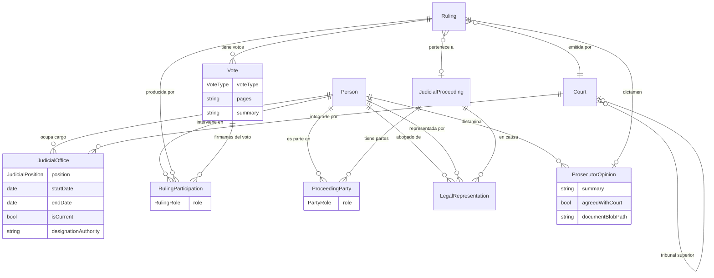
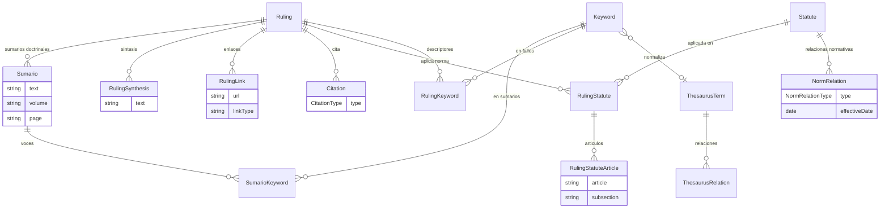
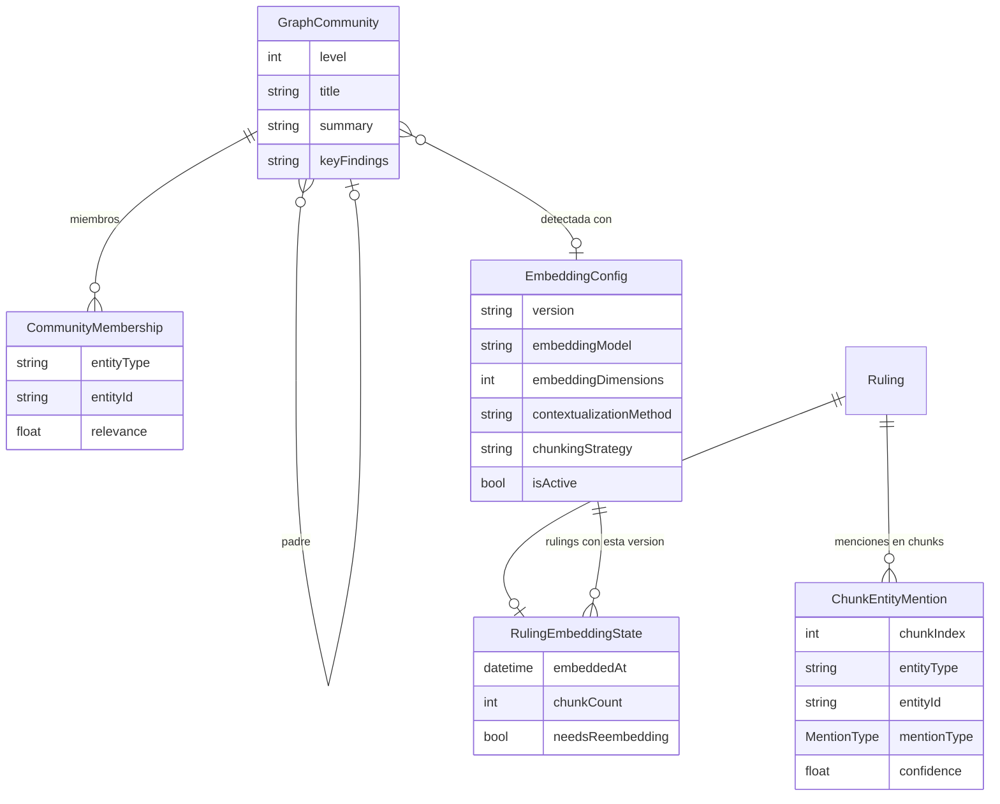
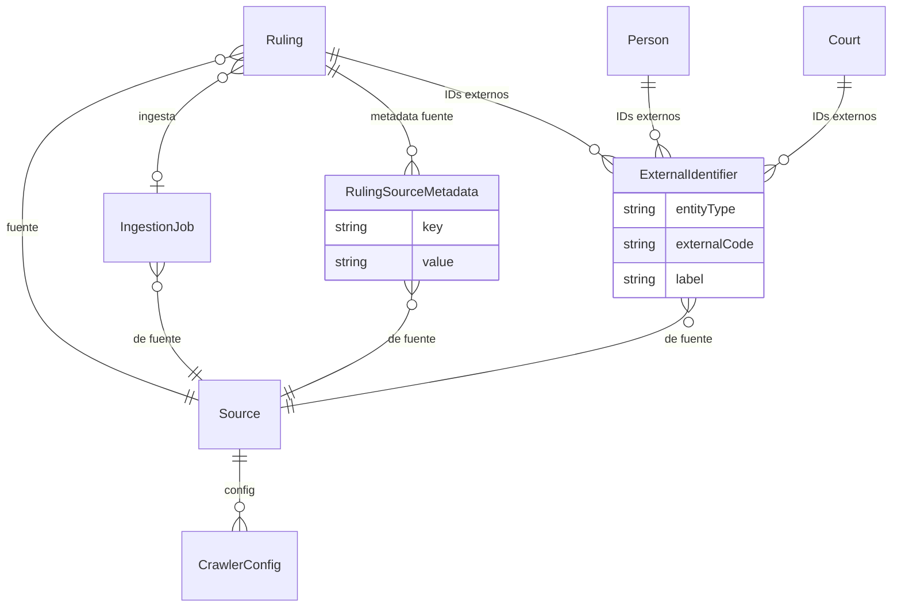
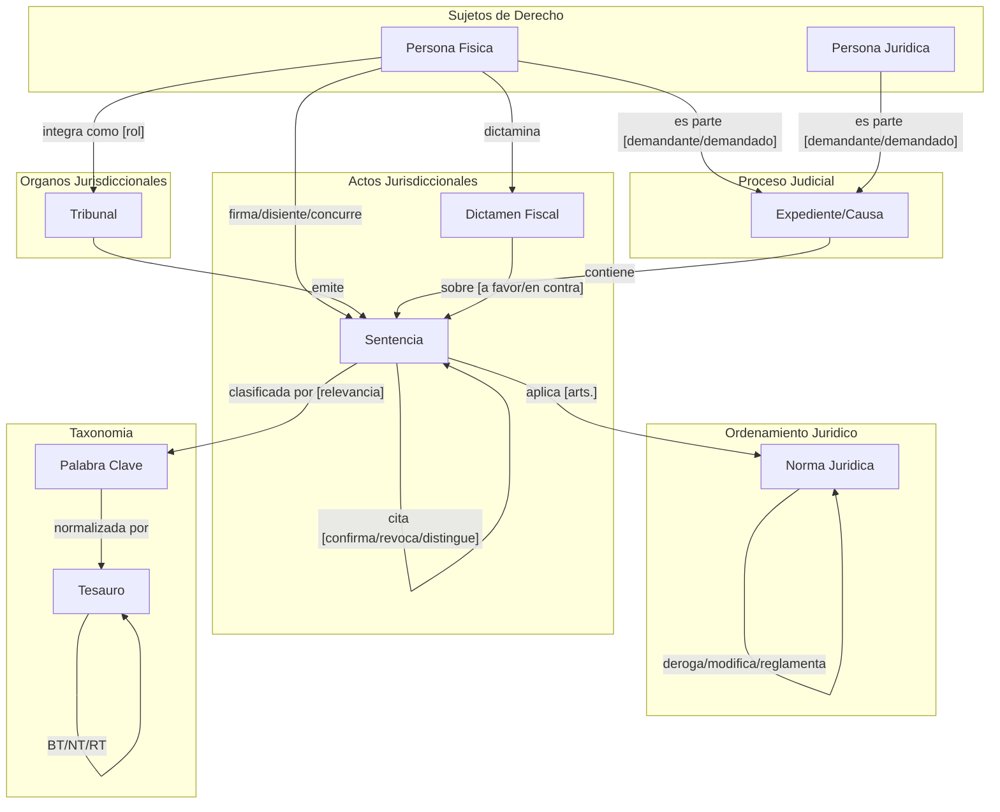
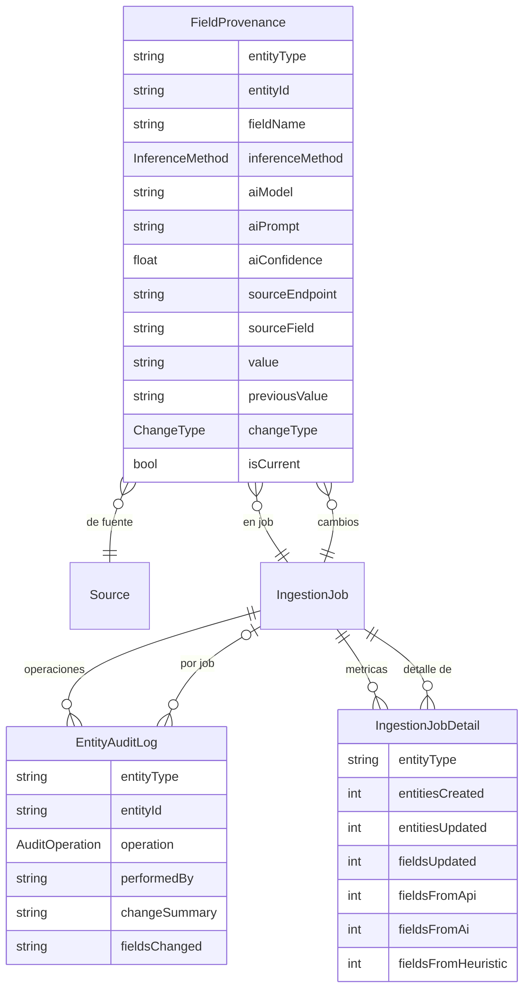

# Modelo Conceptual Target de la Knowledge Base

## Principio rector

El modelo refleja la naturaleza real del dominio juridico argentino. Las entidades son las que el derecho reconoce naturalmente:

- **Persona** (sujeto de derecho) -- fisica o juridica -- es la entidad fundamental
- **Tribunal** (organo jurisdiccional) -- compuesto por personas, emite sentencias
- **Sentencia** (acto jurisdiccional) -- producida por un tribunal, firmada por jueces, aplicando normas
- **Proceso Judicial** (expediente) -- agrupa sentencias, tiene partes (personas)
- **Norma Juridica** -- la ley que se aplica, con su jerarquia normativa

---

## 1. Entidades del dominio

### 1.1 Sujetos de derecho

**Person** -- Persona fisica o juridica. Sujeto de derecho. Solo identidad, sin rol -- el rol es siempre contextual a un acto juridico.

- `Id`: int
- `DisplayName`: string -- siempre poblado ("Rosatti, Horacio" o "YPF S.A." o "Estado Nacional")
- `FirstName`: string? -- solo personas fisicas
- `LastName`: string? -- solo personas fisicas
- `PersonType`: PersonType -- Physical, LegalPublic, LegalPrivate, StateEntity, Indeterminate
- `LegalEntityType`: LegalEntityType? -- solo cuando PersonType != Physical (SA, SRL, SAS, CivilAssociation, Foundation, Cooperative, Mutual, State, Other)
- `CsjnMinistroId`: int? -- ID CSJN para ministros nomenclados (dato de origen, no de rol)
- `IsVerified`: bool -- true si proviene de fuente nomenclada (CSJN, MJN)

**No hay `Category` ni `CurrentCourtId` en Person.** El rol se determina por las entidades de relacion en las que participa. Si una persona es juez, eso se sabe porque tiene registros en `JudicialOffice`. Si es parte en una causa, tiene registros en `ProceedingParty`.

Hoy existe como `Judge`. El cambio: generalizar, quitar Category/CurrentCourtId, agregar `PersonType` y `DisplayName`.

### 1.2 Organo jurisdiccional

**Court** -- Tribunal. Organo del Estado que ejerce jurisdiccion, compuesto por personas.

Sin cambios estructurales. Campos existentes: `Name`, `ExternalCode`, `JurisdictionArea`, `Territory`, `Instance`, `CourtCategory` (CourtType), `Fuero`, `InstanceLevel`, `GovernmentLevel`, `ParentCourtId`, `IsVerified`.

### 1.3 Acto jurisdiccional

**Ruling** -- Sentencia/fallo judicial. Documento central de la KB.

Campos existentes: `CaseTitle`, `CaseNumber`, `RulingDate`, `CourtId`, `JudicialProceedingId`, `LegalBranch`, `PrecedentWeight`, `IsPlenario`, `IsLeadingCase`, `IsUnconstitutional`, `Summary`, `Holding`, `FullText`, `BlobPath`, etc.

Campos nuevos (F0.2):
- `RatioDecidendi`: string? -- fundamentacion esencial de la decision; la parte vinculante del fallo. Extraible por LLM (nano) en F1
- `DoctrinaLegal`: string? -- criterio juridico que el fallo sienta para casos futuros. Extraible por LLM (nano) en F1

### 1.4 Proceso judicial

**JudicialProceeding** -- Expediente/causa. Agrupa sentencias y tiene partes.

Campos existentes: `CaseNumber`, `DisplayName`, `JurisdictionArea`, `RulingCount`, `FirstRulingDate`, `LastRulingDate`.

Campos nuevos (F0.2):
- `ProcessType`: ProcessType? -- Civil, Penal, Laboral, ContencisoAdministrativo, Familia, Constitucional
- `ProcessSubtype`: string? -- Ordinario, Sumarisimo, Ejecutivo, Amparo, HabeasCorpus, etc.
- `CourtId`: int? FK Court -- tribunal que entiende (derivable del primer Ruling)
- `LegalBranch`: LegalBranch? -- rama del derecho (derivable de rulings)
- `Status`: ProcessStatus? -- EnTramite, ConSentencia, Firme, Archivado

Se enriquece con las relaciones a partes y representacion legal (ver secciones 2.3 y 2.4).

### 1.5 Norma juridica

**Statute** -- Ley, decreto, tratado, acordada, resolucion, etc.

Campos existentes: `Number`, `Name`, `NormType`, `NormativeLevel`, `LegalBranch`, `IssuingBody`, `SanctionDate`, `EffectiveFrom`, `EffectiveTo`.

Campos nuevos (F0.2):
- `OfficialUrl`: string? -- link a fuente oficial (InfoLEG, SAIJ)
- `IsVigente`: computed bool -- `EffectiveTo == null || EffectiveTo > DateTime.UtcNow`. No se persiste, se calcula en la query

### 1.6 Voto

**Vote** -- Un voto dentro de una sentencia. Agrupa a los jueces que votan juntos en una misma posicion. **Entidad nueva.**

Una sentencia de la CSJN tipicamente tiene 2-4 votos: mayoria, disidencia, concurrencia(s). Cada voto es firmado por un subconjunto de ministros y puede tener su propia fundamentacion.

- `Id`: int
- `RulingId`: Guid FK Ruling
- `VoteType`: VoteType enum (Majority, Dissent, Concurrence, Individual)
- `Pages`: string? -- referencia a paginas del documento donde aparece este voto
- `Summary`: string? -- resumen de la fundamentacion de este voto especifico

Hoy los votos se aplastan a una lista de jueces, perdiendo la estructura grupal. `RulingParticipation` se conecta a `Vote` via `VoteId` opcional.

### 1.7 Sumario

**Sumario** -- Extracto doctrinal oficial de una sentencia. Lo que los abogados citan. **Entidad nueva.**

Un fallo puede tener multiples sumarios, cada uno con su texto doctrinal y descriptores propios. Provienen de `getSumariosAnalisis` de la CSJN.

- `Id`: int
- `RulingId`: Guid FK Ruling
- `ExternalId`: int? -- ID en la fuente (CSJN sumario ID)
- `Text`: string -- el extracto doctrinal
- `Volume`: string? -- tomo en la coleccion Fallos
- `Page`: string? -- pagina en la coleccion Fallos
- `SortOrder`: int
- `CreatedAt`: DateTime

**SumarioKeyword** (join: Sumario <-> Keyword) -- vocesSumario del API:
- `SumarioId`: int FK Sumario
- `KeywordId`: int FK Keyword
- `SortOrder`: int

### 1.8 Sintesis y enlaces

**RulingSynthesis** -- Documento de sintesis/resena de una sentencia. Proviene de `getSintesisAnalisis`. **Entidad nueva.**

- `Id`: int
- `RulingId`: Guid FK Ruling
- `Text`: string
- `SortOrder`: int
- `CreatedAt`: DateTime

**RulingLink** -- Enlace a documento relacionado (PDF de dictamen MPF, documento externo, etc.). Proviene de `getEnlacesAnalisis`. **Entidad nueva.**

- `Id`: int
- `RulingId`: Guid FK Ruling
- `Url`: string
- `Title`: string?
- `LinkType`: string? -- tipo de enlace (ej. "mpf-dictamen", "related-doc", "external")
- `CreatedAt`: DateTime

### 1.9 Vocabulario controlado

**Keyword** -- Palabra clave asociada a sentencias. Sin cambios.
**ThesaurusTerm** -- Descriptor normalizado del tesauro CSJN. Sin cambios.

### 1.10 Identificadores externos

**ExternalIdentifier** -- Identificador de una entidad en un sistema externo. Patron generico para IDs de multiples fuentes. **Entidad nueva.**

- `Id`: int
- `EntityType`: string -- tipo de entidad local ("Person", "Court", "Ruling", "Statute")
- `EntityId`: string -- ID de la entidad local (como string para flexibilidad)
- `SourceId`: int FK Source -- fuente de donde proviene el ID
- `ExternalCode`: string -- el ID en el sistema externo
- `Label`: string? -- descripcion (ej. "CSJN Ministro ID", "MJN Magistrado ID", "SAIJ ID")
- `CreatedAt`: DateTime

Reemplaza campos sueltos:
- `Person.CsjnMinistroId` -> ExternalIdentifier(Person, personId, CSJN, ministroId)
- `Court.ExternalCode` -> ExternalIdentifier(Court, courtId, MJN, externalCode)
- `Ruling.ExternalId` -> ExternalIdentifier(Ruling, rulingId, CSJN, externalId)
- `Ruling.AnalysisId` -> ExternalIdentifier(Ruling, rulingId, CSJN, analysisId)

### 1.11 Metadata de fuente

**RulingSourceMetadata** -- Campos especificos de una fuente que no pertenecen al modelo generico de Ruling. **Entidad nueva.**

- `Id`: int
- `RulingId`: Guid FK Ruling
- `SourceId`: int FK Source
- `Key`: string -- nombre del campo
- `Value`: string? -- valor

Campos que migran de Ruling a esta tabla (CSJN-especificos):
- `ActionType` -- tipo de recurso/accion
- `InternalSubject` -- materia interna CSJN
- `OfficialReference` -- referencia oficial
- `Observations` -- observaciones
- `FederalQuestion` -- cuestion federal
- `ProceduralFormula` -- formula procesal

Campos que se mantienen en Ruling (genericos a cualquier fuente):
- `CaseTitle`, `CaseNumber`, `RulingDate`, `CourtId`, `Summary`, `Holding`, `FullText`, `BlobPath`
- `LegalBranch`, `PrecedentWeight`, `IsPlenario`, `IsLeadingCase`, `IsUnconstitutional`
- `JurisdictionArea`, `Instance`, `Jurisdiction`, `ResourceType`, `RulingDirection`, `SubjectArea`

### 1.12 Comunidades de grafo (para GraphRAG)

GraphRAG detecta comunidades (clusters) de entidades fuertemente relacionadas y genera resumenes jerarquicos. Cada comunidad tiene un titulo, un resumen generado por LLM, y un nivel en la jerarquia. Sirven para responder preguntas globales ("cual es la posicion de la Corte sobre medio ambiente?").

**GraphCommunity** -- Cluster detectado de entidades relacionadas. **Entidad nueva.**

- `Id`: int
- `Level`: int -- 0=hoja (entidades individuales), 1=cluster pequeno, 2+=mas abstracto
- `ParentCommunityId`: int? FK GraphCommunity -- jerarquia de comunidades
- `Title`: string -- titulo descriptivo corto (ej. "Derecho ambiental - CSJN 2020-2025")
- `Summary`: string -- resumen generado por LLM del contenido de la comunidad
- `KeyFindings`: string? -- hallazgos clave / insights
- `EntityCount`: int -- cantidad de entidades en la comunidad
- `EmbeddingConfigId`: int? FK EmbeddingConfig -- config con la que se detecto
- `CreatedAt`: DateTime

**CommunityMembership** -- Que entidades pertenecen a que comunidad. **Entidad nueva.**

- `Id`: int
- `CommunityId`: int FK GraphCommunity
- `EntityType`: string -- "Ruling", "Person", "Court", "Statute", "Keyword"
- `EntityId`: string -- ID de la entidad (string para flexibilidad)
- `Relevance`: float? -- que tan central es esta entidad en la comunidad (0.0-1.0)

Ejemplo: una comunidad Level 1 podria ser "Fallos sobre libertad de expresion firmados por Lorenzetti" con 15 rulings, 3 persons, 8 statutes como miembros.

### 1.13 Vinculacion chunk-entidad (para GraphRAG local search)

Cuando la IA encuentra un chunk relevante, necesita saber que entidades estan mencionadas en ese fragmento especifico para navegar el grafo desde ahi. Hoy los chunks solo tienen `rulingId` pero no saben que personas, normas o tribunales mencionan.

**ChunkEntityMention** -- Entidades mencionadas en un chunk especifico. **Entidad nueva.**

- `Id`: long (bigint, volumen alto: ~10-20 menciones por chunk, ~20 chunks por ruling)
- `RulingId`: Guid FK Ruling
- `ChunkIndex`: int -- indice del chunk dentro del ruling
- `EntityType`: string -- "Person", "Court", "Statute", "Keyword", "JudicialProceeding"
- `EntityId`: string -- ID de la entidad mencionada
- `MentionType`: MentionType enum -- como se menciona
- `Confidence`: float? -- confianza de la extraccion (si fue por IA)

**MentionType** (enum):
- `Named` -- la entidad aparece por nombre
- `Applied` -- una norma es aplicada/citada en este fragmento
- `Discussed` -- la entidad se discute o analiza
- `Referenced` -- referencia indirecta

Esto habilita queries como: "encontre este chunk sobre Art. 14 bis -> que personas y fallos estan en el mismo chunk? -> navegar a sus comunidades en el grafo"

### 1.14 Versionado de embeddings e indices (para Contextual Retrieval)

Cuando cambiamos el modelo de embedding, el metodo de contextualizacion de chunks (rule-based -> LLM), o los parametros de chunking, necesitamos saber que version tiene cada documento para identificar que requiere regeneracion.

**EmbeddingConfig** -- Configuracion de una version de embeddings. **Entidad nueva.**

- `Id`: int
- `Version`: string -- etiqueta legible (ej. "v1-rule-based", "v2-llm-contextual")
- `EmbeddingModel`: string -- modelo usado (ej. "text-embedding-3-large")
- `EmbeddingDimensions`: int -- dimensiones del vector (ej. 3072)
- `ContextualizationMethod`: string -- metodo de contextualizacion ("rule-based-prefix", "llm-contextual-gpt5nano")
- `ChunkingStrategy`: string -- estrategia de chunking (ej. "fixed-512-overlap-50")
- `ChunkSize`: int -- tokens por chunk (ej. 512)
- `ChunkOverlap`: int -- overlap en tokens (ej. 50)
- `IsActive`: bool -- version activa actualmente
- `CreatedAt`: DateTime
- `Notes`: string? -- descripcion del cambio

**RulingEmbeddingState** -- Estado de embedding de cada ruling respecto a la config activa. **Entidad nueva.**

- `RulingId`: Guid FK Ruling
- `EmbeddingConfigId`: int FK EmbeddingConfig -- con que version fue embedido
- `EmbeddedAt`: DateTime -- cuando se genero el embedding
- `ChunkCount`: int -- cuantos chunks se generaron
- `NeedsReembedding`: bool -- true cuando la config activa cambia y esta ruling usa una version anterior

Cuando se activa una nueva `EmbeddingConfig`, todas las rulings con `EmbeddingConfigId != nueva.Id` se marcan con `NeedsReembedding = true`. El pipeline puede reprocesarlas incrementalmente.

Ejemplo de ciclo de vida:
1. Config v1 (rule-based, embedding-3-large, 512 tokens) -> 1811 rulings embedidas
2. Se crea Config v2 (llm-contextual, misma embedding) -> v2.IsActive = true
3. Se marcan 1811 rulings con NeedsReembedding = true
4. Pipeline re-procesa chunks con nuevo metodo de contextualizacion
5. Cada ruling procesada actualiza EmbeddingConfigId = v2, NeedsReembedding = false

---

## 2. Roles contextuales (entidades de relacion persona-acto)

Principio: **el rol no es una propiedad de la persona, es una entidad que conecta a la persona con un acto juridico especifico.** Cada rol tiene sus propias propiedades que describen la naturaleza de la participacion.

La misma persona puede tener multiples roles simultaneos o a lo largo del tiempo:
- Rosatti *integra* la CSJN como Ministro (JudicialOffice)
- Rosatti *firma en disidencia* el fallo X (RulingParticipation)
- Garcia fue *abogado* de la parte demandante en la causa Y (LegalRepresentation)
- Garcia hoy es *juez* del Juzgado Federal N 1 (JudicialOffice)
- YPF S.A. es *demandada* en la causa Z (ProceedingParty)

### 2.1 Cargo judicial (Person <-> Court)

**JudicialOffice** -- Una persona ocupa un cargo en un tribunal. Entidad con ciclo de vida propio.

- `Id`: int
- `PersonId`: int FK Person
- `CourtId`: int FK Court
- `Position`: JudicialPosition enum
- `StartDate`: DateOnly?
- `EndDate`: DateOnly?
- `IsCurrent`: bool
- `DesignationAuthority`: string? -- quien lo designo (ej. "Decreto PEN 123/2020")

Hoy existe como `JudgeTenure`. El cambio: renombrar, reemplazar `Role` (que era PersonCategory) por `Position` (JudicialPosition), agregar `DesignationAuthority`.

**JudicialPosition** (enum -- cargos judiciales):
- `Minister` -- Ministro de la CSJN
- `Conjuez` -- Conjuez
- `CamaristaNacional` -- Camarista Nacional
- `CamaristaFederal` -- Camarista Federal
- `JuezPrimeraInstancia` -- Juez de primera instancia
- `JuezDePaz` -- Juez de paz
- `ProcuradorGeneral` -- Procurador General de la Nacion
- `FiscalGeneral` -- Fiscal General
- `Fiscal` -- Fiscal
- `DefensorGeneral` -- Defensor General
- `Defensor` -- Defensor publico
- `Secretario` -- Secretario de juzgado/tribunal

### 2.2 Participacion en sentencia (Person <-> Ruling, via Vote)

**RulingParticipation** -- Una persona interviene en la produccion de una sentencia, en una calidad especifica, como parte de un voto especifico.

- `Id`: int
- `RulingId`: Guid FK Ruling
- `PersonId`: int FK Person
- `VoteId`: int? FK Vote -- a que voto pertenece esta participacion (NULL si no es juez)
- `Role`: RulingRole enum
- `CreatedAt`: DateTime

Hoy existe como `RulingJudge` sin tipo ni voto. El cambio: renombrar, agregar `Role` y `VoteId`.

**RulingRole** (enum -- calidad en la que se interviene en la sentencia):
- `SIGNATORY` -- firma el fallo (voto de mayoria)
- `DISSENT` -- voto en disidencia
- `CONCURRENCE` -- voto en concurrencia
- `MAJORITY_AUTHOR` -- redactor del voto mayoritario
- `PROSECUTOR` -- fiscal que dictamino
- `PUBLIC_DEFENDER` -- defensor publico interviniente

### 2.3 Parte procesal (Person <-> JudicialProceeding)

**ProceedingParty** -- Una persona (fisica o juridica) es parte en un proceso judicial. **Entidad nueva.**

- `Id`: int
- `JudicialProceedingId`: int FK JudicialProceeding
- `PersonId`: int FK Person
- `Role`: PartyRole enum
- `CreatedAt`: DateTime

**PartyRole** (enum -- calidad procesal):
- `PLAINTIFF` -- demandante / querellante / actor
- `DEFENDANT` -- demandado / imputado
- `THIRD_PARTY` -- tercero interesado / citado
- `AMICUS_CURIAE` -- amicus curiae

### 2.4 Representacion legal (Person <-> Person <-> JudicialProceeding)

**LegalRepresentation** -- Un abogado representa a una parte en un proceso judicial. **Entidad nueva.**

- `Id`: int
- `LawyerPersonId`: int FK Person -- el abogado
- `PartyPersonId`: int FK Person -- la parte representada
- `JudicialProceedingId`: int FK JudicialProceeding
- `CreatedAt`: DateTime

Esto modela: "Dr. Garcia (abogado) representa a YPF S.A. (demandada) en la causa X c/ YPF".

### 2.5 Dictamen fiscal (Person <-> Ruling)

**ProsecutorOpinion** -- Un fiscal emite un dictamen sobre una sentencia. Se mantiene como entidad separada porque tiene datos sustantivos propios. Se enriquece con el documento completo del dictamen.

- `PersonId`: int FK Person -- **NUEVO** (reemplaza `ProsecutorName` string)
- `RulingId`: Guid FK Ruling
- `Summary`: string?
- `RecommendedDirection`: string?
- `AgreedWithCourt`: bool
- `DocumentDate`: DateOnly? -- **NUEVO** fecha del dictamen
- `DocumentBlobPath`: string? -- **NUEVO** path al PDF del dictamen en blob storage (de getDictamenesAnalisis)
- `FullText`: string? -- **NUEVO** texto completo del dictamen

### 2.6 Aplicacion de normas con articulos estructurados (Ruling <-> Statute)

**RulingStatute** -- Una sentencia aplica una norma, con referencia precisa a articulos.

Campos existentes: `RulingId`, `StatuteId`, `Articles` (string).

**RulingStatuteArticle** -- Referencia estructurada a un articulo especifico. **Entidad nueva.**

- `Id`: int
- `RulingStatuteId`: int FK RulingStatute
- `Article`: string -- numero de articulo (ej. "14 bis", "75 inc. 22")
- `Subsection`: string? -- inciso o parrafo especifico

Esto permite queries precisas: "todos los fallos que aplican el Art. 14 bis de la CN" en vez de buscar en un string libre.

El campo `RulingStatute.Articles` (string) se mantiene como texto libre de respaldo; `RulingStatuteArticle` es la version estructurada.

### 2.7 Relaciones entre actos (sin cambios)

- **Citation** (Ruling <-> Ruling) con `CitationType` -- confirma, revoca, distingue, sigue, disiente
- **RulingKeyword** (Ruling <-> Keyword) con `SortOrder` -- descriptores del fallo
- **NormRelation** (Statute <-> Statute) con `NormRelationType` -- deroga, modifica, reglamenta, complementa
- **ThesaurusRelation** (ThesaurusTerm <-> ThesaurusTerm) con `ThesaurusRelationType` -- BT, NT, UF, RT

---

## 3. Enumeraciones

### PersonType (NUEVO)
- `Physical` -- persona humana
- `LegalPublic` -- persona juridica de derecho publico (Art. 146 CCyC: Estado, provincias, municipios, entes autarquicos)
- `LegalPrivate` -- persona juridica de derecho privado (Art. 148 CCyC: sociedades, asociaciones, fundaciones)

### JudicialPosition (NUEVO, reemplaza PersonCategory para cargos judiciales)
- `Minister`, `Conjuez`, `CamaristaNacional`, `CamaristaFederal`, `JuezPrimeraInstancia`, `JuezDePaz`
- `ProcuradorGeneral`, `FiscalGeneral`, `Fiscal`, `DefensorGeneral`, `Defensor`
- `Secretario`

### RulingRole (NUEVO, reemplaza ParticipationType)
- `SIGNATORY`, `DISSENT`, `CONCURRENCE`, `MAJORITY_AUTHOR`, `PROSECUTOR`, `PUBLIC_DEFENDER`

### PartyRole (NUEVO)
- `PLAINTIFF`, `DEFENDANT`, `THIRD_PARTY`, `AMICUS_CURIAE`

### Se elimina
- `PersonCategory` -- ya no existe como enum. Los roles se expresan a traves de las entidades de relacion:
  - Judicial oficial? -> tiene `JudicialOffice` records
  - Parte procesal? -> tiene `ProceedingParty` records
  - Abogado? -> tiene `LegalRepresentation` records
  - Fiscal? -> tiene `ProsecutorOpinion` o `RulingParticipation` con Role=PROSECUTOR

### VoteType (NUEVO)
- `Majority` -- voto de la mayoria
- `Dissent` -- voto en disidencia
- `Concurrence` -- voto en concurrencia
- `Individual` -- voto individual (segun su fundamento)

### Enums sin cambios
`CitationType`, `CourtType`, `Fuero`, `GovernmentLevel`, `LegalBranch`, `NormType`, `NormativeLevel`, `NormRelationType`, `PrecedentWeight`, `RulingStatus`, `ThesaurusRelationType`

---

## 4. Modelo completo

### 4.0 Vista general -- todas las entidades y relaciones

```mermaid
flowchart TB
    subgraph sujetos [SUJETOS DE DERECHO]
        Person["Person
        DisplayName, PersonType
        FirstName?, LastName?
        IsVerified"]
    end

    subgraph organos [ORGANO JURISDICCIONAL]
        Court["Court
        Name, CourtCategory, Fuero
        InstanceLevel, GovernmentLevel
        ParentCourtId?"]
    end

    subgraph actos [ACTO JURISDICCIONAL]
        Ruling["Ruling
        CaseTitle, CaseNumber, RulingDate
        Summary, Holding, FullText
        LegalBranch, PrecedentWeight
        IsPlenario, IsLeadingCase
        IsUnconstitutional"]
        Vote["Vote
        VoteType, Pages?, Summary?"]
        ProsOpinion["ProsecutorOpinion
        PersonId, Summary
        AgreedWithCourt
        DocumentBlobPath?"]
    end

    subgraph proceso [PROCESO JUDICIAL]
        JudProc["JudicialProceeding
        CaseNumber, DisplayName
        RulingCount
        FirstRulingDate, LastRulingDate"]
    end

    subgraph normas [ORDENAMIENTO JURIDICO]
        Statute["Statute
        Number, Name, NormType
        NormativeLevel, LegalBranch"]
    end

    subgraph contenido [CONTENIDO DOCTRINAL]
        Sumario["Sumario
        Text, Volume?, Page?"]
        Synthesis["RulingSynthesis
        Text"]
        RulingLnk["RulingLink
        Url, LinkType"]
    end

    subgraph vocabulario [VOCABULARIO CONTROLADO]
        Keyword["Keyword
        ExternalCode?, Description"]
        ThTerm["ThesaurusTerm
        Label, BranchName"]
    end

    subgraph roles [ROLES CONTEXTUALES]
        JudOffice["JudicialOffice
        Position, StartDate, EndDate
        IsCurrent, DesignationAuthority"]
        RulPart["RulingParticipation
        Role, VoteId?"]
        ProcParty["ProceedingParty
        Role"]
        LegalRep["LegalRepresentation
        LawyerPersonId, PartyPersonId"]
    end

    subgraph graphrag [GRAPHRAG]
        Community["GraphCommunity
        Level, Title, Summary
        KeyFindings"]
        CommMember["CommunityMembership
        EntityType, EntityId, Relevance"]
        ChunkMention["ChunkEntityMention
        ChunkIndex, EntityType
        MentionType, Confidence"]
    end

    subgraph retrieval [CONTEXTUAL RETRIEVAL]
        EmbConfig["EmbeddingConfig
        Version, EmbeddingModel
        ContextualizationMethod
        ChunkSize, ChunkOverlap"]
        EmbState["RulingEmbeddingState
        EmbeddedAt, ChunkCount
        NeedsReembedding"]
    end

    subgraph operativas [OPERATIVAS]
        Source["Source"]
        IngestJob["IngestionJob"]
        CrawlConf["CrawlerConfig"]
        UserEnt["User"]
    end

    subgraph identificadores [IDENTIFICADORES Y METADATA]
        ExtId["ExternalIdentifier
        EntityType, ExternalCode, Label"]
        SrcMeta["RulingSourceMetadata
        Key, Value"]
    end

    subgraph normRel [RELACIONES ENTRE ENTIDADES]
        Citation["Citation
        CitationType"]
        RulStat["RulingStatute + RulingStatuteArticle
        Articles, Article, Subsection"]
        RulKw["RulingKeyword
        SortOrder"]
        SumKw["SumarioKeyword"]
        NormRel["NormRelation
        NormRelationType, EffectiveDate"]
        ThRel["ThesaurusRelation
        RelationType"]
    end

    subgraph auditoria [AUDITORIA Y TRAZABILIDAD]
        FieldProv["FieldProvenance
        InferenceMethod, AiModel
        SourceEndpoint, SourceField
        Value, PreviousValue"]
        AuditLog["EntityAuditLog
        Operation, PerformedBy"]
        JobDetail["IngestionJobDetail
        EntitiesCreated, FieldsFromAi"]
    end

    Person --> JudOffice --> Court
    Person --> RulPart --> Ruling
    Person --> ProcParty --> JudProc
    Person --> LegalRep --> JudProc
    Person --> ProsOpinion --> Ruling
    Vote --> RulPart
    Ruling --> Vote
    Ruling --> Court
    Ruling --> JudProc
    Ruling --> Citation
    Ruling --> RulStat --> Statute
    Ruling --> RulKw --> Keyword
    Ruling --> Sumario --> SumKw --> Keyword
    Ruling --> Synthesis
    Ruling --> RulingLnk
    Ruling --> SrcMeta --> Source
    Ruling --> EmbState --> EmbConfig
    Ruling --> ChunkMention
    Statute --> NormRel
    Keyword --> ThTerm --> ThRel
    Community --> CommMember
    ExtId --> Source
    Ruling --> IngestJob --> Source
    Source --> CrawlConf
    FieldProv --> IngestJob
    AuditLog --> IngestJob
    JobDetail --> IngestJob
```



**Inventario: 37 entidades, 19 enums**

Dominio core: 7 (Person, Court, Ruling, JudicialProceeding, Statute, Keyword, ThesaurusTerm)
Contenido doctrinal: 4 (Vote, Sumario, RulingSynthesis, RulingLink)
Roles contextuales: 5 (JudicialOffice, RulingParticipation, ProceedingParty, LegalRepresentation, ProsecutorOpinion)
Relaciones entre actos: 7 (Citation, RulingStatute, RulingStatuteArticle, RulingKeyword, SumarioKeyword, NormRelation, ThesaurusRelation)
Identificadores y metadata: 2 (ExternalIdentifier, RulingSourceMetadata)
GraphRAG: 3 (GraphCommunity, CommunityMembership, ChunkEntityMention)
Contextual Retrieval: 2 (EmbeddingConfig, RulingEmbeddingState)
Operativas: 4 (Source, IngestionJob, CrawlerConfig, User)
Auditoria: 3 (FieldProvenance, EntityAuditLog, IngestionJobDetail)

### 4.1 Nucleo: Sentencia, Tribunal, Persona y sus roles



### 4.2 Contenido doctrinal y normativo



### 4.3 GraphRAG: comunidades y chunk-entity linking



### 4.4 Operativas e identificadores



---

## 5. Mapa de almacenamiento por capa

### Azure SQL -- fuente de verdad para todas las entidades y relaciones

Todas las entidades del modelo se persisten en SQL con integridad referencial completa:
- Persons, Courts, Rulings, Statutes, Keywords, JudicialProceedings, ProsecutorOpinions
- RulingParticipations, ProceedingParties (NUEVA), Citations, RulingStatutes, RulingKeywords, PersonTenures, NormRelations, ThesaurusTerms, ThesaurusRelations
- Sources, IngestionJobs, CrawlerConfigs, Users

Graph traversal se realiza via CTEs recursivos sobre Citations, RulingParticipations, ProceedingParties, RulingStatutes.

### Azure AI Search -- busqueda full-text y semantica

**rulings-by-ruling** (documento denormalizado):
- Campos existentes: caseTitle, summary, holding, caseNumber, rulingDate, court, courtType, fuero, keywords[], judges[], statutes[], etc.
- Campos nuevos propuestos: `judicialProceedingId`, `judicialProceedingName`, `parties[]` (nombres de partes del proceeding), `citationTypes[]`, `prosecutorAgreed`

**rulings-by-chunk** (fragmentos para RAG): sin cambios.

**legal-thesaurus** (synonym map): sin cambios.

### Azure Blob Storage -- documentos y cache

- `legal-ai-ar-kb/{type}/{source}/{yyyy-MM}/{id}.pdf|.txt|.metadata.json|.indexer.json` -- sin cambios
- `_cache/{source}/pdf/` y `_cache/{source}/api/` -- sin cambios

### Graph Explorer -- visualizacion de relaciones

Nodos: `ruling`, `court`, `person`, `statute`, `keyword`, `judicialProceeding` (NUEVO)

Edges:
- `issuedBy`: ruling -> court
- `signedBy`: ruling -> person (label = ParticipationType)
- `partyOf`: person -> judicialProceeding (label = PartyRole) (NUEVO)
- `cites` / `citedBy`: ruling <-> ruling (label = CitationType)
- `citesStatute`: ruling -> statute
- `hasKeyword`: ruling -> keyword
- `memberOf`: person -> court
- `normRelation`: statute -> statute
- `belongsTo`: ruling -> judicialProceeding (NUEVO)

---

## 6. Capa de semantica de relaciones (para contexto IA)

El grafo de la KB no es solo un esquema relacional -- es un **grafo de conocimiento juridico** donde cada arista lleva el contexto semantico que permite a la IA entender la naturaleza de la relacion. Cada edge responde a la pregunta: *con que rol o en que calidad esta entidad participa en este acto juridico?*

### 6.1 Aristas persona-acto (rol en el acto juridico)

| Arista | Nodos | Rol (atributo del edge) | Ejemplo de contexto para la IA |
|---|---|---|---|
| **participaEn** | Person -> Ruling | `ParticipationType` (SIGNATORY, DISSENT, CONCURRENCE, PROSECUTOR, etc.) | "Rosatti firmó en disidencia en este fallo sobre libertad de expresión" |
| **esParteEn** | Person -> JudicialProceeding | `PartyRole` (PLAINTIFF, DEFENDANT, COUNSEL, etc.) | "YPF S.A. fue demandada en esta causa ambiental" |
| **dictamina** | Person -> ProsecutorOpinion -> Ruling | `AgreedWithCourt`, `RecommendedDirection` | "El procurador Casal dictaminó a favor de la inconstitucionalidad, coincidiendo con la Corte" |
| **integra** | Person -> Court | `PersonCategory` (Minister, Camarista, etc.) + `StartDate`/`EndDate` | "Maqueda fue ministro de la CSJN desde 2002 hasta 2024" |

### 6.2 Aristas acto-acto (relacion entre actos juridicos)

| Arista | Nodos | Rol (atributo del edge) | Ejemplo de contexto para la IA |
|---|---|---|---|
| **cita** | Ruling -> Ruling | `CitationType` (UPHOLDS, OVERRULES, DISTINGUISHES, FOLLOWS, DISSENTS_FROM) | "Este fallo revoca el precedente Halabi sobre acciones colectivas" |
| **perteneceA** | Ruling -> JudicialProceeding | (implicito, temporal) | "Esta sentencia es la 3ra resolución en la causa X c/ Y, dictada en apelación" |

### 6.3 Aristas acto-norma (aplicacion del derecho)

| Arista | Nodos | Rol (atributo del edge) | Ejemplo de contexto para la IA |
|---|---|---|---|
| **aplicaNorma** | Ruling -> Statute | `Articles` (articulos especificos aplicados) | "La Corte aplicó el Art. 14 bis de la Constitución Nacional para resolver sobre derechos laborales" |
| **declaraInconstitucional** | Ruling -> Statute | (derivado de `Ruling.IsUnconstitutional` + RulingStatute) | "Se declaró inconstitucional el Art. 5 de la Ley 25.326 de protección de datos" |

### 6.4 Aristas norma-norma (ordenamiento juridico)

| Arista | Nodos | Rol (atributo del edge) | Ejemplo de contexto para la IA |
|---|---|---|---|
| **deroga** | Statute -> Statute | `NormRelationType` + `EffectiveDate` | "El Decreto 70/2023 derogó parcialmente la Ley 20.744 de contrato de trabajo" |
| **modifica** | Statute -> Statute | `NormRelationType` + `EffectiveDate` | "La Ley 27.742 modificó los Arts. 1-15 de la Ley 24.013" |
| **reglamenta** | Statute -> Statute | `NormRelationType` | "El Decreto 1759/72 reglamenta la Ley 19.549 de procedimiento administrativo" |

### 6.5 Aristas de clasificacion (taxonomia)

| Arista | Nodos | Rol (atributo del edge) | Ejemplo de contexto para la IA |
|---|---|---|---|
| **emitidoPor** | Ruling -> Court | (Court.CourtCategory, Court.Fuero) | "Sentencia emitida por la CSJN, máxima instancia judicial" |
| **clasificadaComo** | Ruling -> Keyword | `SortOrder` (relevancia) | "El fallo trata sobre 'daño ambiental colectivo' y 'legitimación activa'" |
| **normalizadoPor** | Keyword -> ThesaurusTerm | (ThesaurusRelationType) | "'Daño ambiental' es descriptor preferido; 'contaminación' es término relacionado" |

### 6.6 Grafo completo del dominio



### 6.7 Que habilita esta capa para la IA

La IA legal puede responder preguntas de contexto complejas porque cada traversal del grafo lleva informacion de rol:

**1-hop (relacion directa):**
- "Quienes firmaron en disidencia en fallos de derecho ambiental?" -> Person -[DISSENT]-> Ruling (LegalBranch=SOC_AMB)
- "Que normas aplica la CSJN cuando declara inconstitucionalidad?" -> Ruling (IsUnconstitutional) -[Articles]-> Statute

**2-hop (relacion indirecta):**
- "En que causas fue parte el Estado Nacional donde se aplicó la ley 24.240?" -> Person (Estado Nacional) -[DEFENDANT]-> JudicialProceeding -> Ruling -[Articles]-> Statute (24.240)
- "Que jueces que integraron la Camara Federal de La Plata luego firmaron fallos en la CSJN?" -> Person -[integra]-> Court (Cam.Fed.LP) && Person -[SIGNATORY]-> Ruling (Court=CSJN)

**3-hop (analisis profundo):**
- "Que precedentes cita la CSJN cuando revoca fallos de camaras federales en materia laboral?" -> Ruling (Court=CSJN) -[OVERRULES]-> Ruling (CourtType=CAM_FED, LegalBranch=PRIV_LAB) -[FOLLOWS]-> Ruling (precedente citado)

---

## 7. Delta respecto al modelo actual

### Entidades que cambian

- `Judge` -> **`Person`**: se quita `Category` y `CurrentCourtId`. Se agregan `DisplayName`, `PersonType`. FirstName/LastName se mantienen como opcionales
- `RulingJudge` -> **`RulingParticipation`**: se agrega `Role` (RulingRole enum)
- `JudgeTenure` -> **`JudicialOffice`**: `Role` (que era PersonCategory) cambia a `Position` (JudicialPosition). Se agrega `DesignationAuthority`
- `ProsecutorOpinion`: se agrega `PersonId` FK (reemplaza `ProsecutorName` string)

### Entidades nuevas

- **`Vote`**: voto dentro de una sentencia (VoteType, Pages, Summary)
- **`ProceedingParty`**: Person <-> JudicialProceeding con PartyRole
- **`LegalRepresentation`**: Person (abogado) <-> Person (parte) <-> JudicialProceeding
- **`Sumario`**: extracto doctrinal con texto, tomo, pagina
- **`SumarioKeyword`**: voces del sumario (Sumario <-> Keyword)
- **`RulingSynthesis`**: documento de sintesis de una sentencia
- **`RulingLink`**: enlace a documento relacionado (MPF, externo)
- **`RulingStatuteArticle`**: referencia estructurada a articulo/inciso de norma
- **`ExternalIdentifier`**: patron generico para IDs de multiples fuentes
- **`RulingSourceMetadata`**: campos especificos de fuente sacados de Ruling (key-value)

### Enums nuevos

- **`PersonType`**: Physical, LegalPublic, LegalPrivate, StateEntity, Indeterminate
- **`JudicialPosition`**: Minister, CamaristaNacional, CamaristaFederal, Fiscal, Defensor, etc.
- **`RulingRole`**: SIGNATORY, DISSENT, CONCURRENCE, MAJORITY_AUTHOR, PROSECUTOR, PUBLIC_DEFENDER
- **`PartyRole`**: PLAINTIFF, DEFENDANT, THIRD_PARTY, AMICUS_CURIAE
- **`VoteType`**: Majority, Dissent, Concurrence, Individual
- **`MentionType`**: Named, Applied, Discussed, Referenced
- **`InferenceMethod`**: SourceApi, AiFallback, AiPrimary, Heuristic, Derived, Embedding, Manual, Migration
- **`ChangeType`**: Create, Update, Delete
- **`AuditOperation`**: Created, Updated, Deleted, Restored, Reprocessed
- **`ProcessType`** (F0.2): Civil, Penal, Laboral, ContencisoAdministrativo, Familia, Constitucional
- **`ProcessStatus`** (F0.2): EnTramite, ConSentencia, Firme, Archivado
- **`LegalEntityType`** (F0.2): SA, SRL, SAS, CivilAssociation, Foundation, Cooperative, Mutual, State, Other

### Enums que se eliminan

- **`PersonCategory`** -- los roles se expresan via entidades de relacion, no como atributo de Person
- **`ParticipationType`** (viejo) -- reemplazado por RulingRole + PartyRole separados

### Campos que migran fuera de Ruling

- `AnalysisId`, `ExternalId` -> **ExternalIdentifier** (Ruling, CSJN, valor)
- `ActionType`, `InternalSubject`, `OfficialReference`, `Observations`, `FederalQuestion`, `ProceduralFormula` -> **RulingSourceMetadata** (key-value por fuente)
- `ContentHash` se mantiene en Ruling (es generico, no CSJN-especifico)

### Campos que migran fuera de Person

- `CsjnMinistroId` -> **ExternalIdentifier** (Person, CSJN, ministroId)
- `Category` -> se elimina, el rol se expresa via entidades de relacion
- `CurrentCourtId` -> se elimina, se deriva de JudicialOffice donde IsCurrent=true

### Campos que migran fuera de Court

- `ExternalCode` -> **ExternalIdentifier** (Court, MJN, externalCode)

### Campos nuevos en entidades existentes (F0.2 — convergencia ontologica)

- **JudicialProceeding**: +`ProcessType`, +`ProcessSubtype`, +`CourtId` (FK), +`LegalBranch`, +`Status`
- **Ruling**: +`RatioDecidendi`, +`DoctrinaLegal`
- **Statute**: +`OfficialUrl`, +`IsVigente` (computed)
- **Person**: +`LegalEntityType`, PersonType ampliado con StateEntity/Indeterminate

### Entidades sin cambios

Court, Keyword, ThesaurusTerm, Citation, RulingKeyword, NormRelation, ThesaurusRelation, Source, IngestionJob, CrawlerConfig, User

### Que se puebla hoy vs. que se puebla a futuro

**Fase 0 -- Migracion de datos existentes (solo DDL + rename + data migration):**
- Person (Physical): jueces CSJN + jueces MJN (migrar de tabla Judges)
- RulingParticipation: jueces firmantes (migrar de tabla RulingJudges)
- JudicialOffice: trayectorias (migrar de tabla JudgeTenures, mapear JudgeRole -> JudicialPosition)
- ExternalIdentifier: migrar Person.CsjnMinistroId, Court.ExternalCode, Ruling.ExternalId, Ruling.AnalysisId
- RulingSourceMetadata: migrar Ruling.ActionType, InternalSubject, OfficialReference, etc.

**Fase 1 -- Cambios en pipeline parser (sin LLM, datos ya disponibles en API):**
- Vote: parsear estructura de votos de CsjnVoteDto en vez de aplanar
- RulingParticipation.VoteId + Role: inferir de la estructura del voto
- Sumario + SumarioKeyword: parsear getSumariosAnalisis (hoy se descarga pero no se modela)
- RulingSynthesis: parsear getSintesisAnalisis
- RulingLink: parsear getEnlacesAnalisis
- ProsecutorOpinion.PersonId + DocumentBlobPath: parsear getDictamenesAnalisis
- RulingStatuteArticle: parsear Article/Subsection de CsjnApiStatuteDto en vez de fusionar en string

**Fase 2 -- Cambios en pipeline enrichment (requiere LLM o heuristicas):**
- Person (Physical): fiscal como entidad (hoy es string en ProsecutorOpinion)
- RulingParticipation Role=PROSECUTOR vinculado a la Person del fiscal

**Fase 3 -- Contextual Retrieval (re-embedding con contextualizacion mejorada):**
- EmbeddingConfig v2: configuracion con ContextualizationMethod="llm-contextual"
- RulingEmbeddingState: marcar rulings existentes como NeedsReembedding=true
- Regenerar chunks con contextualizedText producido por LLM (nano)
- Re-embedar todos los chunks y actualizar Search index
- ChunkEntityMention: extraer entidades mencionadas por chunk (NER sobre chunks)

**Fase 4 -- GraphRAG (deteccion de comunidades y resumenes):**
- Ejecutar deteccion de comunidades (Leiden o similar) sobre el grafo SQL
- GraphCommunity: crear comunidades a multiples niveles (Level 0, 1, 2)
- CommunityMembership: asignar entidades a comunidades con relevancia
- Generar Summary y KeyFindings por comunidad via LLM (chat model)
- Integrar community summaries en el flujo de busqueda global del asistente

**Fase 5 -- Extraccion avanzada (requiere LLM sobre texto completo):**
- Person (LegalPublic/LegalPrivate): partes del proceso extraidas del caseTitle "X c/ Y s/ Z"
- ProceedingParty: vinculo partes -> JudicialProceeding con PartyRole
- LegalRepresentation: abogados vinculados a partes en procesos
- RulingParticipation: PUBLIC_DEFENDER, CONCURRENCE diferenciado de SIGNATORY

**--- Plan de convergencia ontologica (F0.2+) ---**

**Fase C1 -- Profundizar CSJN (modelo + LLM):**
- JudicialProceeding: +ProcessType, +ProcessSubtype, +CourtId, +LegalBranch, +Status (heuristicas sobre rulings existentes)
- Ruling: +RatioDecidendi, +DoctrinaLegal (extraccion LLM nano sobre FullText+Summary+Holding)
- Person: +LegalEntityType (clasificacion LLM de partes procesales)
- PersonType: ampliar con StateEntity, Indeterminate
- Mejorar resolucion de Citations (matching por volumen+pagina de Fallos)

**Fase C3b -- Legislacion SAIJ:**
- Statute: +OfficialUrl, +FullText (texto completo de normas SAIJ), +PublicationDate, +SaijId
- StatuteStatus enum: Vigente, ModificadaParcialmente, Derogada, VetoTotal, VetoParcial
- Nuevo indice AI Search para legislacion
- Vincular Statutes con Citations existentes (resolver CitedStatuteId)

**Fase C4 -- Expansion:**
- ProceduralRemedy: entidad nueva (cadena de impugnacion entre instancias)
- DoctrinaLegal: promover de campo en Ruling a entidad separada (Statement, IsOverruled, OverruledByRulingId)
- StateOrgan: generalizacion de Court para incluir organos emisores legislativos/ejecutivos
- SAIJ Rulings: Camaras Federales y Nacionales como nueva fuente

---

## 8. Modelo de auditoria y trazabilidad (paralelo al dominio)

Modelo exclusivamente administrativo. No alimenta a la IA ni al usuario final. Permite auditar el origen de cada dato de la KB y restaurar el estado de la KB a cualquier punto de ingesta.

### 8.1 Principios

- **Toda informacion proviene de fuentes externas gubernamentales publicas.** Cada valor de cada campo tiene un origen rastreable: fuente, endpoint, campo del API, fecha, job de ingesta.
- **Historial completo.** Cuando un valor cambia, el anterior se preserva. No se pierde informacion.
- **Restauracion a cualquier ingesta.** Dado un IngestionJob, se puede reconstruir el estado exacto de la KB en ese momento.
- **Solo visible en admin.** Este modelo no impacta el dominio, la IA ni el frontend publico.

### 8.2 Estrategia tecnica: tablas temporales + provenance

Se combinan dos mecanismos:

**A) SQL Server Temporal Tables** -- para historial automatico a nivel entidad

SQL Server mantiene automaticamente una tabla de historial para cada tabla temporal. Cada fila tiene `SysStartTime` y `SysEndTime` que registran el periodo de validez del registro.

Tablas que se convierten en temporales (todas las de dominio):
- `Persons`, `Rulings`, `Courts`, `Statutes`, `Keywords`, `JudicialProceedings`
- `JudicialOffices`, `RulingParticipations`, `ProceedingParties`, `LegalRepresentations`
- `Votes`, `Citations`, `RulingStatutes`, `RulingKeywords`, `ProsecutorOpinions`
- `Sumarios`, `NormRelations`, `ExternalIdentifiers`, `RulingSourceMetadata`

Esto habilita queries como:
```sql
-- Estado de todas las rulings al momento en que termino el Job X
SELECT r.*
FROM Rulings FOR SYSTEM_TIME AS OF @jobCompletedAt r
WHERE r.IngestionJobId IS NOT NULL
```

Restauracion: dado un `IngestionJob.CompletedAt`, se consulta cada tabla temporal con `FOR SYSTEM_TIME AS OF` para obtener el snapshot exacto.

**B) FieldProvenance** -- para trazabilidad a nivel campo

### 8.3 Mapa completo de campos generados/inferidos por IA

Cada campo de la KB tiene un **metodo de obtencion** que debe quedar registrado:

**Campos obtenidos de la API fuente (metodo: SourceApi):**
- Ruling: CaseTitle, CaseNumber, RulingDate, JurisdictionArea, Instance, Jurisdiction, ResourceType, RulingDirection, SubjectArea, IsUnconstitutional, Summary, Holding, HasDictamen
- Ruling (source metadata CSJN): ActionType, InternalSubject, OfficialReference, Observations, FederalQuestion, ProceduralFormula
- Citation: ExternalAlias, CsjnSummaryId, CsjnFalloId, CitationText
- Keyword: ExternalCode, Description
- Statute (cuando API provee referenciasNormativas): Number, Name, Articles
- Vote/Judges (cuando API provee votos estructurados): VoteType, ministers, participation

**Campos extraidos por IA como fallback (metodo: AiFallback):**
- Person (firstName, lastName, participationType) -- LLM extrae del texto cuando la API no provee votos estructurados. Modelo: nano. Prompt: `JudgesExtractionPrompt`
- Statute (number, name, articles) -- LLM extrae del texto cuando la API no provee referenciasNormativas. Modelo: nano. Prompt: `StatutesExtractionPrompt`

**Campos extraidos por IA como metodo primario (metodo: AiPrimary):**
- ProsecutorOpinion (prosecutorName, summary, recommendedDirection, agreedWithCourt) -- LLM extrae del texto del fallo cuando HasDictamen=true. No hay alternativa API para este contenido. Modelo: nano. Prompt: `ProsecutorOpinionPrompt`

**Campos inferidos por heuristicas (metodo: Heuristic):**
- Ruling.LegalBranch -- mapeado del SubjectArea via diccionario (`SubjectAreaMap` en `CsjnEnrichmentStrategy`)
- Ruling.IsPlenario -- regex sobre caseTitle/summary para detectar "plenario"
- Ruling.IsLeadingCase -- fijo false (no se infiere aun)
- Citation.CitationType -- clasificacion por ventana de keywords alrededor de la cita (`ClassifyCitationTypesHeuristic`)

**Campos derivados por reglas (metodo: Derived):**
- Ruling.PrecedentWeight -- derivado del campo Instance (regla: CSJN=BINDING, Camara=PERSUASIVE, etc.)
- JudicialProceeding.RulingCount, FirstRulingDate, LastRulingDate -- calculados de las rulings vinculadas

**Vectores generados por modelo de embedding (metodo: Embedding):**
- Search index `rulings-by-ruling.embedding` -- embedding del summary+holding. Modelo: text-embedding-3-large (3072 dims)
- Search index `rulings-by-chunk.embedding` -- embedding por chunk. Mismo modelo
- Search index `rulings-by-chunk.contextualizedText` -- prefijo contextual construido por regla (no LLM), luego embedido

**IA en tiempo de consulta (no persiste en KB, pero debe registrarse en logs):**
- Guardrail classification -- nano model clasifica intent del usuario (legal_query, greeting, etc.)
- Query enrichment -- nano model extrae entidades de la query (tribunales, normas, fechas, temas)
- Search query preprocessing -- nano model expande la query en keyword + semantic
- RAG chat response -- chat model genera respuesta con contexto de la KB
- Agent chat tools -- chat model usa tools para explorar el grafo

### 8.4 Entidades del modelo de auditoria

**FieldProvenance** -- Registro del origen de cada valor de cada campo de la KB.

- `Id`: long (bigint, volumen alto)
- `EntityType`: string -- tipo de entidad ("Ruling", "Person", "Court", "Statute", etc.)
- `EntityId`: string -- ID de la entidad (como string para flexibilidad entre Guid e int)
- `FieldName`: string -- nombre del campo ("Summary", "CaseTitle", "RulingDate", etc.)
- `Value`: string? -- valor actual del campo (serializado como string)
- `PreviousValue`: string? -- valor anterior (NULL si es creacion)
- `SourceId`: int FK Source -- fuente de donde proviene
- `SourceEndpoint`: string? -- endpoint del API (ej. "abrirAnalisis", "getSumariosAnalisis"). NULL para IA/heuristica
- `SourceField`: string? -- campo especifico del API (ej. "sumpieza", "texto"). NULL para IA/heuristica
- `InferenceMethod`: InferenceMethod enum -- como se obtuvo el valor
- `AiModel`: string? -- modelo de IA usado (ej. "azure.gpt-5-nano", "text-embedding-3-large"). NULL si no es IA
- `AiPrompt`: string? -- prompt o heuristica usada (ej. "JudgesExtractionPrompt", "ClassifyCitationTypesHeuristic"). NULL si es SourceApi
- `AiConfidence`: float? -- score de confianza si el modelo lo provee. NULL si no disponible
- `IngestionJobId`: Guid FK IngestionJob -- job que produjo este cambio
- `ChangeType`: ChangeType enum -- Create, Update, Delete
- `RecordedAt`: DateTime
- `IsCurrent`: bool -- true si es el valor vigente

Cuando un campo se actualiza, el registro anterior pasa a `IsCurrent = false` y se crea uno nuevo con `IsCurrent = true`.

**EntityAuditLog** -- Log de operaciones sobre entidades (creacion, actualizacion, eliminacion).

- `Id`: long
- `EntityType`: string
- `EntityId`: string
- `Operation`: AuditOperation enum -- Created, Updated, Deleted, Restored
- `IngestionJobId`: Guid? FK IngestionJob
- `PerformedBy`: string -- "pipeline", "admin:user@email", "migration:script-name"
- `ChangeSummary`: string? -- resumen legible del cambio (ej. "Updated Summary, RulingDate from getSumariosAnalisis")
- `FieldsChanged`: string? -- JSON array de nombres de campos que cambiaron
- `Timestamp`: DateTime

**IngestionJobDetail** -- Extension de IngestionJob con metricas detalladas de cambios. **Entidad nueva.**

- `Id`: int
- `IngestionJobId`: Guid FK IngestionJob
- `EntityType`: string -- (ej. "Ruling", "Person", etc.)
- `EntitiesCreated`: int
- `EntitiesUpdated`: int
- `EntitiesDeleted`: int
- `FieldsUpdated`: int -- total de campos que cambiaron
- `Timestamp`: DateTime

### 8.5 Enums de auditoria

**InferenceMethod** (NUEVO -- como se obtuvo un valor):
- `SourceApi` -- extraido directamente del campo de un endpoint de la fuente
- `AiFallback` -- extraido por LLM porque la fuente no proveyo dato estructurado
- `AiPrimary` -- extraido por LLM como metodo principal (no hay alternativa estructurada)
- `Heuristic` -- computado por logica de reglas/diccionario/regex
- `Derived` -- calculado a partir de otros campos de la KB
- `Embedding` -- vector generado por modelo de embedding
- `Manual` -- ingresado o corregido manualmente por un administrador
- `Migration` -- valor migrado de una estructura anterior

**ChangeType**: `Create`, `Update`, `Delete`
**AuditOperation**: `Created`, `Updated`, `Deleted`, `Restored`, `Reprocessed`

### 8.6 Diagrama del modelo de auditoria



### 8.6 Flujo de escritura en el pipeline

En cada etapa del pipeline que persiste datos (Indexer principalmente), el proceso:

1. **Antes de persistir**: compara el estado actual de la entidad con los nuevos valores
2. **Para cada campo que cambia**: crea un `FieldProvenance` con el valor anterior, el nuevo, y la referencia al endpoint/campo de origen
3. **Crea un `EntityAuditLog`** con el resumen de la operacion
4. **Persiste la entidad** (SQL Server temporal table registra automaticamente el historial)
5. **Al finalizar el job**: calcula y persiste `IngestionJobDetail` con metricas agregadas

### 8.8 Capacidades de auditoria en Admin

**Vista de trazabilidad de un campo:**
- "El Summary de la Ruling X fue obtenido del campo `texto` del endpoint `getSumariosAnalisis` de la CSJN, en el Job Y del 28/04/2026. Anteriormente contenia [valor anterior], que provenia del campo `sumpieza` de `abrirAnalisis`, cargado en el Job Z del 15/04/2026."

**Vista de trazabilidad IA de un campo:**
- "Los jueces de la Ruling X fueron extraidos por **IA (fallback)** usando el modelo `azure.gpt-5-nano` con el prompt `JudgesExtractionPrompt`, porque la API CSJN no proveyo votos estructurados para este fallo. Job Y del 28/04/2026."
- "El LegalBranch de la Ruling X fue inferido por **heuristica** `ClassifyOntologyHeuristic` a partir del SubjectArea 'DERECHO AMBIENTAL'. Job Y del 28/04/2026."

**Vista de historial de una entidad:**
- Timeline completa de todos los cambios de la entidad, con quien/que los hizo y por que
- Diferenciacion visual entre valores de fuente (confiables) vs valores de IA (inferidos)

**Dashboard de calidad IA:**
- Porcentaje de campos obtenidos de API vs IA vs heuristica (por tipo de entidad)
- Rulings donde los jueces fueron extraidos por IA (candidatas a re-verificacion)
- Campos con InferenceMethod=AiFallback que podrian tener alternativa estructurada
- Comparacion de resultados IA entre modelos (si se reprocesa con un modelo diferente)

**Restauracion a un punto de ingesta:**
- Dado un IngestionJob, el admin puede:
  1. **Previsualizar** el estado de la KB en ese momento (via temporal tables)
  2. **Comparar** con el estado actual (diff)
  3. **Restaurar** selectivamente (por entidad, por tipo, o completo)

**Dashboard de integridad:**
- Campos sin provenance (datos huerfanos)
- Entidades modificadas por multiples fuentes (conflictos potenciales)
- Jobs con alto ratio de updates vs creates (posible sobre-escritura)

**Metricas por job:**
- IngestionJobDetail muestra breakdown: cuantos campos vinieron de API, cuantos de IA, cuantos de heuristica
- Permite evaluar la "dependencia de IA" de cada ingesta

### 8.9 Estimacion de volumen

Para 1,811 rulings con ~30 campos cada una + entidades relacionadas:
- ~54,000 FieldProvenance records por ingesta completa (creacion)
- ~5,000-10,000 por ingesta incremental (solo cambios)
- EntityAuditLog: 1 record por entidad afectada por job
- IngestionJobDetail: ~5-8 records por job (uno por tipo de entidad afectada)
- Temporal tables: crecimiento proporcional a la frecuencia de actualizaciones
