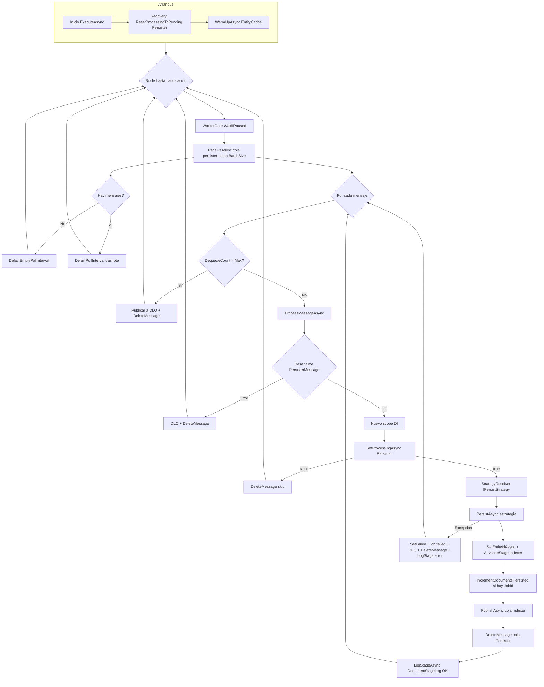
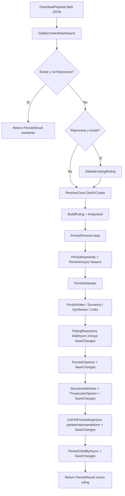

# Persister worker: análisis y propuestas (diferido)

**Estado:** referencia para trabajo futuro. Sin cambios de código asociados a este documento.  
**Fecha de referencia:** 2026-05-12.

## Contexto en código

- Worker: `backend/src/workers/LegalAiAr.Worker.Persister/PersisterWorkerService.cs`
- Estrategia ruling: `backend/src/workers/LegalAiAr.Worker.Persister/Strategies/RulingPersistStrategy.cs`
- Estrategia statute: `backend/src/workers/LegalAiAr.Worker.Persister/Strategies/StatutePersistStrategy.cs`
- Cache en arranque: `backend/src/shared/LegalAiAr.Infrastructure/Caching/EntityCacheService.cs`

## Resumen del análisis

1. **Procesamiento secuencial por diseño:** un mensaje de cola tras otro (evita carreras en dimensiones compartidas y grafos EF). El `BatchSize` limita cuántos mensajes se *reciben* por poll, no cuántos se persisten en paralelo.
2. **Muchas lecturas/escrituras en SQL** en fallos complejos (ruling): get-or-create de personas, keywords, leyes, tribunal; normalización de tesauro por keyword; varios `SaveChanges` en fases distintas; vínculo a expediente; citas inversas (cited-by).
3. **Nuevo `DbContext` por mensaje:** el warm-up en memoria ayuda, pero reenganchar entidades cacheadas puede implicar consultas adicionales (`Find`, etc.) si no están en el tracker local.
4. **Blob + JSON:** descarga y deserialización del payload antes de persistir; tamaño del payload afecta latencia.
5. **Pausas entre polls:** `PollIntervalSeconds` / `EmptyPollIntervalSeconds` añaden latencia entre lotes.

---

## Diagrama de flujo (worker Persister)

---

## Diagrama de flujo (estrategia Ruling, resumen)

**Statute:** flujo más corto (payload blob → `GetOrCreate` norma → actualizar campos → `SaveChanges` según `StatutePersistStrategy`).

---

## Puntos de medición sugeridos

| # | Punto | Qué registrar | Utilidad |
|---|--------|---------------|----------|
| 1 | Duración total `ProcessMessageAsync` | ms por documento | SLA por doc |
| 2 | `ReceiveAsync` por poll | ms + cantidad de mensajes | Cola / red |
| 3 | Entre polls | intervalo efectivo | Backoff vs backlog |
| 4 | `WaitIfPausedAsync` | tiempo bloqueado | Operación vs carga |
| 5 | Deserialize mensaje cola | ms + tamaño body | Payloads anómalos |
| 6 | `SetProcessingAsync` | ms + true/false | Huérfanos / estado |
| 7 | `PersistAsync` total | ms por EntityType | Ruling vs Statute |
| 8 | Blob + JSON payload | ms + bytes aprox. | Storage vs CPU |
| 9 | ContentHash / reprocess | rama + ms | Duplicados |
| 10 | Bloque dimensiones | conteos o acumulados | Correlación con SQL |
| 11 | `ResolveAsync` tesauro | llamadas + ms | Multiplicador |
| 12 | `AddAsync` ruling + 1er save | ms | Primer commit |
| 13 | `SaveChanges` posteriores | ms por tramo | Dónde domina |
| 14 | `PersistCitedByAsync` | N items + ms | Patrones N+1 |
| 15 | Post-persist SQL | SetEntityId / Advance / job | Overhead pipeline |
| 16 | Publish indexer + delete queue | ms | Cola saliente |
| 17 | `LogStageAsync` | ms | Coste logging |
| 18 | Warm-up arranque | duración + filas | Coste boot |
| 19 | Recovery reset | filas | Reinicios |
| 20 | Errores / DLQ | tipo + doc id | Calidad datos |

Herramientas: Application Insights, logs estructurados con `DocumentId` / `IngestionJobId`, EF logging solo en staging, Query Store / extended events en SQL.

---

## Propuestas de mejora (orden: menor esfuerzo / mayor impacto relativo)

| Orden | Propuesta | Esfuerzo | Impacto | Riesgo / notas |
|------:|------------|-----------|---------|----------------|
| 1 | Métricas y logs por fase (tabla anterior) | Bajo | Alto | Solo observabilidad |
| 2 | Dashboard p95, throughput, profundidad de cola | Bajo | Alto | Operativo |
| 3 | Revisar `PollIntervalSeconds`, `EmptyPollIntervalSeconds`, `BatchSize`, visibilidad cola | Bajo | Medio | `BatchSize` no paraleliza persist |
| 4 | Alertas p95 / cola | Bajo | Medio | — |
| 5 | Documentar contrato de payload (tamaños, listas) | Bajo | Medio | Producto / datos |
| 6 | Batch de lecturas donde hoy hay bucle + query (p. ej. cited-by) | Medio | Alto | Diseño + pruebas |
| 7 | Reducir round-trips en get-or-create con cache + nuevo contexto | Medio | Alto | EF tracking |
| 8 | Aprovechar más el warm-up (p. ej. tesauro preferido en memoria) | Medio | Medio-Alto | Sinónimos vs preferido |
| 9 | Fusionar `SaveChanges` donde FK lo permita | Alto | Alto | Regresiones |
| 10 | Diferir parte del grafo a post-indexer | Muy alto | Alto | Cambio de pipeline |
| 11 | Escalar horizontal varias instancias Persister | Medio-Alto | Variable | Carreras / partición |
| 12 | Reducir payload (compresión, menos redundancia) | Medio | Medio | Upstream |

---

## Próximos pasos sugeridos (cuando se retome)

1. Instrumentar puntos 1, 7–9, 12–14 en un entorno de staging y medir una muestra representativa de jobs.
2. Decidir si el cuello es SQL, blob o cola; entonces priorizar filas 6–9 de la tabla de mejoras.
3. Cualquier cambio de código: work item explícito + revisión de riesgos en dimensiones compartidas.
