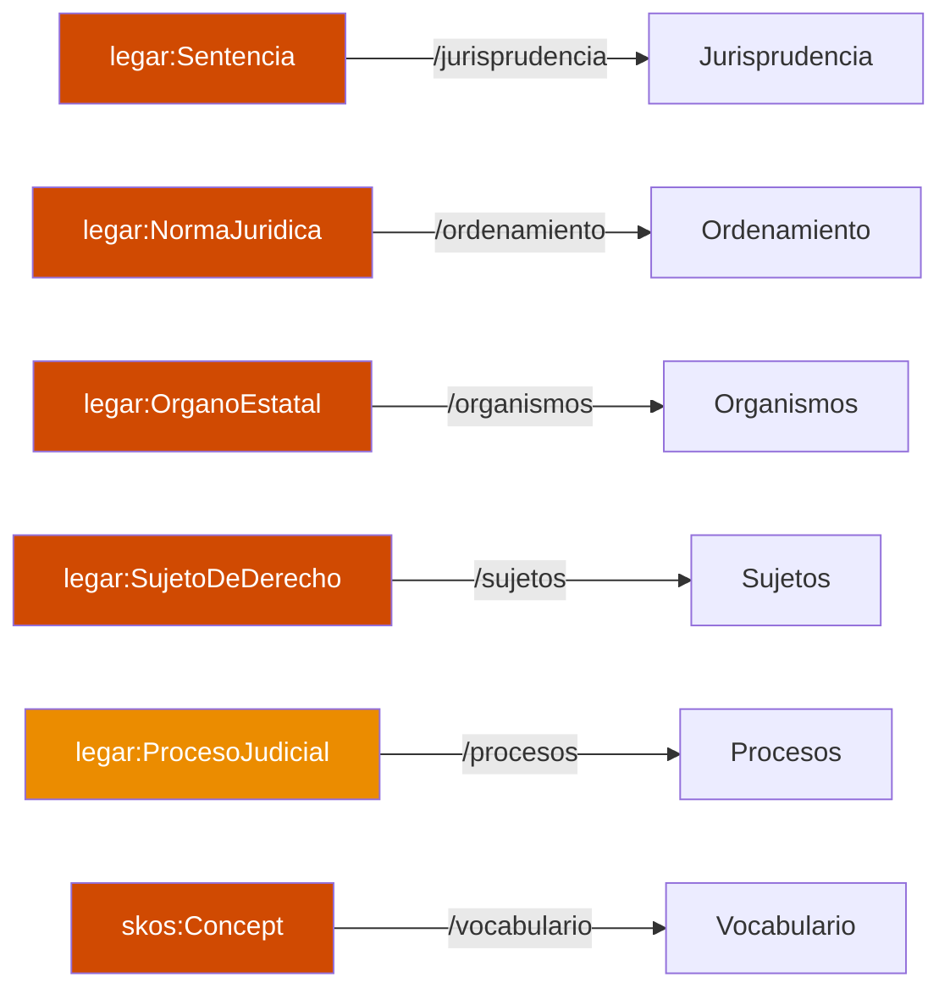
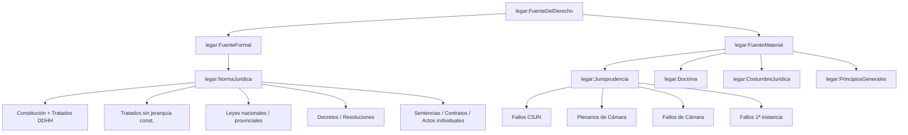
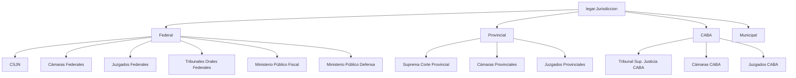
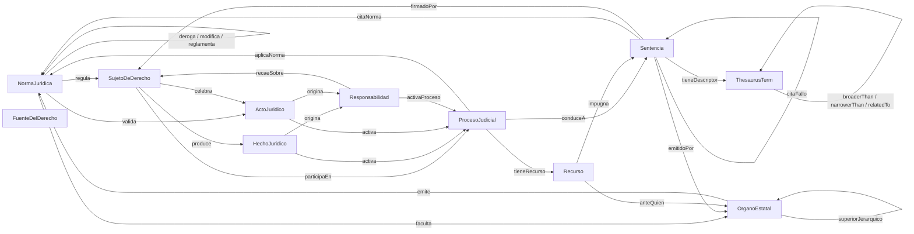
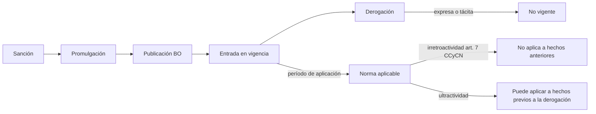
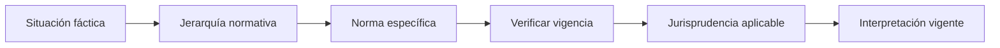
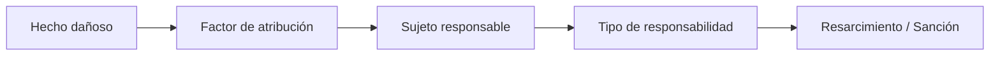
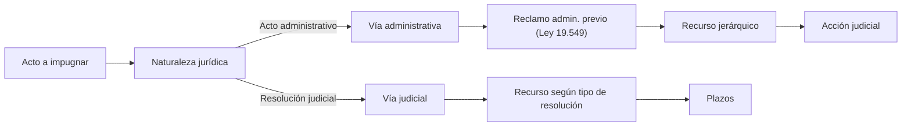
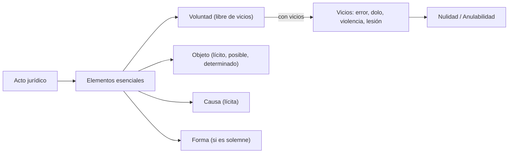

> 📦 **MVP ontology — preserved reference.** This is the ontology produced during the MVP, kept here
> so its unique content stays available: the mapping to the actual KB data model, the assistant
> reasoning flows, treaties with constitutional hierarchy, and the enum/type glossary. The **applied**
> ontology for the project is the broader [`argentine-legal-ontology.md`](argentine-legal-ontology.md),
> which is **based on** this one. Spanish original retained verbatim; diagram and prompt assets are in
> [`mvp-diagrams/`](mvp-diagrams/) and [`mvp-prompts/`](mvp-prompts/).

# Legal AI AR — Modelo Ontológico del Sistema Legal Argentino

| Campo | Valor |
|---|---|
| **Versión** | 2.1 |
| **Fecha** | 2026-04-30 |
| **Diagramas Visio** | `docs/ontology/mvp-diagrams/` — ver [README-visio-export.md](mvp-diagrams/README-visio-export.md) |
| **Basado en** | Ontología del Sistema Legal Argentino v1.0 (2025) |
| **Rama** | `feature/legal-ontology` |
| **Namespace** | `http://legal-ai-ar.pwc.com/ontology/` (prefijo `legar:`) |

---

## 1. Propósito y alcance

Este documento define el modelo ontológico formal del sistema legal argentino para Legal AI AR. A diferencia de un manual de derecho, este modelo especifica **clases, jerarquías, propiedades y relaciones** que permiten al sistema razonar sobre situaciones jurídicas concretas.

### 1.1 Objetivos

- **Formalizar** los conceptos del dominio jurídico argentino como clases con propiedades y restricciones.
- **Conectar** las entidades existentes en la Knowledge Base (Ruling, Court, Person, Statute, JudicialProceeding, etc.) con el modelo ontológico ampliado.
- **Habilitar** razonamiento jurídico estructurado: identificar norma aplicable, trazar jerarquías, calcular plazos, determinar competencia.
- **Guiar** la extensión incremental del modelo de datos y del grafo de conocimiento.

### 1.2 Alcance territorial

- **Derecho federal**: aplicación en todo el territorio nacional.
- **Derecho provincial**: principales jurisdicciones (CABA, Buenos Aires, Córdoba, Santa Fe, Mendoza).
- **Derecho internacional privado**: normas de conflicto y convenios ratificados por Argentina.

### 1.3 Vocabularios reutilizados

| Prefijo | URI | Uso |
|---|---|---|
| `skos:` | `http://www.w3.org/2004/02/skos/core#` | Taxonomías y vocabularios controlados |
| `dc:` | `http://purl.org/dc/elements/1.1/` | Metadatos (fecha, autor, título) |
| `foaf:` | `http://xmlns.com/foaf/0.1/` | Personas y agentes |
| `schema:` | `http://schema.org/` | Organizaciones, eventos |
| `time:` | `http://www.w3.org/2006/time#` | Intervalos temporales y vigencia |

### 1.4 Scope de implementación

Las clases ontológicas se implementan incrementalmente. Estado actual y target:

| Clase | Estado | Entidad KB | Espacio UI | Fase target |
|---|---|---|---|---|
| **Sentencia** | Implementada | `Ruling`, `Vote`, `RulingParticipation`, `Sumario`, `RulingSynthesis` | `/jurisprudencia` | Hecho |
| **OrganoEstatal** (Tribunal) | Implementada | `Court`, `JudicialOffice` | `/organismos` | Hecho |
| **SujetoDeDerecho** | Implementada | `Person`, `ProceedingParty`, `LegalRepresentation` | `/sujetos` | Hecho |
| **NormaJuridica** | Parcial (refs) | `Statute`, `RulingStatute`, `Citation` | `/ordenamiento` | F3 / F3b |
| **ProcesoJudicial** | Parcial | `JudicialProceeding`, `ProceedingParty` | `/procesos` | F3 |
| **FuenteDelDerecho** | Conceptual | Jurisprudencia como `Ruling`; Doctrina no modelada | — | F4 |
| **HechoJuridico** | No implementada | — | — | Futuro |
| **RelacionJuridica** | No implementada | — | — | Futuro |
| **Jurisdiccion** | Parcial (enums) | `GovernmentLevel`, `InstanceLevel` en `Court` | Dentro de `/organismos` | F3 |
| **Recurso Procesal** | No implementada | — | Dentro de `/procesos` | F4 |

### 1.5 Principios de diseño

1. **Subsunción correcta**: las relaciones is-a reflejan la doctrina jurídica argentina (CCyCN, CN, códigos procesales).
2. **Temporalidad explícita**: toda entidad normativa y jurisdiccional tiene vigencia temporal modelada.
3. **Separación ontología / conocimiento**: este documento define la estructura; el contenido sustantivo del derecho (textos, explicaciones, jurisprudencia) vive en la KB y en RAG.
4. **Compatibilidad con KB existente**: las entidades actuales (Ruling, Court, Person, Statute, JudicialProceeding, etc.) se mapean como instancias o subclases del modelo ontológico.
5. **Extensibilidad**: nuevas ramas del derecho o jurisdicciones se agregan como instancias de las taxonomías, sin modificar las clases core.

### 1.6 Mapeo inverso: Clase ontológica → Espacio de UI

Cada clase ontológica implementada tiene un espacio dedicado en la aplicación, permitiendo que la ontología funcione como mapa de navegación.



| Clase ontológica | Ruta UI | Estado |
|---|---|---|
| `legar:Sentencia` | `/jurisprudencia`, `/jurisprudencia/:id` | Implementada |
| `legar:NormaJuridica` | `/ordenamiento`, `/ordenamiento/:id`, `/ordenamiento/piramide` | Planificada (F3) |
| `legar:OrganoEstatal` (Tribunal) | `/organismos`, `/organismos/:id` | Implementada |
| `legar:SujetoDeDerecho` | `/sujetos`, `/sujetos/:id` | Implementada |
| `legar:ProcesoJudicial` | `/procesos`, `/procesos/:id` | Planificada (F3) |
| `skos:Concept` (Tesauro) | `/vocabulario`, `/vocabulario/:id` | Implementada |
| `legar:HechoJuridico` | — | No planificada (conceptual) |
| `legar:RelacionJuridica` | — | No planificada (conceptual) |
| `legar:FuenteDelDerecho` | — | Subsumida por Sentencia + NormaJuridica |
| `legar:Recurso` | Dentro de `/procesos/:id` | Planificada (F4) |

---

## 2. Jerarquía de clases

El modelo define 10 clases fundamentales organizadas en una jerarquía de subsunción. Las primeras 8 cubren el dominio jurídico sustantivo; las 2 adicionales (`FuenteDelDerecho`, `Jurisdicción`) formalizan conceptos que el documento v1.0 trataba solo como texto.

```mermaid
graph TD
    Thing["owl:Thing"]

    Thing --> NormaJuridica["legar:NormaJuridica"]
    Thing --> SujetoDeDerecho["legar:SujetoDeDerecho"]
    Thing --> OrganoEstatal["legar:OrganoEstatal"]
    Thing --> HechoJuridico["legar:HechoJuridico"]
    Thing --> RelacionJuridica["legar:RelacionJuridica"]
    Thing --> ProcesoJudicial["legar:ProcesoJudicial"]
    Thing --> FuenteDelDerecho["legar:FuenteDelDerecho"]
    Thing --> Jurisdiccion["legar:Jurisdiccion"]

    NormaJuridica --> Constitucion["legar:Constitucion"]
    NormaJuridica --> Tratado["legar:Tratado"]
    NormaJuridica --> Ley["legar:Ley"]
    NormaJuridica --> Decreto["legar:Decreto"]
    NormaJuridica --> Resolucion["legar:Resolucion"]
    NormaJuridica --> Ordenanza["legar:Ordenanza"]
    NormaJuridica --> Acordada["legar:Acordada"]

    SujetoDeDerecho --> PersonaHumana["legar:PersonaHumana"]
    SujetoDeDerecho --> PersonaJuridica["legar:PersonaJuridica"]
    PersonaJuridica --> PJPublica["legar:PersonaJuridicaPublica"]
    PersonaJuridica --> PJPrivada["legar:PersonaJuridicaPrivada"]
    PersonaHumana -.->|"rol"| Juez["legar:RolJudicial"]
    PersonaHumana -.->|"rol"| Fiscal["legar:RolFiscal"]
    PersonaHumana -.->|"rol"| Defensor["legar:RolDefensor"]
    PersonaHumana -.->|"rol"| Abogado["legar:RolAbogado"]

    OrganoEstatal --> OrganoJudicial["legar:OrganoJudicial"]
    OrganoEstatal --> OrganoLegislativo["legar:OrganoLegislativo"]
    OrganoEstatal --> OrganoEjecutivo["legar:OrganoEjecutivo"]
    OrganoEstatal --> OrganoDescentralizado["legar:OrganoDescentralizado"]
    OrganoJudicial --> Tribunal["legar:Tribunal"]
    OrganoJudicial --> MinisterioPublico["legar:MinisterioPublico"]

    HechoJuridico --> HechoInvoluntario["legar:HechoInvoluntario"]
    HechoJuridico --> HechoVoluntario["legar:HechoVoluntario"]
    HechoVoluntario --> ActoLicito["legar:ActoLicito"]
    HechoVoluntario --> ActoIlicito["legar:ActoIlicito"]
    ActoLicito --> ActoJuridico["legar:ActoJuridico"]
    ActoIlicito --> Delito["legar:Delito"]
    ActoIlicito --> Cuasidelito["legar:Cuasidelito"]
    ActoJuridico --> Contrato["legar:Contrato"]
    ActoJuridico --> ActoAdministrativo["legar:ActoAdministrativo"]
    ActoJuridico --> ActoProcesal["legar:ActoProcesal"]
    ActoJuridico --> ActoDeFamilia["legar:ActoDeFamilia"]
    ActoJuridico --> Testamento["legar:Testamento"]

    ProcesoJudicial --> ProcesoCivil["legar:ProcesoCivil"]
    ProcesoJudicial --> ProcesoPenal["legar:ProcesoPenal"]
    ProcesoJudicial --> ProcesoLaboral["legar:ProcesoLaboral"]
    ProcesoJudicial --> ProcesoContAdm["legar:ProcesoContencisoAdministrativo"]
    ProcesoJudicial --> ProcesoFamilia["legar:ProcesoDeFamilia"]
    ProcesoJudicial --> ProcesoConst["legar:ProcesoConstitucional"]

    FuenteDelDerecho --> FuenteFormal["legar:FuenteFormal"]
    FuenteDelDerecho --> FuenteMaterial["legar:FuenteMaterial"]
    FuenteFormal --> NormaJuridica
    FuenteMaterial --> Jurisprudencia["legar:Jurisprudencia"]
    FuenteMaterial --> Doctrina["legar:Doctrina"]
    FuenteMaterial --> CostumbreJuridica["legar:CostumbreJuridica"]
```



### 2.1 Notas sobre la jerarquía

- **HechoJurídico → ActoJurídico**: En el CCyCN (art. 259), el acto jurídico es un hecho voluntario, lícito, con fin jurídico inmediato. La jerarquía `HechoJuridico > HechoVoluntario > ActoLicito > ActoJuridico` respeta esta doctrina.
- **PersonaHumana ⊥ PersonaJuridica**: Clases disjuntas (owl:disjointWith). Una entidad no puede ser ambas.
- **Juez, Fiscal, Defensor, Abogado**: Son **roles** de PersonaHumana, no subclases. Una persona puede tener múltiples roles a lo largo del tiempo (ej: abogado que luego es designado juez). Se modelan con aristas punteadas `-.->` en el grafo para distinguirlos de la jerarquía is-a. En la KB, esto se refleja con la entidad `Person` (PersonType) + `JudicialOffice` (rol + período) + `RulingParticipation` (rol en un fallo específico).
- **Jurisprudencia como FuenteMaterial**: Los fallos (Ruling) son instancias de Jurisprudencia. Un fallo es tanto una resolución de un proceso judicial como una fuente material del derecho cuando sienta doctrina.

---

## 3. Clases y propiedades

### 3.1 NormaJurídica

Norma general, abstracta y coercitiva que integra el ordenamiento jurídico. Extiende el concepto actual de `Statute` (que solo tiene número, nombre y URL).

| Propiedad | Tipo | Descripción |
|---|---|---|
| `identificador` | string | Número o código oficial (ej: "26.994", "DNU 70/2023") |
| `denominacion` | string | Nombre usual (ej: "Código Civil y Comercial") |
| `tipo` | NormType | Constitución, Tratado, Ley, Decreto, DNU, Resolución, Acordada, Ordenanza |
| `jerarquia` | NormativeLevel | Nivel en la pirámide normativa (1-5) |
| `organoEmisor` | OrganoEstatal | Quién la dictó |
| `fechaSancion` | date | Fecha de aprobación |
| `fechaPromulgacion` | date? | Fecha de promulgación (leyes) |
| `fechaPublicacionBO` | date? | Fecha de publicación en Boletín Oficial |
| `fechaVigenciaDesde` | date | Inicio de vigencia |
| `fechaVigenciaHasta` | date? | Fin de vigencia (null = vigente) |
| `esVigente` | boolean | Calculado: vigenciaHasta == null o > hoy |
| `textoOriginal` | text? | Texto completo |
| `urlOficial` | uri? | Link a fuente oficial (InfoLEG, SAIJ) |
| `articulosRelevantes` | string? | Artículos citados con frecuencia |
| `ramaDelDerecho` | RamaDelDerecho | A qué rama pertenece |

**Relaciones:**

| Relación | Rango | Cardinalidad | Descripción |
|---|---|---|---|
| `deroga` | NormaJurídica | 0..N | Esta norma deroga total o parcialmente a otra |
| `modifica` | NormaJurídica | 0..N | Esta norma modifica artículos de otra |
| `reglamenta` | NormaJurídica | 0..N | Decreto que reglamenta una ley |
| `complementa` | NormaJurídica | 0..N | Norma que complementa sin derogar ni modificar |
| `regula` | SujetoDeDerecho | 0..N | Sujetos alcanzados por la norma |
| `faculta` | OrganoEstatal | 0..N | Órganos a los que otorga competencia |
| `perteneceA` | RamaDelDerecho | 1..N | Rama(s) del derecho a la que pertenece |

**Mapeo KB actual**: `Statute` → instancia de `NormaJuridica` (subtipo `Ley`). Se extiende con las propiedades faltantes.

### 3.2 SujetoDeDerecho

Toda entidad susceptible de adquirir derechos y contraer obligaciones (art. 22 CCyCN).

| Propiedad | Tipo | Descripción |
|---|---|---|
| `nombre` | string | Nombre completo o razón social |
| `tipo` | PersonType | Physical, LegalPublic, LegalPrivate, StateEntity, Indeterminate |
| `domicilio` | string? | Domicilio legal |
| `jurisdiccion` | Jurisdicción? | Jurisdicción de inscripción o domicilio |

**Subclase PersonaHumana:**

| Propiedad | Tipo | Descripción |
|---|---|---|
| `dni` | string? | Documento de identidad |
| `fechaNacimiento` | date? | Fecha de nacimiento |
| `capacidadEjercicio` | CapacityType | Plena, Restringida, Inhabilitada |

**Subclase PersonaJurídica:**

| Propiedad | Tipo | Descripción |
|---|---|---|
| `tipoSocietario` | LegalEntityType | SA, SRL, SAS, Asociación Civil, Fundación, Cooperativa, Mutual, Estado |
| `cuit` | string? | CUIT |
| `fechaConstitucion` | date? | Fecha de constitución |
| `registroInscripcion` | string? | IGJ, Registro Provincial, etc. |

**Rol Judicial** (de PersonaHumana, modelado via `JudicialOffice`):

| Propiedad | Tipo | Descripción |
|---|---|---|
| `tribunalActual` | Tribunal? | Tribunal donde actualmente presta funciones |
| `cargo` | JudicialPosition | Juez, Vocal, Presidente, SecretarioGeneral, Conjuez |
| `designaciones` | list[JudicialOffice] | Historial de tribunales con períodos (desde/hasta) |
| `totalFallos` | int | Cantidad de fallos indexados |

> **Mapeo KB**: `Person` con `JudicialOffice[]` reemplaza la antigua entidad `Judge`. Una persona con oficios judiciales es un juez; la misma persona puede haber sido abogado antes. Los roles procesales (SIGNATORY, MAJORITY, DISSENT, etc.) se capturan en `RulingParticipation`.

**Relaciones:**

| Relación | Rango | Cardinalidad | Descripción |
|---|---|---|---|
| `celebra` | ActoJurídico | 0..N | Actos jurídicos en los que participa |
| `esRegulado` | NormaJurídica | 0..N | Normas que lo regulan |
| `participaEn` | ProcesoJudicial | 0..N | Procesos donde es parte o interviniente |
| `asume` | Responsabilidad | 0..N | Responsabilidades derivadas |

**Mapeo KB actual**: `Person` (PersonType = Physical, con JudicialOffice[]) → PersonaHumana con rol judicial. `Person` (PersonType = LegalPublic/LegalPrivate) → PersonaJurídica. `Person` (PersonType = StateEntity) → OrganoEstatal tratado como sujeto procesal.

### 3.3 OrganoEstatal

Entidad del Estado con competencia asignada por la Constitución o la ley.

| Propiedad | Tipo | Descripción |
|---|---|---|
| `nombre` | string | Nombre oficial |
| `tipo` | OrganType | Judicial, Legislativo, Ejecutivo, Descentralizado |
| `nivel` | GovernmentLevel | Nacional, Provincial, Municipal, CABA |
| `jurisdiccionTerritorial` | string | Territorio de competencia |
| `competenciaMaterial` | list[string] | Materias en las que tiene competencia |
| `jerarquia` | int | Nivel jerárquico dentro de su poder (0 = máximo) |
| `esActivo` | boolean | Si está en funcionamiento |

**Subclase Tribunal** (OrganoJudicial):

| Propiedad | Tipo | Descripción |
|---|---|---|
| `fuero` | Fuero | Civil, Comercial, Penal, Laboral, Cont.-Adm., Familia, etc. |
| `instancia` | InstanceLevel | Primera, Segunda (Cámara), Tercera (CSJN/Sup. Corte) |
| `tipoTribunal` | CourtType | Juzgado, Cámara, Tribunal Oral, Corte Suprema |
| `integrantesActuales` | list[Person] | Personas con JudicialOffice activo en este tribunal |

**Relaciones:**

| Relación | Rango | Cardinalidad | Descripción |
|---|---|---|---|
| `superiorJerarquico` | OrganoEstatal | 0..1 | Órgano superior en la cadena de mando o apelación |
| `subordinado` | OrganoEstatal | 0..N | Órganos inferiores |
| `emite` | NormaJurídica / ActoAdministrativo | 0..N | Normas o actos que emite |
| `controla` | OrganoEstatal | 0..N | Órganos que controla |
| `esFacultadoPor` | NormaJurídica | 1..N | Normas que le otorgan competencia |

**Mapeo KB actual**: `Court` → instancia de `Tribunal`. Se extiende con jerarquía, fuero, e instancia como entidades formales (hoy son strings).

### 3.4 HechoJurídico

Acontecimiento que produce efectos jurídicos (arts. 257-258 CCyCN). Clase base para la jerarquía de hechos y actos.

| Propiedad | Tipo | Descripción |
|---|---|---|
| `descripcion` | string | Descripción del hecho |
| `fecha` | date | Fecha de ocurrencia |
| `lugar` | string? | Lugar de ocurrencia |
| `esVoluntario` | boolean | Si interviene la voluntad humana |
| `esLicito` | boolean? | Lícito o ilícito (null para involuntarios) |
| `efectosJuridicos` | list[string] | Consecuencias jurídicas que produce |

**Subclase ActoJurídico** (art. 259 CCyCN):

| Propiedad | Tipo | Descripción |
|---|---|---|
| `forma` | ActFormality | Solemne absoluta, Solemne relativa, No solemne |
| `objeto` | string | Objeto del acto (lícito, posible, determinado) |
| `causaFin` | string? | Finalidad perseguida |
| `vicios` | list[ActDefect]? | Error, Dolo, Violencia, Lesión, Simulación, Fraude |
| `validez` | ActValidity | Válido, Nulo, Anulable |
| `modalidades` | list[ActModality]? | Condición, Plazo, Cargo |

**Relaciones:**

| Relación | Rango | Cardinalidad | Descripción |
|---|---|---|---|
| `esCelebradoPor` | SujetoDeDerecho | 1..N | Partes del acto |
| `esValidadoPor` | NormaJurídica | 1..N | Normas que lo regulan |
| `origina` | Responsabilidad | 0..N | Responsabilidades que genera |
| `activa` | ProcesoJudicial | 0..N | Procesos que desencadena (si hay conflicto) |

### 3.5 ProcesoJudicial

Secuencia ordenada de actos procesales ante un órgano jurisdiccional, dirigida a la resolución de un conflicto mediante sentencia.

| Propiedad | Tipo | Descripción |
|---|---|---|
| `expediente` | string | Número de expediente / carátula |
| `tipo` | ProcessType | Civil, Penal, Laboral, Contencioso-Administrativo, Familia, Constitucional |
| `subtipo` | string? | Ordinario, Sumarísimo, Ejecutivo, Amparo, etc. |
| `tribunal` | Tribunal | Tribunal que entiende |
| `codigoProcesal` | NormaJurídica | Código procesal aplicable (CPCCN, CPPF, etc.) |
| `etapaActual` | ProcessStage | Etapa en la que se encuentra |
| `fechaInicio` | date | Fecha de inicio |
| `fechaFinalizacion` | date? | Fecha de sentencia firme (null = en trámite) |
| `estado` | ProcessStatus | En trámite, Con sentencia, Firme, Archivado |
| `materia` | RamaDelDerecho | Rama del derecho aplicable |

**Subclases de etapas (ProcessStage como enum):**
- ProcesoCivil: Demanda → Contestación → Prueba → Alegatos → Sentencia → Recursos
- ProcesoPenal: Investigación → Formulación de cargos → Etapa intermedia → Juicio oral → Sentencia → Recursos
- ProcesoContAdm: Agotamiento vía admin. → Reclamo previo → Recurso jerárquico → Acción judicial

**Relaciones:**

| Relación | Rango | Cardinalidad | Descripción |
|---|---|---|---|
| `parteActora` | SujetoDeDerecho | 1..N | Actor / querellante / fiscal |
| `parteDemandada` | SujetoDeDerecho | 1..N | Demandado / imputado |
| `juezInterviniente` | Person (rol judicial) | 1..N | Juez o jueces que entienden |
| `conduceA` | Sentencia (Ruling) | 0..1 | Sentencia que resuelve el proceso |
| `esActivadoPor` | HechoJurídico / ActoJurídico | 1..N | Hecho o acto que origina el conflicto |
| `aplicaNorma` | NormaJurídica | 1..N | Normas aplicadas en la resolución |
| `tieneRecurso` | Recurso | 0..N | Recursos interpuestos |

**Mapeo KB actual**: `JudicialProceeding` → instancia de ProcesoJudicial. `Ruling` es la sentencia que resulta del proceso. `ProceedingParty` captura las partes (actor, demandado). `LegalRepresentation` captura los abogados.

### 3.6 Sentencia (Ruling)

Resolución judicial que pone fin al proceso en la instancia. Es la entidad central de la KB actual.

| Propiedad | Tipo | Descripción | Estado KB |
|---|---|---|---|
| `caratula` | string | Título del caso | `CaseTitle` ✓ |
| `expediente` | string? | Número de expediente | `CaseNumber` ✓ |
| `fecha` | date | Fecha de la sentencia | `RulingDate` ✓ |
| `tribunal` | Tribunal | Tribunal que la dictó | `Court` ✓ |
| `jurisdiccion` | string? | Área jurisdiccional | `JurisdictionArea` ✓ |
| `instancia` | string? | Instancia | `Instance` ✓ |
| `materia` | RamaDelDerecho? | Rama del derecho | `SubjectArea` (string libre) |
| `tipoRecurso` | string? | Tipo de recurso resuelto | `ResourceType` ✓ |
| `sentido` | string? | Sentido del fallo | `RulingDirection` ✓ |
| `esInconstitucional` | boolean | Declara inconstitucionalidad | `IsUnconstitutional` ✓ |
| `sumario` | text? | Resumen del fallo | `Summary` ✓ |
| `holding` | text? | Doctrina del fallo | `Holding` ✓ |
| `textoCompleto` | text? | Texto íntegro | `FullText` ✓ |
| `pesoPrecedencial` | PrecedentWeight | Peso como precedente | **FALTA** |
| `esPlenario` | boolean | Si es fallo plenario | **FALTA** |
| `esLeadingCase` | boolean | Si es caso líder | **FALTA** |

**Conceptos jurisprudenciales a agregar:**

| Concepto | Descripción | Estado KB |
|---|---|---|
| `RatioDecidendi` | Fundamento esencial de la decisión; la parte vinculante del fallo | **FALTA** |
| `ObiterDictum` | Afirmación al pasar, no vinculante como precedente | **FALTA** |
| `VotoIndividual` | Voto de un juez con sus fundamentos propios | Parcial: `ParticipationType` existe |
| `Disidencia` | Voto en disidencia con fundamentos distintos a la mayoría | Parcial: `DISSENT` en enum |
| `DoctrinaLegal` | Criterio jurídico establecido por la sentencia para casos futuros | **FALTA** |
| `PesoPrecedencial` | Peso del fallo como precedente (CSJN > Cámara > 1ª instancia; unanimidad > mayoría) | **FALTA** |

**Relaciones:**

| Relación | Rango | Cardinalidad | Descripción | Estado KB |
|---|---|---|---|---|
| `emitidoPor` | Tribunal | 1 | Tribunal que la dictó | `CourtId` ✓ |
| `firmadoPor` | Person (rol judicial) | 1..N | Personas que participaron en el fallo | `RulingParticipations` ✓ |
| `citaNorma` | NormaJurídica | 0..N | Normas aplicadas | `RulingStatutes` ✓ |
| `citaFallo` | Sentencia | 0..N | Fallos citados (con tipo) | `Citations` ✓ |
| `tieneDescriptor` | ThesaurusTerm | 0..N | Descriptores temáticos | `RulingKeywords` → `ThesaurusTerm` ✓ |
| `provieneDe` | Source | 1 | Fuente de datos | `SourceId` ✓ |
| `esResultadoDe` | ProcesoJudicial | 0..1 | Proceso que la originó | **FALTA** |
| `sentaDoctrina` | DoctrinaLegal | 0..N | Doctrina que establece | **FALTA** |

### 3.7 Recurso Procesal

Medio de impugnación de resoluciones judiciales. El documento v1.0 los lista como tabla pero no los modela como entidad.

| Propiedad | Tipo | Descripción |
|---|---|---|
| `tipo` | RemedyType | Aclaratoria, Reposición, Apelación, Casación, REF, Queja, etc. |
| `organoAnteQuienSeInterpone` | Tribunal | Tribunal de interposición (a quo) |
| `organoQueResuelve` | Tribunal | Tribunal que resuelve (ad quem) |
| `plazo` | Duration | Plazo para interponer |
| `efecto` | RemedyEffect | Suspensivo, Devolutivo, Ambos |
| `requisitos` | list[string] | Requisitos de admisibilidad |
| `resolucionesImpugnables` | list[string] | Tipos de resolución que puede impugnar |

### 3.8 Prescripción y Plazos

Concepto transversal: el transcurso del tiempo como factor jurídico.

| Propiedad | Tipo | Descripción |
|---|---|---|
| `tipo` | LimitationType | Prescripción adquisitiva, Prescripción liberatoria, Caducidad |
| `plazoGeneral` | Duration | Plazo genérico (ej: 5 años prescripción genérica, art. 2560 CCyCN) |
| `plazosEspeciales` | map[string, Duration] | Plazos por materia (ej: 2 años resp. civil, 1 año laboral, etc.) |
| `suspension` | list[string] | Causales de suspensión |
| `interrupcion` | list[string] | Causales de interrupción |
| `computo` | ComputationType | Días hábiles, Días corridos, Horas |
| `normaAplicable` | NormaJurídica | Norma que establece el plazo |

### 3.9 FuenteDelDerecho

Las fuentes del derecho argentino, formalizadas como jerarquía ontológica.



### 3.10 Jurisdicción

Modelo formal de la estructura jurisdiccional argentina, que hoy es un string libre en la KB.



### 3.11 Responsabilidad jurídica (consecuencia compleja)

La responsabilidad no se modela como entidad de primer nivel sino como **consecuencia** que se deriva de hechos, actos o relaciones. Se formaliza como una propiedad compleja adjunta a `HechoJuridico` y `ActoJuridico` a través de la relación `origina`.

| Elemento | Tipo | Descripción | Referencia normativa |
|---|---|---|---|
| Tipo | `CIVIL`, `CRIMINAL`, `ADMINISTRATIVE` | Régimen aplicable | |
| Antijuridicidad | boolean | Acción u omisión contraria al ordenamiento | Art. 1717 CCyCN |
| Daño | `PATRIMONIAL`, `EXTRAPATRIMONIAL`, `BOTH` | Tipo de daño sufrido | Art. 1737-1741 CCyCN |
| Nexo causal | string | Relación de causalidad adecuada | Art. 1726 CCyCN |
| Factor de atribución | `SUBJECTIVE_INTENT`, `SUBJECTIVE_FAULT`, `OBJECTIVE_RISK`, `OBJECTIVE_GUARANTEE`, `EQUITY` | Fundamento de la imputación | Arts. 1721-1724 CCyCN |
| Eximentes | list[string] | Caso fortuito, hecho del damnificado, hecho de tercero | Art. 1729-1733 CCyCN |

**Responsabilidad del Estado (Ley 26.944):**

| Aspecto | Actividad ilegítima | Actividad legítima |
|---|---|---|
| Factor | Falta de servicio | Sacrificio especial |
| Daño resarcible | Emergente + lucro cesante + moral | Solo daño emergente |
| Requisitos | Daño cierto, imputabilidad, nexo causal | Daño cierto, nexo causal, ausencia de deber de soportar |

---

## 4. Grafo de relaciones

Diagrama completo de relaciones entre las clases principales:



---

## 5. Taxonomías controladas

Vocabularios cerrados modelados como `skos:ConceptScheme`. Reemplazan los strings libres actuales de la KB.

### 5.1 Pirámide normativa (NormativeLevel)

| Nivel | Código | Normas / Instrumentos |
|---|---|---|
| 1 — Constitucional | `CONSTITUTIONAL` | Constitución Nacional (1994) + Tratados DDHH art. 75 inc. 22 CN |
| 2 — Supralegal | `SUPRALEGAL` | Tratados internacionales sin jerarquía constitucional |
| 3 — Legal | `LEGAL` | Leyes nacionales (Congreso) / Leyes provinciales (Legislaturas) |
| 4 — Reglamentario | `REGULATORY` | Decretos PEN / Resoluciones ministeriales / Ordenanzas |
| 5 — Individual | `INDIVIDUAL` | Sentencias / Contratos / Actos administrativos particulares |

### 5.2 Ramas del derecho (RamaDelDerecho)

#### Derecho público

| Código | Rama | Normativa principal |
|---|---|---|
| `PUB_CONST` | Derecho constitucional | CN 1994 — derechos y garantías, organización del Estado, control de constitucionalidad |
| `PUB_ADMIN` | Derecho administrativo | Ley 19.549 (procedimiento administrativo), Ley 26.944 (resp. estatal), Ley 25.164 (empleo público) |
| `PUB_PENAL` | Derecho penal | Código Penal (Ley 11.179 y mod.) — tipicidad, antijuridicidad, culpabilidad, penas |
| `PUB_PROC_CIV` | Derecho procesal civil | CPCCN (Ley 17.454) — demanda, prueba, sentencia, recursos |
| `PUB_PROC_PEN` | Derecho procesal penal | Cód. Proc. Penal Federal (Ley 27.482) — sistema acusatorio |
| `PUB_TRIB` | Derecho tributario | Ley 11.683 (proc. fiscal), Ley 20.628 (Ganancias), Ley 23.349 (IVA) |
| `PUB_INT` | Derecho internacional público | Convenciones de Viena, Carta ONU, tratados bilaterales |

#### Derecho privado

| Código | Rama | Normativa principal |
|---|---|---|
| `PRIV_CIVIL` | Derecho civil | CCyCN (Ley 26.994) — personas, familia, bienes, obligaciones, contratos, responsabilidad |
| `PRIV_COM` | Derecho comercial | CCyCN + Ley 19.550 (Sociedades) + Ley 24.522 (Concursos) + Ley 17.811 (mercado de capitales) |
| `PRIV_LAB` | Derecho laboral individual | Ley 20.744 (LCT) — contrato de trabajo, jornada, remuneración, extinción |
| `PRIV_LAB_COL` | Derecho colectivo del trabajo | Ley 23.551 (asoc. sindicales), Ley 14.250 (convenios colectivos) |
| `PRIV_SEG` | Derecho de seguros | Ley 17.418 — contrato de seguro, riesgo, prima, siniestro |
| `PRIV_PI` | Derecho autoral e intelectual | Ley 11.723 (propiedad intelectual), Ley 24.481 (patentes) |

#### Derecho social y familia

| Código | Rama | Normativa principal |
|---|---|---|
| `SOC_FAM` | Derecho de familia | CCyCN arts. 401-723 — matrimonio, divorcio, filiación, adopción, alimentos |
| `SOC_PREV` | Derecho previsional | Ley 24.241 (SIJP), Ley 26.425 (SIPA), jubilaciones y pensiones |
| `SOC_NINEZ` | Derecho de la niñez | Ley 26.061 (protección integral NNA), CDN |
| `SOC_AMB` | Derecho ambiental | Ley 25.675 (Ley General del Ambiente), art. 41 CN |
| `SOC_CONS` | Derecho del consumidor | Ley 24.240 (Defensa del Consumidor), art. 42 CN |

#### Derecho digital (faltante en v1.0)

| Código | Rama | Normativa principal |
|---|---|---|
| `DIG_DATOS` | Protección de datos personales | Ley 25.326 (Habeas Data) |
| `DIG_CYBER` | Delitos informáticos | Ley 26.388 (Delitos Informáticos) |
| `DIG_FIRMA` | Firma digital/electrónica | Ley 25.506 (Firma Digital) |

### 5.3 Tipos de tribunal (CourtType)

| Código | Tipo | Instancia | Fuero |
|---|---|---|---|
| `CSJN` | Corte Suprema de Justicia de la Nación | Tercera (originaria y apelada) | Todos |
| `CAM_NAC` | Cámara Nacional de Apelaciones | Segunda | Civil, Comercial, Penal, Laboral, Cont.-Adm., Seg. Social |
| `CAM_FED` | Cámara Federal de Apelaciones | Segunda | Federal |
| `CAM_CAS` | Cámara Federal de Casación Penal | Tercera (casación) | Penal Federal |
| `TOF` | Tribunal Oral Federal | Primera (juicio oral) | Penal Federal |
| `JUZ_NAC` | Juzgado Nacional de 1ª instancia | Primera | Según fuero |
| `JUZ_FED` | Juzgado Federal de 1ª instancia | Primera | Federal |
| `SC_PROV` | Suprema Corte / Superior Tribunal Provincial | Tercera (provincial) | Todos |
| `CAM_PROV` | Cámara Provincial | Segunda | Según fuero |
| `JUZ_PROV` | Juzgado Provincial | Primera | Según fuero |
| `TSJ_CABA` | Tribunal Superior de Justicia CABA | Tercera (CABA) | Todos |

### 5.4 Tipos de citación jurisprudencial (CitationType)

Extiende la enum actual con mayor granularidad:

| Código | Significado | Peso | En KB actual |
|---|---|---|---|
| `UPHOLDS` | Confirma la doctrina del fallo citado | Positivo fuerte | ✓ |
| `FOLLOWS` | Sigue el criterio sin ser caso idéntico | Positivo medio | **NUEVO** |
| `DISTINGUISHES` | Distingue los hechos del citado | Neutro | ✓ |
| `OVERRULES` | Revierte expresamente el criterio | Negativo fuerte | ✓ |
| `CITES` | Referencia genérica sin calificar | Neutro | ✓ |
| `DISSENTS_FROM` | Cita en disidencia con el criterio mayoritario | Negativo medio | **NUEVO** |

### 5.5 Peso precedencial (PrecedentWeight)

| Código | Descripción | Ejemplo |
|---|---|---|
| `BINDING` | Vinculante (obligatorio para inferiores) | Plenarios, fallos CSJN por doctrina consolidada |
| `HIGHLY_PERSUASIVE` | Altamente persuasivo | Fallo CSJN unánime reciente |
| `PERSUASIVE` | Persuasivo | Fallo de Cámara en un tema sin doctrina CSJN |
| `REFERENTIAL` | Referencial | Fallo de 1ª instancia, votos en disidencia |

### 5.6 Recursos procesales (RemedyType)

| Código | Recurso | Procedencia | Plazo | Efecto |
|---|---|---|---|---|
| `ACLARATORIA` | Aclaratoria | Errores materiales u omisiones | 3 días | No suspensivo |
| `REPOSICION` | Reposición / Revocatoria | Resoluciones interlocutorias | 3 días | No suspensivo |
| `APELACION` | Apelación | Sentencias y autos apelables | 5 días | Suspensivo o devolutivo |
| `APELACION_NULIDAD` | Apelación con nulidad | Vicios formales en sentencia | 5 días | Suspensivo |
| `CASACION` | Casación | Cuestiones de derecho | 10 días | No suspensivo |
| `REF` | Recurso extraordinario federal | Cuestión federal, sentencia definitiva | 10 días | No suspensivo |
| `QUEJA` | Queja por recurso denegado | Cuando el a quo deniega REF | 5 días | No suspensivo |
| `INAPLICABILIDAD` | Inaplicabilidad de ley | Ante Sup. Corte provincial | Variable | Variable |

### 5.7 Tipos de participación en fallo (ParticipationType)

Extiende la enum actual:

| Código | Significado | En KB actual |
|---|---|---|
| `SIGNATORY` | Firmante de la mayoría sin voto propio | ✓ |
| `MAJORITY_AUTHOR` | Autor del voto de la mayoría | **NUEVO** |
| `CONCURRENCE` | Voto concurrente (concluye igual, con fundamentos distintos) | **NUEVO** |
| `DISSENT` | Voto en disidencia | ✓ |
| `MAJORITY` | Integra la mayoría | ✓ |

---

## 6. Dimensión temporal

El derecho es profundamente temporal. Este modelo formaliza la vigencia como propiedad transversal.

### 6.1 Vigencia normativa



**Reglas temporales clave:**
- **Irretroactividad** (art. 7 CCyCN): las leyes no son retroactivas salvo disposición en contrario.
- **Ultractividad**: una norma derogada sigue aplicándose a los hechos ocurridos durante su vigencia.
- **Ley penal más benigna** (art. 2 CP): se aplica retroactivamente si beneficia al imputado.

### 6.2 Vigencia jurisprudencial

| Evento | Efecto sobre el precedente |
|---|---|
| Fallo de CSJN cambia doctrina | El criterio anterior deja de ser vinculante |
| Plenario de Cámara es dejado sin efecto | Los tribunales inferiores recuperan libertad interpretativa |
| Cambio de composición del tribunal | El nuevo tribunal puede apartarse del criterio de sus predecesores |
| Nueva ley modifica la materia | Jurisprudencia basada en la ley anterior pierde relevancia |

### 6.3 Historial de designaciones judiciales

```
Person (PersonType = Physical)
 └── JudicialOffices[]
      ├── { court: "Cámara Civil Sala A", position: Vocal, startDate: 2015-03-01, endDate: 2020-12-31 }
      ├── { court: "Cámara Civil Sala K", position: Presidente, startDate: 2021-01-15, endDate: null }  ← actual
```

Permite responder: "¿En qué tribunal estaba el Dr. Rosatti cuando dictó este fallo?"

---

## 7. Mapeo al modelo actual de la KB

Correspondencia entre las entidades actuales del sistema y las clases de la ontología:

| Entidad KB actual | Clase ontológica | Cambios necesarios |
|---|---|---|
| `Ruling` | `legar:Sentencia` | Agregar: pesoPrecedencial, esPlenario, esLeadingCase. Cambiar subjectArea de string a RamaDelDerecho |
| `Court` | `legar:Tribunal` (subclase de OrganoJudicial) | Agregar: fuero, tipoTribunal, jerarquía, superiorJerarquico. Cambiar instance/jurisdictionArea de string a enums |
| `Person` | `legar:SujetoDeDerecho` (Physical → PersonaHumana, LegalPublic/LegalPrivate → PersonaJurídica) | Reemplaza Judge. Roles judiciales via JudicialOffice, participación procesal via ProceedingParty/RulingParticipation |
| `Statute` | `legar:NormaJuridica` (subtipo Ley) | Agregar: tipo, jerarquía, vigencia, fechas, relaciones entre normas |
| `Keyword` | Se mantiene como enlace a `legar:ThesaurusTerm` | Sin cambios inmediatos |
| `Citation` | `legar:citaFallo` (relación) | Agregar: FOLLOWS, DISSENTS_FROM a CitationType |
| `ThesaurusTerm` | `skos:Concept` dentro del esquema SAIJ | Sin cambios |
| `ThesaurusRelation` | `skos:broader` / `skos:narrower` / `skos:related` | Sin cambios |
| `Source` | Entidad operativa (no ontológica) | Sin cambios |
| `IngestionJob` | Entidad operativa (no ontológica) | Sin cambios |
| `User` | Entidad operativa (no ontológica) | Sin cambios |
| `CrawlerConfig` | Entidad operativa (no ontológica) | Sin cambios |

### 7.1 Entidades nuevas requeridas

| Clase ontológica | Prioridad | Justificación |
|---|---|---|
| `RamaDelDerecho` (taxonomía) | Alta | Reemplaza string libre subjectArea; mejora filtros y facets de búsqueda |
| `TipoTribunal` / `Fuero` / `Instancia` (taxonomías) | Alta | Formaliza la jerarquía judicial; habilita filtros estructurados |
| `TipoNorma` / `NivelJerarquico` (taxonomías) | Alta | Clasifica normas citadas; habilita navegación por pirámide normativa |
| `Recurso` (entidad) | Media | Modela recursos procesales para orientación al abogado |
| `DoctrinaLegal` (entidad o propiedad) | Media | Captura la doctrina que un fallo sienta para casos futuros |
| `VotoIndividual` (entidad) | Media | Permite modelar votos individuales con sus fundamentos |
| `Prescripcion` (entidad o referencia) | Baja | Plazos por materia; más útil como contenido de RAG que como entidad SQL |
| `HechoJuridico` / `ActoJuridico` | Baja | Entidades abstractas del modelo; utilidad en razonamiento LLM más que en datos |
| `RelacionJuridica` | Baja | Muy abstracta para el alcance actual; se mantiene como patrón conceptual |

---

## 8. Flujos de razonamiento del asistente

Patrones de razonamiento que el asistente debe seguir, basados en la ontología. Estos flujos se inyectan como contexto en el chat pipeline.

### 8.1 ¿Qué acción tengo disponible?


**Ejemplo**: "Me despidieron sin causa" → Derecho laboral → Justicia Nacional del Trabajo → Proceso laboral ordinario → Pretensión: indemnización art. 245 LCT → Plazo: 2 años (art. 256 LCT).

### 8.2 ¿Qué norma aplica?



**Ejemplo**: "¿Puedo rescindir un contrato de alquiler?" → CCyCN (nivel 3) → arts. 1221-1222 (rescisión anticipada) → Vigente → Fallo CSJN "Kiper" (si aplicable) → Requisitos: preaviso + indemnización.

### 8.3 ¿Qué plazo tengo?


### 8.4 ¿Quién responde?



**Factores de atribución:**
- **Subjetivo**: dolo (art. 1724 CCyCN) o culpa (imprudencia, negligencia, impericia)
- **Objetivo**: riesgo creado, garantía, equidad (arts. 1722-1723 CCyCN)

### 8.5 ¿Cómo impugno este acto?



### 8.6 ¿Es válido este contrato/acto?



---

## 9. Tratados con jerarquía constitucional

Referencia de los instrumentos internacionales incorporados con jerarquía constitucional por art. 75 inc. 22 CN:

| Instrumento | Sigla | Materia principal |
|---|---|---|
| Declaración Americana de los Derechos y Deberes del Hombre | DADDH | Derechos fundamentales |
| Declaración Universal de Derechos Humanos | DUDH | Derechos fundamentales |
| Convención Americana sobre Derechos Humanos | CADH | Derechos civiles y políticos |
| Pacto Internacional de Derechos Civiles y Políticos | PIDCyP | Derechos civiles |
| Pacto Internacional de Derechos Económicos, Sociales y Culturales | PIDESC | Derechos sociales |
| Convención sobre la Eliminación de todas las Formas de Discriminación contra la Mujer | CEDAW | No discriminación |
| Convención sobre los Derechos del Niño | CDN | Derechos de la niñez |
| Convención contra la Tortura | CCT | Prohibición de tortura |
| Convención para la Prevención y Sanción del Delito de Genocidio | CPSDG | Genocidio |
| Convención sobre la Imprescriptibilidad de los Crímenes de Lesa Humanidad | CICLH | Lesa humanidad |
| Convención Interamericana sobre Desaparición Forzada de Personas | CIDFP | Desaparición forzada |

---

## 10. Glosario de enums y tipos

### NormType
`CONSTITUTION`, `TREATY`, `LAW`, `DECREE`, `DNU`, `RESOLUTION`, `ACORDADA`, `ORDINANCE`

### NormativeLevel
`CONSTITUTIONAL` (1), `SUPRALEGAL` (2), `LEGAL` (3), `REGULATORY` (4), `INDIVIDUAL` (5)

### PersonType (reemplaza SubjectType)
`Physical`, `LegalPublic`, `LegalPrivate`, `StateEntity`, `Indeterminate`

> Alineado con `LegalAiAr.Core.Enums.PersonType`. `StateEntity` cubre al Estado como parte procesal. `Indeterminate` para personas cuyo tipo no se pudo inferir.

### LegalEntityType
`SA`, `SRL`, `SAS`, `CIVIL_ASSOCIATION`, `FOUNDATION`, `COOPERATIVE`, `MUTUAL`, `STATE`

### OrganType
`JUDICIAL`, `LEGISLATIVE`, `EXECUTIVE`, `DECENTRALIZED`

### GovernmentLevel
`NATIONAL`, `PROVINCIAL`, `MUNICIPAL`, `CABA`

### ProcessType
`CIVIL`, `CRIMINAL`, `LABOR`, `ADMINISTRATIVE`, `FAMILY`, `CONSTITUTIONAL`

### ProcessStage (por tipo de proceso)
Civil: `CLAIM`, `ANSWER`, `EVIDENCE`, `ARGUMENTS`, `JUDGMENT`, `APPEAL`
Penal: `INVESTIGATION`, `CHARGES`, `INTERMEDIATE`, `TRIAL`, `JUDGMENT`, `APPEAL`

### PrecedentWeight
`BINDING`, `HIGHLY_PERSUASIVE`, `PERSUASIVE`, `REFERENTIAL`

### RemedyType
`ACLARATORIA`, `REPOSICION`, `APELACION`, `APELACION_NULIDAD`, `CASACION`, `REF`, `QUEJA`, `INAPLICABILIDAD`

### RemedyEffect
`SUSPENSIVE`, `DEVOLUTIVE`, `BOTH`

### ActFormality
`SOLEMN_ABSOLUTE`, `SOLEMN_RELATIVE`, `NON_SOLEMN`

### ActDefect
`ERROR`, `FRAUD`, `VIOLENCE`, `INJURY`, `SIMULATION`, `FRAUD_AGAINST_CREDITORS`

### ActValidity
`VALID`, `NULL`, `VOIDABLE`
