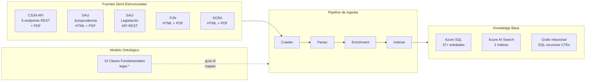
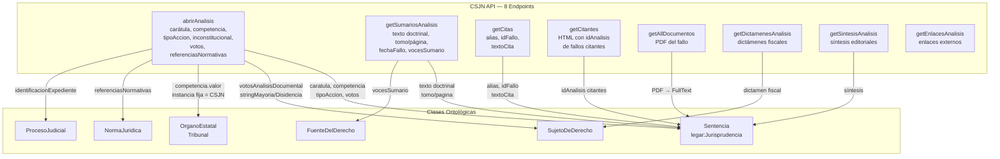
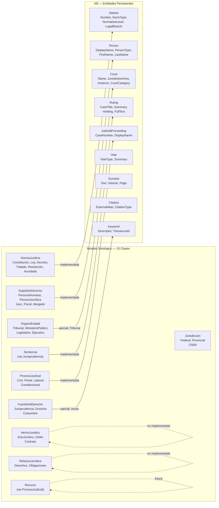
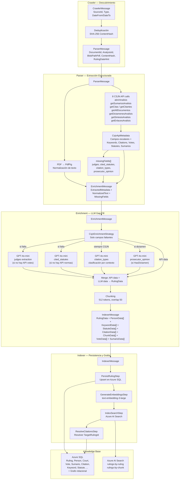
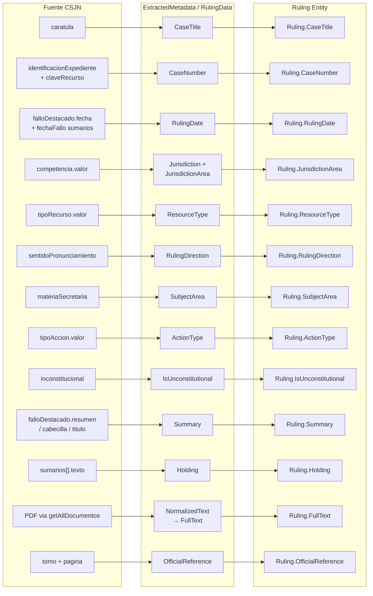
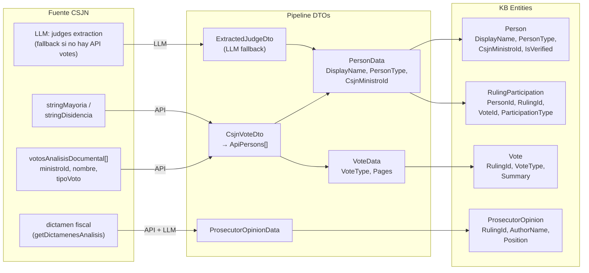
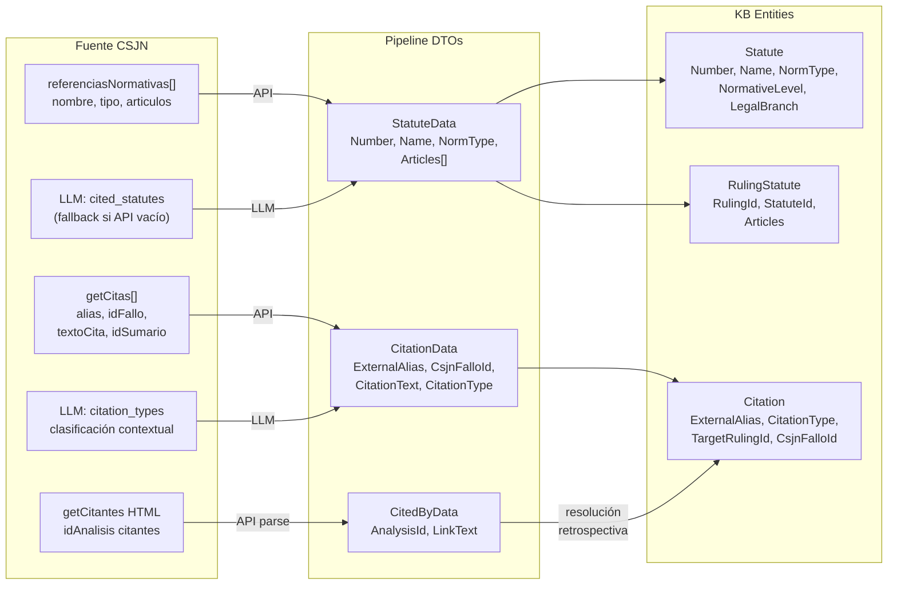
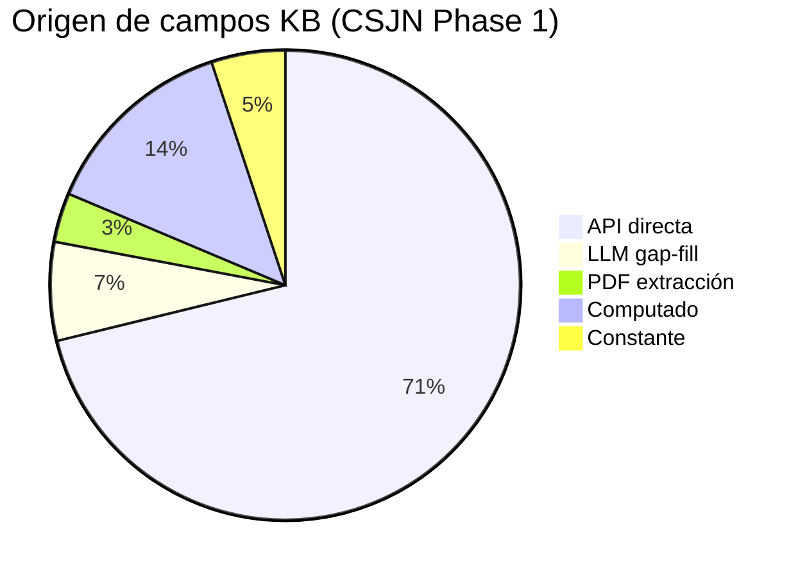
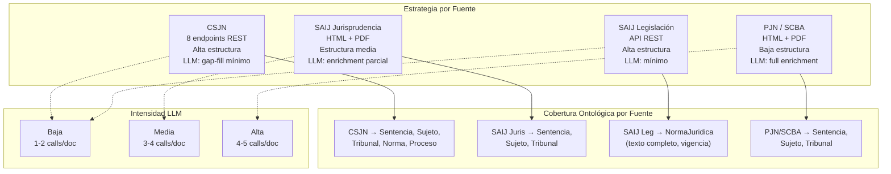
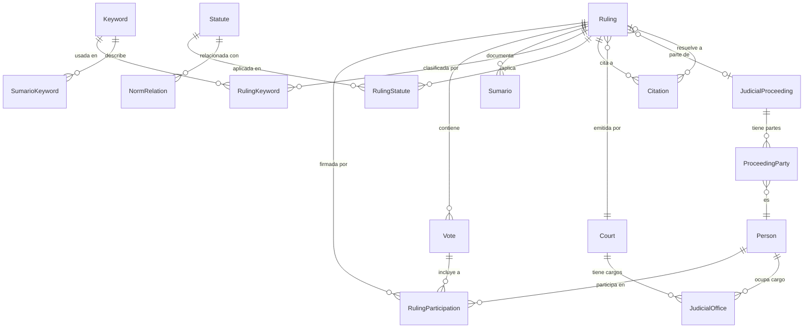

> 📦 **Ported reference.** Preserved from the previous documentation set as a reference for how
> semi-structured sources are transformed through the ontology into the Knowledge Base. Spanish
> original retained; diagrams are the sibling `source-ontology-kb-*.mermaid` files.

# Fuentes → Ontología → Knowledge Base — Diagramas de Transformación

| Campo | Valor |
|---|---|
| **Fecha** | 2026-04-29 |
| **Propósito** | Documentar el proceso de pasaje de fuentes semi-estructuradas diversas a través del modelo ontológico hacia la Knowledge Base |

---

## 1. Visión general: Pipeline de conocimiento

---

## 2. Descomposición de fuentes por clase ontológica

Cada fuente semi-estructurada aporta datos que se mapean a una o más clases del modelo ontológico. Este diagrama muestra qué provee cada fuente.

---

## 3. Ontología como eje de mapeo

El modelo ontológico define **qué conceptos existen** en el dominio jurídico. La KB implementa un subconjunto de estos conceptos como entidades persistentes. Este diagrama muestra la correspondencia.

---

## 4. Pipeline de transformación por etapas

---

## 5. Mapeo detallado: Campo de fuente → DTO → Entidad KB

### 5.1 Ruling (Sentencia)

### 5.2 Personas y roles (SujetoDeDerecho)

### 5.3 Normas y citas (NormaJuridica + Citas)

---

## 6. Origen de cada campo: API vs LLM vs Computado

| Categoría | Campos / artefactos |
|-----------|-------------------|
| **API directa** | CaseTitle, CaseNumber, RulingDate, Jurisdiction, ResourceType, RulingDirection, SubjectArea, ActionType, IsUnconstitutional, Summary, Holding, Keywords, Citations (alias, ids, texto), CitedBy, OfficialReference, Votes, Statutes (API), Sumarios, Syntheses, Links, Dictamen, Observations, FederalQuestion, ProceduralFormula, HasDictamen |
| **LLM gap-fill** | `judges` (si no hay API votes), `cited_statutes` (si no hay referenciasNormativas), `citation_types` (siempre para CSJN), `prosecutor_opinion` (si HasDictamen) |
| **PDF extracción** | FullText (PDF → PdfPig → normalización), TextBlobPath |
| **Computado** | Chunks (512 tokens), Embeddings (text-embedding-3-large), TargetRulingId (resolución de citas), ContentHash (SHA-256), Ruling.Id (DB), CourtId (resolución por nombre) |
| **Constante** | Court = "Corte Suprema de Justicia de la Nación", Instance = "CSJN", SourceId = 1 |

---

## 7. Múltiples fuentes → Estrategias diferenciadas

Cada fuente tiene diferente riqueza de datos estructurados, lo que determina cuánto depende del LLM.

---

## 8. Grafo de conocimiento emergente

Las entidades de la KB y sus relaciones forman un grafo de conocimiento implícito en Azure SQL, navegable via recursive CTEs.

