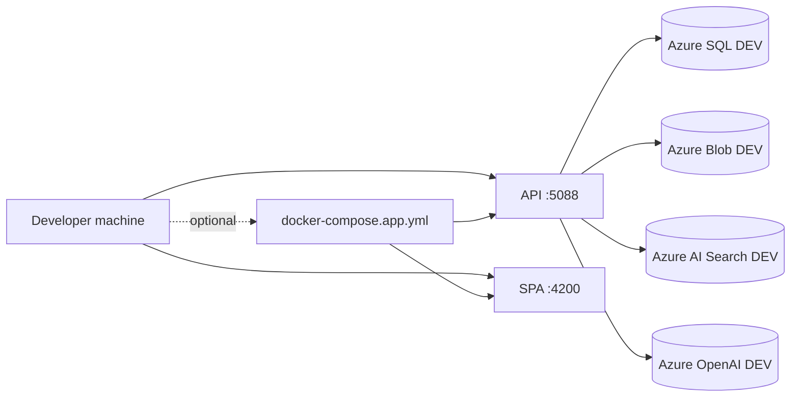

# F0.0 - W07 - Local Environment Setup and Onboarding Guide

> **Feature:** F0.0 - Development Environment and Structure
> **Release:** 0.0 | **Sprint:** S00
> **Type:** doc | **Priority:** High
> **Estimate:** 2 story points
> **Assignable to:** Backend or Frontend Dev (whoever finishes W02/W03 first)

---

## Description

Create the onboarding guide so any developer can clone the repo and have the project running locally in under 30 minutes. Includes automated setup scripts, docker-compose for local dependencies, and step-by-step documentation.

---

## Status — done (adapted)

This work item was **adapted** to match the project's actual local model: **shared cloud DEV** Azure
services (SQL, Blob, Search, OpenAI) — **not** a local SQL Server / Azurite stack. The onboarding
hub, troubleshooting, and extension recommendations already existed from MVP integration; W07 added
automation scripts and aligned docs.

| Deliverable | State |
|-------------|--------|
| Automated setup scripts | ✅ `infra/scripts/setup-local.ps1`, `setup-local.sh` |
| Local dependency compose (`docker-compose.yml` + SQL) | ❌ **Not used** — cloud DEV only |
| `seed-db.sql` | ❌ **Not used** — shared DEV schema/data |
| `docs/onboarding/README.md` | ✅ Updated (scripts, Node 22, 30-min path) |
| `docs/onboarding/troubleshooting.md` | ✅ Updated (+ setup script section) |
| Root `README.md` quick start | ✅ Updated |
| Recommended extensions | ✅ Already in `.vscode/extensions.json` + `recommended-extensions.md` |

---

## Tasks

- [x] ~~Create `docker-compose.yml` at the root with a local SQL Server~~ — **N/A** (cloud DEV workflow; app containers use `docker-compose.app.yml`)
- [x] Create the `infra/scripts/setup-local.ps1` script (Windows)
- [x] Create the `infra/scripts/setup-local.sh` script (Linux/Mac)
- [x] ~~Create `infra/scripts/seed-db.sql`~~ — **N/A** (shared DEV database)
- [x] Update `docs/onboarding/README.md` with a step-by-step guide (incl. automated setup)
- [x] Update `docs/onboarding/troubleshooting.md` with common errors and solutions
- [x] Update the root `README.md` with a quick start
- [x] Verify that a new dev can follow the guide and bring everything up in < 30 min (with DEV credentials)
- [x] Recommended-extensions section — already in `docs/onboarding/recommended-extensions.md` and `.vscode/extensions.json`

---

## Setup scripts

**Windows:** `.\infra\scripts\setup-local.ps1`  
**Linux/macOS:** `./infra/scripts/setup-local.sh`

Both scripts: prerequisite checks (.NET 10, Node 22+, Docker, Git) → create `.env` from template →
`dotnet restore` / `dotnet build` → `npm ci`. Optional Azure connectivity check on Windows:
`-VerifyConnectivity` (calls existing `verify-azure-connectivity.ps1`).

---

## Local runtime model (reference)

**Auth (local):** `Auth:Development:InjectIdentity` — no login screen. See
[`docs/onboarding/README.md`](../../onboarding/README.md) §3.

---

## Acceptance Criteria

- [x] App containers: `docker compose -f docker-compose.app.yml up -d` documented (uses cloud DEV via `.env`; no local DB container)
- [x] The setup script installs dependencies and leaves the project ready (secrets still manual)
- [x] The onboarding guide covers 100% of the setup
- [x] A new dev with DEV credentials can follow the guide in < 30 min
- [x] The troubleshooting covers at least 5 common errors
- [x] The recommended extensions are configured

---

## Dependencies

- **Depends on:** F0.0-W02, F0.0-W03 (existing backend and frontend projects)
- **Blocks:** None (but it is critical for team onboarding)

---

*F0.0 - W07 - Local Environment Setup and Onboarding Guide — Legal Ai Ar*
