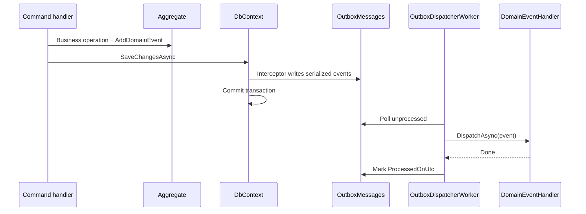

# F0.0 - W12 - Transactional Outbox and Domain Events Infrastructure

> **Feature:** F0.0 - Development Environment and Structure
> **Release:** 0.0 | **Sprint:** S00
> **Type:** backend | **Priority:** Medium (blocking R2 transactional features)
> **Estimate:** 5 story points
> **Assignable to:** Backend Dev

---

## Description

Implement the **transactional outbox** and **domain event dispatch** infrastructure per
[PwC Internal Application Architecture §4.5](../../standards/pwc-internal-app-architecture.md#45-side-effects--outbox-and-queues).
This WI delivers the plumbing only — `OutboxMessages` table, EF interceptor, dispatcher, and handler
registration — **without** business aggregates. Rich aggregates and events are introduced in **R2.0 /
F2.1 (Projects / Workspaces)** when transactional writes require reliable side effects.

Azure Storage Queues remain the mechanism for the **ingestion pipeline** (6 workers); outbox covers
**intra-API transactional side effects** (notifications, audit fan-out, downstream sync).

**Dispatcher host:** `OutboxDispatcherWorker` runs as a `BackgroundService` in the **API** process (see
[`23-outbox-domain-events.md`](../../technical/23-outbox-domain-events.md)).

---

## Tasks

### Domain primitives (Core)

- [x] Add `IDomainEvent` marker interface in `LegalAiAr.Core`
- [x] Add `IAggregateRoot` / `AggregateRoot` with domain event collection and `ClearDomainEvents()`
- [x] Add sample **infrastructure test event** (`PingDomainEvent` in test project only)

### Infrastructure

- [x] Add `OutboxMessage` entity + EF configuration (`OutboxMessages` table)
- [x] Add `DispatchDomainEventsInterceptor` on `SaveChanges` — serialize events to outbox in same transaction
- [x] Add `IDomainEventsDispatcher` + implementation (in-process handler resolution)
- [x] Add `IDomainEventHandler<T>` registration via assembly scanning (`LegalAiAr.Application`)
- [x] Add EF migration for `OutboxMessages`

### Dispatcher host

- [x] Add `OutboxDispatcherWorker` as `BackgroundService` in API (via Infrastructure registration)
- [x] Process unhandled messages in batches; mark `ProcessedOnUtc`; store errors on failure
- [x] Idempotent dispatch (safe retry; handlers must be idempotent)

### Testing

- [x] Integration test: raising event on save persists outbox row; dispatcher invokes handler
- [x] Unit test: interceptor clears domain events from aggregate after capture
- [x] Architecture test: domain event types not in Api; Core events in `LegalAiAr.Core.Domain`

### Documentation

- [x] Add `docs/technical/23-outbox-domain-events.md`
- [x] Cross-link [`21-business-workspace-model.md`](../../technical/21-business-workspace-model.md) — F2.1 will use this infrastructure
- [x] DoD round-trip — merged to `main` ([PR #114](https://github.com/pwc-ar-xlos-argentinaaifactory/legal-ai-ar/pull/114))

---

## Flow

---

## Acceptance Criteria

- [x] Saving an aggregate with a domain event creates an outbox row in the **same transaction**
- [x] Dispatcher processes messages and invokes registered `IDomainEventHandler<T>`
- [x] Failed dispatch records error; message not lost; retry safe
- [x] Ingestion pipeline queues **unchanged** — outbox does not replace worker queues
- [x] `dotnet build` zero warnings; new tests green
- [x] No production feature depends on outbox yet (infrastructure-only — sample event in tests only)
- [x] Architecture standard §4.5 and §16 backend checklist satisfied
- [x] Documentation round-trip complete (DoD) — merged [PR #114](https://github.com/pwc-ar-xlos-argentinaaifactory/legal-ai-ar/pull/114)

---

## Dependencies

- **Blocks:** F2.1 Projects / Workspaces (transactional aggregates with side effects)
- **Prerequisites:** F0.0-W02 (Infrastructure/EF), F0.0-W08 (architecture tests recommended)

---

_F0.0 - W12 - Transactional Outbox and Domain Events Infrastructure — Legal Ai Ar_
