# F00 - W01 - Comprehensive Documentation

> **Feature:** F00 - Development Environment and Structure
> **Release:** 0.0 (Pre-release) | **Sprint:** S00
> **Type:** Documentation | **Priority:** Critical (blocking)
> **Estimate:** 5 story points

---

## 1. General Description

Complete definition of the development environment, tech stack, monorepo structure, code conventions, branching strategy, CI/CD pipelines, Azure environment provisioning, and local development environment setup. This feature is **blocking** for all the others: no development can begin without completing F00.

---

## 2. Tech Stack

### Backend

| Component | Technology | Version |
|---|---|---|
| Runtime | .NET | 10 LTS |
| Framework | ASP.NET Core Minimal API | 10.x |
| ORM | Entity Framework Core | 10.x |
| Validation | FluentValidation | 12.x |
| Logging | Serilog + Application Insights | latest |
| Auth | Platform auth (`id_token` cookie validation, `Auth:Platform`) | — |
| AI Orchestration | Semantic Kernel | latest |
| Testing | xUnit + Moq + FluentAssertions | latest |
| API Docs | Swashbuckle (OpenAPI/Swagger) | latest |
| Mapping | Mapperly (source generator) | latest |
| Mediator | MediatR | 12.x |

### Frontend

| Component | Technology | Version |
|---|---|---|
| Framework | Angular | 19.x |
| UI Components | PwC AppKit 4 | (TBD) |
| Auth | Platform session (`id_token` cookie + `withCredentials`, no MSAL) | — |
| State Management | NgRx Signals / Angular Signals | built-in |
| HTTP | HttpClient + Interceptors | built-in |
| Forms | Reactive Forms + custom validations | built-in |
| Charts | Chart.js + ng2-charts | latest |
| Graph | Cytoscape.js + ngx-cytoscape | latest |
| Calendar | FullCalendar Angular | latest |
| Icons | Material Icons / PwC Icon set | (TBD) |
| Testing | Jest + Angular Testing Library | latest |
| E2E | Playwright | latest |
| Linting | ESLint + Prettier + angular-eslint | latest |

### Azure Infrastructure

| Service | Use |
|---|---|
| Azure SQL Database | Relational database + SQL Graph |
| Azure AI Search | Semantic search indexes (norms, case law) |
| Azure OpenAI | GPT models for AI agents and embeddings |
| Azure Key Vault | Secret and certificate management |
| Azure Storage | Blob Storage (documents), Queue Storage (async messages), Table Storage (logs) |
| Azure App Service | Hosting the .NET 10 API |
| Azure Static Web Apps | Hosting the Angular 19 SPA |
| Azure Functions | Timer triggers (official gazette, deadline evaluation) |
| Azure SignalR Service | Real-time notifications and chat streaming |
| Azure Application Insights | Telemetry, logging, APM |
| Microsoft Entra ID | Identity provider (auth, roles) |

### Development Tools

| Tool | Use |
|---|---|
| GitHub | Repository, Issues, Projects, PRs |
| GitHub Actions | CI/CD pipelines |
| Visual Studio 2022 / Rider | Backend IDE |
| VS Code | Frontend IDE |
| Azure Data Studio | Database management |
| Postman / Bruno | API testing |
| Docker Desktop | Local containers (SQL Server dev) |

---

## 3. Monorepo Structure (based on the existing MVP)

> The `legal-ai-ar` repo already exists and contains a functional MVP. The structure is extended by adding `docs/`, `LegalAiAr.Agents`, and `LegalAiAr.AgentEvals`.

```
legal-ai-ar/                            # ← Existing monorepo
├── .github/
│   ├── workflows/                      # CI/CD (managed outside the roadmap)
│   ├── ISSUE_TEMPLATE/                 # New: issue templates
│   └── PULL_REQUEST_TEMPLATE.md        # New: PR template
├── docs/                               # New: project documentation
│   ├── roadmap/                        # Features and Work Items
│   ├── technical/                      # 9 technical documents
│   └── ontology/                       # Legal domain model
├── backend/
│   ├── src/
│   │   ├── api/
│   │   │   ├── LegalAiAr.Api/         # ✅ ASP.NET Core (Controllers → Minimal API, gradual)
│   │   │   └── LegalAiAr.Application/ # ✅ CQRS, handlers, DTOs, validators
│   │   ├── shared/
│   │   │   ├── LegalAiAr.Core/        # ✅ Entities, enums, interfaces
│   │   │   └── LegalAiAr.Infrastructure/ # ✅ EF Core, AI Search, Azure clients
│   │   ├── workers/                    # ✅ 6 BackgroundService workers (pipeline)
│   │   │   ├── LegalAiAr.Worker.Discoverer/
│   │   │   ├── LegalAiAr.Worker.Fetcher/
│   │   │   ├── LegalAiAr.Worker.Parser/
│   │   │   ├── LegalAiAr.Worker.Enrichment/
│   │   │   ├── LegalAiAr.Worker.Persister/
│   │   │   └── LegalAiAr.Worker.Indexer/
│   │   └── tools/                      # ✅ 10 auxiliary CLI tools
│   ├── tests/
│   │   ├── LegalAiAr.Api.Tests/        # ✅ Existing tests
│   │   ├── LegalAiAr.Application.Tests/ # ✅
│   │   ├── LegalAiAr.Core.Tests/       # ✅
│   │   ├── LegalAiAr.Infrastructure.Tests/ # ✅
│   │   └── LegalAiAr.AgentEvals/       # New: AI agent evaluations
│   ├── LegalAiAr.sln                   # ✅ Existing solution (add new projects)
│   ├── Directory.Build.props           # ✅
│   ├── Directory.Packages.props        # ✅ Central Package Management
│   └── global.json                     # ✅ .NET 10
├── frontend/
│   ├── src/
│   │   ├── app/
│   │   │   ├── core/               # Singleton services, guards, interceptors
│   │   │   │   ├── auth/
│   │   │   │   ├── interceptors/
│   │   │   │   ├── guards/
│   │   │   │   ├── services/
│   │   │   │   └── models/
│   │   │   ├── shared/             # Reusable components, pipes, directives
│   │   │   │   ├── components/
│   │   │   │   ├── directives/
│   │   │   │   ├── pipes/
│   │   │   │   └── utils/
│   │   │   ├── features/           # Per-feature modules (lazy loaded)
│   │   │   │   ├── dashboard/
│   │   │   │   ├── legal-norms/
│   │   │   │   ├── case-law/
│   │   │   │   ├── case-files/
│   │   │   │   ├── deadlines/
│   │   │   │   ├── chat/
│   │   │   │   ├── calendar/
│   │   │   │   ├── risk-analysis/
│   │   │   │   ├── reports/
│   │   │   │   ├── admin/
│   │   │   │   └── updates/
│   │   │   ├── layout/             # Shell, sidebar, navbar, footer
│   │   │   ├── app.component.ts
│   │   │   ├── app.config.ts
│   │   │   └── app.routes.ts
│   │   ├── assets/
│   │   ├── environments/
│   │   │   ├── environment.ts
│   │   │   ├── environment.dev.ts
│   │   │   ├── environment.qa.ts
│   │   │   ├── environment.staging.ts
│   │   │   └── environment.prod.ts
│   │   ├── styles/
│   │   │   ├── _variables.scss
│   │   │   ├── _mixins.scss
│   │   │   ├── _typography.scss
│   │   │   └── styles.scss
│   │   ├── index.html
│   │   └── main.ts
│   ├── angular.json
│   ├── tsconfig.json
│   ├── tsconfig.app.json
│   ├── tsconfig.spec.json
│   ├── jest.config.ts
│   ├── playwright.config.ts
│   ├── .eslintrc.json
│   ├── .prettierrc
│   └── package.json
├── infra/
│   ├── bicep/                      # IaC with Azure Bicep
│   │   ├── main.bicep              # Main orchestrator
│   │   ├── modules/
│   │   │   ├── sql.bicep
│   │   │   ├── search.bicep
│   │   │   ├── openai.bicep
│   │   │   ├── keyvault.bicep
│   │   │   ├── storage.bicep
│   │   │   ├── appservice.bicep
│   │   │   ├── staticwebapp.bicep
│   │   │   ├── functions.bicep
│   │   │   ├── signalr.bicep
│   │   │   └── appinsights.bicep
│   │   └── parameters/
│   │       ├── dev.bicepparam
│   │       ├── qa.bicepparam
│   │       ├── staging.bicepparam
│   │       └── prod.bicepparam
│   └── scripts/
│       ├── setup-local.ps1         # Local setup, Windows
│       ├── setup-local.sh          # Local setup, Linux/Mac
│       └── seed-db.sql             # Initial seed data
├── .gitignore
├── .editorconfig
├── README.md
└── LICENSE
```

---

## 4. Overall Architecture Diagram

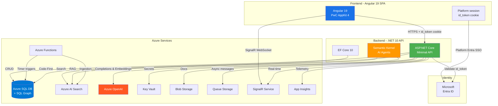

> **Auth note:** Production authentication is platform-managed (GCaaS Entra SSO via the `id_token` HTTP-only cookie; the API validates it with `Auth:Platform`). No MSAL in the SPA. See [`gcaas-hosting.md`](../../deployment/gcaas-hosting.md).

---

## 5. Deployment Environments

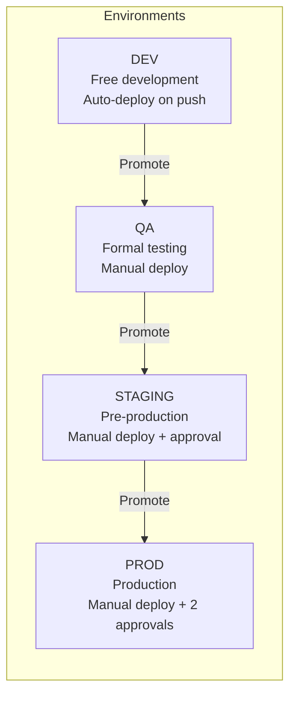

| Environment | Purpose | Deploy Trigger | Approvals | Azure Resource Group |
|---|---|---|---|---|
| **DEV** | Free development, continuous integration | Push to `main` | None | `rg-legal-ai-ar-dev` |
| **QA** | Formal testing by QA/product owner | Manual (workflow dispatch) | 1 (Tech Lead) | `rg-legal-ai-ar-qa` |
| **STAGING** | Pre-production, stakeholder demo | Manual (workflow dispatch) | 1 (Tech Lead) | `rg-legal-ai-ar-staging` |
| **PROD** | Production | Manual (workflow dispatch) | 2 (Tech Lead + Product Owner) | `rg-legal-ai-ar-prod` |

### Azure Resource Naming Convention

```
{service}-legal-ai-ar-{environment}
```

Examples: `sql-legal-ai-ar-dev`, `app-legal-ai-ar-prod`, `func-legal-ai-ar-qa`, `srch-legal-ai-ar-staging`

---

## 6. Branching Strategy (GitHub Flow)

```mermaid
gitgraph
    commit id: "initial"
    branch feature/F01-W02-entra-id-jwt
    checkout feature/F01-W02-entra-id-jwt
    commit id: "feat: add Entra ID config"
    commit id: "feat: add JWT validation"
    checkout main
    merge feature/F01-W02-entra-id-jwt id: "PR #1 merged"
    branch feature/F01-W04-platform-session
    checkout feature/F01-W04-platform-session
    commit id: "feat: platform session setup"
    checkout main
    merge feature/F01-W04-platform-session id: "PR #2 merged"
    branch hotfix/fix-token-refresh
    checkout hotfix/fix-token-refresh
    commit id: "fix: token refresh"
    checkout main
    merge hotfix/fix-token-refresh id: "PR #3 merged"
```

### Branch Convention

```
feature/{FXX}-{WXX}-{short-description}    → New functionality
bugfix/{FXX}-{short-description}            → Bug fixes
hotfix/{short-description}                  → Urgent production fixes
chore/{short-description}                   → Maintenance, refactor, deps
```

### PR Rules

- Every merge to `main` requires a PR with at least 1 approved review
- CI must pass (build + tests) before merging
- Squash merge as the default strategy
- PR title follows Conventional Commits: `feat(F01): add JWT validation middleware`

---

## 7. Code Conventions

### Conventional Commits

```
feat(F01): add JWT validation middleware
fix(F03): correct search index scoring
chore: update EF Core to 10.0.1
docs(F00): add onboarding guide
test(F01): add auth integration tests
refactor(F05): extract graph service
```

### Backend (.NET)

- **Naming:** PascalCase for classes, methods, properties. camelCase for local variables and parameters
- **Async:** Every I/O operation is async. `Async` suffix on methods
- **Nullable:** Nullable reference types enabled (`<Nullable>enable</Nullable>`)
- **Responses:** Standard `ApiResponse<T>` envelope with `{data, errors[], meta}`
- **Exceptions:** Global exception handler middleware, never try-catch in controllers
- **Validation:** FluentValidation in the MediatR pipeline, never in controllers
- **Logging:** Serilog structured logging with a correlation ID on each request

### Frontend (Angular)

- **Naming:** kebab-case for files, PascalCase for classes, camelCase for variables
- **Standalone:** All components are standalone (Angular 19 default)
- **Signals:** Prefer Angular Signals over RxJS for local component state
- **RxJS:** Use only for HTTP streams and complex async events
- **Lazy Loading:** Each feature is a lazy-loaded module with its own routes
- **Barrel exports:** `index.ts` in each feature folder for clean exports
- **Error handling:** Global error handler + toast notifications

### Feature Module Structure (Angular)

```
features/legal-norms/
├── components/
│   ├── legal-norm-list/
│   │   ├── legal-norm-list.component.ts
│   │   ├── legal-norm-list.component.html
│   │   └── legal-norm-list.component.scss
│   └── legal-norm-detail/
├── services/
│   └── legal-norms.service.ts
├── models/
│   └── legal-norm.model.ts
├── legal-norms.routes.ts
└── index.ts
```

---

## 8. Knowledge Base Architecture

### 8.1 Stores that make up the KB

The Knowledge Base does not live in a single store. Each data type is persisted in the most appropriate store according to its access patterns:

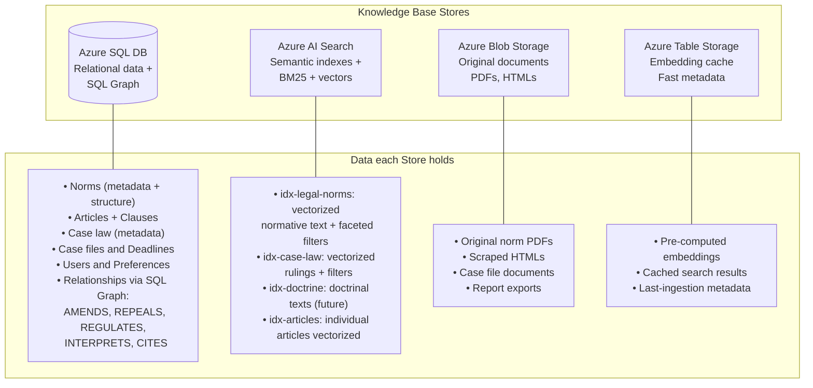

| Store | Technology | What it stores | Access pattern |
|---|---|---|---|
| **Relational + Graph** | Azure SQL DB (SQL Graph) | Structured entities, relationships between norms, case files, deadlines | CRUD, joins, graph traversal |
| **Semantic search** | Azure AI Search | Vectorized text of norms, case law, articles | Hybrid search (BM25 + vectors), faceted filters |
| **Original documents** | Azure Blob Storage | PDFs, HTMLs, attachments | Read by URL, streaming |
| **Cache / Metadata** | Azure Table Storage | Pre-computed embeddings, ingestion state, cache | Fast key-value lookup |
| **Async queues** | Azure Queue Storage | Ingestion messages, deadline alerts, notifications | Producer-consumer |

### 8.2 Complete Data Model (Azure SQL + SQL Graph)

Derived from the Argentine legal ontology. It is divided into 4 groups: **Core Legal**, **Procedural/Management**, **Identity**, and **Relationship Graph**.

#### 8.2.1 Core Legal — Norms and Case Law

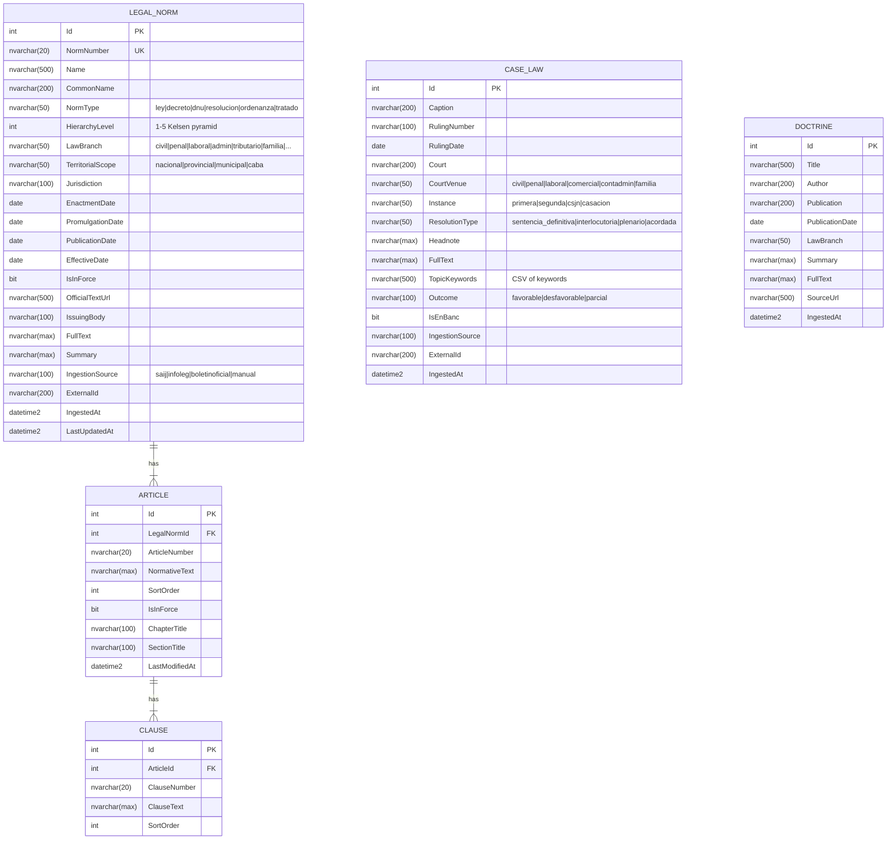

#### 8.2.2 SQL Graph — Relationships Between Legal Entities

Azure SQL's SQL Graph models the N:N relationships between norms, articles, and case law as typed edges, enabling efficient traversal.

**Nodes (NODE tables):**

```sql
-- Nodes (these are the relational tables above, marked AS NODE)
CREATE TABLE LegalNorm (...) AS NODE;
CREATE TABLE Article (...) AS NODE;
CREATE TABLE CaseLaw (...) AS NODE;
CREATE TABLE Doctrine (...) AS NODE;
```

**Edges (graph relationships):**

```sql
-- Norm → Norm
CREATE TABLE Amends AS EDGE;            -- NormA amends NormB
CREATE TABLE Repeals AS EDGE;           -- NormA repeals NormB
CREATE TABLE Regulates AS EDGE;         -- Decree regulates Law
CREATE TABLE Complements AS EDGE;       -- NormA complements NormB

-- Case law → Norm/Article
CREATE TABLE Interprets AS EDGE;        -- Ruling interprets Article
CREATE TABLE Applies AS EDGE;           -- Ruling applies Norm
CREATE TABLE CitesCaseLaw AS EDGE;      -- Ruling cites another Ruling

-- Article → Article
CREATE TABLE References AS EDGE;         -- Art. X references Art. Y

-- Doctrine → Norm/Case law
CREATE TABLE Comments AS EDGE;          -- Doctrine comments on a Norm or Ruling
```

**Edge properties:**

| Edge | Properties | Example |
|---|---|---|
| `Amends` | `AmendedAt`, `AmendmentType` (partial/total), `AffectedArticles` | Ley 27.077 amends art. 1 of Ley 26.994 |
| `Repeals` | `RepealedAt`, `RepealType` (express/tacit) | Ley 26.994 repeals Ley 340 (Civil Code) |
| `Regulates` | `RegulatedAt` | Decreto 1759/72 regulates Ley 19.549 |
| `Interprets` | `InterpretiveCriterion`, `IsBinding` | CSJN interprets art. 14 bis CN |
| `Applies` | `ApplicationResult` | Ruling applies Ley 20.744 art. 245 |
| `CitesCaseLaw` | `CitationContext` | Ruling cites a CSJN precedent |

**Example traversal query:**

```sql
-- Which rulings interpret art. 245 of the LCT?
SELECT j.Caption, j.RulingDate, j.Court
FROM CaseLaw j, Interprets i, Article a, LegalNorm n
WHERE MATCH(j-(i)->a)
  AND a.LegalNormId = n.Id
  AND n.NormNumber = '20.744'
  AND a.ArticleNumber = '245';

-- Amendment chain of a norm (up to 5 levels)
SELECT n1.Name, n2.Name AS AmendedBy, n3.Name AS InTurnAmendedBy
FROM LegalNorm n1, Amends m1, LegalNorm n2, Amends m2, LegalNorm n3
WHERE MATCH(n1<-(m1)-n2<-(m2)-n3);
```

#### 8.2.3 Procedural and Management

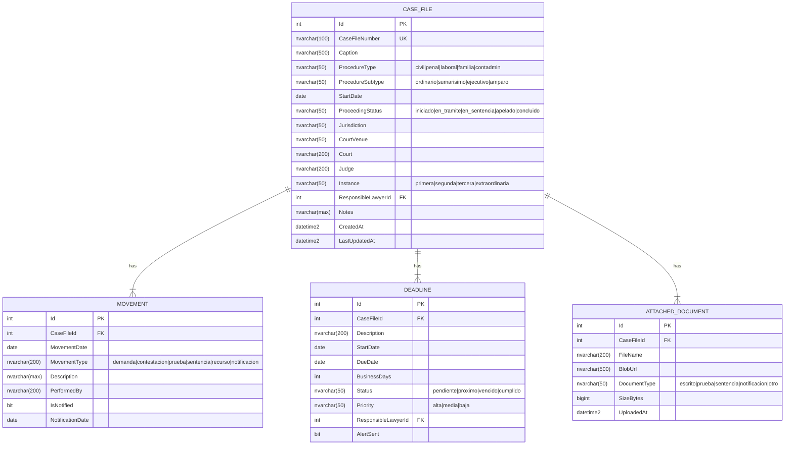

#### 8.2.4 Identity and System

```sql
-- System users (reference to Entra ID)
CREATE TABLE UserPreferences (
    Id INT PRIMARY KEY IDENTITY,
    EntraObjectId NVARCHAR(128) NOT NULL UNIQUE,
    Email NVARCHAR(256) NOT NULL,
    FullName NVARCHAR(200),
    Role NVARCHAR(50) NOT NULL, -- abogado | administrativo
    LastAccessAt DATETIME2,
    Preferences NVARCHAR(MAX) -- JSON
);

-- Chat conversations with agents
CREATE TABLE Conversation (
    Id INT PRIMARY KEY IDENTITY,
    UserId INT FK REFERENCES UserPreferences(Id),
    AgentId NVARCHAR(50), -- normativo | jurisprudencial | procesal
    Title NVARCHAR(200),
    CreatedAt DATETIME2,
    LastMessageAt DATETIME2
);

CREATE TABLE ChatMessage (
    Id INT PRIMARY KEY IDENTITY,
    ConversationId INT FK REFERENCES Conversation(Id),
    Role NVARCHAR(20), -- user | assistant
    Content NVARCHAR(MAX),
    CitedSources NVARCHAR(MAX), -- JSON array of norm/ruling IDs
    TokensUsed INT,
    CreatedAt DATETIME2
);

-- Risk analysis
CREATE TABLE RiskAnalysis (
    Id INT PRIMARY KEY IDENTITY,
    UserId INT FK REFERENCES UserPreferences(Id),
    CaseDescription NVARCHAR(MAX),
    RiskScore DECIMAL(5,2),
    RiskLevel NVARCHAR(20), -- bajo | medio | alto | critico
    FullAnalysis NVARCHAR(MAX), -- structured JSON
    CitedNorms NVARCHAR(MAX), -- JSON array
    CitedCaseLaw NVARCHAR(MAX), -- JSON array
    CreatedAt DATETIME2
);

-- Audit
CREATE TABLE AuditLog (
    Id BIGINT PRIMARY KEY IDENTITY,
    UserId INT,
    Action NVARCHAR(100),
    Entity NVARCHAR(100),
    EntityId INT,
    DataBefore NVARCHAR(MAX),
    DataAfter NVARCHAR(MAX),
    IpAddress NVARCHAR(45),
    ActionDate DATETIME2 DEFAULT GETUTCDATE()
);
```

---

## 9. RAG Strategy: GraphRAG + Hybrid Search

### 9.1 Overview

The system uses a layered RAG strategy that combines **Hybrid Search** (BM25 + vectors) with **Graph-enhanced retrieval** to enrich the context with legal relationships that semantic search alone would not capture.

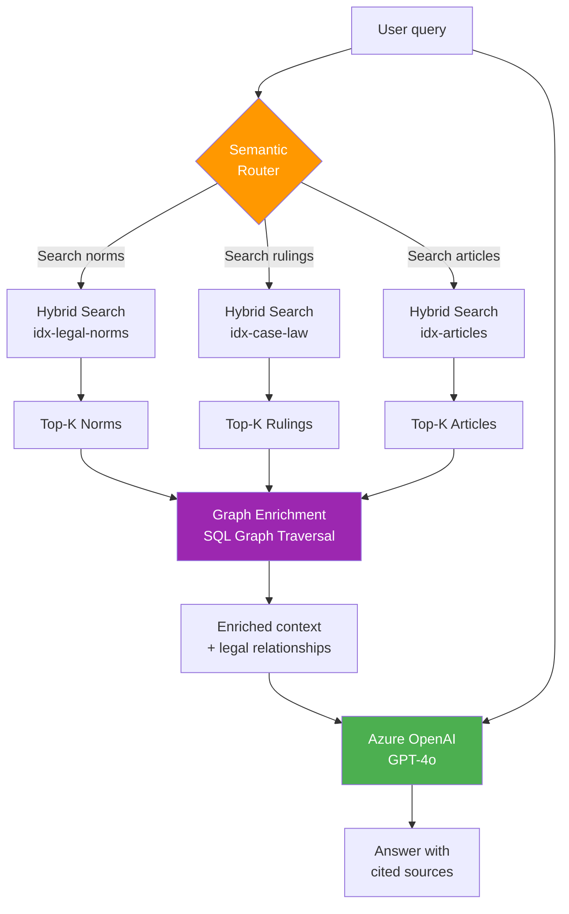

### 9.2 RAG Types per Agent

| Agent | RAG Type | What it searches | Graph Enrichment |
|---|---|---|---|
| **Regulatory** | Hybrid Search + GraphRAG | Relevant norms and articles | Amendment chain, norms that repeal/regulate, related articles |
| **Case Law** | Hybrid Search + GraphRAG | Relevant court rulings | Norms the ruling applies/interprets, rulings cited by other rulings, interpreted articles |
| **Procedural** | SQL Query + Hybrid | Case files, deadlines, business-day calendar | Deadlines linked to the case file, applicable procedural norms |

### 9.3 Hybrid Search — Azure AI Search Configuration

Each index uses **Hybrid Search** that combines BM25 (keyword) with vector search in a single query, using Reciprocal Rank Fusion (RRF) to combine scores.

#### `idx-legal-norms` index

```json
{
  "name": "idx-legal-norms",
  "fields": [
    { "name": "id", "type": "Edm.String", "key": true },
    { "name": "legalNormId", "type": "Edm.Int32", "filterable": true },
    { "name": "normNumber", "type": "Edm.String", "searchable": true, "filterable": true },
    { "name": "name", "type": "Edm.String", "searchable": true },
    { "name": "normType", "type": "Edm.String", "filterable": true, "facetable": true },
    { "name": "lawBranch", "type": "Edm.String", "filterable": true, "facetable": true },
    { "name": "territorialScope", "type": "Edm.String", "filterable": true, "facetable": true },
    { "name": "isInForce", "type": "Edm.Boolean", "filterable": true },
    { "name": "publicationDate", "type": "Edm.DateTimeOffset", "filterable": true, "sortable": true },
    { "name": "issuingBody", "type": "Edm.String", "filterable": true, "facetable": true },
    { "name": "fullText", "type": "Edm.String", "searchable": true },
    { "name": "summary", "type": "Edm.String", "searchable": true },
    { "name": "embedding", "type": "Collection(Edm.Single)", "dimensions": 3072, "vectorSearchProfile": "hybrid-profile" }
  ],
  "vectorSearch": {
    "algorithms": [{ "name": "hnsw-algo", "kind": "hnsw", "parameters": { "m": 4, "efConstruction": 400, "efSearch": 500 } }],
    "profiles": [{ "name": "hybrid-profile", "algorithm": "hnsw-algo" }]
  },
  "scoringProfiles": [{
    "name": "boost-in-force",
    "text": { "weights": { "name": 3, "summary": 2, "fullText": 1 } },
    "functions": [{
      "type": "freshness",
      "fieldName": "publicationDate",
      "boost": 2,
      "parameters": { "boostingDuration": "P365D" }
    }]
  }]
}
```

#### `idx-case-law` index

```json
{
  "name": "idx-case-law",
  "fields": [
    { "name": "id", "type": "Edm.String", "key": true },
    { "name": "caseLawId", "type": "Edm.Int32", "filterable": true },
    { "name": "caption", "type": "Edm.String", "searchable": true },
    { "name": "court", "type": "Edm.String", "filterable": true, "facetable": true },
    { "name": "courtVenue", "type": "Edm.String", "filterable": true, "facetable": true },
    { "name": "instance", "type": "Edm.String", "filterable": true, "facetable": true },
    { "name": "rulingDate", "type": "Edm.DateTimeOffset", "filterable": true, "sortable": true },
    { "name": "isEnBanc", "type": "Edm.Boolean", "filterable": true },
    { "name": "topicKeywords", "type": "Collection(Edm.String)", "filterable": true, "facetable": true },
    { "name": "headnote", "type": "Edm.String", "searchable": true },
    { "name": "fullText", "type": "Edm.String", "searchable": true },
    { "name": "embedding", "type": "Collection(Edm.Single)", "dimensions": 3072, "vectorSearchProfile": "hybrid-profile" }
  ]
}
```

#### `idx-articles` index

```json
{
  "name": "idx-articles",
  "fields": [
    { "name": "id", "type": "Edm.String", "key": true },
    { "name": "articleId", "type": "Edm.Int32", "filterable": true },
    { "name": "legalNormId", "type": "Edm.Int32", "filterable": true },
    { "name": "legalNormName", "type": "Edm.String", "searchable": true },
    { "name": "articleNumber", "type": "Edm.String", "filterable": true },
    { "name": "normativeText", "type": "Edm.String", "searchable": true },
    { "name": "chapterTitle", "type": "Edm.String", "searchable": true, "filterable": true },
    { "name": "isInForce", "type": "Edm.Boolean", "filterable": true },
    { "name": "embedding", "type": "Collection(Edm.Single)", "dimensions": 3072, "vectorSearchProfile": "hybrid-profile" }
  ]
}
```

### 9.4 GraphRAG — Enrichment Pipeline

After obtaining the Top-K results from Hybrid Search, the system enriches the context with graph relationships:

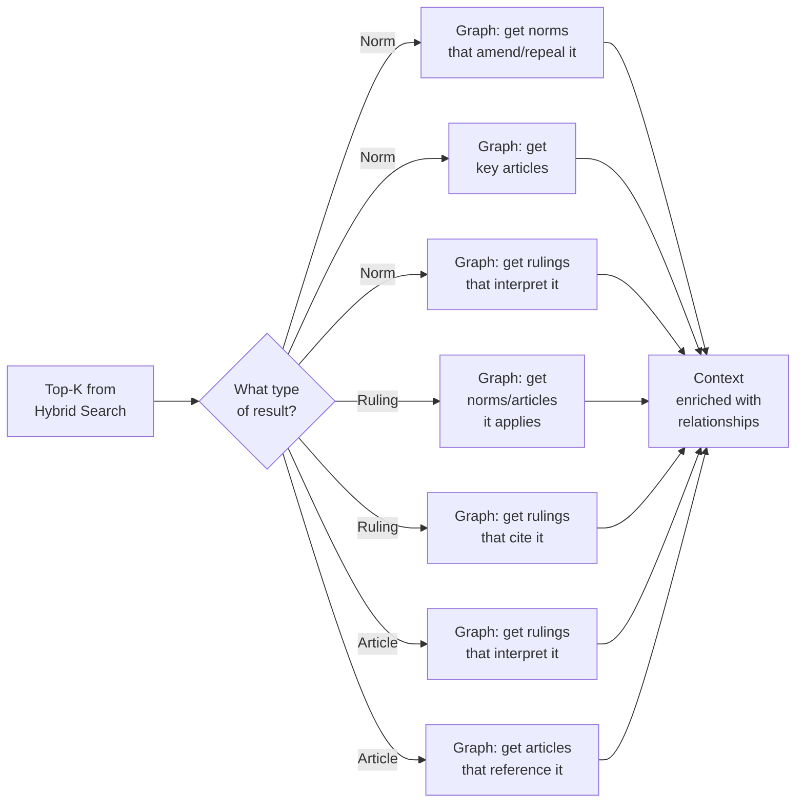

**Enrichment example for a query about dismissal without cause:**

1. Hybrid Search returns: Ley 20.744 (LCT), art. 245, art. 232
2. Graph Enrichment adds:
   - `Amends`: Ley 25.877 amended art. 245 in 2004
   - `Interprets`: 15 CNAT rulings interpreting art. 245 (top 3 by relevance)
   - `Regulates`: Decreto 1694/06 regulates the salary base
   - `References`: art. 245 references art. 232 (prior notice) and art. 233 (month integration)

### 9.5 Embeddings

| Aspect | Configuration |
|---|---|
| **Model** | `text-embedding-3-large` (Azure OpenAI) |
| **Dimensions** | 3072 |
| **Norm chunking** | Per individual article (minimum legal semantic unit) |
| **Case law chunking** | By sections: facts, grounds, resolution (separated with metadata) |
| **Doctrine chunking** | ~500-token chunks with a 100-token overlap |
| **Batch processing** | 100 embeddings per batch, rate limiting respected |
| **Pre-computation** | Embeddings are generated in the ingestion pipeline and stored in AI Search + Table Storage (cache) |

---

## 10. Ingestion Pipelines

### 10.1 Ingestion Architecture

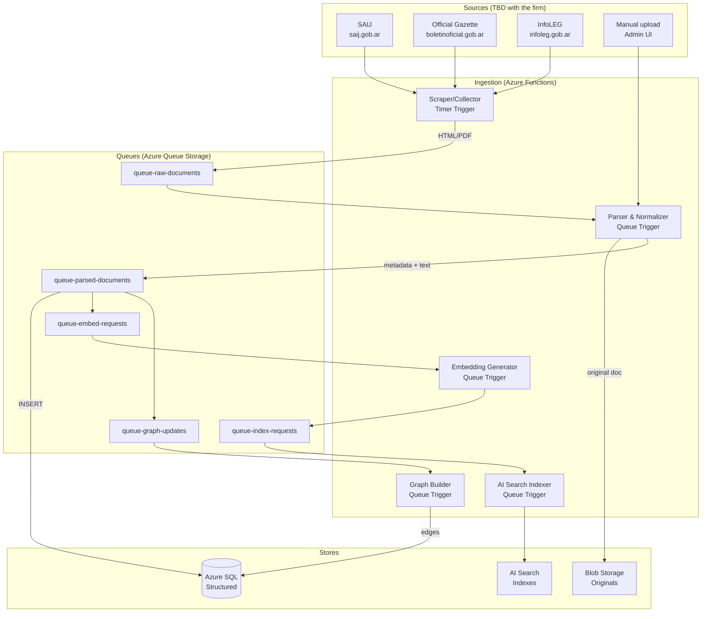

### 10.2 Ingestion Types

| Type | Trigger | Frequency | Source | What it ingests |
|---|---|---|---|---|
| **Official Gazette** | Timer (daily 8am) | Daily | boletinoficial.gob.ar | Newly published norms |
| **SAIJ Norms** | Timer (weekly) | Weekly | saij.gob.ar | Updated/new norms |
| **SAIJ Case Law** | Timer (weekly) | Weekly | saij.gob.ar | New rulings |
| **InfoLEG** | Timer (weekly) | Weekly | infoleg.gob.ar | Consolidated texts |
| **Manual upload** | HTTP / Admin UI | On demand | Users | Provincial norms, doctrine |
| **Re-indexing** | Manual | As needed | All stores | Index rebuild |

> **Note:** The specific sources will be defined with the law firm. The architecture is extensible: adding a new source only requires a new Scraper/Collector in Azure Functions.

### 10.3 Per-Document Processing Pipeline

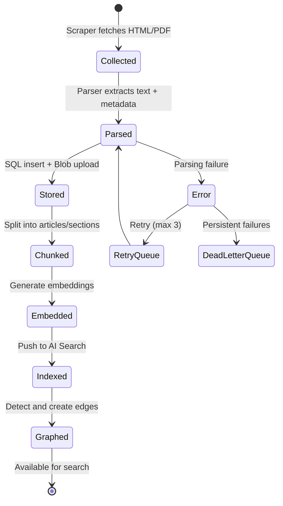

**Detail of each step:**

1. **Collect:** An Azure Function with a Timer Trigger scrapes the source, downloads the HTML/PDF, and saves to `queue-raw-documents`
2. **Parse:** Extracts clean text, metadata (number, date, type, body), structure (articles, clauses). For PDFs it uses Azure Document Intelligence
3. **Store:** Inserts into Azure SQL (relational tables) + uploads the original to Blob Storage
4. **Chunk:** Splits into semantic units (articles for norms, sections for rulings)
5. **Embed:** Generates embeddings with `text-embedding-3-large` in batch
6. **Index:** Pushes documents + embeddings to Azure AI Search
7. **Graph:** Analyzes the text to detect references to other norms/articles and creates edges in SQL Graph

### 10.4 Automatic Relationship Detection (Graph Builder)

The Graph Builder analyzes the text of each norm/ruling to detect relationships and create edges:

| Detected pattern | Edge created | Example |
|---|---|---|
| "Modifícase el artículo X de la Ley Y" | `Amends` | Ley 27.077 → art. 1 Ley 26.994 |
| "Derógase la Ley X" | `Repeals` | Ley 26.994 → Ley 340 |
| "Reglamentación de la Ley X" | `Regulates` | Decreto 1759/72 → Ley 19.549 |
| "Conforme lo dispuesto por el art. X" | `References` | Art. 245 → Art. 232 LCT |
| Ruling cites "art. X de la Ley Y" | `Applies` / `Interprets` | Ruling → Art. 245 Ley 20.744 |
| Ruling cites another ruling (caption + date) | `CitesCaseLaw` | Ruling A → Ruling B |

Detection uses a combination of regex patterns for simple cases and Azure OpenAI for ambiguous cases, with human validation in a review queue.

---

## 11. CI/CD Pipelines (GitHub Actions)

> *(Note: the previous sections 8-10 cover the KB architecture. The original CI/CD and local-environment sections are kept below.)*

### Backend CI (`ci-backend.yml`)

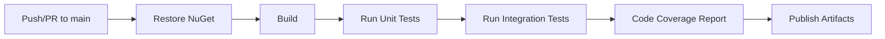

**Trigger:** Push to `main` or PR targeting `main` with changes in `backend/`

**Steps:**
1. Checkout + setup .NET 10
2. `dotnet restore`
3. `dotnet build --no-restore -c Release`
4. `dotnet test --no-build -c Release --collect:"XPlat Code Coverage"`
5. Upload coverage report
6. `dotnet publish -c Release -o ./publish`
7. Upload build artifact

### Frontend CI (`ci-frontend.yml`)

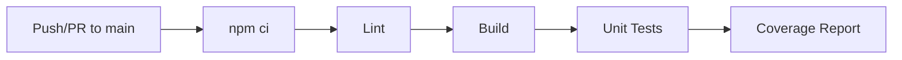

**Trigger:** Push to `main` or PR targeting `main` with changes in `frontend/`

**Steps:**
1. Checkout + setup Node 22
2. `npm ci`
3. `npm run lint`
4. `npm run build -- --configuration=production`
5. `npm run test -- --coverage`
6. Upload coverage report
7. Upload build artifact

### CD (`cd-{env}.yml`)

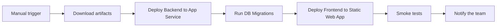

---

## 12. Local Environment Setup

### Prerequisites

| Tool | Minimum version | Verify with |
|---|---|---|
| .NET SDK | 10.0 | `dotnet --version` |
| Node.js | 22.x LTS | `node --version` |
| npm | 10.x | `npm --version` |
| Angular CLI | 19.x | `ng version` |
| Docker Desktop | Latest | `docker --version` |
| Azure CLI | Latest | `az --version` |
| Git | 2.40+ | `git --version` |

### Step-by-step Setup

```bash
# 1. Clone the repo
git clone https://github.com/{org}/legal-ai-ar.git
cd legal-ai-ar

# 2. Backend
cd backend
dotnet restore
dotnet build

# 3. Local SQL Server with Docker
docker run -e "ACCEPT_EULA=Y" -e "MSSQL_SA_PASSWORD=LocalDev123!" \
  -p 1433:1433 --name legal-ai-ar-sql \
  -d mcr.microsoft.com/mssql/server:2022-latest

# 4. Apply migrations
cd src/LegalAiAr.Api
dotnet ef database update

# 5. Configure local secrets
dotnet user-secrets set "AzureOpenAI:Endpoint" "https://xxx.openai.azure.com/"
dotnet user-secrets set "AzureOpenAI:ApiKey" "xxx"
dotnet user-secrets set "AzureAISearch:Endpoint" "https://xxx.search.windows.net"
dotnet user-secrets set "AzureAISearch:ApiKey" "xxx"

# 6. Start the API
dotnet run

# 7. Frontend (in another terminal)
cd ../../frontend
npm ci
ng serve
```

### Environment Variables (.env / appsettings)

The backend does NOT use `.env` files. It uses `appsettings.{Environment}.json` + User Secrets (dev) + Key Vault (deploy).

```json
// appsettings.Development.json
{
  "ConnectionStrings": {
    "DefaultConnection": "Server=localhost,1433;Database=LegalAiAr;User=sa;Password=LocalDev123!;TrustServerCertificate=true"
  },
  "AzureOpenAI": {
    "Endpoint": "user-secret",
    "DeploymentName": "gpt-4o",
    "EmbeddingDeploymentName": "text-embedding-3-large"
  },
  "AzureAISearch": {
    "Endpoint": "user-secret",
    "IndexLegalNorms": "idx-legal-norms-dev",
    "IndexCaseLaw": "idx-case-law-dev"
  },
  "Entra": {
    "Instance": "https://login.microsoftonline.com/",
    "TenantId": "user-secret",
    "ClientId": "user-secret",
    "Audience": "api://legal-ai-ar-dev"
  }
}
```

---

## 13. F00 Acceptance Criteria

- [ ] The monorepo is set up on GitHub with the defined structure
- [ ] The backend compiles with no errors via `dotnet build`
- [ ] The frontend compiles with no errors via `ng build`
- [ ] The backend CI pipeline runs and passes (build + tests)
- [ ] The frontend CI pipeline runs and passes (lint + build + tests)
- [ ] The CD pipeline deploys successfully to the DEV environment
- [ ] The 4 Azure resource groups are provisioned with Bicep
- [ ] Local SQL Server with Docker works and migrations apply
- [ ] Both developers can clone, install, and run the project locally in < 30 min
- [ ] The `README.md` has clear, verified setup instructions
- [ ] `.editorconfig`, ESLint, and Prettier are configured and consistent
- [ ] CODEOWNERS is configured to require reviews

---

## 14. Work Items of this Feature

| ID | Name | Type | Sprint |
|----|------|------|--------|
| F00-W01 | Comprehensive Documentation | doc | S00 |
| F00-W02 | Monorepo Setup and Backend Scaffolding | backend | S00 |
| F00-W03 | Angular 19 Frontend Scaffolding | frontend | S00 |
| F00-W04 | GitHub Actions CI Configuration | devops | S00 |
| F00-W05 | Azure Infrastructure with Bicep (IaC) | devops | S00 |
| F00-W06 | CD Deployment Pipelines Configuration | devops | S00 |
| F00-W07 | Local Environment Setup and Onboarding Guide | doc | S00 |
| F00-W08 | Code Quality Configuration (Linting, Formatting, EditorConfig) | devops | S00 |

---

## 15. Dependencies

- **Blocks:** All features (F01–F23, FT01–FT04)
- **Prerequisites:** Active Azure subscription, GitHub organization created, Entra ID tenant

---

## 16. Definition of Done

- [ ] Monorepo created with the complete structure
- [ ] Backend and frontend compile and pass tests
- [ ] CI/CD pipelines working across the 4 environments
- [ ] Azure infrastructure provisioned with Bicep
- [ ] Both devs can run the project locally
- [ ] README and onboarding guide complete and verified

---

*F00 - Development Environment and Structure — Comprehensive Documentation — Legal Ai Ar*
