# F00 - W01 - Documentacion Integral

> **Feature:** F00 - Entorno y Estructura de Desarrollo
> **Release:** 0.0 (Pre-release) | **Sprint:** S00
> **Tipo:** Documentación | **Prioridad:** Crítica (bloqueante)
> **Estimación:** 5 story points

---

## 1. Descripción General

Definición completa del entorno de desarrollo, stack tecnológico, estructura del monorepo, convenciones de código, estrategia de branching, pipelines CI/CD, provisión de ambientes Azure y configuración del entorno local de desarrollo. Esta feature es **bloqueante** para todas las demás: ningún desarrollo puede comenzar sin completar F00.

---

## 2. Stack Tecnológico

### Backend

| Componente | Tecnología | Versión |
|---|---|---|
| Runtime | .NET | 10 LTS |
| Framework | ASP.NET Core Minimal API | 10.x |
| ORM | Entity Framework Core | 10.x |
| Validación | FluentValidation | 12.x |
| Logging | Serilog + Application Insights | latest |
| Auth | Microsoft.Identity.Web | 3.x |
| AI Orchestration | Semantic Kernel | latest |
| Testing | xUnit + Moq + FluentAssertions | latest |
| API Docs | Swashbuckle (OpenAPI/Swagger) | latest |
| Mapping | Mapperly (source generator) | latest |
| Mediator | MediatR | 12.x |

### Frontend

| Componente | Tecnología | Versión |
|---|---|---|
| Framework | Angular | 19.x |
| UI Components | PwC AppKit 4 | (a definir) |
| Auth | @azure/msal-angular | 4.x |
| State Management | NgRx Signals / Angular Signals | built-in |
| HTTP | HttpClient + Interceptors | built-in |
| Formularios | Reactive Forms + validaciones custom | built-in |
| Charts | Chart.js + ng2-charts | latest |
| Grafo | Cytoscape.js + ngx-cytoscape | latest |
| Calendar | FullCalendar Angular | latest |
| Icons | Material Icons / PwC Icon set | (a definir) |
| Testing | Jest + Angular Testing Library | latest |
| E2E | Playwright | latest |
| Linting | ESLint + Prettier + angular-eslint | latest |

### Infraestructura Azure

| Servicio | Uso |
|---|---|
| Azure SQL Database | Base de datos relacional + SQL Graph |
| Azure AI Search | Índices de búsqueda semántica (normas, jurisprudencia) |
| Azure OpenAI | Modelos GPT para agentes IA y embeddings |
| Azure Key Vault | Gestión de secretos y certificados |
| Azure Storage | Blob Storage (documentos), Queue Storage (mensajes async), Table Storage (logs) |
| Azure App Service | Hosting de la API .NET 10 |
| Azure Static Web Apps | Hosting del SPA Angular 19 |
| Azure Functions | Timer triggers (boletín oficial, evaluación de plazos) |
| Azure SignalR Service | Notificaciones real-time y streaming de chat |
| Azure Application Insights | Telemetría, logging, APM |
| Microsoft Entra ID | Identity provider (auth, roles) |

### Herramientas de Desarrollo

| Herramienta | Uso |
|---|---|
| GitHub | Repositorio, Issues, Projects, PRs |
| GitHub Actions | CI/CD pipelines |
| Visual Studio 2022 / Rider | IDE Backend |
| VS Code | IDE Frontend |
| Azure Data Studio | Gestión de base de datos |
| Postman / Bruno | Testing de APIs |
| Docker Desktop | Contenedores locales (SQL Server dev) |

---

## 3. Estructura del Monorepo (basado en MVP existente)

> El repo `legal-ai-ar` ya existe y contiene un MVP funcional. La estructura se extiende agregando `docs/`, `LegalAiAr.Agents` y `LegalAiAr.AgentEvals`.

```
legal-ai-ar/                            # ← Monorepo existente
├── .github/
│   ├── workflows/                      # CI/CD (gestionado fuera del roadmap)
│   ├── ISSUE_TEMPLATE/                 # Nuevo: templates de issues
│   └── PULL_REQUEST_TEMPLATE.md        # Nuevo: template de PR
├── docs/                               # Nuevo: documentación del proyecto
│   ├── roadmap/                        # Features y Work Items
│   ├── tecnicas/                       # 9 documentos técnicos
│   └── ontologia/                      # Modelo de dominio legal
├── backend/
│   ├── src/
│   │   ├── api/
│   │   │   ├── LegalAiAr.Api/         # ✅ ASP.NET Core (Controllers → Minimal API gradual)
│   │   │   └── LegalAiAr.Application/ # ✅ CQRS, handlers, DTOs, validators
│   │   ├── shared/
│   │   │   ├── LegalAiAr.Core/        # ✅ Entidades, enums, interfaces
│   │   │   └── LegalAiAr.Infrastructure/ # ✅ EF Core, AI Search, Azure clients
│   │   ├── workers/                    # ✅ 6 BackgroundService workers (pipeline)
│   │   │   ├── LegalAiAr.Worker.Discoverer/
│   │   │   ├── LegalAiAr.Worker.Fetcher/
│   │   │   ├── LegalAiAr.Worker.Parser/
│   │   │   ├── LegalAiAr.Worker.Enrichment/
│   │   │   ├── LegalAiAr.Worker.Persister/
│   │   │   └── LegalAiAr.Worker.Indexer/
│   │   └── tools/                      # ✅ 10 herramientas CLI auxiliares
│   ├── tests/
│   │   ├── LegalAiAr.Api.Tests/        # ✅ Tests existentes
│   │   ├── LegalAiAr.Application.Tests/ # ✅
│   │   ├── LegalAiAr.Core.Tests/       # ✅
│   │   ├── LegalAiAr.Infrastructure.Tests/ # ✅
│   │   └── LegalAiAr.AgentEvals/       # Nuevo: evaluaciones de agentes IA
│   ├── LegalAiAr.sln                   # ✅ Solución existente (agregar nuevos proyectos)
│   ├── Directory.Build.props           # ✅
│   ├── Directory.Packages.props        # ✅ Central Package Management
│   └── global.json                     # ✅ .NET 10
├── frontend/
│   ├── src/
│   │   ├── app/
│   │   │   ├── core/               # Servicios singleton, guards, interceptors
│   │   │   │   ├── auth/
│   │   │   │   ├── interceptors/
│   │   │   │   ├── guards/
│   │   │   │   ├── services/
│   │   │   │   └── models/
│   │   │   ├── shared/             # Componentes, pipes, directivas reutilizables
│   │   │   │   ├── components/
│   │   │   │   ├── directives/
│   │   │   │   ├── pipes/
│   │   │   │   └── utils/
│   │   │   ├── features/           # Módulos por feature (lazy loaded)
│   │   │   │   ├── dashboard/
│   │   │   │   ├── normas/
│   │   │   │   ├── jurisprudencia/
│   │   │   │   ├── expedientes/
│   │   │   │   ├── plazos/
│   │   │   │   ├── chat/
│   │   │   │   ├── calendario/
│   │   │   │   ├── analisis-riesgo/
│   │   │   │   ├── reportes/
│   │   │   │   ├── admin/
│   │   │   │   └── novedades/
│   │   │   ├── layout/             # Shell, sidebar, navbar, footer
│   │   │   ├── app.component.ts
│   │   │   ├── app.config.ts
│   │   │   └── app.routes.ts
│   │   ├── assets/
│   │   ├── environments/
│   │   │   ├── environment.ts
│   │   │   ├── environment.dev.ts
│   │   │   ├── environment.qa.ts
│   │   │   ├── environment.staging.ts
│   │   │   └── environment.prod.ts
│   │   ├── styles/
│   │   │   ├── _variables.scss
│   │   │   ├── _mixins.scss
│   │   │   ├── _typography.scss
│   │   │   └── styles.scss
│   │   ├── index.html
│   │   └── main.ts
│   ├── angular.json
│   ├── tsconfig.json
│   ├── tsconfig.app.json
│   ├── tsconfig.spec.json
│   ├── jest.config.ts
│   ├── playwright.config.ts
│   ├── .eslintrc.json
│   ├── .prettierrc
│   └── package.json
├── infra/
│   ├── bicep/                      # IaC con Azure Bicep
│   │   ├── main.bicep              # Orquestador principal
│   │   ├── modules/
│   │   │   ├── sql.bicep
│   │   │   ├── search.bicep
│   │   │   ├── openai.bicep
│   │   │   ├── keyvault.bicep
│   │   │   ├── storage.bicep
│   │   │   ├── appservice.bicep
│   │   │   ├── staticwebapp.bicep
│   │   │   ├── functions.bicep
│   │   │   ├── signalr.bicep
│   │   │   └── appinsights.bicep
│   │   └── parameters/
│   │       ├── dev.bicepparam
│   │       ├── qa.bicepparam
│   │       ├── staging.bicepparam
│   │       └── prod.bicepparam
│   └── scripts/
│       ├── setup-local.ps1         # Setup entorno local Windows
│       ├── setup-local.sh          # Setup entorno local Linux/Mac
│       └── seed-db.sql             # Seed data inicial
├── .gitignore
├── .editorconfig
├── README.md
└── LICENSE
```

---

## 4. Diagrama de Arquitectura General

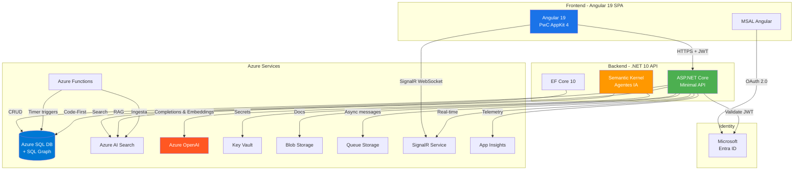

---

## 5. Ambientes de Deployment

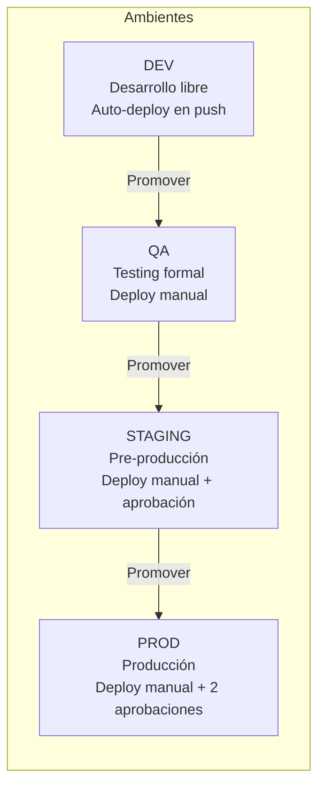

| Ambiente | Propósito | Trigger de Deploy | Aprobaciones | Azure Resource Group |
|---|---|---|---|---|
| **DEV** | Desarrollo libre, integración continua | Push a `main` | Ninguna | `rg-legal-ai-ar-dev` |
| **QA** | Testing formal por QA/product owner | Manual (workflow dispatch) | 1 (Tech Lead) | `rg-legal-ai-ar-qa` |
| **STAGING** | Pre-producción, demo a stakeholders | Manual (workflow dispatch) | 1 (Tech Lead) | `rg-legal-ai-ar-staging` |
| **PROD** | Producción | Manual (workflow dispatch) | 2 (Tech Lead + Product Owner) | `rg-legal-ai-ar-prod` |

### Naming Convention de Recursos Azure

```
{servicio}-legal-ai-ar-{ambiente}
```

Ejemplos: `sql-legal-ai-ar-dev`, `app-legal-ai-ar-prod`, `func-legal-ai-ar-qa`, `srch-legal-ai-ar-staging`

---

## 6. Estrategia de Branching (GitHub Flow)

```mermaid
gitgraph
    commit id: "initial"
    branch feature/F01-W02-entra-id-jwt
    checkout feature/F01-W02-entra-id-jwt
    commit id: "feat: add Entra ID config"
    commit id: "feat: add JWT validation"
    checkout main
    merge feature/F01-W02-entra-id-jwt id: "PR #1 merged"
    branch feature/F01-W04-msal-angular
    checkout feature/F01-W04-msal-angular
    commit id: "feat: MSAL setup"
    checkout main
    merge feature/F01-W04-msal-angular id: "PR #2 merged"
    branch hotfix/fix-token-refresh
    checkout hotfix/fix-token-refresh
    commit id: "fix: token refresh"
    checkout main
    merge hotfix/fix-token-refresh id: "PR #3 merged"
```

### Convención de Ramas

```
feature/{FXX}-{WXX}-{descripcion-corta}    → Nuevas funcionalidades
bugfix/{FXX}-{descripcion-corta}            → Corrección de bugs
hotfix/{descripcion-corta}                  → Fixes urgentes a producción
chore/{descripcion-corta}                   → Mantenimiento, refactor, deps
```

### Reglas de PRs

- Todo merge a `main` requiere PR con al menos 1 review aprobado
- CI debe pasar (build + tests) antes de poder mergear
- Squash merge como estrategia por defecto
- Título del PR sigue Conventional Commits: `feat(F01): add JWT validation middleware`

---

## 7. Convenciones de Código

### Conventional Commits

```
feat(F01): add JWT validation middleware
fix(F03): correct search index scoring
chore: update EF Core to 10.0.1
docs(F00): add onboarding guide
test(F01): add auth integration tests
refactor(F05): extract graph service
```

### Backend (.NET)

- **Naming:** PascalCase para clases, métodos, propiedades. camelCase para variables locales y parámetros
- **Async:** Toda operación I/O es async. Sufijo `Async` en métodos
- **Nullable:** Nullable reference types habilitado (`<Nullable>enable</Nullable>`)
- **Responses:** Envelope estándar `ApiResponse<T>` con `{data, errors[], meta}`
- **Exceptions:** Global exception handler middleware, nunca try-catch en controllers
- **Validación:** FluentValidation en pipeline de MediatR, nunca en controllers
- **Logging:** Serilog structured logging con correlation ID en cada request

### Frontend (Angular)

- **Naming:** kebab-case para archivos, PascalCase para clases, camelCase para variables
- **Standalone:** Todos los componentes son standalone (Angular 19 default)
- **Signals:** Preferir Angular Signals sobre RxJS para estado local de componentes
- **RxJS:** Usar solo para streams HTTP y eventos async complejos
- **Lazy Loading:** Cada feature es un módulo lazy-loaded con sus propias rutas
- **Barrel exports:** `index.ts` en cada carpeta de feature para exports limpios
- **Error handling:** Global error handler + toast notifications

### Estructura de un Feature Module (Angular)

```
features/normas/
├── components/
│   ├── norma-list/
│   │   ├── norma-list.component.ts
│   │   ├── norma-list.component.html
│   │   └── norma-list.component.scss
│   └── norma-detail/
├── services/
│   └── normas.service.ts
├── models/
│   └── norma.model.ts
├── normas.routes.ts
└── index.ts
```

---

## 8. Arquitectura de la Knowledge Base

### 8.1 Stores que componen la KB

La Knowledge Base no vive en un solo almacén. Cada tipo de dato se persiste en el store más adecuado según sus patrones de acceso:

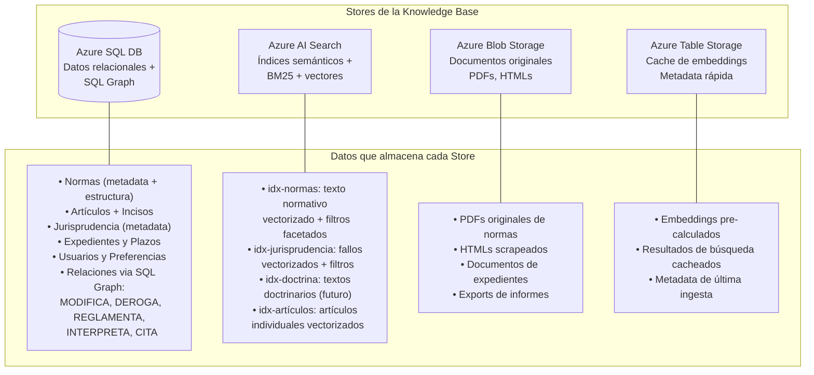

| Store | Tecnología | Qué almacena | Patrón de acceso |
|---|---|---|---|
| **Relacional + Grafo** | Azure SQL DB (SQL Graph) | Entidades estructuradas, relaciones entre normas, expedientes, plazos | CRUD, joins, traversal de grafo |
| **Búsqueda semántica** | Azure AI Search | Textos vectorizados de normas, jurisprudencia, artículos | Hybrid search (BM25 + vectors), filtros facetados |
| **Documentos originales** | Azure Blob Storage | PDFs, HTMLs, archivos adjuntos | Lectura por URL, streaming |
| **Cache / Metadata** | Azure Table Storage | Embeddings pre-calculados, estado de ingesta, cache | Key-value lookup rápido |
| **Colas async** | Azure Queue Storage | Mensajes de ingesta, alertas de plazos, notificaciones | Productor-consumidor |

### 8.2 Modelo de Datos Completo (Azure SQL + SQL Graph)

Derivado de la ontología legal argentina. Se divide en 4 grupos: **Core Legal**, **Procesal/Gestión**, **Identidad** y **Grafo de Relaciones**.

#### 8.2.1 Core Legal — Normas y Jurisprudencia

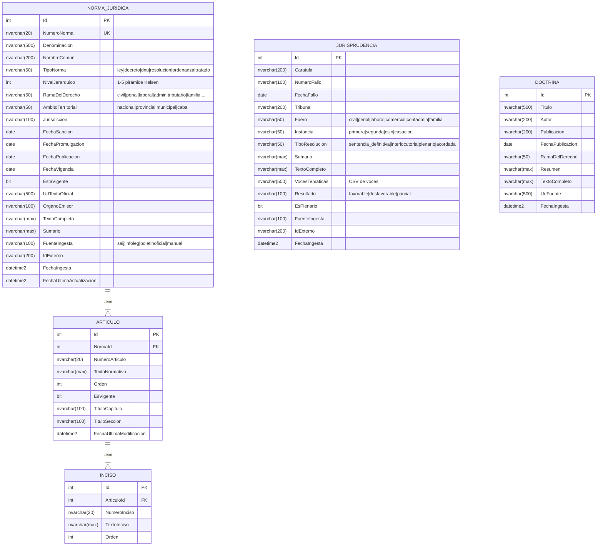

#### 8.2.2 SQL Graph — Relaciones entre Entidades Legales

SQL Graph de Azure SQL permite modelar las relaciones N:N entre normas, artículos y jurisprudencia como edges tipados, habilitando traversal eficiente.

**Nodos (NODE tables):**

```sql
-- Nodos (ya son las tablas relacionales anteriores, marcadas como NODE)
CREATE TABLE NormaJuridica (...) AS NODE;
CREATE TABLE Articulo (...) AS NODE;
CREATE TABLE Jurisprudencia (...) AS NODE;
CREATE TABLE Doctrina (...) AS NODE;
```

**Edges (relaciones del grafo):**

```sql
-- Norma → Norma
CREATE TABLE Modifica AS EDGE;          -- NormaA modifica a NormaB
CREATE TABLE Deroga AS EDGE;            -- NormaA deroga a NormaB
CREATE TABLE Reglamenta AS EDGE;        -- Decreto reglamenta Ley
CREATE TABLE Complementa AS EDGE;       -- NormaA complementa NormaB

-- Jurisprudencia → Norma/Artículo
CREATE TABLE Interpreta AS EDGE;        -- Fallo interpreta Artículo
CREATE TABLE Aplica AS EDGE;            -- Fallo aplica Norma
CREATE TABLE CitaJurisprudencia AS EDGE; -- Fallo cita otro Fallo

-- Artículo → Artículo
CREATE TABLE Referencia AS EDGE;        -- Art. X referencia a Art. Y

-- Doctrina → Norma/Jurisprudencia
CREATE TABLE Comenta AS EDGE;           -- Doctrina comenta Norma o Fallo
```

**Propiedades de los Edges:**

| Edge | Propiedades | Ejemplo |
|---|---|---|
| `Modifica` | `FechaModificacion`, `TipoModificacion` (parcial/total), `ArticulosAfectados` | Ley 27.077 modifica art. 1 de Ley 26.994 |
| `Deroga` | `FechaDerogacion`, `TipoDerogacion` (expresa/tácita) | Ley 26.994 deroga Ley 340 (Código Civil) |
| `Reglamenta` | `FechaReglamentacion` | Decreto 1759/72 reglamenta Ley 19.549 |
| `Interpreta` | `CriterioInterpretativo`, `EsVinculante` | CSJN interpreta art. 14 bis CN |
| `Aplica` | `ResultadoAplicacion` | Fallo aplica Ley 20.744 art. 245 |
| `CitaJurisprudencia` | `ContextoCita` | Fallo cita precedente de CSJN |

**Consulta de traversal ejemplo:**

```sql
-- ¿Qué fallos interpretan el art. 245 de la LCT?
SELECT j.Caratula, j.FechaFallo, j.Tribunal
FROM Jurisprudencia j, Interpreta i, Articulo a, NormaJuridica n
WHERE MATCH(j-(i)->a)
  AND a.NormaId = n.Id
  AND n.NumeroNorma = '20.744'
  AND a.NumeroArticulo = '245';

-- Cadena de modificaciones de una norma (hasta 5 niveles)
SELECT n1.Denominacion, n2.Denominacion AS ModificadaPor, n3.Denominacion AS AsuVezModificadaPor
FROM NormaJuridica n1, Modifica m1, NormaJuridica n2, Modifica m2, NormaJuridica n3
WHERE MATCH(n1<-(m1)-n2<-(m2)-n3);
```

#### 8.2.3 Procesal y Gestión

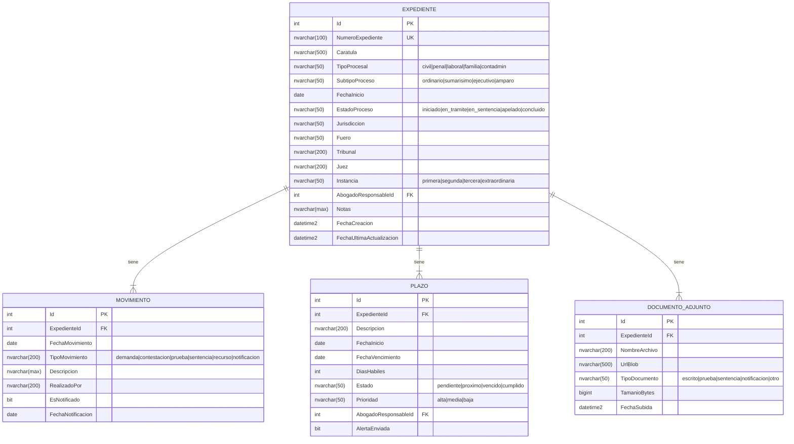

#### 8.2.4 Identidad y Sistema

```sql
-- Usuarios del sistema (referencia a Entra ID)
CREATE TABLE UsuarioPreferencias (
    Id INT PRIMARY KEY IDENTITY,
    EntraObjectId NVARCHAR(128) NOT NULL UNIQUE,
    Email NVARCHAR(256) NOT NULL,
    NombreCompleto NVARCHAR(200),
    Rol NVARCHAR(50) NOT NULL, -- abogado | administrativo
    FechaUltimoAcceso DATETIME2,
    Preferencias NVARCHAR(MAX) -- JSON
);

-- Conversaciones de chat con agentes
CREATE TABLE Conversacion (
    Id INT PRIMARY KEY IDENTITY,
    UsuarioId INT FK REFERENCES UsuarioPreferencias(Id),
    AgenteId NVARCHAR(50), -- normativo | jurisprudencial | procesal
    Titulo NVARCHAR(200),
    FechaCreacion DATETIME2,
    FechaUltimoMensaje DATETIME2
);

CREATE TABLE MensajeChat (
    Id INT PRIMARY KEY IDENTITY,
    ConversacionId INT FK REFERENCES Conversacion(Id),
    Rol NVARCHAR(20), -- user | assistant
    Contenido NVARCHAR(MAX),
    FuentesCitadas NVARCHAR(MAX), -- JSON array de IDs de normas/fallos
    TokensUsados INT,
    FechaCreacion DATETIME2
);

-- Análisis de riesgo
CREATE TABLE AnalisisRiesgo (
    Id INT PRIMARY KEY IDENTITY,
    UsuarioId INT FK REFERENCES UsuarioPreferencias(Id),
    DescripcionCaso NVARCHAR(MAX),
    ScoreRiesgo DECIMAL(5,2),
    NivelRiesgo NVARCHAR(20), -- bajo | medio | alto | critico
    AnalisisCompleto NVARCHAR(MAX), -- JSON estructurado
    NormasCitadas NVARCHAR(MAX), -- JSON array
    JurisprudenciaCitada NVARCHAR(MAX), -- JSON array
    FechaCreacion DATETIME2
);

-- Auditoría
CREATE TABLE AuditLog (
    Id BIGINT PRIMARY KEY IDENTITY,
    UsuarioId INT,
    Accion NVARCHAR(100),
    Entidad NVARCHAR(100),
    EntidadId INT,
    DatosAntes NVARCHAR(MAX),
    DatosDespues NVARCHAR(MAX),
    IpAddress NVARCHAR(45),
    FechaAccion DATETIME2 DEFAULT GETUTCDATE()
);
```

---

## 9. Estrategia de RAG: GraphRAG + Hybrid Search

### 9.1 Visión General

El sistema usa una estrategia de RAG en capas que combina **Hybrid Search** (BM25 + vectores) con **Graph-enhanced retrieval** para enriquecer el contexto con relaciones legales que la búsqueda semántica sola no capturaría.

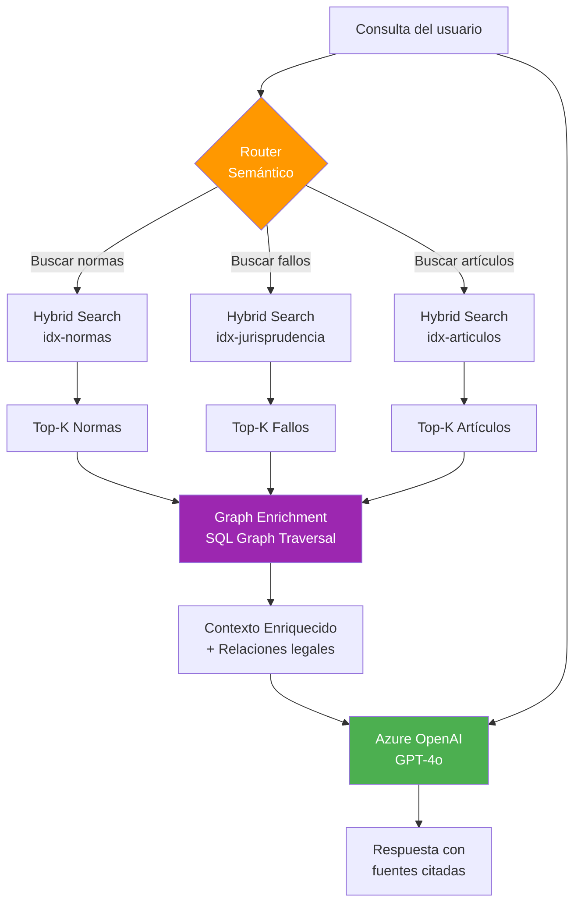

### 9.2 Tipos de RAG por Agente

| Agente | Tipo de RAG | Qué busca | Graph Enrichment |
|---|---|---|---|
| **Normativo** | Hybrid Search + GraphRAG | Normas y artículos relevantes | Cadena de modificaciones, normas que derogan/reglamentan, artículos relacionados |
| **Jurisprudencial** | Hybrid Search + GraphRAG | Fallos judiciales relevantes | Normas que el fallo aplica/interpreta, fallos citados por otros fallos, artículos interpretados |
| **Procesal** | SQL Query + Hybrid | Expedientes, plazos, calendario de días hábiles | Plazos vinculados al expediente, normas procesales aplicables |

### 9.3 Hybrid Search — Configuración de Azure AI Search

Cada índice usa **Hybrid Search** que combina BM25 (keyword) con búsqueda vectorial en un solo query, usando Reciprocal Rank Fusion (RRF) para combinar scores.

#### Índice `idx-normas`

```json
{
  "name": "idx-normas",
  "fields": [
    { "name": "id", "type": "Edm.String", "key": true },
    { "name": "normaId", "type": "Edm.Int32", "filterable": true },
    { "name": "numeroNorma", "type": "Edm.String", "searchable": true, "filterable": true },
    { "name": "denominacion", "type": "Edm.String", "searchable": true },
    { "name": "tipoNorma", "type": "Edm.String", "filterable": true, "facetable": true },
    { "name": "ramaDelDerecho", "type": "Edm.String", "filterable": true, "facetable": true },
    { "name": "ambitoTerritorial", "type": "Edm.String", "filterable": true, "facetable": true },
    { "name": "estaVigente", "type": "Edm.Boolean", "filterable": true },
    { "name": "fechaPublicacion", "type": "Edm.DateTimeOffset", "filterable": true, "sortable": true },
    { "name": "organoEmisor", "type": "Edm.String", "filterable": true, "facetable": true },
    { "name": "textoCompleto", "type": "Edm.String", "searchable": true },
    { "name": "sumario", "type": "Edm.String", "searchable": true },
    { "name": "embedding", "type": "Collection(Edm.Single)", "dimensions": 3072, "vectorSearchProfile": "hybrid-profile" }
  ],
  "vectorSearch": {
    "algorithms": [{ "name": "hnsw-algo", "kind": "hnsw", "parameters": { "m": 4, "efConstruction": 400, "efSearch": 500 } }],
    "profiles": [{ "name": "hybrid-profile", "algorithm": "hnsw-algo" }]
  },
  "scoringProfiles": [{
    "name": "boost-vigentes",
    "text": { "weights": { "denominacion": 3, "sumario": 2, "textoCompleto": 1 } },
    "functions": [{
      "type": "freshness",
      "fieldName": "fechaPublicacion",
      "boost": 2,
      "parameters": { "boostingDuration": "P365D" }
    }]
  }]
}
```

#### Índice `idx-jurisprudencia`

```json
{
  "name": "idx-jurisprudencia",
  "fields": [
    { "name": "id", "type": "Edm.String", "key": true },
    { "name": "jurisprudenciaId", "type": "Edm.Int32", "filterable": true },
    { "name": "caratula", "type": "Edm.String", "searchable": true },
    { "name": "tribunal", "type": "Edm.String", "filterable": true, "facetable": true },
    { "name": "fuero", "type": "Edm.String", "filterable": true, "facetable": true },
    { "name": "instancia", "type": "Edm.String", "filterable": true, "facetable": true },
    { "name": "fechaFallo", "type": "Edm.DateTimeOffset", "filterable": true, "sortable": true },
    { "name": "esPlenario", "type": "Edm.Boolean", "filterable": true },
    { "name": "vocesTematicas", "type": "Collection(Edm.String)", "filterable": true, "facetable": true },
    { "name": "sumario", "type": "Edm.String", "searchable": true },
    { "name": "textoCompleto", "type": "Edm.String", "searchable": true },
    { "name": "embedding", "type": "Collection(Edm.Single)", "dimensions": 3072, "vectorSearchProfile": "hybrid-profile" }
  ]
}
```

#### Índice `idx-articulos`

```json
{
  "name": "idx-articulos",
  "fields": [
    { "name": "id", "type": "Edm.String", "key": true },
    { "name": "articuloId", "type": "Edm.Int32", "filterable": true },
    { "name": "normaId", "type": "Edm.Int32", "filterable": true },
    { "name": "normaDenominacion", "type": "Edm.String", "searchable": true },
    { "name": "numeroArticulo", "type": "Edm.String", "filterable": true },
    { "name": "textoNormativo", "type": "Edm.String", "searchable": true },
    { "name": "tituloCapitulo", "type": "Edm.String", "searchable": true, "filterable": true },
    { "name": "esVigente", "type": "Edm.Boolean", "filterable": true },
    { "name": "embedding", "type": "Collection(Edm.Single)", "dimensions": 3072, "vectorSearchProfile": "hybrid-profile" }
  ]
}
```

### 9.4 GraphRAG — Enrichment Pipeline

Después de obtener los Top-K resultados de Hybrid Search, el sistema enriquece el contexto con relaciones del grafo:

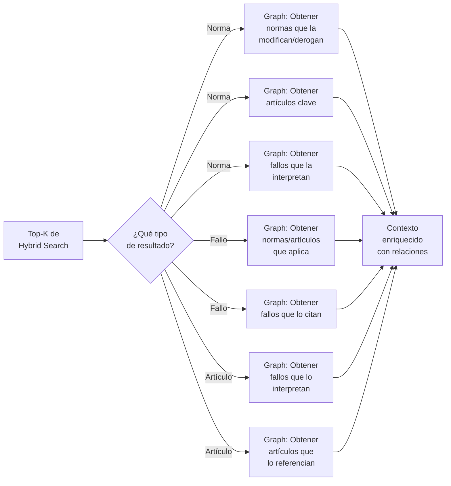

**Ejemplo de enrichment para una consulta sobre despido sin causa:**

1. Hybrid Search retorna: Ley 20.744 (LCT), art. 245, art. 232
2. Graph Enrichment agrega:
   - `Modifica`: Ley 25.877 modificó art. 245 en 2004
   - `Interpreta`: 15 fallos de CNAT interpretando art. 245 (top 3 por relevancia)
   - `Reglamenta`: Decreto 1694/06 reglamenta base salarial
   - `Referencia`: art. 245 referencia a art. 232 (preaviso) y art. 233 (integración mes)

### 9.5 Embeddings

| Aspecto | Configuración |
|---|---|
| **Modelo** | `text-embedding-3-large` (Azure OpenAI) |
| **Dimensiones** | 3072 |
| **Chunking de normas** | Por artículo individual (unidad mínima semántica legal) |
| **Chunking de jurisprudencia** | Por secciones: hechos, fundamentos, resolución (separados con metadata) |
| **Chunking de doctrina** | Chunks de ~500 tokens con overlap de 100 |
| **Batch processing** | 100 embeddings por batch, rate limiting respetado |
| **Pre-cálculo** | Los embeddings se generan en el pipeline de ingesta y se almacenan en AI Search + Table Storage (cache) |

---

## 10. Pipelines de Ingesta

### 10.1 Arquitectura de Ingesta

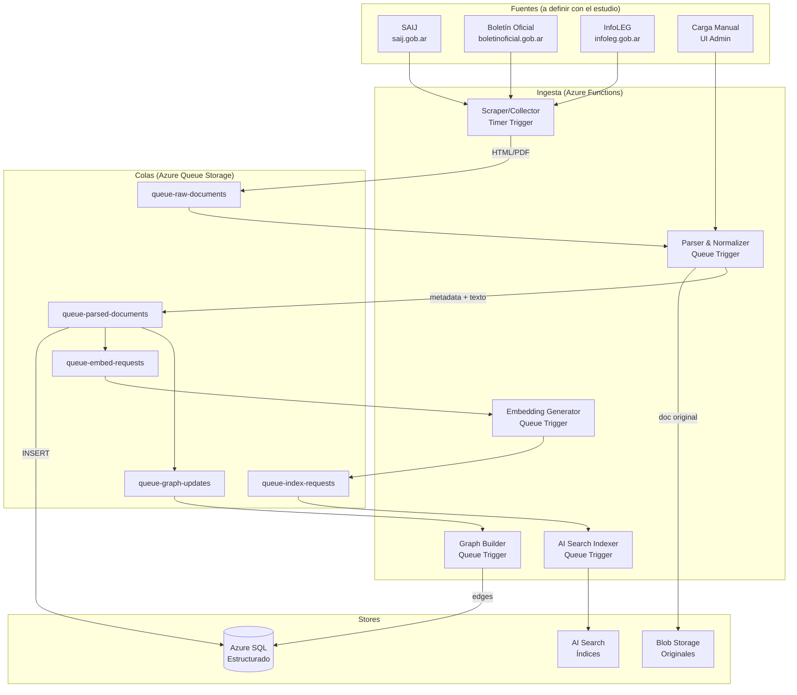

### 10.2 Tipos de Ingesta

| Tipo | Trigger | Frecuencia | Fuente | Qué ingesta |
|---|---|---|---|---|
| **Boletín Oficial** | Timer (diario 8am) | Diaria | boletinoficial.gob.ar | Nuevas normas publicadas |
| **SAIJ Normas** | Timer (semanal) | Semanal | saij.gob.ar | Normas actualizadas/nuevas |
| **SAIJ Jurisprudencia** | Timer (semanal) | Semanal | saij.gob.ar | Fallos nuevos |
| **InfoLEG** | Timer (semanal) | Semanal | infoleg.gob.ar | Textos consolidados |
| **Carga manual** | HTTP / UI Admin | On demand | Usuarios | Normas provinciales, doctrina |
| **Re-indexación** | Manual | Según necesidad | Todos los stores | Reconstrucción de índices |

> **Nota:** Las fuentes específicas se definirán con el estudio de abogados. La arquitectura es extensible: agregar una nueva fuente requiere solo un nuevo Scraper/Collector en Azure Functions.

### 10.3 Pipeline de Procesamiento por Documento

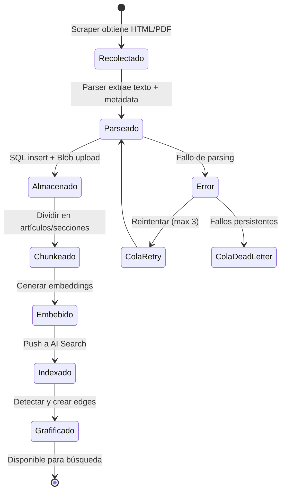

**Detalle de cada paso:**

1. **Recolectar:** Azure Function con Timer Trigger scrape la fuente, descarga HTML/PDF, guarda en `queue-raw-documents`
2. **Parsear:** Extrae texto limpio, metadata (número, fecha, tipo, órgano), estructura (artículos, incisos). Para PDFs usa Azure Document Intelligence
3. **Almacenar:** Inserta en Azure SQL (tablas relacionales) + sube original a Blob Storage
4. **Chunkear:** Divide en unidades semánticas (artículos para normas, secciones para fallos)
5. **Embeber:** Genera embeddings con `text-embedding-3-large` en batch
6. **Indexar:** Pushea documentos + embeddings a Azure AI Search
7. **Grafificar:** Analiza el texto para detectar referencias a otras normas/artículos y crea edges en SQL Graph

### 10.4 Detección Automática de Relaciones (Graph Builder)

El Graph Builder analiza el texto de cada norma/fallo para detectar relaciones y crear edges:

| Patrón detectado | Edge creado | Ejemplo |
|---|---|---|
| "Modifícase el artículo X de la Ley Y" | `Modifica` | Ley 27.077 → art. 1 Ley 26.994 |
| "Derógase la Ley X" | `Deroga` | Ley 26.994 → Ley 340 |
| "Reglamentación de la Ley X" | `Reglamenta` | Decreto 1759/72 → Ley 19.549 |
| "Conforme lo dispuesto por el art. X" | `Referencia` | Art. 245 → Art. 232 LCT |
| Fallo cita "art. X de la Ley Y" | `Aplica` / `Interpreta` | Fallo → Art. 245 Ley 20.744 |
| Fallo cita otro fallo (carátula + fecha) | `CitaJurisprudencia` | Fallo A → Fallo B |

La detección usa una combinación de regex patterns para los casos simples y Azure OpenAI para los casos ambiguos, con validación humana en un queue de revisión.

---

## 11. CI/CD Pipelines (GitHub Actions)

> *(Nota: las secciones anteriores 8-10 cubren la arquitectura de la KB. Las secciones originales de CI/CD y entorno local se mantienen a continuación.)*

### CI Backend (`ci-backend.yml`)

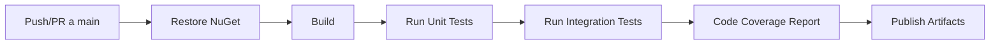

**Trigger:** Push a `main` o PR targeting `main` con cambios en `backend/`

**Steps:**
1. Checkout + setup .NET 10
2. `dotnet restore`
3. `dotnet build --no-restore -c Release`
4. `dotnet test --no-build -c Release --collect:"XPlat Code Coverage"`
5. Upload coverage report
6. `dotnet publish -c Release -o ./publish`
7. Upload build artifact

### CI Frontend (`ci-frontend.yml`)

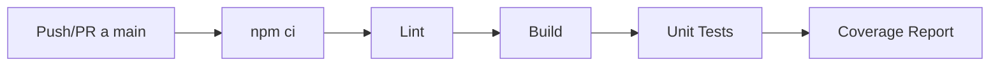

**Trigger:** Push a `main` o PR targeting `main` con cambios en `frontend/`

**Steps:**
1. Checkout + setup Node 22
2. `npm ci`
3. `npm run lint`
4. `npm run build -- --configuration=production`
5. `npm run test -- --coverage`
6. Upload coverage report
7. Upload build artifact

### CD (`cd-{env}.yml`)

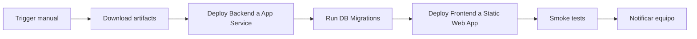

---

## 12. Configuración del Entorno Local

### Prerequisitos

| Herramienta | Versión mínima | Verificar con |
|---|---|---|
| .NET SDK | 10.0 | `dotnet --version` |
| Node.js | 22.x LTS | `node --version` |
| npm | 10.x | `npm --version` |
| Angular CLI | 19.x | `ng version` |
| Docker Desktop | Latest | `docker --version` |
| Azure CLI | Latest | `az --version` |
| Git | 2.40+ | `git --version` |

### Setup paso a paso

```bash
# 1. Clonar el repo
git clone https://github.com/{org}/legal-ai-ar.git
cd legal-ai-ar

# 2. Backend
cd backend
dotnet restore
dotnet build

# 3. SQL Server local con Docker
docker run -e "ACCEPT_EULA=Y" -e "MSSQL_SA_PASSWORD=LocalDev123!" \
  -p 1433:1433 --name legal-ai-ar-sql \
  -d mcr.microsoft.com/mssql/server:2022-latest

# 4. Aplicar migraciones
cd src/LegalAiAr.Api
dotnet ef database update

# 5. Configurar secretos locales
dotnet user-secrets set "AzureOpenAI:Endpoint" "https://xxx.openai.azure.com/"
dotnet user-secrets set "AzureOpenAI:ApiKey" "xxx"
dotnet user-secrets set "AzureAISearch:Endpoint" "https://xxx.search.windows.net"
dotnet user-secrets set "AzureAISearch:ApiKey" "xxx"

# 6. Levantar API
dotnet run

# 7. Frontend (en otra terminal)
cd ../../frontend
npm ci
ng serve
```

### Variables de Entorno (.env / appsettings)

El backend NO usa archivos `.env`. Se usan `appsettings.{Environment}.json` + User Secrets (dev) + Key Vault (deploy).

```json
// appsettings.Development.json
{
  "ConnectionStrings": {
    "DefaultConnection": "Server=localhost,1433;Database=LegalAiAr;User=sa;Password=LocalDev123!;TrustServerCertificate=true"
  },
  "AzureOpenAI": {
    "Endpoint": "user-secret",
    "DeploymentName": "gpt-4o",
    "EmbeddingDeploymentName": "text-embedding-3-large"
  },
  "AzureAISearch": {
    "Endpoint": "user-secret",
    "IndexNormas": "idx-normas-dev",
    "IndexJurisprudencia": "idx-jurisprudencia-dev"
  },
  "Entra": {
    "Instance": "https://login.microsoftonline.com/",
    "TenantId": "user-secret",
    "ClientId": "user-secret",
    "Audience": "api://legal-ai-ar-dev"
  }
}
```

---

## 13. Criterios de Aceptación de F00

- [ ] El repo monorepo está creado en GitHub con la estructura definida
- [ ] El backend compila sin errores con `dotnet build`
- [ ] El frontend compila sin errores con `ng build`
- [ ] El pipeline CI backend ejecuta y pasa (build + tests)
- [ ] El pipeline CI frontend ejecuta y pasa (lint + build + tests)
- [ ] El pipeline CD despliega exitosamente al ambiente DEV
- [ ] Los 4 resource groups de Azure están provisionados con Bicep
- [ ] SQL Server local con Docker funciona y las migraciones se aplican
- [ ] Ambos desarrolladores pueden clonar, instalar y levantar el proyecto localmente en < 30 min
- [ ] El `README.md` tiene instrucciones de setup claras y verificadas
- [ ] `.editorconfig`, ESLint y Prettier están configurados y consistentes
- [ ] CODEOWNERS está configurado para requerir reviews

---

## 14. Work Items de esta Feature

| ID | Nombre | Tipo | Sprint |
|----|--------|------|--------|
| F00-W01 | Documentación Integral | doc | S00 |
| F00-W02 | Setup Monorepo y Scaffolding Backend .NET 10 | backend | S00 |
| F00-W03 | Scaffolding Frontend Angular 19 | frontend | S00 |
| F00-W04 | Configuración CI - GitHub Actions | devops | S00 |
| F00-W05 | Infraestructura Azure con Bicep (IaC) | devops | S00 |
| F00-W06 | Configuración CD - Pipelines de Deploy | devops | S00 |
| F00-W07 | Setup Entorno Local y Onboarding Guide | doc | S00 |
| F00-W08 | Configuración de Calidad de Código (Linting, Formatting, EditorConfig) | devops | S00 |

---

## 15. Dependencias

- **Bloquea:** Todas las features (F01–F23, FT01–FT04)
- **Prerrequisitos:** Suscripción Azure activa, organización GitHub creada, tenant Entra ID

---

## 16. Definition of Done

- [ ] Monorepo creado con estructura completa
- [ ] Backend y frontend compilan y pasan tests
- [ ] CI/CD pipelines funcionando en los 4 ambientes
- [ ] Infraestructura Azure provisionada con Bicep
- [ ] Ambos devs pueden levantar el proyecto localmente
- [ ] README y onboarding guide completos y verificados

---

*F00 - Entorno y Estructura de Desarrollo — Documentación integral — Legal Ai Ar*
