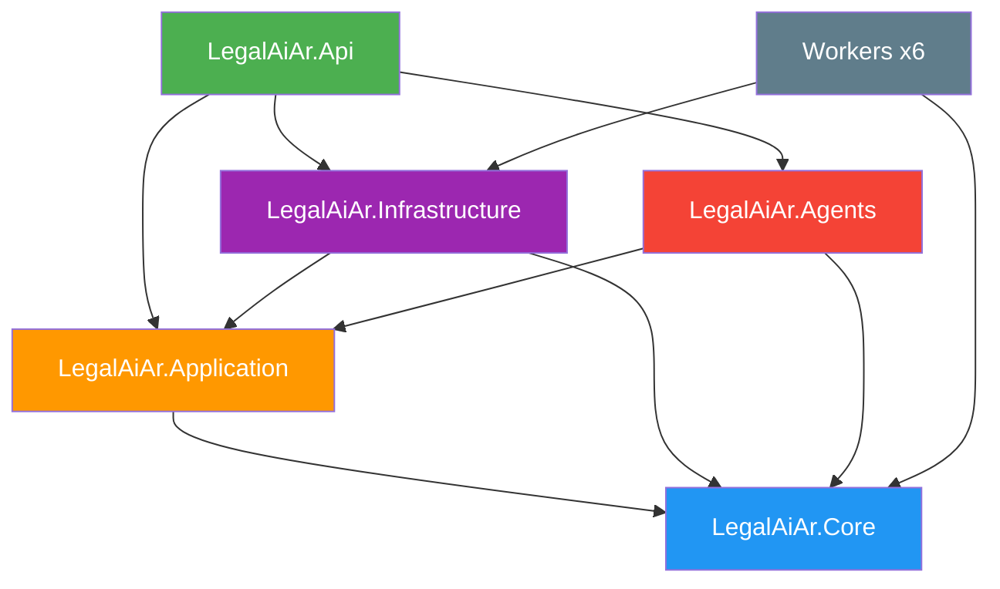

# F00 - W02 - Monorepo Setup and Backend Scaffolding

> **Feature:** F00 - Development Environment and Structure
> **Release:** 0.0 | **Sprint:** S00
> **Type:** backend | **Priority:** Critical (blocking)
> **Estimate:** 5 story points
> **Assignable to:** Backend Dev

---

## Description

Restructure the existing `legal-ai-ar` monorepo to incorporate the `docs/` folder with all the project documentation, create the new `LegalAiAr.Agents` project (Semantic Kernel), and the evaluation project `LegalAiAr.AgentEvals`. No new repo is created — the existing one is evolved.

---

## Current Monorepo State (MVP)

```
legal-ai-ar/
├── backend/
│   ├── src/
│   │   ├── api/
│   │   │   ├── LegalAiAr.Api/           # ✅ ASP.NET Core 10 (Controllers)
│   │   │   └── LegalAiAr.Application/   # ✅ CQRS, handlers, services
│   │   ├── shared/
│   │   │   ├── LegalAiAr.Core/          # ✅ Entities, enums, interfaces
│   │   │   └── LegalAiAr.Infrastructure/ # ✅ EF Core, Azure services, AI
│   │   ├── workers/                      # ✅ 6 BackgroundService workers
│   │   └── tools/                        # ✅ 10 auxiliary CLI tools
│   ├── tests/                            # ✅ 8 test projects
│   ├── LegalAiAr.sln                     # ✅ Existing solution
│   ├── Directory.Build.props             # ✅
│   ├── Directory.Packages.props          # ✅ Central Package Management
│   └── global.json                       # ✅ .NET 10
├── frontend/                             # ✅ Angular 19 SPA
└── README.md                             # ✅
```

---

## Tasks

### Folder structure

- [ ] Create the `docs/` folder at the repo root
- [ ] Move the project documentation to `docs/` (roadmap, technical, ontology)
- [ ] Add `.github/ISSUE_TEMPLATE/` with templates (bug_report, feature_request, work_item)
- [ ] Add `.github/PULL_REQUEST_TEMPLATE.md`

### New project: LegalAiAr.Agents

- [ ] Create the `LegalAiAr.Agents` project (Class Library) in `backend/src/shared/`
- [ ] Configure the internal structure: `Plugins/`, `Prompts/`, `Orchestration/`
- [ ] Add a reference to `LegalAiAr.Application` and `LegalAiAr.Core`
- [ ] Add a reference from `LegalAiAr.Api` to `LegalAiAr.Agents`
- [ ] Install the Semantic Kernel NuGet packages
- [ ] Add the project to `LegalAiAr.sln`

### New project: LegalAiAr.AgentEvals

- [ ] Create the `LegalAiAr.AgentEvals` project in `backend/tests/`
- [ ] Configure the structure for the golden set and evaluations
- [ ] Add the project to `LegalAiAr.sln`

### Verification

- [ ] `dotnet build` compiles all projects (existing + new) with no errors
- [ ] `dotnet test` passes including the new projects
- [ ] References between projects respect Clean Architecture

---

## Project References (updated)



---

## New NuGet Packages

### LegalAiAr.Agents (new)
```xml
<PackageReference Include="Microsoft.SemanticKernel" />
<PackageReference Include="Microsoft.SemanticKernel.Connectors.AzureOpenAI" />
```

### LegalAiAr.AgentEvals (new)
```xml
<PackageReference Include="xunit" />
<PackageReference Include="xunit.runner.visualstudio" />
<PackageReference Include="FluentAssertions" />
```

> **Note:** The packages for the existing projects (Api, Application, Core, Infrastructure, Workers, Tools, Tests) are already configured in `Directory.Packages.props` and are not modified.

---

## Acceptance Criteria

- [ ] `docs/` folder created with the documentation organized (roadmap, technical, ontology)
- [ ] `LegalAiAr.Agents` compiles and is referenced correctly in the solution
- [ ] `LegalAiAr.AgentEvals` compiles with at least 1 placeholder test
- [ ] `dotnet build` compiles everything with no warnings
- [ ] References between projects respect Clean Architecture (Core references no one)
- [ ] GitHub templates added (.github/)

---

## Dependencies

- **Blocks:** F00-W05 (Code quality), F01-W02 (Auth backend), R2.0 (Agents)
- **Prerequisites:** None — the repo already exists

---

*F00 - W02 - Monorepo Setup and Backend Scaffolding — Legal Ai Ar*
