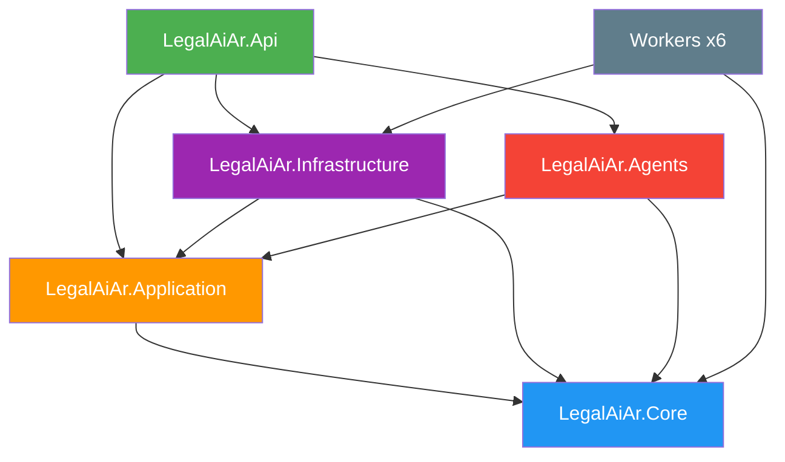

# F00 - W02 - Reestructurar Monorepo y Scaffolding Nuevos Proyectos

> **Feature:** F00 - Entorno y Estructura de Desarrollo
> **Release:** 0.0 | **Sprint:** S00
> **Tipo:** backend | **Prioridad:** Crítica (bloqueante)
> **Estimación:** 5 story points
> **Asignable a:** Dev Backend

---

## Descripción

Reestructurar el monorepo existente `legal-ai-ar` para incorporar la carpeta `docs/` con toda la documentación del proyecto, crear el nuevo proyecto `LegalAiAr.Agents` (Semantic Kernel) y el proyecto de evaluación `LegalAiAr.AgentEvals`. No se crea un repo nuevo — se evoluciona el existente.

---

## Estado Actual del Monorepo (MVP)

```
legal-ai-ar/
├── backend/
│   ├── src/
│   │   ├── api/
│   │   │   ├── LegalAiAr.Api/           # ✅ ASP.NET Core 10 (Controllers)
│   │   │   └── LegalAiAr.Application/   # ✅ CQRS, handlers, services
│   │   ├── shared/
│   │   │   ├── LegalAiAr.Core/          # ✅ Entidades, enums, interfaces
│   │   │   └── LegalAiAr.Infrastructure/ # ✅ EF Core, Azure services, AI
│   │   ├── workers/                      # ✅ 6 BackgroundService workers
│   │   └── tools/                        # ✅ 10 herramientas CLI auxiliares
│   ├── tests/                            # ✅ 8 proyectos de test
│   ├── LegalAiAr.sln                     # ✅ Solución existente
│   ├── Directory.Build.props             # ✅
│   ├── Directory.Packages.props          # ✅ Central Package Management
│   └── global.json                       # ✅ .NET 10
├── frontend/                             # ✅ Angular 19 SPA
└── README.md                             # ✅
```

---

## Tareas

### Estructura de carpetas

- [ ] Crear carpeta `docs/` en la raíz del repo
- [ ] Mover la documentación del proyecto a `docs/` (roadmap, tecnicas, ontologia)
- [ ] Agregar `.github/ISSUE_TEMPLATE/` con templates (bug_report, feature_request, work_item)
- [ ] Agregar `.github/PULL_REQUEST_TEMPLATE.md`

### Nuevo proyecto: LegalAiAr.Agents

- [ ] Crear proyecto `LegalAiAr.Agents` (Class Library) en `backend/src/shared/`
- [ ] Configurar estructura interna: `Plugins/`, `Prompts/`, `Orchestration/`
- [ ] Agregar referencia a `LegalAiAr.Application` y `LegalAiAr.Core`
- [ ] Agregar referencia desde `LegalAiAr.Api` a `LegalAiAr.Agents`
- [ ] Instalar paquetes NuGet de Semantic Kernel
- [ ] Agregar proyecto a `LegalAiAr.sln`

### Nuevo proyecto: LegalAiAr.AgentEvals

- [ ] Crear proyecto `LegalAiAr.AgentEvals` en `backend/tests/`
- [ ] Configurar estructura para golden set y evaluaciones
- [ ] Agregar proyecto a `LegalAiAr.sln`

### Verificación

- [ ] `dotnet build` compila todos los proyectos (existentes + nuevos) sin errores
- [ ] `dotnet test` pasa incluyendo los nuevos proyectos
- [ ] Las referencias entre proyectos respetan Clean Architecture

---

## Referencias entre Proyectos (actualizado)



---

## Paquetes NuGet Nuevos

### LegalAiAr.Agents (nuevo)
```xml
<PackageReference Include="Microsoft.SemanticKernel" />
<PackageReference Include="Microsoft.SemanticKernel.Connectors.AzureOpenAI" />
```

### LegalAiAr.AgentEvals (nuevo)
```xml
<PackageReference Include="xunit" />
<PackageReference Include="xunit.runner.visualstudio" />
<PackageReference Include="FluentAssertions" />
```

> **Nota:** Los paquetes de los proyectos existentes (Api, Application, Core, Infrastructure, Workers, Tools, Tests) ya están configurados en `Directory.Packages.props` y no se modifican.

---

## Criterios de Aceptación

- [ ] Carpeta `docs/` creada con la documentación organizada (roadmap, tecnicas, ontologia)
- [ ] `LegalAiAr.Agents` compila y está referenciado correctamente en la solución
- [ ] `LegalAiAr.AgentEvals` compila con al menos 1 test placeholder
- [ ] `dotnet build` compila todo sin warnings
- [ ] Las referencias entre proyectos respetan Clean Architecture (Core no referencia a nadie)
- [ ] Templates de GitHub agregados (.github/)

---

## Dependencias

- **Bloquea:** F00-W05 (Calidad de código), F01-W02 (Auth backend), R2.0 (Agentes)
- **Prerrequisitos:** Ninguno — el repo ya existe

---

*F00 - W02 - Reestructurar Monorepo y Scaffolding Nuevos Proyectos — Legal Ai Ar*
