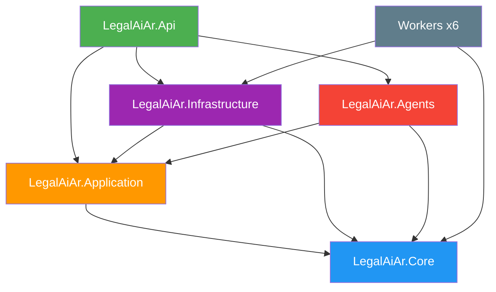

# F00 - W02 - Monorepo Setup and Backend Scaffolding

> **Feature:** F00 - Development Environment and Structure
> **Release:** 0.0 | **Sprint:** S00
> **Type:** backend | **Priority:** Critical (blocking)
> **Estimate:** 5 story points
> **Assignable to:** Backend Dev

---

## Description

Restructure the existing `legal-ai-ar` monorepo: hoist application code from `mvp/` to the repo root,
add `LegalAiAr.Agents` (Semantic Kernel) and `LegalAiAr.AgentEvals` (golden-set eval scaffold). No new
repo is created — the existing one is evolved. Documentation already lives under `docs/` (completed in
F00-W01).

---

## Current Monorepo State

```
legal-ai-ar/
├── backend/
│   ├── src/
│   │   ├── api/
│   │   │   ├── LegalAiAr.Api/              # ASP.NET Core 10 (Controllers → Minimal API in F00-W09)
│   │   │   └── LegalAiAr.Application/      # CQRS, handlers, services
│   │   ├── shared/
│   │   │   ├── LegalAiAr.Core/             # Entities, enums, interfaces
│   │   │   ├── LegalAiAr.Infrastructure/   # EF Core, Azure services, AI
│   │   │   └── LegalAiAr.Agents/           # Semantic Kernel (plugins, prompts, orchestration)
│   │   ├── workers/                        # 6 BackgroundService workers
│   │   └── tools/                          # 10 auxiliary CLI tools
│   ├── tests/                              # 9 test projects (+ LegalAiAr.AgentEvals)
│   ├── LegalAiAr.sln
│   ├── Directory.Build.props
│   ├── Directory.Packages.props
│   └── global.json
├── frontend/                               # Angular 19 SPA
├── infra/                                  # Azure provisioning scripts
├── deployment/                             # GCaaS Helm chart
├── docs/                                   # roadmap, technical, ontology (F00-W01)
└── README.md
```

---

## Tasks

### Folder structure

- [x] Create the `docs/` folder at the repo root *(done in F00-W01)*
- [x] Move the project documentation to `docs/` (roadmap, technical, ontology) *(done in F00-W01)*
- [x] Add `.github/ISSUE_TEMPLATE/` with templates (bug_report, feature_request, work_item)
- [x] Add `.github/PULL_REQUEST_TEMPLATE.md` *(already present)*

### New project: LegalAiAr.Agents

- [x] Create the `LegalAiAr.Agents` project (Class Library) in `backend/src/shared/`
- [x] Configure the internal structure: `Plugins/`, `Prompts/`, `Orchestration/`
- [x] Add a reference to `LegalAiAr.Application` and `LegalAiAr.Core`
- [x] Add a reference from `LegalAiAr.Api` to `LegalAiAr.Agents`
- [x] Install the Semantic Kernel NuGet packages
- [x] Add the project to `LegalAiAr.sln`

### New project: LegalAiAr.AgentEvals

- [x] Create the `LegalAiAr.AgentEvals` project in `backend/tests/`
- [x] Configure the structure for the golden set and evaluations
- [x] Add the project to `LegalAiAr.sln`

### Verification

- [x] `dotnet build` compiles all projects (existing + new) with no errors
- [x] `dotnet test` passes including the new projects
- [x] References between projects respect Clean Architecture

---

## Deviations / notes

- **Build warnings:** Acceptance criteria updated to **0 errors** for W02. Existing analyzer warnings
  (e.g. xUnit1051) remain; **zero-warning policy** is deferred to **F00-W08 (Code Quality Configuration)**.
- **AgentEvals packages:** Uses **xunit.v3** (repo standard), not classic xunit + FluentAssertions listed in
  the original ticket draft.
- **Hoist:** `mvp/` removed; code at repo root (`backend/`, `frontend/`, `infra/`, `deployment/`).
- **Tests:** Incidental fixes in `ResolveCitationsStepTests` (DI for `EntityCacheService`) and
  `CitationRepository` (case-insensitive inbound alias match) required for green `dotnet test`.

---

## Project References (updated)



---

## New NuGet Packages

### LegalAiAr.Agents (new)
```xml
<PackageReference Include="Microsoft.SemanticKernel" />
<PackageReference Include="Microsoft.SemanticKernel.Connectors.AzureOpenAI" />
```

### LegalAiAr.AgentEvals (new)
```xml
<PackageReference Include="xunit.v3" />
<PackageReference Include="xunit.runner.visualstudio" />
<PackageReference Include="Microsoft.NET.Test.Sdk" />
```

> **Note:** Versions are centrally managed in `Directory.Packages.props`. Semantic Kernel **1.77.0**.

---

## Acceptance Criteria

- [x] `docs/` folder created with the documentation organized (roadmap, technical, ontology) *(F00-W01)*
- [x] `LegalAiAr.Agents` compiles and is referenced correctly in the solution
- [x] `LegalAiAr.AgentEvals` compiles with at least 1 placeholder test
- [x] `dotnet build` compiles the full solution with **no errors** (warnings addressed in F00-W08)
- [x] References between projects respect Clean Architecture (Core references no one)
- [x] GitHub templates added (`.github/` — PR template + issue templates)

---

## Dependencies

- **Blocks:** F00-W05 (Code quality), authentication backend (R1.0), specialized agents (R3.0)
- **Prerequisites:** None — the repo already exists

---

*F00 - W02 - Monorepo Setup and Backend Scaffolding — Legal Ai Ar*
