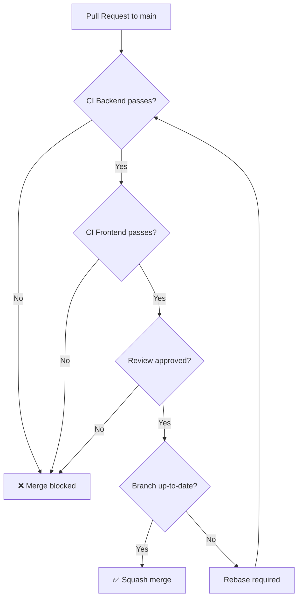

# F00 - W04 - GitHub Actions CI Configuration

> **Feature:** F00 - Development Environment and Structure
> **Release:** 0.0 | **Sprint:** S00
> **Type:** devops | **Priority:** High
> **Estimate:** 5 story points
> **Assignable to:** Backend Dev (or whoever has the most DevOps experience)

---

## Description

Configure the Continuous Integration (CI) pipelines in GitHub Actions for backend (.NET 10) and frontend (Angular 19). The pipelines must run automatically on every push to `main` and on every PR, and must block the merge if they fail.

---

## Tasks

- [ ] Create `.github/workflows/ci-backend.yml`
- [ ] Create `.github/workflows/ci-frontend.yml`
- [ ] Configure path filters so each pipeline only runs on relevant changes
- [ ] Configure NuGet and npm caching to speed up builds
- [ ] Configure branch protection rules on `main`:
  - Require PR reviews (1)
  - Require status checks (CI backend + CI frontend)
  - Require up-to-date branch
  - Squash merge only
- [ ] Configure GitHub secrets for Azure (if needed for integration tests)
- [ ] Add CI badges to README.md
- [ ] Verify that a PR with failing tests can NOT be merged
- [ ] Verify that a PR with lint errors can NOT be merged

---

## Backend CI Pipeline

```yaml
# .github/workflows/ci-backend.yml
name: CI Backend

on:
  push:
    branches: [main]
    paths: ['backend/**', '.github/workflows/ci-backend.yml']
  pull_request:
    branches: [main]
    paths: ['backend/**']

defaults:
  run:
    working-directory: backend

jobs:
  build-and-test:
    runs-on: ubuntu-latest
    steps:
      - uses: actions/checkout@v4

      - name: Setup .NET 10
        uses: actions/setup-dotnet@v4
        with:
          dotnet-version: '10.0.x'

      - name: Cache NuGet
        uses: actions/cache@v4
        with:
          path: ~/.nuget/packages
          key: ${{ runner.os }}-nuget-${{ hashFiles('**/Directory.Packages.props') }}
          restore-keys: ${{ runner.os }}-nuget-

      - name: Restore
        run: dotnet restore

      - name: Build
        run: dotnet build --no-restore -c Release -warnaserror

      - name: Unit Tests
        run: dotnet test tests/LegalAiAr.UnitTests -c Release --no-build --logger trx --collect:"XPlat Code Coverage"

      - name: Integration Tests
        run: dotnet test tests/LegalAiAr.IntegrationTests -c Release --no-build --logger trx
        continue-on-error: false

      - name: Publish Coverage
        uses: codecov/codecov-action@v4
        if: always()
        with:
          directory: tests/LegalAiAr.UnitTests/TestResults
          fail_ci_if_error: false

      - name: Publish Build Artifact
        if: github.ref == 'refs/heads/main' && github.event_name == 'push'
        run: dotnet publish src/LegalAiAr.Api -c Release -o ./publish

      - name: Upload Artifact
        if: github.ref == 'refs/heads/main' && github.event_name == 'push'
        uses: actions/upload-artifact@v4
        with:
          name: backend-${{ github.sha }}
          path: backend/publish/
```

---

## Frontend CI Pipeline

```yaml
# .github/workflows/ci-frontend.yml
name: CI Frontend

on:
  push:
    branches: [main]
    paths: ['frontend/**', '.github/workflows/ci-frontend.yml']
  pull_request:
    branches: [main]
    paths: ['frontend/**']

defaults:
  run:
    working-directory: frontend

jobs:
  build-and-test:
    runs-on: ubuntu-latest
    steps:
      - uses: actions/checkout@v4

      - name: Setup Node 22
        uses: actions/setup-node@v4
        with:
          node-version: '22'
          cache: 'npm'
          cache-dependency-path: frontend/package-lock.json

      - name: Install dependencies
        run: npm ci

      - name: Lint
        run: npm run lint

      - name: Build (production)
        run: npm run build:prod

      - name: Unit Tests
        run: npm run test -- --coverage

      - name: Upload Coverage
        uses: codecov/codecov-action@v4
        if: always()
        with:
          directory: frontend/coverage
          fail_ci_if_error: false

      - name: Upload Build Artifact
        if: github.ref == 'refs/heads/main' && github.event_name == 'push'
        uses: actions/upload-artifact@v4
        with:
          name: frontend-${{ github.sha }}
          path: frontend/dist/
```

---

## Branch Protection Rules (main)



**Configuration in GitHub → Settings → Branches → Branch protection rules:**

| Setting | Value |
|---|---|
| Require a pull request before merging | ✅ |
| Required approving reviews | 1 |
| Require status checks to pass | ✅ |
| Required checks | `CI Backend / build-and-test`, `CI Frontend / build-and-test` |
| Require branches to be up to date | ✅ |
| Allow squash merging | ✅ (this one only) |
| Allow merge commits | ❌ |
| Allow rebase merging | ❌ |

---

## Acceptance Criteria

- [ ] A push to `main` with changes in `backend/` runs only CI Backend
- [ ] A push to `main` with changes in `frontend/` runs only CI Frontend
- [ ] A PR with failing tests shows ❌ and does not allow merge
- [ ] A PR with all checks ✅ and 1 review allows merge
- [ ] Artifacts are generated correctly on pushes to main
- [ ] The NuGet/npm cache works (second build is faster)
- [ ] The CI badges appear in the README

---

## Dependencies

- **Depends on:** F00-W02 (backend scaffolding), F00-W03 (frontend scaffolding)
- **Blocks:** F00-W06 (CD pipelines)

---

*F00 - W04 - GitHub Actions CI Configuration — Legal Ai Ar*
