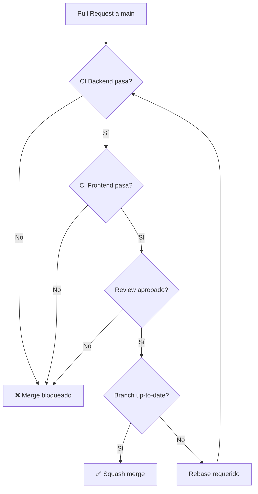

# F00 - W04 - Configuración CI - GitHub Actions

> **Feature:** F00 - Entorno y Estructura de Desarrollo
> **Release:** 0.0 | **Sprint:** S00
> **Tipo:** devops | **Prioridad:** Alta
> **Estimación:** 5 story points
> **Asignable a:** Dev Backend (o el que tenga más experiencia DevOps)

---

## Descripción

Configurar los pipelines de Integración Continua (CI) en GitHub Actions para backend (.NET 10) y frontend (Angular 19). Los pipelines deben ejecutarse automáticamente en cada push a `main` y en cada PR, y deben bloquear el merge si fallan.

---

## Tareas

- [ ] Crear `.github/workflows/ci-backend.yml`
- [ ] Crear `.github/workflows/ci-frontend.yml`
- [ ] Configurar path filters para que cada pipeline solo ejecute en cambios relevantes
- [ ] Configurar cache de NuGet y npm para acelerar builds
- [ ] Configurar branch protection rules en `main`:
  - Require PR reviews (1)
  - Require status checks (CI backend + CI frontend)
  - Require up-to-date branch
  - Squash merge only
- [ ] Configurar GitHub secrets para Azure (si se necesita para integration tests)
- [ ] Agregar badges de CI al README.md
- [ ] Verificar que un PR con tests fallidos NO se puede mergear
- [ ] Verificar que un PR con lint errors NO se puede mergear

---

## Pipeline CI Backend

```yaml
# .github/workflows/ci-backend.yml
name: CI Backend

on:
  push:
    branches: [main]
    paths: ['backend/**', '.github/workflows/ci-backend.yml']
  pull_request:
    branches: [main]
    paths: ['backend/**']

defaults:
  run:
    working-directory: backend

jobs:
  build-and-test:
    runs-on: ubuntu-latest
    steps:
      - uses: actions/checkout@v4

      - name: Setup .NET 10
        uses: actions/setup-dotnet@v4
        with:
          dotnet-version: '10.0.x'

      - name: Cache NuGet
        uses: actions/cache@v4
        with:
          path: ~/.nuget/packages
          key: ${{ runner.os }}-nuget-${{ hashFiles('**/Directory.Packages.props') }}
          restore-keys: ${{ runner.os }}-nuget-

      - name: Restore
        run: dotnet restore

      - name: Build
        run: dotnet build --no-restore -c Release -warnaserror

      - name: Unit Tests
        run: dotnet test tests/LegalAiAr.UnitTests -c Release --no-build --logger trx --collect:"XPlat Code Coverage"

      - name: Integration Tests
        run: dotnet test tests/LegalAiAr.IntegrationTests -c Release --no-build --logger trx
        continue-on-error: false

      - name: Publish Coverage
        uses: codecov/codecov-action@v4
        if: always()
        with:
          directory: tests/LegalAiAr.UnitTests/TestResults
          fail_ci_if_error: false

      - name: Publish Build Artifact
        if: github.ref == 'refs/heads/main' && github.event_name == 'push'
        run: dotnet publish src/LegalAiAr.Api -c Release -o ./publish

      - name: Upload Artifact
        if: github.ref == 'refs/heads/main' && github.event_name == 'push'
        uses: actions/upload-artifact@v4
        with:
          name: backend-${{ github.sha }}
          path: backend/publish/
```

---

## Pipeline CI Frontend

```yaml
# .github/workflows/ci-frontend.yml
name: CI Frontend

on:
  push:
    branches: [main]
    paths: ['frontend/**', '.github/workflows/ci-frontend.yml']
  pull_request:
    branches: [main]
    paths: ['frontend/**']

defaults:
  run:
    working-directory: frontend

jobs:
  build-and-test:
    runs-on: ubuntu-latest
    steps:
      - uses: actions/checkout@v4

      - name: Setup Node 22
        uses: actions/setup-node@v4
        with:
          node-version: '22'
          cache: 'npm'
          cache-dependency-path: frontend/package-lock.json

      - name: Install dependencies
        run: npm ci

      - name: Lint
        run: npm run lint

      - name: Build (production)
        run: npm run build:prod

      - name: Unit Tests
        run: npm run test -- --coverage

      - name: Upload Coverage
        uses: codecov/codecov-action@v4
        if: always()
        with:
          directory: frontend/coverage
          fail_ci_if_error: false

      - name: Upload Build Artifact
        if: github.ref == 'refs/heads/main' && github.event_name == 'push'
        uses: actions/upload-artifact@v4
        with:
          name: frontend-${{ github.sha }}
          path: frontend/dist/
```

---

## Branch Protection Rules (main)



**Configuración en GitHub → Settings → Branches → Branch protection rules:**

| Setting | Valor |
|---|---|
| Require a pull request before merging | ✅ |
| Required approving reviews | 1 |
| Require status checks to pass | ✅ |
| Required checks | `CI Backend / build-and-test`, `CI Frontend / build-and-test` |
| Require branches to be up to date | ✅ |
| Allow squash merging | ✅ (solo este) |
| Allow merge commits | ❌ |
| Allow rebase merging | ❌ |

---

## Criterios de Aceptación

- [ ] Push a `main` con cambios en `backend/` ejecuta solo CI Backend
- [ ] Push a `main` con cambios en `frontend/` ejecuta solo CI Frontend
- [ ] Un PR con tests fallidos muestra ❌ y no permite merge
- [ ] Un PR con todos los checks ✅ y 1 review permite merge
- [ ] Los artifacts se generan correctamente en pushes a main
- [ ] El cache de NuGet/npm funciona (segundo build más rápido)
- [ ] Los badges de CI aparecen en el README

---

## Dependencias

- **Depende de:** F00-W02 (backend scaffolding), F00-W03 (frontend scaffolding)
- **Bloquea:** F00-W06 (CD pipelines)

---

*F00 - W04 - Configuración CI - GitHub Actions — Legal Ai Ar*
