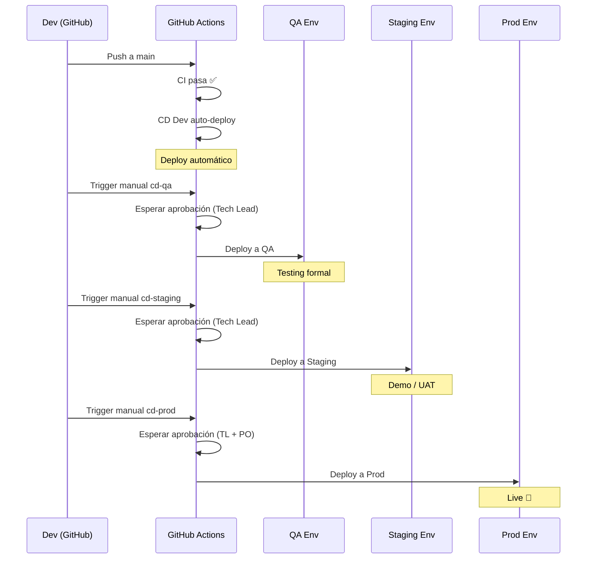

# F00 - W06 - Configuración CD - Pipelines de Deploy

> **Feature:** F00 - Entorno y Estructura de Desarrollo
> **Release:** 0.0 | **Sprint:** S00
> **Tipo:** devops | **Prioridad:** Alta
> **Estimación:** 5 story points
> **Asignable a:** Dev Backend

---

## Descripción

Configurar los pipelines de Continuous Deployment (CD) en GitHub Actions para los 4 ambientes: DEV (automático), QA, STAGING y PROD (manuales con aprobaciones). Incluye deploy de backend a App Service, frontend a Static Web App, y ejecución de migraciones EF Core.

---

## Tareas

- [ ] Crear Service Principal en Azure para GitHub Actions
- [ ] Configurar GitHub Secrets con credenciales Azure (AZURE_CREDENTIALS, AZURE_SUBSCRIPTION_ID)
- [ ] Crear `.github/workflows/cd-dev.yml` (auto-deploy en push a main)
- [ ] Crear `.github/workflows/cd-qa.yml` (manual con 1 aprobación)
- [ ] Crear `.github/workflows/cd-staging.yml` (manual con 1 aprobación)
- [ ] Crear `.github/workflows/cd-prod.yml` (manual con 2 aprobaciones)
- [ ] Configurar GitHub Environments con protection rules y reviewers
- [ ] Implementar step de migración EF Core en cada pipeline
- [ ] Implementar smoke tests post-deploy (health check)
- [ ] Configurar notificaciones de deploy (GitHub + opcional Slack/Teams)
- [ ] Verificar deploy completo al ambiente DEV
- [ ] Documentar proceso de promoción entre ambientes

---

## Pipeline CD DEV (automático)

```yaml
# .github/workflows/cd-dev.yml
name: CD Dev

on:
  workflow_run:
    workflows: ["CI Backend", "CI Frontend"]
    types: [completed]
    branches: [main]

concurrency:
  group: cd-dev
  cancel-in-progress: true

jobs:
  deploy-backend:
    if: ${{ github.event.workflow_run.conclusion == 'success' }}
    runs-on: ubuntu-latest
    environment: dev
    steps:
      - uses: actions/checkout@v4

      - name: Setup .NET 10
        uses: actions/setup-dotnet@v4
        with:
          dotnet-version: '10.0.x'

      - name: Build & Publish
        run: dotnet publish backend/src/LegalAiAr.Api -c Release -o ./publish

      - name: Login to Azure
        uses: azure/login@v2
        with:
          creds: ${{ secrets.AZURE_CREDENTIALS_DEV }}

      - name: Run EF Migrations
        run: |
          dotnet tool install --global dotnet-ef
          cd backend/src/LegalAiAr.Api
          dotnet ef database update --connection "${{ secrets.SQL_CONNECTION_DEV }}"

      - name: Deploy to App Service
        uses: azure/webapps-deploy@v3
        with:
          app-name: app-legal-ai-ar-dev
          package: ./publish

      - name: Smoke Test
        run: |
          sleep 30
          STATUS=$(curl -s -o /dev/null -w "%{http_code}" https://app-legal-ai-ar-dev.azurewebsites.net/health)
          if [ "$STATUS" != "200" ]; then
            echo "Smoke test failed with status $STATUS"
            exit 1
          fi

  deploy-frontend:
    if: ${{ github.event.workflow_run.conclusion == 'success' }}
    runs-on: ubuntu-latest
    environment: dev
    steps:
      - uses: actions/checkout@v4

      - name: Setup Node 22
        uses: actions/setup-node@v4
        with:
          node-version: '22'
          cache: 'npm'
          cache-dependency-path: frontend/package-lock.json

      - name: Install & Build
        run: |
          cd frontend
          npm ci
          npm run build:dev

      - name: Login to Azure
        uses: azure/login@v2
        with:
          creds: ${{ secrets.AZURE_CREDENTIALS_DEV }}

      - name: Deploy to Static Web App
        uses: Azure/static-web-apps-deploy@v1
        with:
          azure_static_web_apps_api_token: ${{ secrets.SWA_TOKEN_DEV }}
          action: upload
          app_location: frontend/dist/legal-ai-ar/browser
```

---

## GitHub Environments

| Environment | Protection Rules | Reviewers |
|---|---|---|
| `dev` | Ninguna (auto-deploy) | — |
| `qa` | Required reviewers | Tech Lead |
| `staging` | Required reviewers + wait timer (5 min) | Tech Lead |
| `prod` | Required reviewers + wait timer (15 min) | Tech Lead + Product Owner |

---

## Flujo de Promoción



---

## GitHub Secrets Requeridos

| Secret | Scope | Descripción |
|---|---|---|
| `AZURE_CREDENTIALS_DEV` | Environment: dev | Service Principal JSON para DEV |
| `AZURE_CREDENTIALS_QA` | Environment: qa | Service Principal JSON para QA |
| `AZURE_CREDENTIALS_STAGING` | Environment: staging | Service Principal JSON para STAGING |
| `AZURE_CREDENTIALS_PROD` | Environment: prod | Service Principal JSON para PROD |
| `SQL_CONNECTION_{ENV}` | Por ambiente | Connection string de Azure SQL |
| `SWA_TOKEN_{ENV}` | Por ambiente | Token de Static Web App |

---

## Criterios de Aceptación

- [ ] Push a `main` que pasa CI dispara auto-deploy a DEV
- [ ] El backend se despliega correctamente a App Service DEV
- [ ] Las migraciones EF Core se ejecutan en DEV sin errores
- [ ] El frontend se despliega correctamente a Static Web App DEV
- [ ] El smoke test valida que `/health` devuelve 200
- [ ] Los pipelines manuales (QA, staging, prod) esperan aprobación
- [ ] Los GitHub Environments están configurados con los reviewers correctos

---

## Dependencias

- **Depende de:** F00-W04 (CI pipelines), F00-W05 (infra Azure provisionada)
- **Bloquea:** Ninguno directamente (pero habilita deploys de todas las features)

---

*F00 - W06 - Configuración CD - Pipelines de Deploy — Legal Ai Ar*
