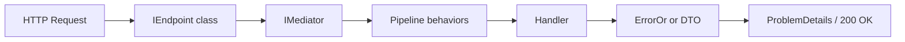

# F00 - W09 - Minimal API Endpoint Discovery and Migration

> **Feature:** F00 - Development Environment and Structure
> **Release:** 0.0 | **Sprint:** S00
> **Type:** backend | **Priority:** High (blocking R1 API work)
> **Estimate:** 8 story points
> **Assignable to:** Backend Dev

---

## Description

Migrate the API surface from MVC Controllers to **Minimal API with convention-based endpoint discovery**
(`IEndpoint`), per [PwC Internal Application Architecture §4.4](../../standards/pwc-internal-app-architecture.md#44-api-layer--minimal-api-with-endpoint-discovery).
The MVP uses Controllers today; F00-W02 deferred this migration explicitly. This work item introduces the
infrastructure (discovery, groups, validation filter, ProblemDetails mapping) and migrates endpoints
**incrementally** — no big-bang rewrite.

**Baseline:** [architecture standard §4](../../standards/pwc-internal-app-architecture.md#4-backend-architecture),
[§13 DoD alignment](../../standards/pwc-internal-app-architecture.md#13-definition-of-done-alignment).
Prerequisite: **F00-W08** (NetArchTest must enforce endpoint placement rules).

---

## Implementation Tasks

> Broken down on 2026-06-02 (architect plan confirmed). **Completed 2026-06-02** — infra, waves 1–4, remaining five controllers, `MapControllers` removed.

### PR-A — Endpoint infrastructure

- [x] **Create**: `backend/src/api/LegalAiAr.Api/Interfaces/IEndpoint.cs`
    - `string GroupName { get; }`, `void MapEndpoint(IEndpointRouteBuilder app)` (per `pwc-internal-app-architecture.md` §4.4)
- [x] **Create**: `backend/src/api/LegalAiAr.Api/Endpoints/EndpointGroupBase.cs`
    - Optional base: shared `GroupName`, helpers for `RequireAuthorization()` / `RequireAuthorization("AdminOnly")`
- [x] **Create**: `backend/src/api/LegalAiAr.Api/Extensions/EndpointDiscoveryExtensions.cs`
    - `AddLegalAiArEndpoints(this IServiceCollection)` — register all `IEndpoint` implementations from `LegalAiAr.Api` assembly (singleton or transient per implementation)
- [x] **Create**: `backend/src/api/LegalAiAr.Api/Extensions/EndpointMappingExtensions.cs`
    - `MapLegalAiArEndpoints(this WebApplication)` — resolve endpoints, `MapGroup("api/{groupName}")` (lowercase), apply group auth (fallback authenticated user), attach global filters
- [x] **Create**: `backend/src/api/LegalAiAr.Api/Filters/ValidationEndpointFilter.cs`
    - `IEndpointFilter`: for bound body/query types with registered `IValidator<T>`, run FluentValidation; return 400 `ValidationProblemDetails` on failure (complements `ValidationBehavior` for `Api.Models` DTOs)
- [x] **Create**: `backend/src/api/LegalAiAr.Api/Extensions/ErrorOrResultExtensions.cs`
    - `ToProblemResult(this ErrorOr<T>)` / `Match` helpers mapping to RFC 7807 (forward-looking; handlers may still throw until later WIs)
- [x] **Modify**: `backend/Directory.Packages.props`
    - Add `ErrorOr` package version (if mapper is implemented in this WI)
- [x] **Modify**: `backend/src/api/LegalAiAr.Api/LegalAiAr.Api.csproj`
    - Reference `ErrorOr` when added to central packages
- [x] **Modify**: `backend/src/api/LegalAiAr.Api/Program.cs`
    - Call `AddLegalAiArEndpoints()` and `MapLegalAiArEndpoints()` alongside existing `MapControllers()` (no duplicate routes until controllers removed)
    - Add `AddEndpointsApiExplorer()` if Swashbuckle requires it for Minimal API
- [x] **Verify**: app starts with zero route conflicts (infra only or health smoke)

### PR-A — Architecture enforcement

- [x] **Create**: `backend/tests/LegalAiAr.ArchitectureTests/ControllerAllowlist.cs`
    - Static list of existing `*Controller` type names permitted until migrated (19 controllers)
- [x] **Create**: `backend/tests/LegalAiAr.ArchitectureTests/EndpointArchitectureTests.cs`
    - Test: types implementing `IEndpoint` reside in namespace `LegalAiAr.Api.Endpoints`
    - Test: no new types inheriting `ControllerBase` except those in `ControllerAllowlist`
- [x] **Modify**: `backend/tests/LegalAiAr.ArchitectureTests/LayerDependencyTests.cs`
    - Keep `Controllers_should_reside_in_Api` until `Controllers/` folder is empty (or narrow to allowlist)

### PR-B — Wave 1: Auth + Health

- [x] **Create**: `backend/src/api/LegalAiAr.Api/Endpoints/Auth/AuthEndpointGroup.cs`
    - `GroupName` = `"auth"` → routes under `api/auth`
- [x] **Create**: `backend/src/api/LegalAiAr.Api/Endpoints/Auth/GetAuthMe.cs`
    - `GET /me` — same claims logic as `AuthController.Me`; types `MeResponse` (move records to `Api/Models/Auth/` or keep colocated)
- [x] **Create**: `backend/src/api/LegalAiAr.Api/Endpoints/Auth/PostAuthLogout.cs`
    - `POST /logout` — `LogoutResponse`
- [x] **Create**: `backend/src/api/LegalAiAr.Api/Endpoints/Health/HealthEndpointGroup.cs`
    - `GroupName` = `"health"`
- [x] **Create**: `backend/src/api/LegalAiAr.Api/Endpoints/Health/GetHealthLive.cs`
    - `GET /live` — `[AllowAnonymous]`, `{ status: "live" }`
- [x] **Create**: `backend/src/api/LegalAiAr.Api/Endpoints/Health/GetHealth.cs`
    - `GET /` — `IHealthCheckService.CheckAsync`, 503 when unhealthy
- [x] **Delete**: `backend/src/api/LegalAiAr.Api/Controllers/AuthController.cs`
- [x] **Delete**: `backend/src/api/LegalAiAr.Api/Controllers/HealthController.cs`
- [x] **Modify**: `backend/src/api/LegalAiAr.Api/LegalAiAr.Api.http`
    - Auth + health requests still hit `api/auth/*`, `api/health/*`
- [x] **Verify**: SPA `auth.service.ts` bootstrap (`GET /api/auth/me`) and liveness probe

### PR-B — Application mapping (hoist controller logic)

- [x] **Create**: `backend/src/api/LegalAiAr.Application/Rulings/Mapping/SearchRulingsRequestMapper.cs`
    - `SearchRulingsRequest` → `SearchRulingsQuery` + `SearchFilters?` (move `MapFilters` from `RulingsController`)
- [x] **Create**: `backend/src/api/LegalAiAr.Application/Catalogs/Mapping/PersonListViewParser.cs`
    - `ParsePersonListView(string? vista)` (move from `PersonsController`)

### PR-B — Wave 2: Rulings (`api/rulings`)

- [x] **Create**: `backend/src/api/LegalAiAr.Api/Endpoints/Rulings/RulingsEndpointGroup.cs` — `GroupName` = `"rulings"`
- [x] **Create**: `backend/src/api/LegalAiAr.Api/Endpoints/Rulings/PostRulingsSearch.cs` — `POST /search`, body `SearchRulingsRequest`, `IMediator.Send(SearchRulingsQuery)`
- [x] **Create**: `backend/src/api/LegalAiAr.Api/Endpoints/Rulings/GetRulingById.cs` — `GET /{id:guid}`, pass `allowReprocessing: user.IsInRole("admin")`
- [x] **Create**: `backend/src/api/LegalAiAr.Api/Endpoints/Rulings/GetRulingDocument.cs` — `GET /{id:guid}/document`, `Results.File(..., enableRangeProcessing: true)` or 404
- [x] **Create**: `backend/src/api/LegalAiAr.Api/Endpoints/Rulings/GetRulingRelated.cs` — `GET /{id:guid}/related`, query `limit`
- [x] **Create**: `backend/src/api/LegalAiAr.Api/Endpoints/Rulings/GetRulingsFacets.cs` — `GET /facets`
- [x] **Delete**: `backend/src/api/LegalAiAr.Api/Controllers/RulingsController.cs`

### PR-B — Wave 2: Statutes (`api/statutes`)

- [x] **Create**: `backend/src/api/LegalAiAr.Api/Endpoints/Statutes/StatutesEndpointGroup.cs`
- [x] **Create**: `backend/src/api/LegalAiAr.Api/Endpoints/Statutes/GetStatutesList.cs` — `GET /`, query params → `GetStatutesQuery`
- [x] **Create**: `backend/src/api/LegalAiAr.Api/Endpoints/Statutes/GetStatutesPyramid.cs` — `GET /pyramid`
- [x] **Create**: `backend/src/api/LegalAiAr.Api/Endpoints/Statutes/GetStatuteById.cs` — `GET /{id:int}`, 404 when null
- [x] **Delete**: `backend/src/api/LegalAiAr.Api/Controllers/StatutesController.cs`

### PR-B — Wave 2: Courts (`api/courts`)

- [x] **Create**: `backend/src/api/LegalAiAr.Api/Endpoints/Courts/CourtsEndpointGroup.cs`
- [x] **Create**: `backend/src/api/LegalAiAr.Api/Endpoints/Courts/GetCourtsList.cs` — `GET /`
- [x] **Create**: `backend/src/api/LegalAiAr.Api/Endpoints/Courts/GetCourtById.cs` — `GET /{id:int}`
- [x] **Delete**: `backend/src/api/LegalAiAr.Api/Controllers/CourtsController.cs`

### PR-B — Wave 2: Persons (`api/persons`)

- [x] **Create**: `backend/src/api/LegalAiAr.Api/Endpoints/Persons/PersonsEndpointGroup.cs`
- [x] **Create**: `backend/src/api/LegalAiAr.Api/Endpoints/Persons/GetPersonsList.cs` — `GET /`, use `PersonListViewParser`
- [x] **Create**: `backend/src/api/LegalAiAr.Api/Endpoints/Persons/GetPersonById.cs` — `GET /{id:int}`
- [x] **Delete**: `backend/src/api/LegalAiAr.Api/Controllers/PersonsController.cs`

### PR-B — Wave 2: Thesaurus (`api/thesaurus`)

- [x] **Create**: `backend/src/api/LegalAiAr.Api/Endpoints/Thesaurus/ThesaurusEndpointGroup.cs`
- [x] **Create**: `backend/src/api/LegalAiAr.Api/Endpoints/Thesaurus/GetThesaurusSearch.cs` — `GET /search`, min 2 chars → empty array
- [x] **Create**: `backend/src/api/LegalAiAr.Api/Endpoints/Thesaurus/GetThesaurusRoots.cs` — `GET /roots`
- [x] **Create**: `backend/src/api/LegalAiAr.Api/Endpoints/Thesaurus/GetThesaurusChildren.cs` — `GET /{id:int}/children`
- [x] **Create**: `backend/src/api/LegalAiAr.Api/Endpoints/Thesaurus/GetThesaurusById.cs` — `GET /{id:int}`
- [x] **Delete**: `backend/src/api/LegalAiAr.Api/Controllers/ThesaurusController.cs`
- [x] **Update allowlist**: remove migrated controllers from `ControllerAllowlist.cs`

### PR-B — Documentation (partial DoD for waves 1–2)

- [x] **Create**: `docs/technical/22-api-endpoints.md`
    - Table: group prefix, HTTP method, route, auth policy, migration status (migrated vs controller)
- [x] **Modify**: `docs/technical/10-system-architecture.md`
    - Link Minimal API + `22-api-endpoints.md`; note controllers still used for Search, Ontology, Proceedings, Admin, Chat

### PR-C — Wave 3: Chat SSE (follow-up PR)

- [x] **Create**: `backend/src/api/LegalAiAr.Api/Endpoints/Chat/ChatEndpointGroup.cs` — `GroupName` = `"chat"`
- [x] **Create**: `backend/src/api/LegalAiAr.Api/Endpoints/Chat/PostChatStream.cs`
    - `POST /` — preserve SSE headers, `IMediator.CreateStream(ChatQueryCommand)`, event payloads identical to `ChatController`
- [x] **Delete**: `backend/src/api/LegalAiAr.Api/Controllers/ChatController.cs`
- [x] **Verify**: `frontend/src/app/services/chat.service.ts` streaming

### PR-D — Wave 4: Admin (split across PRs; order)

- [x] **Migrate** `UsersAdminController` → `Endpoints/Admin/Users/*.cs` (`api/admin/users`, policy `AdminOnly`)
- [x] **Migrate** `DlqAdminController` → `Endpoints/Admin/Dlq/*.cs`
- [x] **Migrate** `CrawlersAdminController` → `Endpoints/Admin/Crawlers/*.cs`
- [x] **Migrate** `InfraAdminController` → `Endpoints/Admin/Infra/*.cs`
- [x] **Migrate** `WorkerControlAdminController` → `Endpoints/Admin/Workers/*.cs`
- [x] **Migrate** `RulingReprocessAdminController` → `Endpoints/Admin/RulingReprocess/*.cs`
- [x] **Migrate** `JobsAdminController` → `Endpoints/Admin/Jobs/*.cs` (largest; one file per action)
- [x] **Delete** each admin controller after its endpoints are live; shrink `ControllerAllowlist`
- [x] **Modify**: `LegalAiAr.Api.http` — admin section per group

### Final cleanup (when all controllers gone)

- [x] **Modify**: `Program.cs` — remove `AddControllers()` / `MapControllers()`
- [x] **Delete**: `backend/src/api/LegalAiAr.Api/Controllers/` folder (or leave empty)
- [x] **Remove**: `ControllerAllowlist` + controller-related arch tests; keep endpoint placement test only

### Verification (every PR)

- [x] `dotnet build` — zero warnings (`TreatWarningsAsErrors`)
- [x] `dotnet test` — all tests green including `LegalAiAr.ArchitectureTests`
- [x] No duplicate routes (Swagger `/docs` or integration smoke)
- [x] Migrated routes match SPA URLs (lowercase `api/{group}`)
- [x] Work item acceptance criteria for completed waves
- [x] DoD round-trip on WI close: STATUS.md, `22-api-endpoints.md`, `10-system-architecture.md`

---

## Endpoint pattern (target)

```csharp
// LegalAiAr.Api/Endpoints/Rulings/SearchRulings.cs
public sealed class SearchRulings : RulingGroup, IEndpoint
{
    public void MapEndpoint(IEndpointRouteBuilder app) =>
        app.MapPost("/search", async (
            [FromServices] IMediator mediator,
            SearchRulingsRequest request,
            CancellationToken ct) =>
        {
            var result = await mediator.Send(new SearchRulingsQuery(request), ct);
            return result.Match(Results.Ok, Problem);
        });
}
```



---

## Acceptance Criteria

- [x] `IEndpoint` discovery registers all migrated endpoints; app starts with zero controller/action conflicts
- [x] At least **waves 1–2** fully migrated (auth + primary read catalogs); waves 3–4 completed on same branch
- [x] Validation filter rejects invalid requests with 400 + ProblemDetails before hitting handlers
- [x] `ErrorOr` failures map to consistent ProblemDetails (type, title, status, errors dictionary)
- [x] `dotnet build` zero warnings; `dotnet test` green including new architecture tests
- [x] Swagger documents migrated routes under `api/{group}`
- [x] No business logic in endpoint lambdas — handlers only (mapping hoisted to `Api/Mapping` or Application where needed)
- [x] Architecture standard §16 backend checklist satisfied for API layer
- [x] Documentation round-trip complete (DoD)

---

## Dependencies

- **Blocks:** R1 feature endpoints that assume Minimal API; F00-W10 (Contracts DTOs consumed by endpoints)
- **Prerequisites:** F00-W02 (monorepo/backend scaffold), F00-W08 (NetArchTest + warnings-as-errors)

---

_F00 - W09 - Minimal API Endpoint Discovery and Migration — Legal Ai Ar_
