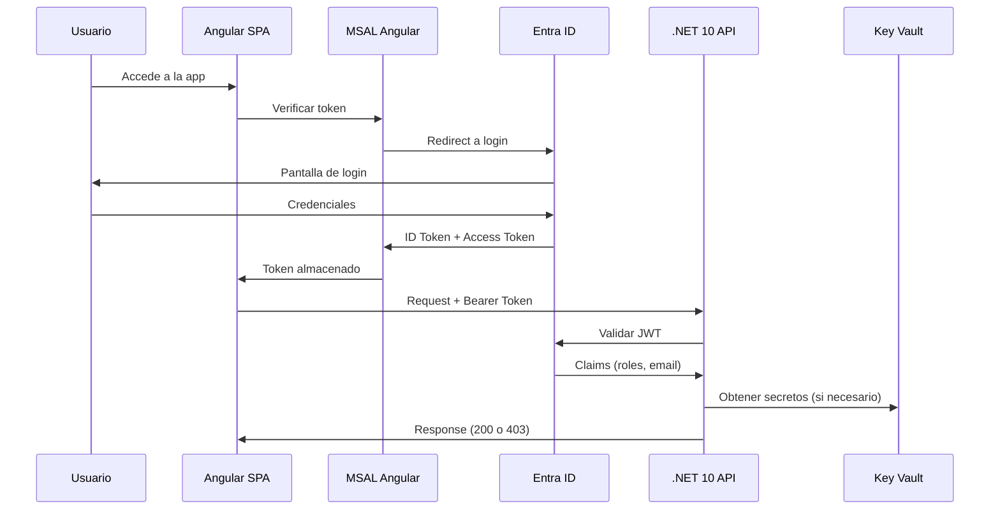

# F01 - W01 - Comprehensive Documentation

> **Feature:** F01 - Authentication and Authorization
> **Release:** 1.0 | **Sprint:** S01
> **Type:** Documentation | **Priority:** Critical (blocking)
> **Estimate:** 3 story points

---

## 1. General Description

Login con Microsoft Entra ID, roles (Abogado/Administrativo), guards de ruta, interceptors de auth.

---

## 2. Architecture Diagram



---

## 3. Data Model

### Tablas (Azure SQL)

No se crean tablas nuevas para auth. Se usa Entra ID como IdP.

**Tabla auxiliar: UsuarioPreferencias**

| Column | Type | Description |
|---------|------|-------------|
| Id | int (PK) | ID interno |
| EntraObjectId | nvarchar(128) | Object ID de Entra ID |
| Email | nvarchar(256) | User email |
| Rol | nvarchar(50) | abogado / administrativo |
| LastAccessAt | datetime2 | Last login |
| Preferencias | nvarchar(max) | JSON con preferencias de UI |

---

## 4. API Endpoints

| Method | Endpoint | Request | Response | Auth |
|--------|----------|---------|----------|------|
| GET | `/api/auth/me` | - | `{email, nombre, rol, permisos[]}` | Bearer |
| GET | `/api/auth/permisos` | - | `{modulos: [{nombre, lectura, escritura}]}` | Bearer |

---

## 5. UI / UX Description

### Pantallas

1. **Login Page:** Minimal page with the firm logo + an "Iniciar sesión con Microsoft" button. Redirects to Entra ID.
2. **Loading:** Spinner mientras se valida el token post-redirect.
3. **Error 403:** "Acceso denegado" page with a friendly message and a button to return to the dashboard.

### User flow
```
[Landing] → [Click "Iniciar sesión"] → [Entra ID login] → [Redirect callback] → [Dashboard]
```

---

## 6. Acceptance Criteria

- [ ] El login con Entra ID funciona correctamente (redirect y callback)
- [ ] The JWT token is automatically included in every HTTP request
- [ ] Protected routes redirect to login if there is no session
- [ ] A user with the "abogado" role can access all routes
- [ ] A user with the "administrativo" role can NOT access AI agent or risk analysis routes
- [ ] The token refreshes automatically before expiring
- [ ] El logout limpia el estado y redirige a la pantalla de login
- [ ] Si el backend devuelve 401, el interceptor redirige a login
- [ ] If the backend returns 403, an "Acceso denegado" message is shown

---

## 7. Dependencies

- **Blocks:** All other features (auth is a universal prerequisite)
- **Prerequisites:** Tenant de Entra ID configurado con App Registration
- **NuGet:** Microsoft.Identity.Web, Microsoft.AspNetCore.Authentication.JwtBearer
- **npm:** @azure/msal-angular, @azure/msal-browser

---

## 8. Technical Notes

- Validate the `id_token` cookie JWT against Entra OIDC (`Auth:Platform`) in .NET 10
- The SPA uses the platform session cookie with `withCredentials` (no MSAL)
- Almacenar tokens en sessionStorage (no localStorage) por seguridad
- Los roles se configuran como App Roles en Entra ID y llegan como claims en el JWT
- El `AuthInterceptor` debe manejar el refresh silencioso del token
- Para development, configurar un tenant de Entra ID de desarrollo

---

## 9. Work Items of this Feature

| ID | Name | Type | Sprint |
|----|--------|------|--------|
| F01-W01 | Comprehensive Documentation | doc | S01 |
| F01-W02 | Backend - Entra ID and JWT Configuration | backend | S01 |
| F01-W03 | Backend - Role-Based Authorization Middleware | backend | S01 |
| F01-W04 | Frontend - MSAL Angular Setup and AuthService | frontend | S01 |
| F01-W05 | Frontend - AuthGuard and RoleGuard | frontend | S01 |
| F01-W06 | Frontend - AuthInterceptor and ErrorInterceptor | frontend | S01 |
| F01-W07 | Testing - E2E Authentication Tests | testing | S01 |

---

## 10. Definition of Done

- [ ] Code reviewed by at least 1 peer (PR approved)
- [ ] Unit tests with > 80% coverage
- [ ] Integration tests for endpoints
- [ ] No errors in the CI build
- [ ] API documentation updated (Swagger/OpenAPI)
- [ ] Angular components documented with JSDoc
- [ ] Accessibility validated (WCAG 2.1 AA)
- [ ] Responsive verified on desktop and tablet
- [ ] Performance: load time < 3 sec, API response < 2 sec
- [ ] Feature flag configured (if applicable)

---

*F01 - Authentication and Authorization — Comprehensive Documentation — Legal Ai Ar*
