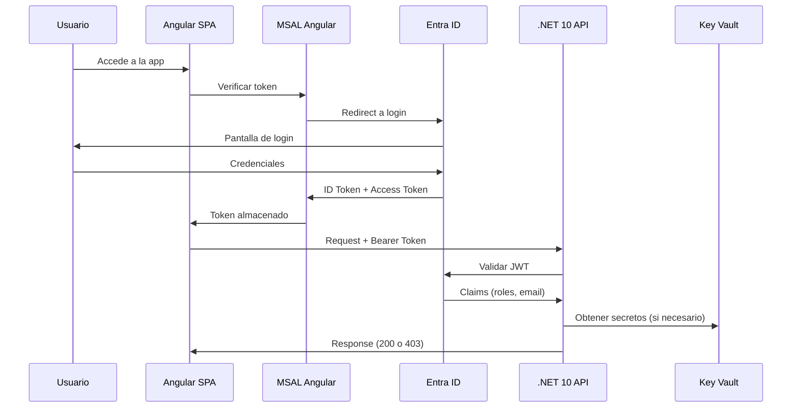

# F01 - W01 - Documentacion Integral

> **Feature:** F01 - Autenticacion y Autorizacion
> **Release:** 1.0 | **Sprint:** S01
> **Tipo:** Documentación | **Prioridad:** Crítica (bloqueante)
> **Estimación:** 3 story points

---

## 1. Descripción General

Login con Microsoft Entra ID, roles (Abogado/Administrativo), guards de ruta, interceptors de auth.

---

## 2. Diagrama de Arquitectura



---

## 3. Modelo de Datos

### Tablas (Azure SQL)

No se crean tablas nuevas para auth. Se usa Entra ID como IdP.

**Tabla auxiliar: UsuarioPreferencias**

| Columna | Tipo | Descripción |
|---------|------|-------------|
| Id | int (PK) | ID interno |
| EntraObjectId | nvarchar(128) | Object ID de Entra ID |
| Email | nvarchar(256) | Email del usuario |
| Rol | nvarchar(50) | abogado / administrativo |
| FechaUltimoAcceso | datetime2 | Último login |
| Preferencias | nvarchar(max) | JSON con preferencias de UI |

---

## 4. API Endpoints

| Método | Endpoint | Request | Response | Auth |
|--------|----------|---------|----------|------|
| GET | `/api/auth/me` | - | `{email, nombre, rol, permisos[]}` | Bearer |
| GET | `/api/auth/permisos` | - | `{modulos: [{nombre, lectura, escritura}]}` | Bearer |

---

## 5. Descripción de UI / UX

### Pantallas

1. **Login Page:** Página minimal con logo del estudio + botón "Iniciar sesión con Microsoft". Redirect a Entra ID.
2. **Loading:** Spinner mientras se valida el token post-redirect.
3. **Error 403:** Página de "Acceso denegado" con mensaje amigable y botón para volver al dashboard.

### Flujo de usuario
```
[Landing] → [Click "Iniciar sesión"] → [Entra ID login] → [Redirect callback] → [Dashboard]
```

---

## 6. Criterios de Aceptación

- [ ] El login con Entra ID funciona correctamente (redirect y callback)
- [ ] El token JWT se incluye automáticamente en cada request HTTP
- [ ] Las rutas protegidas redirigen a login si no hay sesión
- [ ] Un usuario con rol "abogado" puede acceder a todas las rutas
- [ ] Un usuario con rol "administrativo" NO puede acceder a rutas de agentes IA ni análisis de riesgo
- [ ] El token se refresca automáticamente antes de expirar
- [ ] El logout limpia el estado y redirige a la pantalla de login
- [ ] Si el backend devuelve 401, el interceptor redirige a login
- [ ] Si el backend devuelve 403, se muestra un mensaje de "Acceso denegado"

---

## 7. Dependencias

- **Bloquea:** Todas las demás features (auth es prerrequisito universal)
- **Prerrequisitos:** Tenant de Entra ID configurado con App Registration
- **NuGet:** Microsoft.Identity.Web, Microsoft.AspNetCore.Authentication.JwtBearer
- **npm:** @azure/msal-angular, @azure/msal-browser

---

## 8. Notas Técnicas

- Usar `Microsoft.Identity.Web` v3.x para validación de JWT en .NET 10
- MSAL Angular v4.x con configuración de scopes para la API
- Almacenar tokens en sessionStorage (no localStorage) por seguridad
- Los roles se configuran como App Roles en Entra ID y llegan como claims en el JWT
- El `AuthInterceptor` debe manejar el refresh silencioso del token
- Para development, configurar un tenant de Entra ID de desarrollo

---

## 9. Work Items de esta Feature

| ID | Nombre | Tipo | Sprint |
|----|--------|------|--------|
| F01-W01 | Documentacion Integral | doc | S01 |
| F01-W02 | Backend - Configuracion Entra ID y JWT | backend | S01 |
| F01-W03 | Backend - Middleware de Autorizacion por Rol | backend | S01 |
| F01-W04 | Frontend - MSAL Angular Setup y AuthService | frontend | S01 |
| F01-W05 | Frontend - AuthGuard y RoleGuard | frontend | S01 |
| F01-W06 | Frontend - AuthInterceptor y ErrorInterceptor | frontend | S01 |
| F01-W07 | Testing - Tests de Autenticacion E2E | testing | S01 |

---

## 10. Definition of Done

- [ ] Código revisado por al menos 1 peer (PR aprobado)
- [ ] Tests unitarios con cobertura > 80%
- [ ] Tests de integración para endpoints
- [ ] Sin errores en build de CI
- [ ] Documentación de API actualizada (Swagger/OpenAPI)
- [ ] Componentes Angular documentados con JSDoc
- [ ] Accesibilidad validada (WCAG 2.1 AA)
- [ ] Responsive verificado en desktop y tablet
- [ ] Performance: tiempo de carga < 3 seg, API response < 2 seg
- [ ] Feature flag configurado (si aplica)

---

*F01 - Autenticacion y Autorizacion — Documentación integral — Legal Ai Ar*
