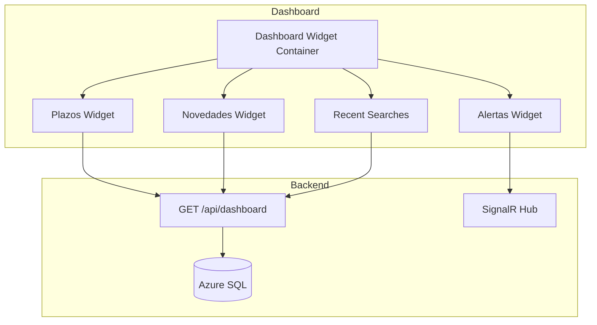

# F02 - W01 - Comprehensive Documentation

> **Feature:** F02 - Main Dashboard
> **Release:** 1.0 | **Sprint:** S02
> **Type:** Documentation | **Priority:** Critical (blocking)
> **Estimate:** 3 story points

---

## 1. General Description

Main post-login view with summary widgets: deadlines, recent searches, alerts, regulatory updates. Differentiated by role.

---

## 2. Architecture Diagram

---

## 3. Data Model

> Define the specific data model during the W01 implementation.
> Refer to the ontology in `docs/ontology/argentine-legal-ontology.md` for the base classes.

---

## 4. API Endpoints

| Method | Endpoint | Request | Response |
|--------|----------|---------|----------|
| GET | `/api/dashboard` | `?rol=abogado` | `{plazos[], novedades[], busquedasRecientes[], alertasPendientes}` |
| GET | `/api/dashboard/novedades` | `?limite=10` | `{items: [{tipo, norma, fecha, resumen}]}` |

---

## 5. UI / UX Description

> Define the UI mockups during implementation. Follow the Angular Material 19 + Tailwind CSS 4 guidelines.
> Refer to `docs/roadmap/features.md` for the functional UI description.

---

## 6. Acceptance Criteria

- [ ] The functionality described in the Description section is fully implemented
- [ ] The API endpoints return the expected data
- [ ] The UI is responsive and functional on desktop and tablet
- [ ] Unit tests cover > 80% of the new code
- [ ] The CI build passes with no errors
- [ ] The functionality is accessible (WCAG 2.1 AA)

---

## 7. Dependencies

- **Depends on:** F01 (Auth), FT03 (Tema)
- **NuGet:** ninguno adicional
- **npm:** @angular/material, @angular/cdk

---

## 8. Technical Notes

- Stack: Angular 19 (standalone components, signals) + .NET 10 Minimal API
- Database: Azure SQL with EF Core 10 + Graph Tables
- Search: Azure AI Search with hybrid scoring
- Auth: platform-managed Microsoft Entra SSO via `id_token` cookie (no MSAL); the API validates it (`Auth:Platform`)
- Real-time communication: SignalR
- Storage: Azure Blob Storage for documents
- Refer to the ontology (`docs/ontology/argentine-legal-ontology.md`) for the domain model

---

## 9. Work Items of this Feature

| ID | Name | Type | Sprint |
|----|--------|------|--------|
| F02-W01 | Comprehensive Documentation | doc | S02 |
| F02-W02 | Backend - Dashboard Aggregator Endpoint | backend | S02 |
| F02-W03 | Frontend - Shell Layout Sidebar and Navbar | frontend | S02 |
| F02-W04 | Frontend - Dashboard Component and Widgets | frontend | S02 |
| F02-W05 | Frontend - Upcoming Deadlines Widget | frontend | S02 |
| F02-W06 | Frontend - Regulatory Updates Widget | frontend | S02 |
| F02-W07 | Testing - Dashboard Tests | testing | S02 |

---

## 10. Definition of Done

- [ ] Code reviewed by at least 1 peer (PR approved)
- [ ] Unit tests with > 80% coverage
- [ ] Integration tests for endpoints
- [ ] No errors in the CI build
- [ ] API documentation updated (Swagger/OpenAPI)
- [ ] Angular components documented with JSDoc
- [ ] Accessibility validated (WCAG 2.1 AA)
- [ ] Responsive verified on desktop and tablet
- [ ] Performance: load time < 3 sec, API response < 2 sec
- [ ] Feature flag configured (if applicable)

---

*F02 - Main Dashboard — Comprehensive Documentation — Legal Ai Ar*
