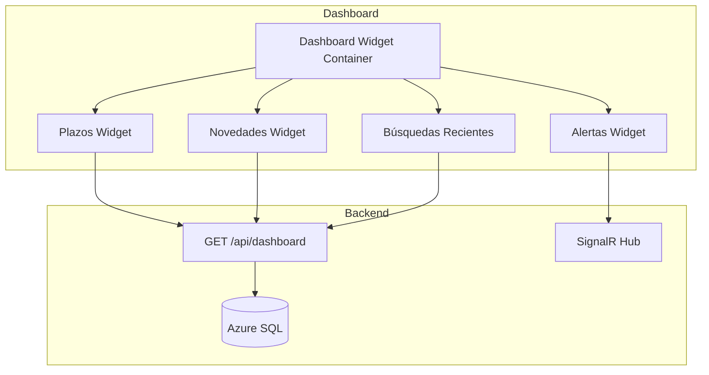

# F02 - W01 - Documentacion Integral

> **Feature:** F02 - Dashboard Principal
> **Release:** 1.0 | **Sprint:** S02
> **Tipo:** Documentación | **Prioridad:** Crítica (bloqueante)
> **Estimación:** 3 story points

---

## 1. Descripción General

Vista principal post-login con widgets de resumen: plazos, búsquedas recientes, alertas, novedades normativas. Diferenciado por rol.

---

## 2. Diagrama de Arquitectura

---

## 3. Modelo de Datos

> Definir modelo de datos específico durante la implementación del W01.
> Referir a la ontología en `docs/ontologia/ontologia_legal_argentina.md` para las clases base.

---

## 4. API Endpoints

| Método | Endpoint | Request | Response |
|--------|----------|---------|----------|
| GET | `/api/dashboard` | `?rol=abogado` | `{plazos[], novedades[], busquedasRecientes[], alertasPendientes}` |
| GET | `/api/dashboard/novedades` | `?limite=10` | `{items: [{tipo, norma, fecha, resumen}]}` |

---

## 5. Descripción de UI / UX

> Definir mockups de UI durante la implementación. Seguir las guidelines de Angular Material 19 + Tailwind CSS 4.
> Referir a `docs/roadmap/features.md` para la descripción funcional de la UI.

---

## 6. Criterios de Aceptación

- [ ] La funcionalidad descrita en la sección de Descripción está completamente implementada
- [ ] Los endpoints de API retornan los datos esperados
- [ ] La UI es responsive y funcional en desktop y tablet
- [ ] Los tests unitarios cubren > 80% del código nuevo
- [ ] El build de CI pasa sin errores
- [ ] La funcionalidad es accesible (WCAG 2.1 AA)

---

## 7. Dependencias

- **Depende de:** F01 (Auth), FT03 (Tema)
- **NuGet:** ninguno adicional
- **npm:** @angular/material, @angular/cdk

---

## 8. Notas Técnicas

- Stack: Angular 19 (standalone components, signals) + .NET 10 Minimal API
- Base de datos: Azure SQL con EF Core 10 + Graph Tables
- Búsqueda: Azure AI Search con scoring híbrido
- Auth: Microsoft Entra ID con MSAL Angular + Microsoft.Identity.Web
- Comunicación real-time: SignalR
- Storage: Azure Blob Storage para documentos
- Referir a la ontología (`docs/ontologia/ontologia_legal_argentina.md`) para el modelo de dominio

---

## 9. Work Items de esta Feature

| ID | Nombre | Tipo | Sprint |
|----|--------|------|--------|
| F02-W01 | Documentacion Integral | doc | S02 |
| F02-W02 | Backend - Endpoint Agregador Dashboard | backend | S02 |
| F02-W03 | Frontend - Layout Shell Sidebar y Navbar | frontend | S02 |
| F02-W04 | Frontend - Dashboard Component y Widgets | frontend | S02 |
| F02-W05 | Frontend - Widget Plazos Proximos | frontend | S02 |
| F02-W06 | Frontend - Widget Novedades Normativas | frontend | S02 |
| F02-W07 | Testing - Tests de Dashboard | testing | S02 |

---

## 10. Definition of Done

- [ ] Código revisado por al menos 1 peer (PR aprobado)
- [ ] Tests unitarios con cobertura > 80%
- [ ] Tests de integración para endpoints
- [ ] Sin errores en build de CI
- [ ] Documentación de API actualizada (Swagger/OpenAPI)
- [ ] Componentes Angular documentados con JSDoc
- [ ] Accesibilidad validada (WCAG 2.1 AA)
- [ ] Responsive verificado en desktop y tablet
- [ ] Performance: tiempo de carga < 3 seg, API response < 2 seg
- [ ] Feature flag configurado (si aplica)

---

*F02 - Dashboard Principal — Documentación integral — Legal Ai Ar*
