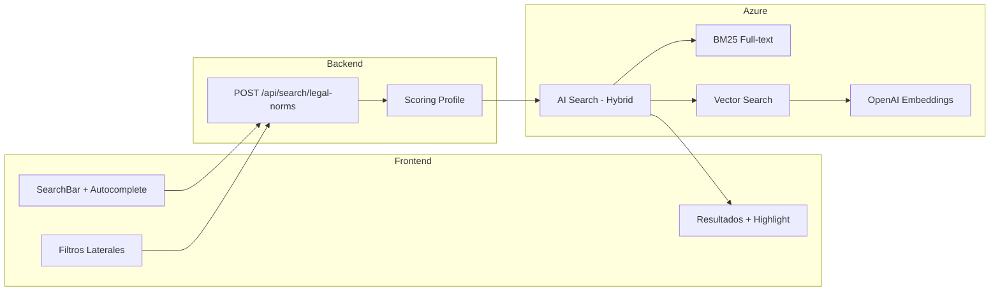

# F03 - W01 - Comprehensive Documentation

> **Feature:** F03 - Legal Norm Search
> **Release:** 1.0 | **Sprint:** S02-S03
> **Type:** Documentation | **Priority:** Critical (blocking)
> **Estimate:** 3 story points

---

## 1. General Description

Semantic search of Argentine legislation with filters by branch, jurisdiction, validity, norm type, and date range.

---

## 2. Architecture Diagram



---

## 3. Data Model

### Índice AI Search: `idx-normas`

| Campo | Tipo AI Search | Searchable | Filterable | Sortable | Facetable |
|-------|---------------|:----------:|:----------:|:--------:|:---------:|
| id | Edm.String (key) | - | - | - | - |
| numero | Edm.String | ✅ | ✅ | ✅ | - |
| denominacion | Edm.String | ✅ | - | - | - |
| textoCompleto | Edm.String | ✅ | - | - | - |
| ramaDelDerecho | Edm.String | - | ✅ | - | ✅ |
| ambitoTerritorial | Edm.String | - | ✅ | - | ✅ |
| estaVigente | Edm.Boolean | - | ✅ | - | ✅ |
| fechaSancion | Edm.DateTimeOffset | - | ✅ | ✅ | - |
| jerarquiaNivel | Edm.Int32 | - | ✅ | ✅ | - |
| embedding | Collection(Edm.Single) | - | - | - | - |

**Scoring Profile: `sp-normas-relevancia`**
- BM25 weight: 0.6
- Vector weight: 0.3
- Freshness boost (fechaSancion): 0.05
- Vigencia boost (estaVigente=true): 0.05

---

## 4. API Endpoints

| Method | Endpoint | Request Body | Response |
|--------|----------|-------------|----------|
| POST | `/api/search/legal-norms` | `{query, filters: {rama?, vigencia?, jurisdiccion?, dateFrom?, dateTo?, tipo?}, page, pageSize}` | `{total, items: [{id, numero, denominacion, rama, vigente, snippet, score}], facets: {rama: [], vigencia: []}}` |
| GET | `/api/search/suggestions` | `?q=prescripcion+laboral` | `{suggestions: ["prescripción laboral", "prescripción penal", ...]}` |

---

## 5. UI / UX Description

### Page layout

```
┌─────────────────────────────────────────────────────────┐
│  [🔍 Buscar normas... (autocompletado)         ] [Buscar] │
├──────────────┬──────────────────────────────────────────┤
│  FILTROS     │  RESULTADOS                              │
│              │                                          │
│  Rama:       │  📄 Ley 26.994 - Código Civil y...      │
│  ☑ Civil     │     ...el plazo de **prescripción** es   │
│  ☑ Penal     │     Vigente | Nacional | Civil           │
│  ☐ Laboral   │  ─────────────────────────────────────   │
│              │  📄 Ley 20.744 - Contrato de Trabajo     │
│  Vigencia:   │     ...la **prescripción** de acciones   │
│  ◉ Vigentes  │     Vigente | Nacional | Laboral         │
│  ○ Todas     │  ─────────────────────────────────────   │
│              │  📄 Ley 11.179 - Código Penal            │
│  Jurisdicción│     ...acción penal **prescribe**...     │
│  ☑ Nacional  │     Vigente | Nacional | Penal           │
│  ☐ Provincial│                                          │
│              │  ◀ 1 2 3 ... 15 ▶                        │
└──────────────┴──────────────────────────────────────────┘
```

---

## 6. Acceptance Criteria

- [ ] Search returns results in under 2 seconds
- [ ] The most relevant results appear in the top 5
- [ ] Autocomplete shows suggestions after 300ms of inactivity
- [ ] Filters show a dynamic count (facets) of results per category
- [ ] Pagination works correctly with 20 results per page
- [ ] Highlighting emphasizes the searched terms in the snippets
- [ ] Natural-language search works (e.g., "plazo para reclamar daños")
- [ ] Filters can be combined (branch + validity + jurisdiction)
- [ ] When filters are cleared, all query results are shown

---

## 7. Dependencies

- **Depends on:** F01 (Auth), Pipeline ETL (normas ingestadas en AI Search)
- **Blocks:** F05 (Legal Norm Detail), F04 (Case Law Search)
- **NuGet:** Azure.Search.Documents
- **npm:** ninguno adicional

---

## 8. Technical Notes

- Usar Azure AI Search SDK `Azure.Search.Documents` v12.x para .NET 10
- El scoring profile combina BM25 (0.6) + vector (0.3) + freshness (0.05) + vigencia (0.05)
- Los embeddings se generan con `text-embedding-3-large` de Azure OpenAI
- Norm chunking: each article/clause is an independent chunk for better precision
- El autocompletado usa el suggester de AI Search (campo: denominacion + nombreComun)
- Implement a 300ms debounce on the frontend for autocomplete
- Los facets de AI Search se mapean 1:1 con los filters laterales

---

## 9. Work Items of this Feature

| ID | Name | Type | Sprint |
|----|--------|------|--------|
| F03-W01 | Comprehensive Documentation | doc | S02-S03 |
| F03-W02 | Backend - AI Search Index for Legal Norms | backend | S02-S03 |
| F03-W03 | Backend - Hybrid BM25 and Vector Scoring Profile | backend | S02-S03 |
| F03-W04 | Backend - POST Search Legal Norms Endpoint | backend | S02-S03 |
| F03-W05 | Frontend - SearchBar with Autocomplete | frontend | S02-S03 |
| F03-W06 | Frontend - Sidebar Filters with Facets | frontend | S02-S03 |
| F03-W07 | Frontend - Results List with Highlight | frontend | S02-S03 |
| F03-W08 | Testing - Legal Norm Search Tests | testing | S02-S03 |

---

## 10. Definition of Done

- [ ] Code reviewed by at least 1 peer (PR approved)
- [ ] Unit tests with > 80% coverage
- [ ] Integration tests for endpoints
- [ ] No errors in the CI build
- [ ] API documentation updated (Swagger/OpenAPI)
- [ ] Angular components documented with JSDoc
- [ ] Accessibility validated (WCAG 2.1 AA)
- [ ] Responsive verified on desktop and tablet
- [ ] Performance: load time < 3 sec, API response < 2 sec
- [ ] Feature flag configured (if applicable)

---

*F03 - Legal Norm Search — Comprehensive Documentation — Legal Ai Ar*
