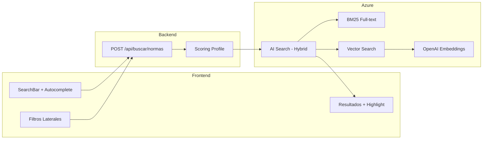

# F03 - W01 - Documentacion Integral

> **Feature:** F03 - Busqueda de Normas
> **Release:** 1.0 | **Sprint:** S02-S03
> **Tipo:** Documentación | **Prioridad:** Crítica (bloqueante)
> **Estimación:** 3 story points

---

## 1. Descripción General

Buscador semántico de legislación argentina con filtros por rama, jurisdicción, vigencia, tipo de norma y rango de fechas.

---

## 2. Diagrama de Arquitectura



---

## 3. Modelo de Datos

### Índice AI Search: `idx-normas`

| Campo | Tipo AI Search | Searchable | Filterable | Sortable | Facetable |
|-------|---------------|:----------:|:----------:|:--------:|:---------:|
| id | Edm.String (key) | - | - | - | - |
| numero | Edm.String | ✅ | ✅ | ✅ | - |
| denominacion | Edm.String | ✅ | - | - | - |
| textoCompleto | Edm.String | ✅ | - | - | - |
| ramaDelDerecho | Edm.String | - | ✅ | - | ✅ |
| ambitoTerritorial | Edm.String | - | ✅ | - | ✅ |
| estaVigente | Edm.Boolean | - | ✅ | - | ✅ |
| fechaSancion | Edm.DateTimeOffset | - | ✅ | ✅ | - |
| jerarquiaNivel | Edm.Int32 | - | ✅ | ✅ | - |
| embedding | Collection(Edm.Single) | - | - | - | - |

**Scoring Profile: `sp-normas-relevancia`**
- BM25 weight: 0.6
- Vector weight: 0.3
- Freshness boost (fechaSancion): 0.05
- Vigencia boost (estaVigente=true): 0.05

---

## 4. API Endpoints

| Método | Endpoint | Request Body | Response |
|--------|----------|-------------|----------|
| POST | `/api/buscar/normas` | `{query, filtros: {rama?, vigencia?, jurisdiccion?, fechaDesde?, fechaHasta?, tipo?}, page, pageSize}` | `{total, items: [{id, numero, denominacion, rama, vigente, snippet, score}], facets: {rama: [], vigencia: []}}` |
| GET | `/api/buscar/sugerencias` | `?q=prescripcion+laboral` | `{sugerencias: ["prescripción laboral", "prescripción penal", ...]}` |

---

## 5. Descripción de UI / UX

### Layout de la página

```
┌─────────────────────────────────────────────────────────┐
│  [🔍 Buscar normas... (autocompletado)         ] [Buscar] │
├──────────────┬──────────────────────────────────────────┤
│  FILTROS     │  RESULTADOS                              │
│              │                                          │
│  Rama:       │  📄 Ley 26.994 - Código Civil y...      │
│  ☑ Civil     │     ...el plazo de **prescripción** es   │
│  ☑ Penal     │     Vigente | Nacional | Civil           │
│  ☐ Laboral   │  ─────────────────────────────────────   │
│              │  📄 Ley 20.744 - Contrato de Trabajo     │
│  Vigencia:   │     ...la **prescripción** de acciones   │
│  ◉ Vigentes  │     Vigente | Nacional | Laboral         │
│  ○ Todas     │  ─────────────────────────────────────   │
│              │  📄 Ley 11.179 - Código Penal            │
│  Jurisdicción│     ...acción penal **prescribe**...     │
│  ☑ Nacional  │     Vigente | Nacional | Penal           │
│  ☐ Provincial│                                          │
│              │  ◀ 1 2 3 ... 15 ▶                        │
└──────────────┴──────────────────────────────────────────┘
```

---

## 6. Criterios de Aceptación

- [ ] La búsqueda retorna resultados en menos de 2 segundos
- [ ] Los resultados más relevantes aparecen en el top 5
- [ ] El autocompletado muestra sugerencias después de 300ms de inactividad
- [ ] Los filtros muestran conteo dinámico (facets) de resultados por categoría
- [ ] La paginación funciona correctamente con 20 resultados por página
- [ ] El highlighting resalta los términos buscados en los snippets
- [ ] La búsqueda por lenguaje natural funciona (ej: "plazo para reclamar daños")
- [ ] Los filtros se pueden combinar (rama + vigencia + jurisdicción)
- [ ] Al limpiar filtros, se muestran todos los resultados de la query

---

## 7. Dependencias

- **Depende de:** F01 (Auth), Pipeline ETL (normas ingestadas en AI Search)
- **Bloquea:** F05 (Detalle de Norma), F04 (Búsqueda Jurisprudencia)
- **NuGet:** Azure.Search.Documents
- **npm:** ninguno adicional

---

## 8. Notas Técnicas

- Usar Azure AI Search SDK `Azure.Search.Documents` v12.x para .NET 10
- El scoring profile combina BM25 (0.6) + vector (0.3) + freshness (0.05) + vigencia (0.05)
- Los embeddings se generan con `text-embedding-3-large` de Azure OpenAI
- Chunking de normas: cada artículo/inciso es un chunk independiente para mejor precisión
- El autocompletado usa el suggester de AI Search (campo: denominacion + nombreComun)
- Implementar debounce de 300ms en el frontend para el autocompletado
- Los facets de AI Search se mapean 1:1 con los filtros laterales

---

## 9. Work Items de esta Feature

| ID | Nombre | Tipo | Sprint |
|----|--------|------|--------|
| F03-W01 | Documentacion Integral | doc | S02-S03 |
| F03-W02 | Backend - Indice AI Search para Normas | backend | S02-S03 |
| F03-W03 | Backend - Scoring Profile Hibrido BM25 y Vectores | backend | S02-S03 |
| F03-W04 | Backend - Endpoint POST Buscar Normas | backend | S02-S03 |
| F03-W05 | Frontend - SearchBar con Autocompletado | frontend | S02-S03 |
| F03-W06 | Frontend - Filtros Laterales con Facets | frontend | S02-S03 |
| F03-W07 | Frontend - Lista de Resultados con Highlight | frontend | S02-S03 |
| F03-W08 | Testing - Tests de Busqueda de Normas | testing | S02-S03 |

---

## 10. Definition of Done

- [ ] Código revisado por al menos 1 peer (PR aprobado)
- [ ] Tests unitarios con cobertura > 80%
- [ ] Tests de integración para endpoints
- [ ] Sin errores en build de CI
- [ ] Documentación de API actualizada (Swagger/OpenAPI)
- [ ] Componentes Angular documentados con JSDoc
- [ ] Accesibilidad validada (WCAG 2.1 AA)
- [ ] Responsive verificado en desktop y tablet
- [ ] Performance: tiempo de carga < 3 seg, API response < 2 seg
- [ ] Feature flag configurado (si aplica)

---

*F03 - Busqueda de Normas — Documentación integral — Legal Ai Ar*
