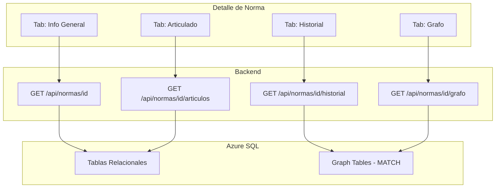

# F05 - W01 - Documentacion Integral

> **Feature:** F05 - Detalle de Norma
> **Release:** 1.0 | **Sprint:** S03-S04
> **Tipo:** Documentación | **Prioridad:** Crítica (bloqueante)
> **Estimación:** 3 story points

---

## 1. Descripción General

Vista completa de norma jurídica: metadata, articulado navegable, historial de modificaciones, grafo de relaciones.

---

## 2. Diagrama de Arquitectura

---

## 3. Modelo de Datos

> Definir modelo de datos específico durante la implementación del W01.
> Referir a la ontología en `docs/ontologia/ontologia_legal_argentina.md` para las clases base.

---

## 4. API Endpoints

| Método | Endpoint | Params | Response |
|--------|----------|--------|----------|
| GET | `/api/normas/{id}` | - | `{id, numero, denominacion, fechaSancion, estaVigente, ramaDelDerecho, textoCompleto, ...}` |
| GET | `/api/normas/{id}/articulos` | `?page=1&pageSize=50` | `{total, items: [{numero, texto, vigente, incisos[]}]}` |
| GET | `/api/normas/{id}/grafo` | `?profundidad=2` | `{nodos: [{id, tipo, label}], edges: [{source, target, tipo}]}` |
| GET | `/api/normas/{id}/historial` | - | `{modificaciones: [{normaModificatoria, fecha, tipo}]}` |

---

## 5. Descripción de UI / UX

> Definir mockups de UI durante la implementación. Seguir las guidelines de Angular Material 19 + Tailwind CSS 4.
> Referir a `docs/roadmap/features.md` para la descripción funcional de la UI.

---

## 6. Criterios de Aceptación

- [ ] La funcionalidad descrita en la sección de Descripción está completamente implementada
- [ ] Los endpoints de API retornan los datos esperados
- [ ] La UI es responsive y funcional en desktop y tablet
- [ ] Los tests unitarios cubren > 80% del código nuevo
- [ ] El build de CI pasa sin errores
- [ ] La funcionalidad es accesible (WCAG 2.1 AA)

---

## 7. Dependencias

- **Depende de:** F01 (Auth)
- **Referir a features.md** para dependencias detalladas entre features

---

## 8. Notas Técnicas

- Stack: Angular 19 (standalone components, signals) + .NET 10 Minimal API
- Base de datos: Azure SQL con EF Core 10 + Graph Tables
- Búsqueda: Azure AI Search con scoring híbrido
- Auth: Microsoft Entra ID con MSAL Angular + Microsoft.Identity.Web
- Comunicación real-time: SignalR
- Storage: Azure Blob Storage para documentos
- Referir a la ontología (`docs/ontologia/ontologia_legal_argentina.md`) para el modelo de dominio

---

## 9. Work Items de esta Feature

| ID | Nombre | Tipo | Sprint |
|----|--------|------|--------|
| F05-W01 | Documentacion Integral | doc | S03-S04 |
| F05-W02 | Backend - Endpoint GET Norma Detalle | backend | S03-S04 |
| F05-W03 | Backend - Endpoint GET Norma Grafo SQL Graph | backend | S03-S04 |
| F05-W04 | Backend - Endpoint GET Norma Articulos Paginado | backend | S03-S04 |
| F05-W05 | Frontend - Pagina Detalle de Norma con Tabs | frontend | S03-S04 |
| F05-W06 | Frontend - Visualizacion Grafo de Relaciones | frontend | S03-S04 |
| F05-W07 | Frontend - Timeline de Modificaciones | frontend | S03-S04 |
| F05-W08 | Testing - Tests de Detalle de Norma | testing | S03-S04 |

---

## 10. Definition of Done

- [ ] Código revisado por al menos 1 peer (PR aprobado)
- [ ] Tests unitarios con cobertura > 80%
- [ ] Tests de integración para endpoints
- [ ] Sin errores en build de CI
- [ ] Documentación de API actualizada (Swagger/OpenAPI)
- [ ] Componentes Angular documentados con JSDoc
- [ ] Accesibilidad validada (WCAG 2.1 AA)
- [ ] Responsive verificado en desktop y tablet
- [ ] Performance: tiempo de carga < 3 seg, API response < 2 seg
- [ ] Feature flag configurado (si aplica)

---

*F05 - Detalle de Norma — Documentación integral — Legal Ai Ar*
