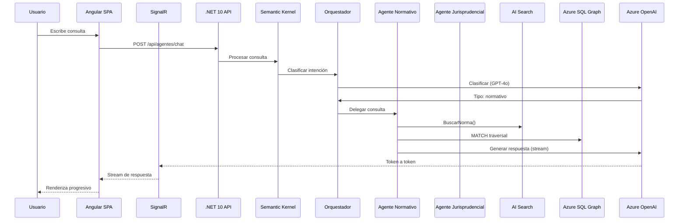

# F08 - W01 - Documentacion Integral

> **Feature:** F08 - Chat con Agentes IA
> **Release:** 2.0 | **Sprint:** S05-S06
> **Tipo:** Documentación | **Prioridad:** Crítica (bloqueante)
> **Estimación:** 3 story points

---

## 1. Descripción General

Interfaz de chat para interactuar con agentes especializados. Streaming de respuesta, citación de fuentes, historial de conversaciones.

---

## 2. Diagrama de Arquitectura



---

## 3. Modelo de Datos

> Definir modelo de datos específico durante la implementación del W01.
> Referir a la ontología en `docs/ontologia/ontologia_legal_argentina.md` para las clases base.

---

## 4. API Endpoints

> Los endpoints específicos se definirán en base al documento de features: `docs/roadmap/features.md`, sección API Endpoints.

---

## 5. Descripción de UI / UX

### Layout del chat

```
┌──────────────────────────────────────────┬─────────────┐
│  CONVERSACIÓN                            │  FUENTES    │
│                                          │             │
│  👤 ¿Cuál es el plazo de prescripción   │  📄 Art. 2562│
│     para un reclamo por daños?           │     CCCN    │
│                                          │             │
│  🤖 Según el art. 2562 del CCCN, el     │  ⚖️ CSJN    │
│     plazo de prescripción para la        │  "Gómez c/  │
│     acción por daños derivados de la     │   Estado"   │
│     responsabilidad civil es de **3      │  2024       │
│     años** contados desde...             │             │
│     [ver más]                            │             │
│                                          │             │
│  📎 Fuentes: Art. 2562 CCCN | Gómez c/  │             │
│     Estado Nacional (CSJN, 2024)         │             │
│                                          │             │
├──────────────────────────────────────────┤             │
│  [Escribe tu consulta...        ] [Enviar]│             │
└──────────────────────────────────────────┴─────────────┘
```

---

## 6. Criterios de Aceptación

- [ ] El usuario puede escribir una consulta y recibir respuesta del agente
- [ ] La respuesta se renderiza progresivamente (streaming token a token)
- [ ] Cada respuesta incluye fuentes citadas (normas, fallos) como links clickeables
- [ ] Las fuentes llevan a la vista de detalle de la norma/fallo correspondiente
- [ ] El historial de conversaciones persiste entre sesiones
- [ ] El markdown en las respuestas se renderiza correctamente (headers, listas, code blocks)
- [ ] El indicador de "pensando" se muestra mientras el agente procesa
- [ ] Se puede exportar una conversación a .docx
- [ ] Solo los usuarios con rol "abogado" tienen acceso al chat

---

## 7. Dependencias

- **Depende de:** F01 (Auth), F03 (búsqueda de normas funcional), F04 (búsqueda jurisprudencia funcional)
- **Bloquea:** F09, F10, F11 (agentes especializados), F15 (análisis de riesgo)
- **NuGet:** Microsoft.SemanticKernel, Microsoft.AspNetCore.SignalR
- **npm:** @microsoft/signalr, ngx-markdown

---

## 8. Notas Técnicas

- Semantic Kernel SDK v1.x para .NET 10
- El orquestador usa un prompt de clasificación de intención para rutear al agente correcto
- SignalR con protocolo MessagePack para mejor performance en streaming
- Cada mensaje del agente incluye metadata: `{sources: [{tipo, id, titulo, url}]}`
- El historial se almacena en Azure SQL (tabla Conversacion + tabla Mensaje)
- Limitar el contexto a los últimos 10 mensajes para evitar exceder el token limit
- Usar `IChatCompletionService` con streaming para la generación de respuestas

---

## 9. Work Items de esta Feature

| ID | Nombre | Tipo | Sprint |
|----|--------|------|--------|
| F08-W01 | Documentacion Integral | doc | S05-S06 |
| F08-W02 | Backend - Semantic Kernel Setup y Orquestador | backend | S05-S06 |
| F08-W03 | Backend - Endpoint POST Chat con SignalR Streaming | backend | S05-S06 |
| F08-W04 | Backend - Persistencia de Conversaciones | backend | S05-S06 |
| F08-W05 | Frontend - Chat UI con Markdown Rendering | frontend | S05-S06 |
| F08-W06 | Frontend - SignalR Client para Streaming | frontend | S05-S06 |
| F08-W07 | Frontend - Panel de Fuentes Citadas | frontend | S05-S06 |
| F08-W08 | Frontend - Historial de Conversaciones | frontend | S05-S06 |
| F08-W09 | Testing - Tests de Chat E2E | testing | S05-S06 |

---

## 10. Definition of Done

- [ ] Código revisado por al menos 1 peer (PR aprobado)
- [ ] Tests unitarios con cobertura > 80%
- [ ] Tests de integración para endpoints
- [ ] Sin errores en build de CI
- [ ] Documentación de API actualizada (Swagger/OpenAPI)
- [ ] Componentes Angular documentados con JSDoc
- [ ] Accesibilidad validada (WCAG 2.1 AA)
- [ ] Responsive verificado en desktop y tablet
- [ ] Performance: tiempo de carga < 3 seg, API response < 2 seg
- [ ] Feature flag configurado (si aplica)

---

*F08 - Chat con Agentes IA — Documentación integral — Legal Ai Ar*
