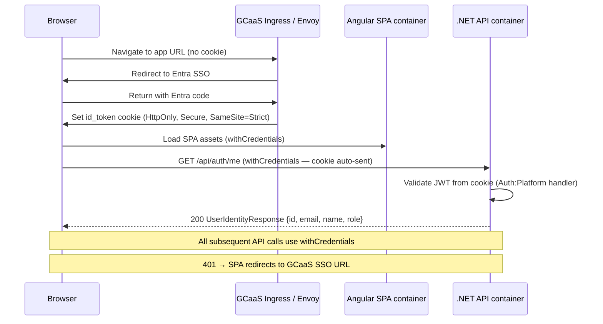

# F1.1 - W01 - Comprehensive Documentation

> **Feature:** F1.1 - Authentication & Corporate SSO
> **Release:** 1.0 | **Sprint:** S01
> **Type:** documentation | **Priority:** Critical (blocking all R1 features)
> **Estimate:** 3 story points
> **Assignable to:** Tech Lead

---

## 1. Feature Overview

Replace the simulated/dev auth used in R0.0 with **production platform-managed Entra SSO** as mandated by
[PwC Internal Application Architecture §1 and §5](../../standards/pwc-internal-app-architecture.md).

The GCaaS ingress validates the user's Entra session and sets an **`id_token` HTTP-only cookie**. The API
validates this cookie; the SPA sends all requests with `withCredentials: true`. No MSAL, no
`/login` redirect owned by the app, no Bearer tokens in browser storage.

**MVP delta:** The MVP has a simulated auth (likely a dev bypass or a stub `GET /api/auth/me`). This
feature replaces it end-to-end with production cookie validation, role extraction, and proper 401/403
handling throughout the stack.

---

## 2. Authentication Sequence



---

## 3. Backend Architecture

### 3.1 Auth handler (Infrastructure)

Register a custom `IAuthenticationHandler` (or use `JwtBearerHandler` configured to read from cookie):

```
LegalAiAr.Infrastructure/
└── Auth/
    ├── PlatformAuthHandler.cs          # Reads id_token cookie, validates JWT
    ├── PlatformAuthOptions.cs          # Issuer, Audience, etc. from config
    └── ServiceCollectionExtensions.cs  # AddPlatformAuth()
```

Configuration keys (`appsettings.{env}.json` / Vault):

```json
"Auth": {
  "Platform": {
    "Issuer": "https://login.microsoftonline.com/{tenantId}/v2.0",
    "Audience": "api://legal-ai-ar",
    "CookieName": "id_token"
  }
}
```

### 3.2 Role-based authorization

Roles come from the `roles` claim in the `id_token` (populated by Entra app role assignments):

| Claim value       | Internal role              |
| ----------------- | -------------------------- |
| `Partner`         | `partner` / Manager-level  |
| `Senior`          | `senior`                   |
| `Associate`       | `associate`                |
| `Admin`           | `admin`                    |

Policy definitions (registered in `Program.cs` / Infrastructure):

```csharp
options.AddPolicy("AdminOnly", p => p.RequireRole("admin"));
options.AddPolicy("PwCStaff", p => p.RequireRole("partner", "senior", "associate", "admin"));
```

### 3.3 Endpoints

| Method | Route              | Auth    | Description                                    |
| ------ | ------------------ | ------- | ---------------------------------------------- |
| GET    | `/api/auth/me`     | cookie  | Returns current user identity + roles          |
| POST   | `/api/auth/logout` | cookie  | Instructs the SPA to redirect to GCaaS logout  |

`GET /api/auth/me` already exists from F0.0-W09 (`GetAuthMe.cs`). This WI replaces the stub with real
validation.

### 3.4 Contracts (`LegalAiAr.Contracts`)

```csharp
// Auth/UserIdentityResponse.cs
public sealed record UserIdentityResponse(
    string Id,           // Entra Object ID
    string Email,
    string DisplayName,
    string Role,         // primary role claim
    IReadOnlyList<string> Roles);
```

---

## 4. Frontend Architecture

### 4.1 Auth service (`core/auth/`)

```typescript
// core/auth/auth.service.ts
@Injectable({ providedIn: 'root' })
export class AuthService {
  private readonly _identity = signal<UserIdentity | null>(null);
  readonly identity = this._identity.asReadonly();
  readonly isAuthenticated = computed(() => this._identity() !== null);

  bootstrap(): Observable<void>;   // called in APP_INITIALIZER
  logout(): void;                  // redirect to GCaaS logout URL
}
```

Bootstrap flow: `GET /api/auth/me` → populate `_identity` signal → if 401, redirect to
`environment.ssoLoginUrl` (set per deployment config).

### 4.2 HTTP interceptor

```
core/interceptors/auth.interceptor.ts
```

Adds `withCredentials: true` to every `HttpClient` request. Intercepts 401 responses and redirects
to the SSO login URL.

### 4.3 Auth guard

```
core/guards/auth.guard.ts
```

`CanActivateFn` — checks `authService.isAuthenticated()` signal. If false, redirects to login.
Loaded on every lazy-loaded route.

### 4.4 Role guard / directive

```
core/guards/role.guard.ts
core/directives/has-role.directive.ts   (structural directive *appHasRole="'admin'")
```

### 4.5 Environments

Each `environment.{env}.ts` exposes:

```typescript
export const environment = {
  apiBaseUrl: '...',
  ssoLoginUrl: 'https://...',   // GCaaS logout / re-auth URL
};
```

---

## 5. Error handling

| HTTP status | SPA behaviour                                  |
| ----------- | ---------------------------------------------- |
| 401         | Redirect to `environment.ssoLoginUrl`          |
| 403         | Show "access denied" toast; stay on page       |
| 5xx         | Global error toast; log to Application Insights|

---

## 6. Testing

- **Unit** — `PlatformAuthHandler` validates a known JWT with correct/wrong audience.
- **Unit** — `AuthService.bootstrap()` handles 200 and 401 correctly.
- **Architecture** — no `Authorization: Bearer` header set anywhere in the SPA (forbidden pattern).
- **Integration** — protected endpoint returns 401 with no cookie, 200 with valid cookie.

---

## 7. Work Items

| ID      | Name                                         | Type     | SP  |
| ------- | -------------------------------------------- | -------- | --- |
| F1.1-W01| Comprehensive Documentation                  | doc      | 3   |
| F1.1-W02| Platform Auth Middleware and JWT Validation  | backend  | 5   |
| F1.1-W03| Frontend Auth Service, Interceptor and Guards| frontend | 5   |

**F1.1 total:** 13 SP

---

## 8. Acceptance Criteria (feature-level)

- [ ] `GET /api/auth/me` returns correct user identity from real `id_token` cookie in DEV environment
- [ ] All non-public API routes return 401 when the cookie is absent or expired
- [ ] SPA redirects to the GCaaS SSO URL (not an app-owned login page) on 401
- [ ] Role-based routes/components are hidden for unauthorized roles
- [ ] No MSAL dependency, no Bearer token in `localStorage`/`sessionStorage`
- [ ] Architecture test: no `AuthorizationHeader` set in frontend interceptors

---

## 9. Dependencies

- **Blocks:** All R1 features (every feature requires an authenticated user)
- **Prerequisites:** F0.0 complete (Minimal API, Contracts, frontend scaffold)
- **Platform requirement:** GCaaS DEV environment with Entra app registration configured

---

_F1.1 - Authentication & Corporate SSO — Comprehensive Documentation — Legal Ai Ar_
