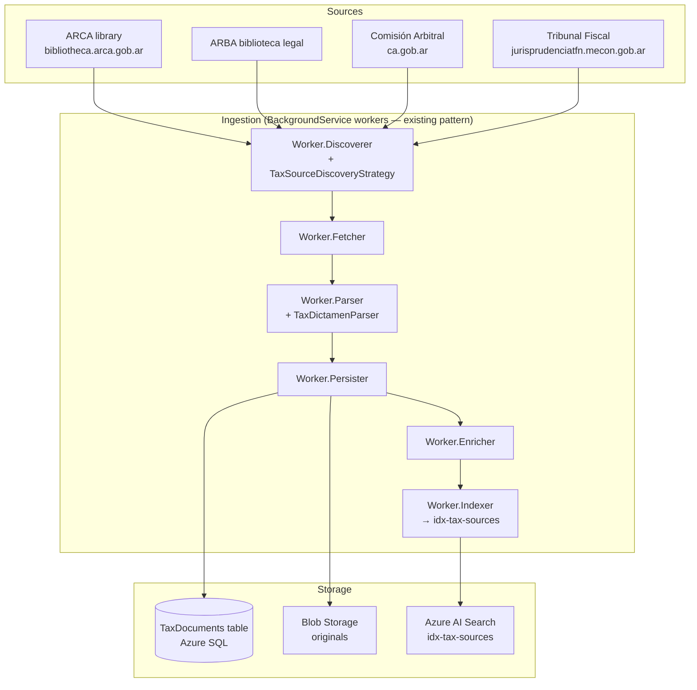

# F1.5 - W01 - Comprehensive Documentation

> **Feature:** F1.5 - Tax Sources Ingestion and Search
> **Release:** 1.0 | **Sprint:** S01
> **Type:** documentation | **Priority:** High (key differentiator vs. generic KB)
> **Estimate:** 3 story points
> **Assignable to:** Tech Lead / Backend Dev

---

## 1. Feature Overview

Ingest and make searchable the **Argentine tax administrative sources** that are not covered by the
existing CSJN/SAIJ pipeline:

| Source group                        | Content                                                       | Source (see tech doc 20) |
| ----------------------------------- | ------------------------------------------------------------- | ------------------------ |
| **ARCA** (ex-AFIP)                  | Dictámenes, instrucciones, circulares                         | `biblioteca.arca.gob.ar` |
| **ARBA**                            | Informes, dictámenes tributarios bonaerenses                  | `web.arba.gov.ar`        |
| **Comisión Arbitral / COMARB**      | Resoluciones CA, Comisión Plenaria, casos concretos (ISIB)    | `ca.gob.ar`              |
| **Tribunal Fiscal de la Nación**    | Fallos TFN (impuestos nacionales, aduaneros)                  | `jurisprudenciatfn.mecon.gob.ar` |
| **Consultas vinculantes** (ARCA)    | Consultas vinculantes sobre impuestos nacionales              | included in ARCA library |

These sources feed a new **`idx-tax-sources`** Azure AI Search index and are searchable via a
dedicated endpoint alongside the existing norm/case-law search.

---

## 2. Architecture Overview



The ingestion pipeline's **strategy pattern** (established in tech docs 13–15) is extended with new
`IDiscoveryStrategy` and `IDocumentParser` implementations per source — no structural changes to the
pipeline.

---

## 3. Data Model — `TaxDocument`

New entity added to `LegalAiAr.Core` and migrated via EF Core:

```sql
CREATE TABLE TaxDocuments (
    Id              INT           PRIMARY KEY IDENTITY,
    ExternalId      NVARCHAR(200) NOT NULL,
    SourceId        INT           NOT NULL,   -- FK to IngestionSources
    DocumentType    NVARCHAR(50)  NOT NULL,   -- dictamen|fallo|resolucion|consulta_vinculante
    Organism        NVARCHAR(100) NOT NULL,   -- ARCA|ARBA|ComisionArbitral|TFN
    ReferenceNumber NVARCHAR(100) NULL,       -- e.g. "DAT 12/2023"
    PublicationDate DATE          NULL,
    TaxBranch       NVARCHAR(100) NULL,       -- e.g. "IVA|Ganancias|ISIB|Sellos"
    TaxPeriod       NVARCHAR(50)  NULL,       -- fiscal period if stated
    Title           NVARCHAR(500) NOT NULL,
    Summary         NVARCHAR(MAX) NULL,
    FullText        NVARCHAR(MAX) NULL,
    OriginalUrl     NVARCHAR(500) NULL,
    BlobUrl         NVARCHAR(500) NULL,
    IngestedAt      DATETIME2     NOT NULL DEFAULT GETUTCDATE(),
    LastIndexedAt   DATETIME2     NULL,
    CONSTRAINT UQ_TaxDoc_Source UNIQUE (SourceId, ExternalId)
);
CREATE INDEX IX_TaxDoc_Organism_Date ON TaxDocuments (Organism, PublicationDate DESC);
CREATE INDEX IX_TaxDoc_TaxBranch ON TaxDocuments (TaxBranch);
```

---

## 4. Azure AI Search — `idx-tax-sources`

```json
{
  "name": "idx-tax-sources",
  "fields": [
    { "name": "id",             "type": "Edm.String",  "key": true },
    { "name": "taxDocumentId",  "type": "Edm.Int32",   "filterable": true },
    { "name": "organism",       "type": "Edm.String",  "filterable": true, "facetable": true },
    { "name": "documentType",   "type": "Edm.String",  "filterable": true, "facetable": true },
    { "name": "taxBranch",      "type": "Edm.String",  "filterable": true, "facetable": true },
    { "name": "referenceNumber","type": "Edm.String",  "searchable": true, "filterable": true },
    { "name": "publicationDate","type": "Edm.DateTimeOffset", "filterable": true, "sortable": true },
    { "name": "title",          "type": "Edm.String",  "searchable": true },
    { "name": "summary",        "type": "Edm.String",  "searchable": true },
    { "name": "fullText",       "type": "Edm.String",  "searchable": true },
    { "name": "embedding",      "type": "Collection(Edm.Single)", "dimensions": 3072,
      "vectorSearchProfile": "hybrid-profile" }
  ]
}
```

Facets exposed to the UI: `organism`, `documentType`, `taxBranch`.

---

## 5. API Endpoints

| Method | Route                       | Auth     | Description                                              |
| ------ | --------------------------- | -------- | -------------------------------------------------------- |
| POST   | `/api/tax-sources/search`   | PwCStaff | Hybrid search over `idx-tax-sources`                     |
| GET    | `/api/tax-sources/{id}`     | PwCStaff | Detail of a single tax document                          |
| GET    | `/api/tax-sources/{id}/document` | PwCStaff | Stream original PDF/HTML from Blob Storage          |
| GET    | `/api/tax-sources/facets`   | PwCStaff | Available facet values (organism, documentType, taxBranch)|

### Search request/response (Contracts)

```csharp
// Contracts/TaxSources/SearchTaxSourcesRequest.cs
public sealed record SearchTaxSourcesRequest(
    string? Query,
    string? Organism,
    string? DocumentType,
    string? TaxBranch,
    DateOnly? PublishedFrom,
    DateOnly? PublishedTo,
    int Page = 1,
    int PageSize = 20);

// Contracts/TaxSources/TaxDocumentSummary.cs
public sealed record TaxDocumentSummary(
    int    Id,
    string Organism,
    string DocumentType,
    string ReferenceNumber,
    DateOnly? PublicationDate,
    string TaxBranch,
    string Title,
    string HighlightedSummary);
```

---

## 6. Ingestion Strategies (per source)

Each source requires its own `IDiscoveryStrategy` + `IDocumentParser`. Priority order for
implementation: TFN (has structured JSON search API) → ARCA (HTML library with pagination) →
Comisión Arbitral → ARBA.

| Source             | Discovery approach            | Parser notes                                   |
| ------------------ | ----------------------------- | ---------------------------------------------- |
| **TFN**            | JSON search API (AI-assisted) | Extract sala, tribunal, impuesto, período       |
| **ARCA**           | HTML pagination scrape        | Extract dictamen number, organismo, fecha       |
| **Comisión Arbitral** | HTML by year/type          | Extract resolución CA number, subject, plenaria |
| **ARBA**           | HTML category tree            | Extract informe type, branch, date              |

---

## 7. Frontend Feature

Route: `/fuentes-tributarias`

Key components:
- `TaxSourceSearchComponent` — query input + facet filters (organism, type, branch, date range)
- `TaxSourceResultsComponent` — card list with highlighted summary
- `TaxSourceDetailComponent` — full detail + embedded PDF viewer (reuses norm detail viewer)

---

## 8. Work Items

| ID      | Name                                               | Type           | SP  |
| ------- | -------------------------------------------------- | -------------- | --- |
| F1.5-W01| Comprehensive Documentation                        | doc            | 3   |
| F1.5-W02| Tax Sources Ingestion Pipeline Strategies          | backend/worker | 8   |
| F1.5-W03| Tax Sources AI Search Index and API Endpoints      | backend        | 5   |
| F1.5-W04| Frontend Tax Sources Search Feature                | frontend       | 5   |

**F1.5 total:** 21 SP

---

## 9. Acceptance Criteria (feature-level)

- [ ] At least **TFN and ARCA** have running ingestion strategies with > 500 documents indexed
- [ ] Hybrid search returns relevant results for queries like "IVA exportación servicios"
- [ ] Facet filters by organism, document type, and tax branch work correctly
- [ ] Detail view shows full text + link/stream to original document
- [ ] `idx-tax-sources` index exists in DEV environment and is queryable
- [ ] New `TaxDocuments` table with EF migration applied to DEV
- [ ] Tech doc 20 updated with integration status for each new source

---

## 10. Dependencies

- **Prerequisites:** F0.0 complete (workers scaffold, pipeline pattern, AI Search client)
- **Enhanced by:** F1.7 (AI assistant can cite tax sources in answers)
- **Reference:** [tech doc 20 — Legal Data Sources](../../technical/20-legal-data-sources.md)

---

_F1.5 - Tax Sources Ingestion and Search — Comprehensive Documentation — Legal Ai Ar_
