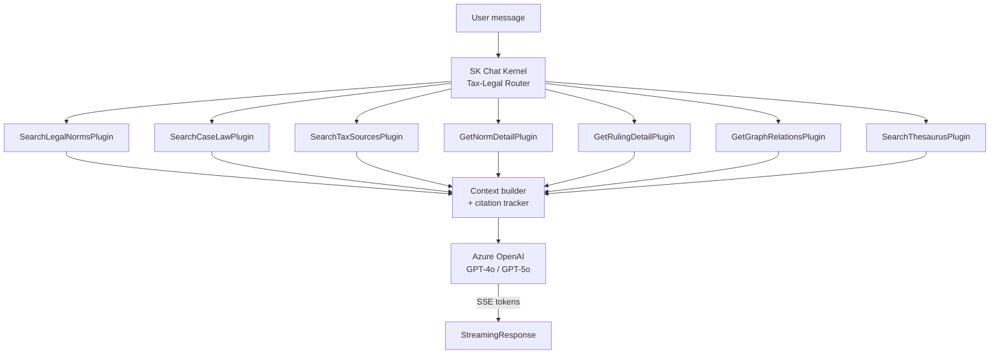

# F1.7 - W01 - Comprehensive Documentation

> **Feature:** F1.7 - AI Research Assistant (Chat over the KB)
> **Release:** 1.0 | **Sprint:** S01
> **Type:** documentation | **Priority:** High (flagship feature)
> **Estimate:** 3 story points
> **Assignable to:** Tech Lead / AI Lead

---

## 1. Feature Overview

An **agentic AI research assistant** that answers tax-legal questions grounded in the knowledge base
(legislation, case law, and tax sources from F1.5). Responses include **inline citations** with links
to the source documents.

MVP coverage: **~80%** — the general assistant exists with 13 tools, hybrid search and GraphRAG,
and SSE streaming. This feature:

1. Adds **tax-tuned system prompts** and new SK plugins for ARCA/TFN/Comisión Arbitral sources.
2. **Persists conversations** (currently transient in the MVP).
3. Aligns the chat endpoint to Minimal API + Contracts.
4. Delivers a polished Angular 19 chat UI using AppKit 4.

---

## 2. Agent Architecture (Semantic Kernel)



### 2.1 SK plugins (new/extended in this feature)

| Plugin class                    | SK function(s)                   | Calls                              |
| ------------------------------- | -------------------------------- | ---------------------------------- |
| `SearchLegalNormsPlugin`        | `SearchNorms`                    | `ILegalNormsSearchService`         |
| `SearchCaseLawPlugin`           | `SearchRulings`                  | `ICaseLawSearchService`            |
| `SearchTaxSourcesPlugin` (**new**)| `SearchTaxDocs`, `GetTaxDocDetail`| `ITaxSourcesSearchService` (F1.5)|
| `GetNormDetailPlugin`           | `GetNormArticles`                | `IStatuteRepository`               |
| `GetRulingDetailPlugin`         | `GetRulingHeadnote`              | `IRulingRepository`                |
| `GetGraphRelationsPlugin`       | `GetRelatedNorms`                | `ILegalGraphService`               |
| `SearchThesaurusPlugin`         | `ExpandQuery`                    | `IThesaurusService`                |

All plugins are in `LegalAiAr.Agents/Plugins/`.

### 2.2 Tax-tuned system prompt

Located at `LegalAiAr.Agents/Prompts/tax-legal-assistant.yaml`.  
Written in **Spanish** (end-user contact layer).

Key prompt elements:
- Persona: "Soy el asistente de investigación jurídico-tributaria de PwC Argentina."
- Scope: legislation, jurisprudencia, dictámenes ARCA/ARBA, Tribunal Fiscal, Comisión Arbitral.
- Citation format: must cite source with type + reference number + date + URL.
- Guardrails: does not give binding legal advice; refers to human professionals.
- Tool use: must prefer tool calls over training knowledge for legal facts.

### 2.3 Citation format (inline)

```
El Artículo 1 de la Ley 27.430¹ establece que...
...

¹ Ley 27.430 — Reforma Tributaria (29/12/2017) — SAIJ
```

Citations are appended to the streamed response and also returned as structured `CitedSource[]` in
the SSE final event.

---

## 3. Conversation Persistence

### 3.1 Entities (aligned with existing MVP `Conversation` / `ChatMessage`)

The MVP already has `Conversation` and `ChatMessage` tables (see F0.0-W01 §8.2.4). This feature
ensures they are used with platform-auth user IDs and linked to the `UserPreferences.EntraObjectId`.

New columns added in this feature's EF migration:

```sql
ALTER TABLE Conversation ADD ProjectId INT NULL REFERENCES Projects(Id);
-- ProjectId nullable for now; populated in R2.0 (F2.1)
```

### 3.2 Conversation management endpoints

| Method | Route                              | Auth     | Description                          |
| ------ | ---------------------------------- | -------- | ------------------------------------ |
| GET    | `/api/conversations`               | PwCStaff | List user's conversations (recent 20)|
| POST   | `/api/conversations`               | PwCStaff | Start a new conversation             |
| GET    | `/api/conversations/{id}/messages` | PwCStaff | Message history for a conversation   |
| DELETE | `/api/conversations/{id}`          | PwCStaff | Delete a conversation                |
| POST   | `/api/chat`                        | PwCStaff | **SSE** — send message + stream response|

---

## 4. Chat SSE Protocol

The `POST /api/chat` endpoint streams Server-Sent Events:

```
event: token
data: {"text":"El Artículo 1 de la Ley"}

event: token
data: {"text":" 27.430 establece..."}

event: citations
data: {"citations":[{"type":"norm","id":1234,"reference":"Ley 27.430","date":"2017-12-29"}]}

event: done
data: {"messageId":"uuid","tokensUsed":412}
```

The SPA uses `EventSource` with `withCredentials: true`.

---

## 5. Frontend Architecture

### 5.1 Feature structure

```
frontend/projects/features/assistant/
├── components/
│   ├── assistant-shell/           # Chat window wrapper
│   ├── conversation-sidebar/      # List of past conversations
│   ├── message-list/              # Scrollable message thread
│   ├── message-bubble/            # User / assistant bubble + citation chips
│   ├── citation-chip/             # Inline citation link → detail page
│   ├── message-input/             # Textarea + send button + file drop (future)
│   └── suggested-queries/         # Example starter questions
├── services/
│   ├── assistant.service.ts       # Signal store + SSE connection
│   └── conversation.service.ts    # CRUD conversations
├── models/
│   └── assistant.model.ts
├── assistant.routes.ts            # lazy-loaded at /asistente
└── index.ts
```

Route: `/asistente`  
Optional: deep-link `/asistente?norm=1234` opens with a pre-seeded context.

### 5.2 SSE handling

```typescript
// Uses native EventSource — no external lib
private streamMessage(conversationId: string, userText: string): void {
  const es = new EventSource(`/api/chat?...`, { withCredentials: true });
  es.addEventListener('token', (e) => { /* append to buffer signal */ });
  es.addEventListener('citations', (e) => { /* add citations */ });
  es.addEventListener('done', (e) => { es.close(); /* finalize */ });
}
```

### 5.3 Context seeding

When opened from a norm/ruling detail page (deep link or in-page panel), the assistant pre-loads
context with the entity's metadata so the user can immediately ask questions about it.

---

## 6. Work Items

| ID      | Name                                           | Type     | SP  |
| ------- | ---------------------------------------------- | -------- | --- |
| F1.7-W01| Comprehensive Documentation                    | doc      | 3   |
| F1.7-W02| Tax-Tuned Agents and Semantic Kernel Plugins   | backend  | 8   |
| F1.7-W03| Chat Endpoints and Conversation Persistence    | backend  | 5   |
| F1.7-W04| Frontend Chat Feature                          | frontend | 8   |

**F1.7 total:** 24 SP

---

## 7. Acceptance Criteria (feature-level)

- [ ] Assistant answers a tax query (e.g. "¿Cómo se calcula el IVA en exportación de servicios?")
  with ≥ 2 cited sources from the KB
- [ ] Citations link to the correct norm/ruling/tax-source detail page
- [ ] Conversations are persisted and retrievable in the sidebar
- [ ] SSE streaming works end-to-end; tokens appear progressively
- [ ] `SearchTaxSourcesPlugin` is invoked for tax-specific queries (tool trace confirms)
- [ ] System prompt is in Spanish; code is in English
- [ ] No tool call result exceeds 4K tokens of context per call (chunking enforced in plugins)
- [ ] Agent eval baseline added in `LegalAiAr.AgentEvals` (≥ 5 golden queries)

---

## 8. Dependencies

- **Prerequisites:** F1.1 (auth), F1.5 (tax sources indexed), F1.4/F1.3 (search services injectable)
- **Reference:** [tech doc 16 — RAG/Chat](../../technical/16-rag-chat.md) (update after this WI)

---

_F1.7 - AI Research Assistant — Comprehensive Documentation — Legal Ai Ar_
