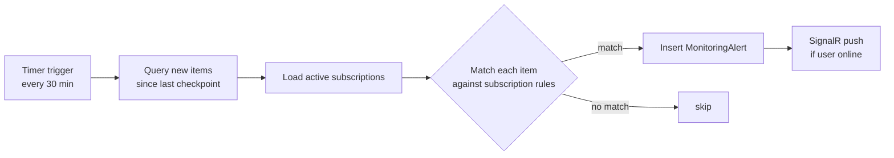

# F1.8 - W01 - Comprehensive Documentation

> **Feature:** F1.8 - Regulatory and Tax Monitoring & Alerts
> **Release:** 1.0 | **Sprint:** S01
> **Type:** documentation | **Priority:** Medium
> **Estimate:** 3 story points
> **Assignable to:** Tech Lead / Backend Dev

---

## 1. Feature Overview

A **monitoring engine** that watches for new or updated norms, rulings, and tax documents matching
each user's subscriptions (by law branch, tax branch, issuing body, or keyword), and delivers
**in-app alerts** displayed on the Home screen and in a dedicated Alerts view.

MVP coverage: **partial** — the MVP has some notification infrastructure (SignalR, workers) but no
user-defined subscription model or alert delivery pipeline.

---

## 2. Monitoring Model

### 2.1 Subscription (user-defined)

A user can subscribe to one or more "watch rules". Each rule matches newly ingested items.

| Field          | Type          | Description                                                  |
| -------------- | ------------- | ------------------------------------------------------------ |
| `Id`           | `Guid`        | PK                                                           |
| `UserId`       | `int`         | FK `UserPreferences`                                         |
| `Name`         | `nvarchar`    | User-defined label (e.g. "Novedades IVA")                   |
| `LawBranch`    | `nvarchar?`   | Filter by KB branch (tributario, laboral, …)                |
| `TaxBranch`    | `nvarchar?`   | Filter by tax branch (IVA, Ganancias, ISIB, …)              |
| `IssuingBody`  | `nvarchar?`   | e.g. "ARCA", "TFN", "CSJN"                                  |
| `Keywords`     | `nvarchar?`   | Comma-separated terms (matched against title/summary)        |
| `SourceTypes`  | `nvarchar`    | JSON array: `["norm","ruling","tax_source"]`                 |
| `IsActive`     | `bit`         | Enabled/disabled                                             |
| `CreatedAt`    | `datetime2`   |                                                              |

### 2.2 Alert (generated)

When the **alert evaluation worker** finds a newly ingested item matching a subscription:

| Field              | Type       | Description                                        |
| ------------------ | ---------- | -------------------------------------------------- |
| `Id`               | `Guid`     | PK                                                 |
| `SubscriptionId`   | `Guid`     | FK `MonitoringSubscriptions`                       |
| `UserId`           | `int`      | Denormalized for fast query                        |
| `ItemType`         | `nvarchar` | norm \| ruling \| tax\_source                     |
| `ItemId`           | `nvarchar` | The matched entity ID                              |
| `Title`            | `nvarchar` | Display title                                      |
| `MatchedBranch`    | `nvarchar` | Which branch matched (for grouping)                |
| `IsRead`           | `bit`      | Default `0`                                        |
| `PublishedAt`      | `datetime2`| Original publication/ingestion date                |
| `CreatedAt`        | `datetime2`| When the alert was generated                       |

---

## 3. Alert Evaluation Worker

A new `BackgroundService` (`AlertEvaluationWorker`) runs in the API process on a configurable
schedule (default: every 30 minutes). It queries items ingested since the last run and evaluates
each subscription:



**Checkpoint** stored in `SystemSettings` table (key: `AlertWorker:LastRunAt`).

**Matching logic:** SQL `LIKE`/`IN` conditions on `LawBranch`, `TaxBranch`, `IssuingBody` columns;
keyword matching via `CONTAINS` full-text search or `LIKE '%term%'` on `Title + Summary` (team
decides at implementation).

---

## 4. Backend Endpoints

| Method | Route                                  | Auth     | Description                              |
| ------ | -------------------------------------- | -------- | ---------------------------------------- |
| GET    | `/api/monitoring/subscriptions`        | PwCStaff | List user's subscriptions                |
| POST   | `/api/monitoring/subscriptions`        | PwCStaff | Create a subscription                    |
| PUT    | `/api/monitoring/subscriptions/{id}`   | PwCStaff | Update a subscription                    |
| DELETE | `/api/monitoring/subscriptions/{id}`   | PwCStaff | Delete a subscription                    |
| GET    | `/api/monitoring/alerts`               | PwCStaff | List alerts (unread first, paged)        |
| PUT    | `/api/monitoring/alerts/{id}/read`     | PwCStaff | Mark alert as read                       |
| PUT    | `/api/monitoring/alerts/read-all`      | PwCStaff | Mark all alerts as read                  |
| GET    | `/api/monitoring/alerts/unread-count`  | PwCStaff | Returns `{ count: N }` for badge         |

### Contracts (key types)

```csharp
// Contracts/Monitoring/CreateSubscriptionRequest.cs
public sealed record CreateSubscriptionRequest(
    string  Name,
    string? LawBranch,
    string? TaxBranch,
    string? IssuingBody,
    string? Keywords,
    IReadOnlyList<string> SourceTypes);

// Contracts/Monitoring/AlertResponse.cs
public sealed record AlertResponse(
    Guid     AlertId,
    string   ItemType,
    string   ItemId,
    string   Title,
    string   MatchedBranch,
    bool     IsRead,
    DateTimeOffset PublishedAt,
    DateTimeOffset CreatedAt);
```

---

## 5. Real-time Push (SignalR)

When `AlertEvaluationWorker` inserts a new `MonitoringAlert`, it sends a SignalR message to the
user's connection group (`userId-{id}`) if they are connected:

```csharp
await _hubContext.Clients
    .Group($"userId-{alert.UserId}")
    .SendAsync("NewAlert", new { alert.Id, alert.Title, alert.ItemType });
```

The SPA receives this event and increments the notification badge without a full page reload.

---

## 6. Frontend Architecture

### 6.1 Feature structure

```
frontend/projects/features/monitoring/
├── components/
│   ├── monitoring-shell/          # Tab: subscriptions | alerts
│   ├── subscription-list/         # Table of active watches
│   ├── subscription-form/         # Create / edit dialog
│   ├── alert-list/                # Paged alert list with read/unread state
│   ├── alert-item/                # Single alert row with item type icon
│   └── alert-badge/               # Notification counter in app header (shared)
├── services/
│   ├── monitoring.service.ts      # Signal store + HTTP
│   └── signalr-alerts.service.ts  # SignalR connection for live alert push
├── models/
│   └── monitoring.model.ts
├── monitoring.routes.ts           # lazy-loaded at /alertas
└── index.ts
```

Route: `/alertas`

### 6.2 Notification badge

`AlertBadgeComponent` subscribes to `monitoring.service.unreadCount` signal and shows a red dot
on the bell icon in the app header (AppKit 4 shell integration point).

---

## 7. Work Items

| ID      | Name                                              | Type     | SP  |
| ------- | ------------------------------------------------- | -------- | --- |
| F1.8-W01| Comprehensive Documentation                       | doc      | 3   |
| F1.8-W02| Alert Rules Engine and Notification Worker        | backend  | 8   |
| F1.8-W03| Frontend Monitoring Settings and Alerts           | frontend | 5   |

**F1.8 total:** 16 SP

---

## 8. Acceptance Criteria (feature-level)

- [ ] User can create a subscription for IVA-related ARCA documents
- [ ] When a new ARCA dictamen is ingested, an alert is generated within 30 min and appears in the list
- [ ] SignalR push delivers an in-app notification badge increment without page reload
- [ ] Mark-as-read and mark-all-read work correctly
- [ ] Home screen shows 5 most recent alerts (F1.2 integration)
- [ ] `AlertEvaluationWorker` runs without errors; checkpoint persisted across restarts

---

## 9. Dependencies

- **Prerequisites:** F1.1 (auth), F1.5 (tax sources indexed — source of most alerts)
- **Feeds:** F1.2 (home alerts section), F2.1 (alerts scoped to projects in R2.0)
- **Infrastructure:** SignalR hub already exists from MVP (re-use connection management)

---

_F1.8 - Regulatory Monitoring and Alerts — Comprehensive Documentation — Legal Ai Ar_
