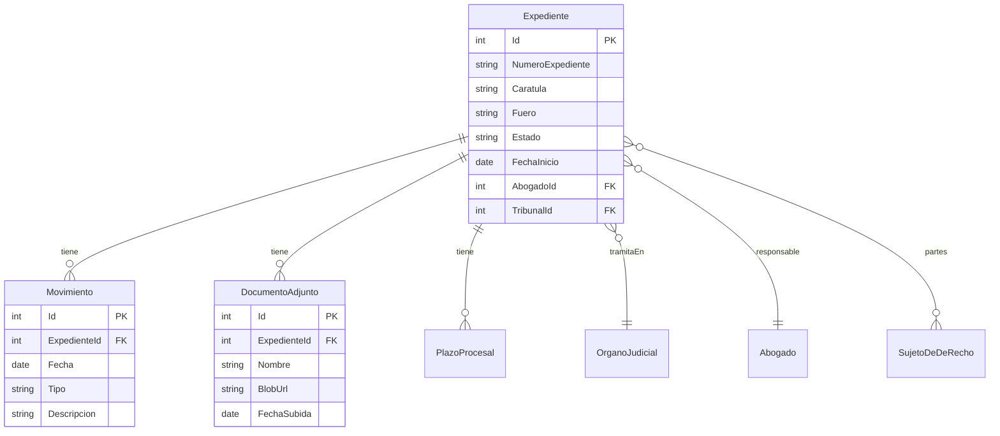

# F12 - W01 - Documentacion Integral

> **Feature:** F12 - Gestion de Expedientes
> **Release:** 2.0 | **Sprint:** S05-S06
> **Tipo:** Documentación | **Prioridad:** Crítica (bloqueante)
> **Estimación:** 3 story points

---

## 1. Descripción General

CRUD completo de expedientes judiciales y administrativos. Movimientos, documentos adjuntos, partes, abogado responsable.

---

## 2. Diagrama de Arquitectura



---

## 3. Modelo de Datos

### Tablas (Azure SQL)

**Expediente**

| Columna | Tipo | Nullable | Descripción |
|---------|------|:--------:|-------------|
| Id | int (PK, identity) | No | ID autogenerado |
| NumeroExpediente | nvarchar(100) | No | Número único del expediente |
| Caratula | nvarchar(500) | No | Carátula del proceso |
| TipoProcesal | nvarchar(50) | No | civil/penal/laboral/familia/contencioso |
| Fuero | nvarchar(50) | No | Fuero de tramitación |
| Estado | nvarchar(50) | No | iniciado/en_tramite/en_sentencia/apelado/concluido |
| FechaInicio | date | No | Fecha de inicio |
| FechaCierre | date | Sí | Fecha de cierre (si aplica) |
| Jurisdiccion | nvarchar(50) | No | federal/provincial/CABA |
| TribunalId | int (FK) | Sí | FK a OrganoJudicial (Graph Node) |
| AbogadoResponsableId | int (FK) | No | FK a UsuarioPreferencias |
| Notas | nvarchar(max) | Sí | Notas internas |
| CreatedAt | datetime2 | No | Timestamp de creación |
| UpdatedAt | datetime2 | No | Timestamp de última actualización |

**Movimiento**

| Columna | Tipo | Nullable | Descripción |
|---------|------|:--------:|-------------|
| Id | int (PK, identity) | No | ID autogenerado |
| ExpedienteId | int (FK) | No | FK a Expediente |
| Fecha | date | No | Fecha del movimiento |
| Tipo | nvarchar(50) | No | demanda/contestacion/prueba/sentencia/recurso/otro |
| Descripcion | nvarchar(2000) | No | Descripción del movimiento |
| CreadoPor | nvarchar(128) | No | EntraObjectId del creador |
| CreatedAt | datetime2 | No | Timestamp |

**DocumentoAdjunto**

| Columna | Tipo | Nullable | Descripción |
|---------|------|:--------:|-------------|
| Id | int (PK, identity) | No | ID autogenerado |
| ExpedienteId | int (FK) | No | FK a Expediente |
| NombreArchivo | nvarchar(256) | No | Nombre original del archivo |
| BlobUrl | nvarchar(1000) | No | URL en Blob Storage |
| ContentType | nvarchar(100) | No | MIME type |
| TamanioBytes | bigint | No | Tamaño en bytes |
| SubidoPor | nvarchar(128) | No | EntraObjectId |
| FechaSubida | datetime2 | No | Timestamp |

---

## 4. API Endpoints

| Método | Endpoint | Request | Response |
|--------|----------|---------|----------|
| GET | `/api/expedientes` | `?fuero=laboral&estado=en_tramite&abogado=id&page=1&pageSize=20` | `{total, items: [Expediente]}` |
| POST | `/api/expedientes` | `{numeroExpediente, caratula, fuero, ...}` | `{id, ...}` (201 Created) |
| GET | `/api/expedientes/{id}` | - | `Expediente completo` |
| PUT | `/api/expedientes/{id}` | `{campos a actualizar}` | `Expediente actualizado` |
| DELETE | `/api/expedientes/{id}` | - | 204 No Content |
| GET | `/api/expedientes/{id}/movimientos` | `?page&pageSize` | `{total, items: [Movimiento]}` |
| POST | `/api/expedientes/{id}/movimientos` | `{fecha, tipo, descripcion}` | `Movimiento` (201) |
| GET | `/api/expedientes/{id}/documentos` | - | `[DocumentoAdjunto]` |
| POST | `/api/expedientes/{id}/documentos` | `multipart/form-data` | `DocumentoAdjunto` (201) |

---

## 5. Descripción de UI / UX

### Pantallas

1. **Lista de expedientes** — DataTable con columnas: N° Expediente, Carátula, Fuero, Estado, Abogado, Fecha Inicio. Filtros superiores. Botón "+ Nuevo expediente".

2. **Detalle de expediente** — Tabs: Info General | Movimientos | Documentos | Plazos | Notas

3. **Formulario** — Reactive form con: N° Expediente, Carátula, Tipo Procesal (select), Fuero (select), Jurisdicción (select), Tribunal (autocomplete), Abogado Responsable (select), Notas (textarea).

```
┌─────────────────────────────────────────────────────────┐
│  Expedientes                              [+ Nuevo]     │
├─────────────────────────────────────────────────────────┤
│  Fuero: [Todos ▼]  Estado: [Todos ▼]  Abogado: [Todos]│
├──────┬──────────────┬────────┬──────────┬───────┬──────┤
│  N°  │ Carátula     │ Fuero  │ Estado   │ Abog. │ Fecha│
├──────┼──────────────┼────────┼──────────┼───────┼──────┤
│ 1234 │ García c/... │ Civil  │ En trám. │ JPérez│ 03/24│
│ 5678 │ López s/...  │ Laboral│ Sentencia│ MRuiz │ 01/25│
│ 9012 │ ARCA c/...   │ Tribut.│ Apelado  │ JPérez│ 06/25│
├──────┴──────────────┴────────┴──────────┴───────┴──────┤
│  ◀ 1 2 3 ... 8 ▶                     20 resultados/pág│
└─────────────────────────────────────────────────────────┘
```

---

## 6. Criterios de Aceptación

- [ ] Se pueden crear, leer, actualizar y eliminar expedientes
- [ ] La lista de expedientes permite filtrar por fuero, estado y abogado responsable
- [ ] La lista permite ordenar por cualquier columna
- [ ] La paginación funciona correctamente
- [ ] Se pueden agregar movimientos a un expediente con fecha, tipo y descripción
- [ ] Los movimientos se muestran en un timeline cronológico
- [ ] Se pueden subir documentos (PDF, DOCX) que se almacenan en Blob Storage
- [ ] Los documentos se pueden descargar
- [ ] Los administrativos pueden leer expedientes y agregar movimientos pero NO eliminar
- [ ] El campo de búsqueda busca por número de expediente y carátula

---

## 7. Dependencias

- **Depende de:** F01 (Auth)
- **Bloquea:** F13 (Plazos), F14 (Calendario)
- **NuGet:** Azure.Storage.Blobs (para documentos adjuntos)
- **npm:** @angular/material (DataTable, Forms)

---

## 8. Notas Técnicas

- Usar EF Core 10 con Fluent API para configurar las relaciones
- Los documentos se suben a Blob Storage con nombre: `expedientes/{id}/{guid}_{filename}`
- Usar SAS tokens de corta duración para URLs de descarga
- Implementar soft delete para expedientes (campo IsDeleted + filtro global de EF Core)
- La búsqueda por carátula usa `CONTAINS` de SQL Server full-text search
- Los movimientos son append-only (no se editan ni eliminan)

---

## 9. Work Items de esta Feature

| ID | Nombre | Tipo | Sprint |
|----|--------|------|--------|
| F12-W01 | Documentacion Integral | doc | S05-S06 |
| F12-W02 | Backend - Modelo EF Core Expediente y Migraciones | backend | S05-S06 |
| F12-W03 | Backend - CRUD Endpoints Expedientes | backend | S05-S06 |
| F12-W04 | Backend - Subrecursos Movimientos y Documentos | backend | S05-S06 |
| F12-W05 | Backend - Upload Documentos a Blob Storage | backend | S05-S06 |
| F12-W06 | Frontend - Lista de Expedientes con DataTable | frontend | S05-S06 |
| F12-W07 | Frontend - Formulario Alta y Edicion Expediente | frontend | S05-S06 |
| F12-W08 | Frontend - Detalle Expediente con Tabs | frontend | S05-S06 |
| F12-W09 | Frontend - Timeline de Movimientos | frontend | S05-S06 |
| F12-W10 | Frontend - Gestion de Documentos Adjuntos | frontend | S05-S06 |
| F12-W11 | Testing - Tests CRUD Expedientes | testing | S05-S06 |

---

## 10. Definition of Done

- [ ] Código revisado por al menos 1 peer (PR aprobado)
- [ ] Tests unitarios con cobertura > 80%
- [ ] Tests de integración para endpoints
- [ ] Sin errores en build de CI
- [ ] Documentación de API actualizada (Swagger/OpenAPI)
- [ ] Componentes Angular documentados con JSDoc
- [ ] Accesibilidad validada (WCAG 2.1 AA)
- [ ] Responsive verificado en desktop y tablet
- [ ] Performance: tiempo de carga < 3 seg, API response < 2 seg
- [ ] Feature flag configurado (si aplica)

---

*F12 - Gestion de Expedientes — Documentación integral — Legal Ai Ar*
