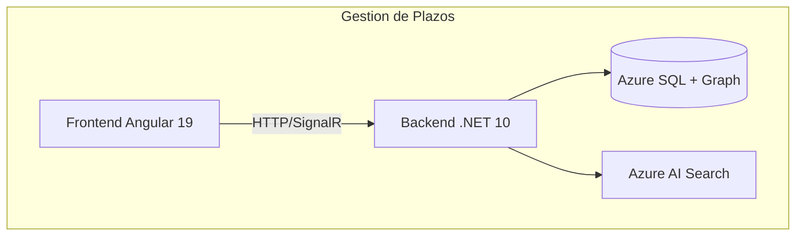

# F13 - W01 - Documentacion Integral

> **Feature:** F13 - Gestion de Plazos
> **Release:** 2.0 | **Sprint:** S06-S07
> **Tipo:** Documentación | **Prioridad:** Crítica (bloqueante)
> **Estimación:** 3 story points

---

## 1. Descripción General

Registro y seguimiento de plazos procesales. Cálculo automático de días hábiles. Alertas configurables. Estados con semáforo visual.

---

## 2. Diagrama de Arquitectura

---

## 3. Modelo de Datos

### Tablas (Azure SQL)

**PlazoProcesal**

| Columna | Tipo | Nullable | Descripción |
|---------|------|:--------:|-------------|
| Id | int (PK, identity) | No | ID autogenerado |
| ExpedienteId | int (FK) | No | FK a Expediente |
| Descripcion | nvarchar(500) | No | Descripción del plazo |
| TipoPlazo | nvarchar(50) | No | perentorio/ordenatorio |
| FechaInicio | date | No | Día desde el que se cuenta |
| DiasHabiles | int | No | Cantidad de días hábiles |
| FechaVencimiento | date | No | Fecha calculada de vencimiento |
| Estado | nvarchar(50) | No | pendiente/proximo/vencido/cumplido |
| FechaCumplimiento | date | Sí | Fecha en que se cumplió |
| AlertasDias | nvarchar(50) | No | Ej: "3,2,1" (días antes para alertar) |
| CreadoPor | nvarchar(128) | No | EntraObjectId |
| CreatedAt | datetime2 | No | Timestamp |

**FeriadoJudicial**

| Columna | Tipo | Nullable | Descripción |
|---------|------|:--------:|-------------|
| Id | int (PK) | No | ID |
| Fecha | date | No | Fecha del feriado |
| Descripcion | nvarchar(200) | No | Nombre del feriado |
| Tipo | nvarchar(50) | No | nacional/judicial |
| Jurisdiccion | nvarchar(50) | No | nacional/CABA/BsAs/etc |

---

## 4. API Endpoints

> Los endpoints específicos se definirán en base al documento de features: `docs/roadmap/features.md`, sección API Endpoints.

---

## 5. Descripción de UI / UX

> Definir mockups de UI durante la implementación. Seguir las guidelines de Angular Material 19 + Tailwind CSS 4.
> Referir a `docs/roadmap/features.md` para la descripción funcional de la UI.

---

## 6. Criterios de Aceptación

- [ ] La funcionalidad descrita en la sección de Descripción está completamente implementada
- [ ] Los endpoints de API retornan los datos esperados
- [ ] La UI es responsive y funcional en desktop y tablet
- [ ] Los tests unitarios cubren > 80% del código nuevo
- [ ] El build de CI pasa sin errores
- [ ] La funcionalidad es accesible (WCAG 2.1 AA)

---

## 7. Dependencias

- **Depende de:** F01 (Auth)
- **Referir a features.md** para dependencias detalladas entre features

---

## 8. Notas Técnicas

- Stack: Angular 19 (standalone components, signals) + .NET 10 Minimal API
- Base de datos: Azure SQL con EF Core 10 + Graph Tables
- Búsqueda: Azure AI Search con scoring híbrido
- Auth: Microsoft Entra ID con MSAL Angular + Microsoft.Identity.Web
- Comunicación real-time: SignalR
- Storage: Azure Blob Storage para documentos
- Referir a la ontología (`docs/ontologia/ontologia_legal_argentina.md`) para el modelo de dominio

---

## 9. Work Items de esta Feature

| ID | Nombre | Tipo | Sprint |
|----|--------|------|--------|
| F13-W01 | Documentacion Integral | doc | S06-S07 |
| F13-W02 | Backend - Modelo EF Core Plazo y Migraciones | backend | S06-S07 |
| F13-W03 | Backend - CRUD Endpoints Plazos | backend | S06-S07 |
| F13-W04 | Backend - Azure Function Evaluacion Diaria de Plazos | backend | S06-S07 |
| F13-W05 | Backend - Generacion de Alertas via Storage Queue | backend | S06-S07 |
| F13-W06 | Frontend - Lista de Plazos con Semaforo Visual | frontend | S06-S07 |
| F13-W07 | Frontend - Formulario Alta Plazo con Calculo Habiles | frontend | S06-S07 |
| F13-W08 | Testing - Tests de Plazos y Calculo de Habiles | testing | S06-S07 |

---

## 10. Definition of Done

- [ ] Código revisado por al menos 1 peer (PR aprobado)
- [ ] Tests unitarios con cobertura > 80%
- [ ] Tests de integración para endpoints
- [ ] Sin errores en build de CI
- [ ] Documentación de API actualizada (Swagger/OpenAPI)
- [ ] Componentes Angular documentados con JSDoc
- [ ] Accesibilidad validada (WCAG 2.1 AA)
- [ ] Responsive verificado en desktop y tablet
- [ ] Performance: tiempo de carga < 3 seg, API response < 2 seg
- [ ] Feature flag configurado (si aplica)

---

*F13 - Gestion de Plazos — Documentación integral — Legal Ai Ar*
