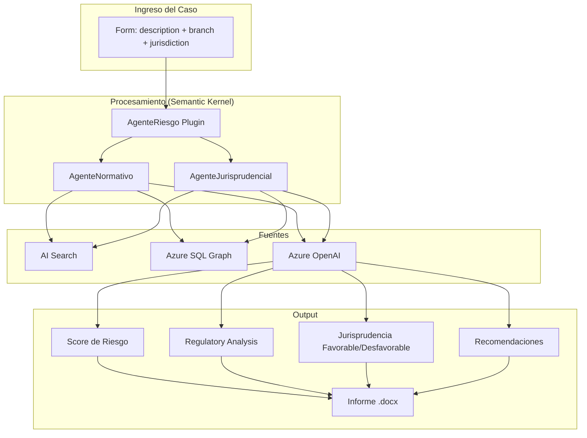

# F15 - W01 - Comprehensive Documentation

> **Feature:** F15 - Legal Risk Analysis
> **Release:** 3.0 | **Sprint:** S08-S09
> **Type:** Documentation | **Priority:** Critical (blocking)
> **Estimate:** 3 story points

---

## 1. General Description

The user describes a case and the system generates a structured risk analysis with score, legislation, case law, and recommendations.

---

## 2. Architecture Diagram

---

## 3. Data Model

> Define the specific data model during the W01 implementation.
> Refer to the ontology in `docs/ontology/argentine-legal-ontology.md` for the base classes.

---

## 4. API Endpoints

> The specific endpoints will be defined based on the features document: `docs/roadmap/features.md`, API Endpoints section.

---

## 5. UI / UX Description

> Define the UI mockups during implementation. Follow the Angular Material 19 + Tailwind CSS 4 guidelines.
> Refer to `docs/roadmap/features.md` for the functional UI description.

---

## 6. Acceptance Criteria

- [ ] The functionality described in the Description section is fully implemented
- [ ] The API endpoints return the expected data
- [ ] The UI is responsive and functional on desktop and tablet
- [ ] Unit tests cover > 80% of the new code
- [ ] The CI build passes with no errors
- [ ] The functionality is accessible (WCAG 2.1 AA)

---

## 7. Dependencies

- **Depends on:** F01 (Auth)
- **Refer to features.md** for detailed dependencies between features

---

## 8. Technical Notes

- El AgenteRiesgo orquesta llamadas a AgenteNormativo y AgenteJurisprudencial via Semantic Kernel
- The risk score is a 0-100 value with categories: low (0-30), medium (31-60), high (61-80), critical (81-100)
- The risk-factor taxonomy is configured as JSON in Azure SQL (RiskConfiguration table)
- Analyses are persisted with a snapshot of the consulted sources for reproducibility
- The agent prompt includes JSON-format instructions for the structured output

---

## 9. Work Items of this Feature

| ID | Name | Type | Sprint |
|----|--------|------|--------|
| F15-W01 | Comprehensive Documentation | doc | S08-S09 |
| F15-W02 | Backend - RiskAgent Semantic Kernel Plugin | backend | S08-S09 |
| F15-W03 | Backend - Risk Taxonomy Model | backend | S08-S09 |
| F15-W04 | Backend - POST Analyze Risk Endpoint | backend | S08-S09 |
| F15-W05 | Backend - Analysis Persistence in SQL | backend | S08-S09 |
| F15-W06 | Frontend - Case Input Form | frontend | S08-S09 |
| F15-W07 | Frontend - Result View with Visual Score | frontend | S08-S09 |
| F15-W08 | Testing - Risk Analysis Evaluation | testing | S08-S09 |

---

## 10. Definition of Done

- [ ] Code reviewed by at least 1 peer (PR approved)
- [ ] Unit tests with > 80% coverage
- [ ] Integration tests for endpoints
- [ ] No errors in the CI build
- [ ] API documentation updated (Swagger/OpenAPI)
- [ ] Angular components documented with JSDoc
- [ ] Accessibility validated (WCAG 2.1 AA)
- [ ] Responsive verified on desktop and tablet
- [ ] Performance: load time < 3 sec, API response < 2 sec
- [ ] Feature flag configured (if applicable)

---

*F15 - Legal Risk Analysis — Comprehensive Documentation — Legal Ai Ar*
