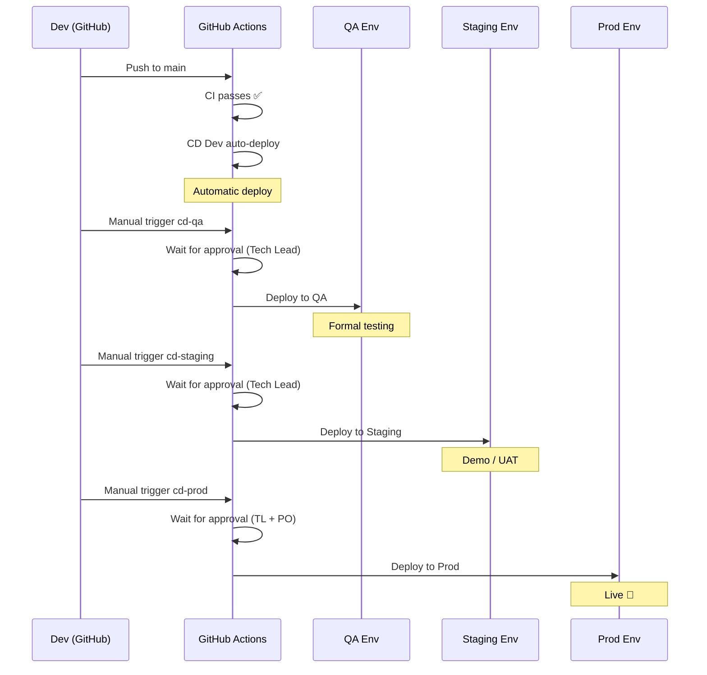

# FT05 - W03 - CD Deployment Pipelines Configuration

> **Feature:** FT05 - Delivery and Hosting (formerly F00-W06)
> **Release:** Cross-cutting (FT) | **Sprint:** —
> **Track status:** ⏸ **On hold** — pending DevOps consultation (do not start until CI path confirmed)
> **Type:** devops | **Priority:** High
> **Estimate:** 5 story points
> **Assignable to:** Backend Dev

---

## Description

Configure the Continuous Deployment (CD) pipelines in GitHub Actions for the 4 environments: DEV (automatic), QA, STAGING, and PROD (manual with approvals). Includes deploying the backend to App Service, the frontend to a Static Web App, and running EF Core migrations.

---

## Tasks

- [ ] Create a Service Principal in Azure for GitHub Actions
- [ ] Configure GitHub Secrets with Azure credentials (AZURE_CREDENTIALS, AZURE_SUBSCRIPTION_ID)
- [ ] Create `.github/workflows/cd-dev.yml` (auto-deploy on push to main)
- [ ] Create `.github/workflows/cd-qa.yml` (manual with 1 approval)
- [ ] Create `.github/workflows/cd-staging.yml` (manual with 1 approval)
- [ ] Create `.github/workflows/cd-prod.yml` (manual with 2 approvals)
- [ ] Configure GitHub Environments with protection rules and reviewers
- [ ] Implement an EF Core migration step in each pipeline
- [ ] Implement post-deploy smoke tests (health check)
- [ ] Configure deploy notifications (GitHub + optional Slack/Teams)
- [ ] Verify a complete deploy to the DEV environment
- [ ] Document the promotion process between environments

---

## DEV CD Pipeline (automatic)

```yaml
# .github/workflows/cd-dev.yml
name: CD Dev

on:
    workflow_run:
        workflows: ["CI Backend", "CI Frontend"]
        types: [completed]
        branches: [main]

concurrency:
    group: cd-dev
    cancel-in-progress: true

jobs:
    deploy-backend:
        if: ${{ github.event.workflow_run.conclusion == 'success' }}
        runs-on: ubuntu-latest
        environment: dev
        steps:
            - uses: actions/checkout@v4

            - name: Setup .NET 10
              uses: actions/setup-dotnet@v4
              with:
                  dotnet-version: "10.0.x"

            - name: Build & Publish
              run: dotnet publish backend/src/LegalAiAr.Api -c Release -o ./publish

            - name: Login to Azure
              uses: azure/login@v2
              with:
                  creds: ${{ secrets.AZURE_CREDENTIALS_DEV }}

            - name: Run EF Migrations
              run: |
                  dotnet tool install --global dotnet-ef
                  cd backend/src/LegalAiAr.Api
                  dotnet ef database update --connection "${{ secrets.SQL_CONNECTION_DEV }}"

            - name: Deploy to App Service
              uses: azure/webapps-deploy@v3
              with:
                  app-name: app-legal-ai-ar-dev
                  package: ./publish

            - name: Smoke Test
              run: |
                  sleep 30
                  STATUS=$(curl -s -o /dev/null -w "%{http_code}" https://app-legal-ai-ar-dev.azurewebsites.net/health)
                  if [ "$STATUS" != "200" ]; then
                    echo "Smoke test failed with status $STATUS"
                    exit 1
                  fi

    deploy-frontend:
        if: ${{ github.event.workflow_run.conclusion == 'success' }}
        runs-on: ubuntu-latest
        environment: dev
        steps:
            - uses: actions/checkout@v4

            - name: Setup Node 22
              uses: actions/setup-node@v4
              with:
                  node-version: "22"
                  cache: "npm"
                  cache-dependency-path: frontend/package-lock.json

            - name: Install & Build
              run: |
                  cd frontend
                  npm ci
                  npm run build:dev

            - name: Login to Azure
              uses: azure/login@v2
              with:
                  creds: ${{ secrets.AZURE_CREDENTIALS_DEV }}

            - name: Deploy to Static Web App
              uses: Azure/static-web-apps-deploy@v1
              with:
                  azure_static_web_apps_api_token: ${{ secrets.SWA_TOKEN_DEV }}
                  action: upload
                  app_location: frontend/dist/legal-ai-ar/browser
```

---

## GitHub Environments

| Environment | Protection Rules                         | Reviewers                 |
| ----------- | ---------------------------------------- | ------------------------- |
| `dev`       | None (auto-deploy)                       | —                         |
| `qa`        | Required reviewers                       | Tech Lead                 |
| `staging`   | Required reviewers + wait timer (5 min)  | Tech Lead                 |
| `prod`      | Required reviewers + wait timer (15 min) | Tech Lead + Product Owner |

---

## Promotion Flow



---

## Required GitHub Secrets

| Secret                      | Scope                | Description                        |
| --------------------------- | -------------------- | ---------------------------------- |
| `AZURE_CREDENTIALS_DEV`     | Environment: dev     | Service Principal JSON for DEV     |
| `AZURE_CREDENTIALS_QA`      | Environment: qa      | Service Principal JSON for QA      |
| `AZURE_CREDENTIALS_STAGING` | Environment: staging | Service Principal JSON for STAGING |
| `AZURE_CREDENTIALS_PROD`    | Environment: prod    | Service Principal JSON for PROD    |
| `SQL_CONNECTION_{ENV}`      | Per environment      | Azure SQL connection string        |
| `SWA_TOKEN_{ENV}`           | Per environment      | Static Web App token               |

---

## Acceptance Criteria

- [ ] A push to `main` that passes CI triggers auto-deploy to DEV
- [ ] The backend deploys correctly to App Service DEV
- [ ] EF Core migrations run on DEV with no errors
- [ ] The frontend deploys correctly to Static Web App DEV
- [ ] The smoke test validates that `/health` returns 200
- [ ] The manual pipelines (QA, staging, prod) wait for approval
- [ ] The GitHub Environments are configured with the correct reviewers

---

## Dependencies

- **Depends on:** FT05-W01 (CI pipelines), FT05-W02 (Azure infrastructure provisioned)
- **Blocks:** None directly (but enables deploys of all features)

---

_FT05 - W03 - CD Deployment Pipelines Configuration — Legal Ai Ar_
