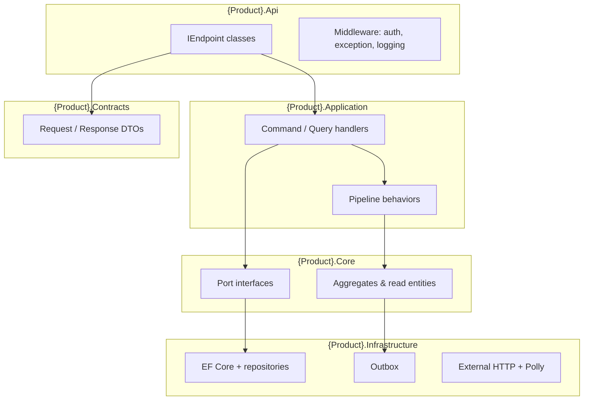

# PwC Internal Application Architecture — Reference Guide

> **Single source of truth** for designing, building, and operating internal web applications on the
> PwC corporate platform (GCaaS, Entra SSO, AppKit 4, Azure).
>
> **Audience:** architects, tech leads, backend and frontend developers, reviewers, and AI assistants.
> **Language:** English (code, docs, identifiers). End-user UI copy may use the product locale.

---

## Executive summary

Internal PwC applications are **monorepo web systems** composed of a **.NET API**, an **Angular SPA**,
and optional **background workers**, hosted on **GCaaS** (production) and **Azure** (staging/dev).
Identity is **platform-managed**: the ingress layer issues an HTTP-only session cookie; applications
must not implement app-owned OAuth flows or store bearer tokens in browser storage.

This guide defines the **mandatory platform constraints**, the **recommended solution structure**, the
**patterns to use**, and the **quality gates** that every internal app should enforce. Product-specific
docs may extend this guide but must not contradict it.

---

## 1. Platform constraints (non-negotiable)

| Constraint                  | Requirement                                                                                                                           |
| --------------------------- | ------------------------------------------------------------------------------------------------------------------------------------- |
| **Hosting (production)**    | GCaaS Knative — **separate containers** for API and SPA                                                                               |
| **Ingress**                 | Istio `VirtualService`; Entra host (`global-caas-*`) + legacy host during transition                                                  |
| **Authentication**          | Platform-managed Entra SSO → **`id_token` HTTP-only cookie**; SPA sends `withCredentials: true`                                       |
| **Forbidden auth patterns** | MSAL in SPA, app-owned `/login` OAuth code flow, Bearer tokens in `sessionStorage`/`localStorage`, refresh-token ownership by the app |
| **Secrets**                 | HashiCorp Vault via Helm; never committed to the repository                                                                           |
| **UI**                      | **AppKit 4** (Classic or Re-Branded) — shell, tokens, components; no custom app chrome                                                |
| **Observability**           | OpenTelemetry-compatible tracing; Datadog on GCaaS; Application Insights on Azure staging                                             |
| **Repository**              | Single monorepo per product                                                                                                           |
| **Code language**           | English for code, files, APIs, schemas, commits, and technical documentation                                                          |

### Authentication sequence (platform model)

```mermaid
sequenceDiagram
    participant B as Browser
    participant GW as GCaaS Ingress / Envoy
    participant SPA as Frontend container
    participant API as Backend container

    B->>GW: Navigate to app URL
    GW->>B: Entra SSO (if needed)
    GW->>B: Set id_token cookie (HttpOnly)
    B->>SPA: Load SPA (withCredentials)
    B->>API: GET /api/auth/me (withCredentials)
    API->>API: Validate platform JWT / headers
    API-->>B: User identity + roles
    Note over B,API: All API calls use withCredentials;<br/>no Authorization Bearer header from SPA
```

---

## 2. Technology baseline

| Layer              | Standard                                     | Notes                                                   |
| ------------------ | -------------------------------------------- | ------------------------------------------------------- |
| Backend runtime    | **.NET 10**                                  | `global.json` pins SDK                                  |
| API                | **ASP.NET Core Minimal API**                 | Endpoint classes with convention-based discovery        |
| Application        | **CQRS** + custom or library mediator        | Pipeline behaviors for cross-cutting concerns           |
| Persistence        | **EF Core 10** + **Azure SQL**               | Migrations in Infrastructure                            |
| Frontend           | **Angular 19**                               | Standalone components; no NgModules                     |
| UI library         | **AppKit 4** (`@appkit4/angular-components`) | See `docs/appkit4/` in products that ship the reference |
| Package management | Central (`Directory.Packages.props`)         | Backend; lockfile for npm                               |
| CI (staging)       | GitHub Actions → Azure                       | API + SPA                                               |
| CD (production)    | GCaaS Helm chart                             | Knative services                                        |

Optional capabilities (enable when the product requires them):

| Capability      | Typical stack                                      |
| --------------- | -------------------------------------------------- |
| Hybrid search   | Azure AI Search + embeddings                       |
| Async pipelines | Azure Storage Queues + `BackgroundService` workers |
| Real-time admin | Azure SignalR Service                              |
| AI agents       | Semantic Kernel + Azure OpenAI                     |
| Blob documents  | Azure Blob Storage                                 |

---

## 3. Monorepo layout

```
{product}/
├── backend/
│   ├── src/
│   │   ├── api/
│   │   │   ├── {Product}.Api/           # Minimal API, middleware, endpoint mapping
│   │   │   └── {Product}.Application/   # CQRS handlers, behaviors, mappers
│   │   ├── shared/
│   │   │   ├── {Product}.Core/        # Domain, entities, ports (interfaces)
│   │   │   ├── {Product}.Contracts/   # Public API request/response DTOs
│   │   │   └── {Product}.Infrastructure/  # EF, Azure, HTTP clients, outbox
│   │   ├── workers/                     # Optional BackgroundService hosts
│   │   └── tools/                       # Optional CLI utilities
│   ├── tests/
│   │   ├── {Product}.UnitTests/
│   │   ├── {Product}.ArchitectureTests/
│   │   └── {Product}.InfrastructureTests/
│   ├── Directory.Packages.props
│   └── {Product}.sln
├── frontend/
│   ├── projects/
│   │   ├── app/                         # Bootstrap + root routes
│   │   ├── shell/                       # AppKit layout (header, drawer, footer)
│   │   ├── core/                        # Auth, interceptors, guards, environment
│   │   ├── ui/                          # AppKit wrapper components
│   │   ├── shared-common/               # Pipes, directives, utils (domain-agnostic)
│   │   └── features/                    # Feature libraries (see §6)
│   └── schema-{prefix}/                 # Optional Angular schematics
├── deployment/                          # GCaaS Helm chart
├── infra/                               # Azure provisioning (Bicep/scripts)
└── docs/
    ├── standards/                       # This guide
    ├── technical/                       # Product-specific implementation docs
    └── deployment/                      # Hosting and delivery runbooks
```

**Dependency rule (backend):** dependencies point inward. `{Product}.Core` references nothing outside
the BCL. `{Product}.Application` references Core (+ Contracts). Infrastructure references Application
and Core. Api references Application and Infrastructure.

---

## 4. Backend architecture

### 4.1 Layer responsibilities



| Layer              | Responsibility                                                                  |
| ------------------ | ------------------------------------------------------------------------------- |
| **Core**           | Domain model, value objects, domain errors, repository/service **interfaces**   |
| **Contracts**      | Stable HTTP contract types (requests, responses); no business logic             |
| **Application**    | Use cases: commands, queries, handlers, validation orchestration, mapping       |
| **Infrastructure** | EF configurations, repository implementations, outbox, Azure SDKs, HTTP clients |
| **Api**            | HTTP surface, auth policies, endpoint mapping, ProblemDetails mapping           |

### 4.2 Domain modeling — dual model

Use the model that matches the access pattern:

| Model type         | When to use                                    | Characteristics                                                    |
| ------------------ | ---------------------------------------------- | ------------------------------------------------------------------ |
| **Rich aggregate** | Transactional writes, invariants, side effects | Private setters, factory methods, `ErrorOr` results, domain events |
| **Read entity**    | Index-heavy, ingest-heavy, mostly queried data | EF entity + DTO mapping; behavior in Application handlers          |
| **Value object**   | Both                                           | Immutable `record`; no identity                                    |

Do not force rich aggregates on read-only catalog data. Do not use anemic entities for multi-step
workflows that emit side effects.

### 4.3 Application layer — CQRS and mediator

- **Commands** mutate state; **queries** read state.
- Handlers implement `IRequestHandler<TRequest, TResponse>` (custom mediator or established library).
- Register handlers by assembly scanning.
- Attach **pipeline behaviors** for cross-cutting concerns:

```
Request → Logging → Validation → Authorization → Transaction → Handler → Response
```

- Return **`ErrorOr<T>`** from commands with business-rule failures; map to RFC 7807 ProblemDetails at
  the API boundary.
- Use **FluentValidation** for input validation; run at the API filter or as a pipeline behavior.

### 4.4 API layer — Minimal API with endpoint discovery

Each endpoint is a class implementing `IEndpoint`:

```csharp
public interface IEndpoint
{
    string GroupName { get; }
    void MapEndpoint(IEndpointRouteBuilder app);
}
```

Registration discovers all `IEndpoint` implementations, groups them under `api/{groupName}`, and applies:

- `[Authorize]` on the group (fallback policy: authenticated user)
- A global validation endpoint filter
- Central ProblemDetails mapping for `ErrorOr` failures

**Do not** embed business logic in endpoint lambdas — delegate to the mediator/handler.

### 4.5 Side effects — outbox and queues

| Mechanism                | Use case                                                                                 |
| ------------------------ | ---------------------------------------------------------------------------------------- |
| **Transactional outbox** | Domain events that must survive process restarts (notifications, audit, downstream sync) |
| **Message queues**       | Long-running pipelines, worker fan-out, ingestion stages                                 |
| **SignalR**              | Live admin dashboards, progress streaming to connected clients                           |

Outbox flow:

1. Aggregate raises domain event before `SaveChanges`.
2. EF interceptor serializes events to an `OutboxMessages` table in the same transaction.
3. A background job or worker dispatches events idempotently.

### 4.6 Resilience and observability (backend)

- **Serilog** structured logging with correlation ID enrichment.
- **Polly** retry/backoff on outbound HTTP (external APIs, webhooks).
- **OpenTelemetry** traces spanning API → Application → Infrastructure → external calls.
- Never log secrets, tokens, or PII beyond what compliance allows.

---

## 5. Authentication and authorization

### 5.1 SPA responsibilities

| Do                                                           | Do not                                                     |
| ------------------------------------------------------------ | ---------------------------------------------------------- |
| Call `GET /api/auth/me` at bootstrap (`APP_INITIALIZER`)     | Store JWT in `localStorage` / `sessionStorage`             |
| Set `withCredentials: true` on API calls (corporate host)    | Add `Authorization: Bearer` from client-side token storage |
| Redirect to platform logout URL on session expiry            | Implement MSAL login flows in the SPA                      |
| Refresh session via platform `/{engagementId}/refresh` timer | Own refresh-token rotation in the app                      |

### 5.2 API responsibilities

- Validate the platform-issued JWT (cookie or forwarded headers per deployment config).
- Expose `/api/auth/me` returning user id, display name, email, and roles/groups.
- Apply authorization policies (`AdminOnly`, feature-specific roles) on endpoint groups.
- Use `[Authorize]` fallback policy requiring authenticated users on all business endpoints.

### 5.3 Environment configuration

| Key                                | Purpose                                                     |
| ---------------------------------- | ----------------------------------------------------------- |
| `usePlatformCredentials`           | SPA: enable `withCredentials` interceptor                   |
| `platformAuthFailurePath`          | SPA route when session is missing (e.g. `session-required`) |
| `platformSessionRefreshIntervalMs` | GCaaS session refresh timer (default ~45 min)               |
| `Auth:Platform`                    | API: JWT validation parameters for GCaaS                    |

---

## 6. Frontend architecture

### 6.1 Angular monorepo structure

The SPA is an **Angular workspace** with publishable libraries:

| Library         | Purpose                                                         |
| --------------- | --------------------------------------------------------------- |
| `app`           | Bootstrap, root routing, error pages                            |
| `shell`         | AppKit header, navigation drawer, footer, content outlet        |
| `core`          | Platform auth service, interceptors, guards, environment        |
| `ui`            | Thin wrappers around AppKit components (tables, modals, panels) |
| `shared-common` | Domain-agnostic pipes, directives, utilities                    |
| `features/*`    | Product features (lazy-loaded)                                  |

All components are **standalone**. Routes use `loadComponent` / `loadChildren`.

### 6.2 Adaptive feature layering

Choose the structure based on feature complexity:

**Thin slice** — read-heavy lists, catalogs, simple CRUD:

```
features/{name}/
├── {name}.routes.ts
├── pages/
├── components/
├── data/              # api + models + service
└── index.ts
```

**Full slice** — multi-step wizards, transactional state, SSE/streaming, complex orchestration:

```
features/{name}/
├── domain/            # models, interfaces
├── api/               # HTTP clients
├── application/       # use cases, signal stores
├── views/
│   ├── pages/
│   └── components/
└── {name}.routes.ts
```

**Rule:** if the feature has transactional writes, long-lived client state, or streaming, use the full
slice. Otherwise prefer the thin slice to reduce ceremony.

### 6.3 AppKit shell

```
┌─────────────────────────────────────────────────┐
│ ap-header  (logo · user menu · logout)          │
├──────────┬──────────────────────────────────────┤
│ ap-drawer│  ap-panel sections                  │
│ (nav)    │  <router-outlet>                    │
├──────────┴──────────────────────────────────────┤
│ ap-footer                                       │
└─────────────────────────────────────────────────┘
```

- Navigation groups: primary features, tools, admin (role-gated).
- Use AppKit design tokens — no hard-coded colors, spacing, or typography.
- Consult AppKit component reference before building custom controls.

### 6.4 Client state

| Concern                        | Approach                                             |
| ------------------------------ | ---------------------------------------------------- |
| Auth user, layout, filters     | **Angular signals**                                  |
| Paginated tables, form wizards | RxJS observables in application layer                |
| SSE / streaming responses      | `fetch` + `ReadableStream` or EventSource (GET only) |

### 6.5 Schematics (recommended)

Maintain project schematics to generate consistent feature scaffolding:

```bash
ng g schema-{prefix}:thin-feature {name} --route={path}
ng g schema-{prefix}:full-feature {name} --route={path}
ng g schema-{prefix}:ui-wrapper {component}
ng g schema-{prefix}:api-service {name} --domain={segment} --feature={feature}
```

> **Legal Ai Ar:** prefix `la`, collection `schema-la`. See `frontend/docs/schematics.md`.

Schematics enforce naming, folder layout, and placeholder tests.

---

## 7. Workers and background processing

| Pattern                                      | When                                                       |
| -------------------------------------------- | ---------------------------------------------------------- |
| `BackgroundService` in dedicated worker host | Continuous queue consumers (ingestion, indexing)           |
| Quartz / cron job in worker or API           | Scheduled tasks (outbox dispatch, reminders)               |
| Azure Functions                              | Lightweight event reactions (evaluate per platform policy) |

Workers share `{Product}.Application` and `{Product}.Infrastructure` with the API. Each worker is a
separate deployable on GCaaS when scale or lifecycle isolation is required (`values.yaml` toggles).

---

## 8. Optional AI and search extension

Products that include AI capabilities add a dedicated project:

```
{Product}.Agents/    # Semantic Kernel plugins, prompt templates, router
```

Principles:

- Prompt templates live in version-controlled YAML (may use the product locale for end-user-facing agent text).
- Plugins expose `[KernelFunction]` tools; handlers in Application orchestrate the agent loop.
- Stream responses via **SSE** (`text/event-stream`) for chat; use POST + `ReadableStream` on the client.
- Evaluate agent quality with golden sets and automated judges in a dedicated test project.
- Apply guardrails (content filtering, PII, rate limits) as pipeline behaviors, not ad hoc in endpoints.

---

## 9. Testing and quality gates

### 9.1 Test pyramid

| Level        | Tooling                                        | Scope                                      |
| ------------ | ---------------------------------------------- | ------------------------------------------ |
| Unit         | xUnit + NSubstitute (backend); Jest (frontend) | Handlers, domain rules, services           |
| Snapshot     | Verify.Xunit                                   | Handler outputs, serialized DTOs           |
| Architecture | NetArchTest.Rules                              | Layer dependency rules, naming conventions |
| Integration  | Testcontainers or dedicated test DB            | Repositories, EF configurations            |
| E2E          | Playwright                                     | Critical user journeys                     |
| Agent eval   | Custom golden-set runner                       | AI response quality (if applicable)        |

### 9.2 Mandatory architecture tests (NetArchTest)

Minimum rules enforced in CI:

- Core does not reference Application, Infrastructure, or Api.
- Handlers live only in Application.
- Endpoint classes live only in Api.
- Contracts contain no business logic (no references to Infrastructure).
- Entities in read-only domains do not reference agent/AI projects.

### 9.3 Static analysis

| Stack     | Tools                                                                       |
| --------- | --------------------------------------------------------------------------- |
| Backend   | `TreatWarningsAsErrors`, nullable reference types, Roslynator, NetAnalyzers |
| Frontend  | ESLint (`angular-eslint`), Prettier, `strict` TypeScript                    |
| Repo-wide | `.editorconfig`, husky + lint-staged pre-commit                             |

---

## 10. Delivery paths

| Path                       | Target               | Artifacts                                                  |
| -------------------------- | -------------------- | ---------------------------------------------------------- |
| **GitHub Actions → Azure** | Staging / dev / QA   | API (App Service), SPA (Static Web App or App Service)     |
| **GCaaS Helm**             | Corporate production | `{release}-backend`, `{release}-frontend` Knative services |

Both paths must produce the **same container images** where possible. Environment-specific values
(connection strings, auth config) come from Vault / Azure Key Vault / Helm values — never from source.

URL pattern (Entra host):

```
https://{entraHostName}/{engagementId}/{releaseName}-{appName}/
```

---

## 11. Naming and language conventions

| Artifact                | Convention                                 | Example                                  |
| ----------------------- | ------------------------------------------ | ---------------------------------------- |
| .NET namespace          | `{Product}` PascalCase, no spaces          | `AcmeTaxPortal.Application`              |
| Database                | `{Product}` PascalCase                     | `AcmeTaxPortal`                          |
| Azure resources         | `{service}-{product-kebab}-{env}`          | `sql-acme-tax-portal-dev`                |
| API routes              | kebab-case, plural nouns                   | `/api/workspaces/{id}`                   |
| Angular selector prefix | product abbreviation, kebab-case           | `atp-workspace-list`                     |
| Storage containers      | kebab-case                                 | `workspace-documents`                    |
| Commits                 | Conventional Commits                       | `feat(workspaces): add create command`   |
| UI strings              | Product locale (often Spanish for AR apps) | Label: "Espacios de trabajo"             |
| Code & docs             | **English**                                | Class `WorkspaceService`, doc in English |

---

## 12. Security checklist

- [ ] All business endpoints require authentication (fallback policy).
- [ ] Admin and elevated endpoints have explicit authorization policies.
- [ ] No secrets in repository, appsettings committed, or client bundles.
- [ ] CORS restricted to known SPA origins; `AllowCredentials` only when required.
- [ ] Input validation on every mutating endpoint (FluentValidation).
- [ ] SQL injection prevented via EF parameterized queries; raw SQL audited.
- [ ] File uploads scanned and size-limited; stored in Blob with SAS or managed identity.
- [ ] AI outputs filtered per responsible-AI policy when applicable.
- [ ] Audit log for sensitive operations (who, what, when).

---

## 13. Definition of Done alignment

Every work item must satisfy the project [Definition of Done](../roadmap/DEFINITION-OF-DONE.md).
Architecture-related items to verify on each PR:

- [ ] Changes respect layer dependencies (§4.1).
- [ ] Auth follows the platform cookie model (§5) — no regressions to app-owned OAuth.
- [ ] New UI uses AppKit components and tokens (§6.3).
- [ ] New endpoints follow the `IEndpoint` + handler pattern (§4.4).
- [ ] Transactional side effects use outbox or queues, not fire-and-forget (§4.5).
- [ ] Architecture tests pass when layers or conventions change (§9.2).
- [ ] Product-specific docs in `docs/technical/` updated to reflect the merged code.

---

## 14. Design decisions summary

| Decision           | Alternatives                       | Chosen                       | Reason                                                  |
| ------------------ | ---------------------------------- | ---------------------------- | ------------------------------------------------------- |
| Auth model         | App-owned OAuth + Bearer           | Platform cookie (`id_token`) | GCaaS standard; no token leakage in browser storage     |
| API style          | MVC Controllers                    | Minimal API + `IEndpoint`    | Thin HTTP layer; one class per endpoint; easy discovery |
| Mediator           | MediatR package                    | Custom mediator + behaviors  | Full control; no version lock-in; pipeline behaviors    |
| Domain style       | Anemic everywhere / DDD everywhere | Dual model (§4.2)            | Right complexity for read vs write paths                |
| Frontend structure | Flat SPA / strict 4-layer always   | Adaptive layering (§6.2)     | Balance consistency and ceremony                        |
| DTO placement      | Inside Application                 | Dedicated Contracts project  | Stable API surface; shared with OpenAPI consumers       |
| Side effects       | Direct async calls                 | Outbox + queues              | Reliability; transactional consistency                  |
| UI                 | Custom CSS / Material-only         | AppKit 4                     | PwC brand compliance; accessibility baseline            |

---

## 15. Product-specific documentation

This guide defines **how** to build internal PwC apps. Each product maintains **`docs/technical/`**
documents describing **what** was built: routes, entities, pipelines, and product-specific decisions.
Those docs must:

1. Reference this guide as the architectural baseline.
2. Be updated in the same PR as code changes (documentation round-trip).
3. Never contradict platform constraints in §1.

---

## 16. Architecture compliance checklist

Use when starting a feature, reviewing a PR, or closing a work item:

### Backend

- [ ] Handler in Application; no business logic in Api endpoint lambdas
- [ ] New DTOs in Contracts (or documented exception)
- [ ] Repository interface in Core; implementation in Infrastructure
- [ ] Command with business rules returns `ErrorOr<T>`
- [ ] Domain events persisted via outbox when side effects are required

### Frontend

- [ ] Feature lazy-loaded; correct slice type (thin vs full)
- [ ] AppKit components used; no custom chrome
- [ ] `withCredentials` via platform interceptor; no Bearer header from storage
- [ ] UI labels in product locale; code identifiers in English

### Delivery & quality

- [ ] Secrets from Vault / Key Vault only
- [ ] `dotnet build` zero warnings; tests green
- [ ] Architecture tests pass
- [ ] DoD documentation round-trip complete

---

## References

- [AppKit 4 documentation](../appkit4/README.md) — UI components, tokens, patterns
- [Definition of Done](../roadmap/DEFINITION-OF-DONE.md) — mandatory close criteria for work items
- [GCaaS hosting](../deployment/gcaas-hosting.md) — production deployment and session model
- [GitHub delivery](../deployment/github-delivery.md) — staging CI/CD

---

_PwC Internal Application Architecture — Reference Guide_
