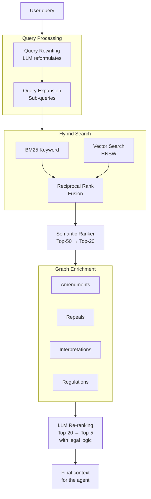

# 01 — RAG & Retrieval

> **Project:** Legal Ai Ar | **Category:** Retrieval-Augmented Generation
> **Status:** Partially defined (Hybrid Search + GraphRAG in F00-W01)
> **Last updated:** May 2026

---

## 1. Description

RAG (Retrieval-Augmented Generation) is the core pattern of Legal Ai Ar: instead of the LLM answering only from its parametric knowledge, the system first retrieves relevant documents from the KB and injects them as context into the prompt. Answer quality depends directly on retrieval quality.

In the Argentine legal domain this is critical because answers must be grounded in current legislation, up-to-date case law, and authoritative doctrine. An answer with no sources or with incorrect sources is not just useless but dangerous.

---

## 2. Technical Decisions

### 2.1 Main search strategy: Hybrid Search

| Alternative | Pros | Cons | Decision |
|---|---|---|---|
| **Keyword Search (BM25)** | Excellent for exact lookup of law numbers, articles, case files. Fast. No embeddings required. | Does not understand synonyms or semantic context. "Despido injustificado" does not match "extinción del contrato sin causa". | Discarded as the sole method |
| **Semantic Search (vectors only)** | Understands synonyms, paraphrases, and natural-language queries. | Misses exact lookups: "Ley 20.744 art. 245" may return irrelevant articles with nearby embeddings. High inference cost. | Discarded as the sole method |
| **Hybrid Search (BM25 + vectors + RRF)** | Combines the best of both: exact + semantic search. Reciprocal Rank Fusion (RRF) merges rankings without weight calibration. Azure AI Search supports it natively. | Higher index complexity. Two scoring pipelines. | **Chosen** |

**Rationale:** The legal domain requires both capabilities simultaneously. A lawyer may search "Ley 20.744 art. 245" (exact keyword) or "¿qué dice la ley sobre indemnización por despido?" (semantic). Hybrid Search with RRF covers both cases without manual weight configuration.

### 2.2 Graph enrichment: GraphRAG

| Alternative | Pros | Cons | Decision |
|---|---|---|---|
| **Flat RAG (top-K only)** | Simple. Fast. Easy to implement. | Loses legal relationships: searching art. 245 does not surface that it was amended by Ley 25.877, nor the rulings that interpret it. | Discarded |
| **Full Knowledge Graph (Neo4j/Neptune)** | Native graph with Cypher/Gremlin. Complex traversals. Integrated visualization. | Additional costly service. Not in the client's Azure stack. Data duplication with SQL. | Discarded |
| **SQL Graph (Azure SQL)** | Uses existing infrastructure (Azure SQL). MATCH syntax for traversals. Typed edges. No additional cost. | Limited vs Neo4j: no native centrality, community, or PageRank algorithms. Deep traversals are less efficient. | **Chosen** |

**Rationale:** SQL Graph within Azure SQL avoids adding a dedicated graph service. The legal relationships we need (amends, repeals, regulates, interprets, applies) are 1-3 level traversals, which SQL Graph handles efficiently. If complex graph algorithms (communities, influence) are required in the future, we can migrate to a dedicated graph.

### 2.3 Contextual Retrieval

| Alternative | Pros | Cons | Decision |
|---|---|---|---|
| **Chunks without context** | Fast to generate. Fewer tokens. | The chunk "El plazo será de 30 días" is useless without knowing it belongs to art. 245 of the LCT on severance pay. | Discarded |
| **Chunking with overlap** | Mitigates context loss with an overlapping window. | Overlap adds redundancy. Does not solve hierarchical context loss (which law, which title, which chapter). | Insufficient alone |
| **Contextual Retrieval (Anthropic)** | Before embedding, an LLM generates a context paragraph prepended to the chunk. "This article belongs to Ley 20.744 on Employment Contracts, Title XII on contract termination, and establishes severance pay for dismissal without cause." | Additional LLM cost per chunk. More tokens in the index. Requires ingestion processing. | **Chosen** |
| **Late Chunking** | Generates embeddings of the full document and then extracts per-chunk representations, preserving cross-attention. | Requires specific models (jina-embeddings-v3). Not available in Azure OpenAI. High implementation complexity. | Evaluated for the future |

**Rationale:** In the legal domain, hierarchical context is fundamental. A standalone article is ambiguous; it needs to know which law, title, chapter, and section it belongs to. Contextual Retrieval solves this by prepending an LLM-generated contextual summary to each chunk before embedding. The cost is manageable because it is done once at ingestion, not on every query.

### 2.4 Query Processing

| Technique | Description | Decision |
|---|---|---|
| **Query Rewriting** | The LLM reformulates the user query to optimize retrieval. "¿Me pueden echar sin aviso?" → "Despido sin preaviso, indemnización art. 232 LCT" | **Chosen** — Implement with a specific prompt |
| **Query Expansion** | Generate multiple complementary queries and merge results. One user query generates 3-4 focused sub-queries. | **Chosen** — For complex multi-concept queries |
| **HyDE (Hypothetical Document Embeddings)** | The LLM generates a "hypothetical document" that answers the query, and its embedding is used to search. | Evaluated for the future — High cost, marginal benefit with Hybrid Search |
| **Step-back prompting** | Before searching, the LLM abstracts the question to a more general level to widen recall. | Evaluated for the future |

### 2.5 Re-ranking

| Alternative | Pros | Cons | Decision |
|---|---|---|---|
| **No re-ranking** | Simple. Lower latency. | RRF can mis-rank documents that are semantically relevant but have a low BM25 score. | Discarded |
| **Cross-encoder re-ranking** | Re-evaluates (query, doc) pairs with a cross-attention model. Very precise. | Requires an additional model. Extra latency of ~200-500ms. Not natively available in Azure AI Search. | Evaluated for the future |
| **LLM re-ranking** | Uses GPT to reorder top-K by relevance to the legal domain. Can consider validity, normative hierarchy, jurisdiction. | More expensive. But it can apply legal logic (prioritize a norm in force over a repealed one, an en banc ruling over an individual one). | **Chosen** — For agents, not for direct search |
| **Semantic Ranker (Azure AI Search)** | Microsoft's integrated re-ranking model. Only requires enabling the feature on the index. | Additional cost per query. Does not understand legal logic. General semantic scoring only. | **Chosen** — As the first layer |

**Tiered decision:**
1. **Layer 1:** Hybrid Search with RRF (native Azure AI Search) — all queries
2. **Layer 2:** Semantic Ranker (Azure AI Search) — enable to refine top-50 → top-20
3. **Layer 3:** LLM re-ranking — only in agents, to refine top-20 → top-5 with legal logic

---

## 3. Retrieval Pipeline Architecture



### 3.1 Detailed flow

1. **Query Processing:** The LLM rewrites the user query, identifying legal entities (law numbers, articles, courts) and expanding into sub-queries if needed.

2. **Hybrid Search:** Azure AI Search runs simultaneous keyword (BM25) and vector (HNSW) search, merging results with RRF. Filters (law branch, validity, jurisdiction) are applied as pre-filters.

3. **Semantic Ranker:** Refines the Hybrid Search top-50 to top-20, re-evaluating with an integrated cross-encoder.

4. **Graph Enrichment:** For each document in the top-20, the SQL Graph edges are queried to obtain legal relationships (amendments, repeals, interpretations). This adds documents that did not appear in the search but are contextually relevant.

5. **LLM Re-ranking:** Only in agents (not in direct UI search). The LLM reorders considering: current validity, normative hierarchy (Constitution > law > decree), ruling recency, jurisdictional relevance.

---

## 4. Concrete Example: Query about dismissal

**User query:** "Un empleado con 8 años de antigüedad fue despedido sin causa, ¿qué indemnización le corresponde?"

### Step 1: Query Rewriting
```
Original query: "empleado 8 años despedido sin causa indemnización"
Rewritten query: "indemnización por despido sin justa causa antigüedad art 245 Ley Contrato Trabajo"
Sub-queries:
  1. "art 245 ley 20744 indemnización despido"
  2. "indemnización por antigüedad despido sin causa cálculo"
  3. "jurisprudencia CNAT despido sin causa base salarial"
```

### Step 2: Hybrid Search
```
BM25 top hits: Ley 20.744 art. 245 (exact match), Ley 25.877, Decreto 1694/06
Vector top hits: art. 245 LCT, art. 232 (preaviso), art. 233 (integración), several CNAT rulings
RRF merged: [art.245, Ley 25.877, art.232, art.233, Decreto 1694/06, CNAT rulings...]
```

### Step 3: Graph Enrichment
```sql
-- For art. 245, find relationships
SELECT e.$edge_id, e.RelationType, n2.Name
FROM Amends e, LegalNorm n1, LegalNorm n2
WHERE MATCH(n1<-(e)-n2)
AND n1.NormNumber = '20744';

-- Result: Ley 25.877 amends art. 245, Decreto 1694/06 regulates the salary base
-- 3 CNAT rulings that interpret art. 245 are added (via the Interprets edge)
```

### Step 4: LLM Re-ranking (in agent)
```
Legal re-ranking criteria:
1. Art. 245 LCT (in force, main norm) → Score: 0.98
2. Ley 25.877 (amending, in force) → Score: 0.95
3. Ruling "Vizzoti c/ AMSA" CSJN (en banc, sets the cap) → Score: 0.92
4. Art. 232 preaviso (complementary) → Score: 0.85
5. Decreto 1694/06 (regulatory, in force) → Score: 0.80
```

---

## 5. Contextual Retrieval Configuration

### 5.1 Context generation prompt

> This is an agent/LLM prompt, so its body is kept in Spanish (the end-user contact layer).

```
Sos un asistente legal argentino. Tu tarea es generar un párrafo breve de contexto
para el siguiente fragmento de texto legal, de modo que sea comprensible sin leer
el documento completo.

DOCUMENTO: {nombre_documento}
TIPO: {tipo} (ley/decreto/resolución/fallo/doctrina)
JERARQUÍA: {titulo} > {capitulo} > {seccion}
FECHA: {fecha_publicacion}
VIGENCIA: {vigente|derogada|modificada}

FRAGMENTO:
{chunk_text}

Generá un párrafo de 2-3 oraciones que incluya:
- A qué norma/fallo pertenece (nombre y número completo)
- En qué parte del documento se ubica (título, capítulo, sección)
- Cuál es el tema general que trata este fragmento
- Si está vigente, derogado o fue modificado

CONTEXTO:
```

### 5.2 Example of a contextualized chunk

The legal text and the generated context below are in Spanish because they are verbatim Argentine legal source content and agent-generated output.

**Original chunk:**
> "La indemnización que corresponda al trabajador será equivalente a un mes de sueldo por cada año de servicio o fracción mayor de tres meses, tomando como base la mejor remuneración mensual, normal y habitual."

**Generated context (prepended):**
> "Este fragmento pertenece al artículo 245 de la Ley 20.744 de Contrato de Trabajo, ubicado en el Título XII 'De la extinción del contrato de trabajo', Capítulo IV 'Del despido directo'. Establece el cálculo de la indemnización por despido sin justa causa. El artículo está vigente, con la modificación introducida por la Ley 25.877 (2004) que alteró la base de cálculo."

**Final contextualized chunk (what gets embedded):**
> "[CONTEXTO: Este fragmento pertenece al artículo 245 de la Ley 20.744 de Contrato de Trabajo, ubicado en el Título XII 'De la extinción del contrato de trabajo', Capítulo IV 'Del despido directo'. Establece el cálculo de la indemnización por despido sin justa causa. El artículo está vigente, con la modificación introducida por la Ley 25.877 (2004) que alteró la base de cálculo.] La indemnización que corresponda al trabajador será equivalente a un mes de sueldo por cada año de servicio o fracción mayor de tres meses, tomando como base la mejor remuneración mensual, normal y habitual."

---

## 6. Retrieval Evaluation Metrics

| Metric | What it measures | Target | How it is measured |
|---|---|---|---|
| **Recall@10** | Is the correct document in the top-10? | ≥ 0.90 | Golden set of 200+ (query, relevant docs) pairs |
| **MRR (Mean Reciprocal Rank)** | At what position does the first correct doc appear? | ≥ 0.75 | Average of 1/rank of the first correct hit |
| **NDCG@10** | Are the relevant docs well ordered? | ≥ 0.80 | Lawyer relevance judgments (0-3) |
| **Precision@5** | How many of the top-5 are relevant? | ≥ 0.70 | Golden set with relevance labels |
| **P95 Latency** | Response time of the full retrieval | < 2s | Application Insights |
| **Validity coverage** | Are norms in force prioritized? | 100% of top-3 in force | Automated test |

### 6.1 Legal Golden Set

An evaluation dataset will be built with the law firm:

- **200 typical queries** grouped by law branch (labor, civil, criminal, commercial, administrative)
- **Expected documents** for each query (norms, articles, rulings)
- **Relevance labels** (0=irrelevant, 1=marginal, 2=relevant, 3=highly relevant)
- **Evaluators:** At least 2 lawyers per query to reduce bias
- **Update:** Quarterly, incorporating new norms and case law

---

## 7. Items Pending Definition

- [ ] Define the initial golden set with the law firm (minimum 200 query-doc pairs)
- [ ] Calibrate Semantic Ranker weights vs the Hybrid Search baseline
- [ ] Define the minimum score threshold to include a result
- [ ] Evaluate whether Late Chunking adds value with available Jina models
- [ ] Define a fallback strategy when retrieval returns low confidence
- [ ] Establish an embedding cache policy for frequent queries
- [ ] Define the granularity of Query Expansion (2, 3, or 4 sub-queries)
- [ ] Evaluate HyDE for conceptual vs factual queries
- [ ] Configure scoring profiles by law branch (different weights for labor vs criminal)

---

## 8. References

- [Azure AI Search — Hybrid Search](https://learn.microsoft.com/en-us/azure/search/hybrid-search-overview)
- [Azure AI Search — Semantic Ranker](https://learn.microsoft.com/en-us/azure/search/semantic-search-overview)
- [Anthropic — Contextual Retrieval](https://www.anthropic.com/news/contextual-retrieval)
- [Microsoft — GraphRAG](https://microsoft.github.io/graphrag/)
- [Azure SQL — Graph Processing](https://learn.microsoft.com/en-us/sql/relational-databases/graphs/sql-graph-overview)

---

*01 — RAG & Retrieval — Legal Ai Ar*
