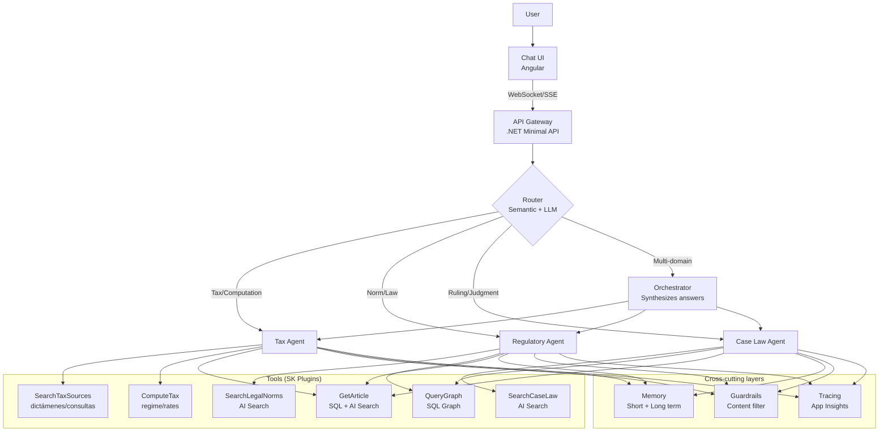

# 02 — Agentic Architecture

> **Project:** Legal Ai Ar | **Category:** AI Agent Architecture
> **Status:** Partially defined (3 agents + Semantic Kernel in F0.0-W01)
> **Last updated:** May 2026

---

## 1. Description

Legal Ai Ar uses a system of specialized AI agents that act as assistants to PwC tax-legal professionals. Each agent has a specific knowledge domain (tax, regulatory, case law) and access to differentiated tools. The agentic architecture defines how these agents receive queries, reason, use tools, collaborate with each other, and produce well-grounded answers.

Unlike a simple chatbot that only does RAG, the agents can plan steps, invoke functions (search, tax computation, document/clause lookup), and chain complex reasoning.

---

## 2. Technical Decisions

### 2.1 Orchestration framework

| Alternative | Pros | Cons | Decision |
|---|---|---|---|
| **Semantic Kernel (Microsoft)** | Native .NET SDK. Native Azure OpenAI integration. Typed plugins in C#. Planning with Function Calling. Enterprise-ready. | Less flexible than LangChain for quick prototypes. Documentation still evolving. | **Chosen** |
| **LangChain (.NET port)** | Large community. Many integrations. Flexible. | Immature .NET port. Originally Python. Excessive abstraction. Strong opinions about the stack. | Discarded |
| **AutoGen (Microsoft)** | Native multi-agent. Conversation between agents. | Research-oriented. Unstable API. Overhead for simple cases. | Evaluated for the future |
| **Custom (no framework)** | Full control. No dependencies. | Reinventing the wheel: prompt management, tool calling, memory, error handling. High development cost. | Discarded |

**Rationale:** Semantic Kernel is the natural choice for .NET 10 + Azure OpenAI. It supports native Function Calling, typed plugins, automatic planning, and has a roadmap aligned with Azure. The 2-dev team cannot maintain a custom framework.

### 2.2 Routing pattern

| Alternative | Pros | Cons | Decision |
|---|---|---|---|
| **Keyword-based router** | Simple. Fast. Deterministic. | Fragile: "¿Qué alícuota de IVA aplica a la exportación de servicios y desde cuándo rige?" has both tax AND regulatory keywords. | Discarded |
| **Semantic router (embedding)** | Classifies by semantic similarity with each agent's descriptions. Fast (one embedding only). | Requires good agent descriptors. May fail on ambiguous queries. | **Chosen as the first layer** |
| **LLM router (function calling)** | The LLM decides which agent to use based on the query. Can explain the decision. Can invoke multiple agents. | Extra latency (~500ms). Cost of an additional LLM call. | **Chosen as the second layer** |
| **Hybrid router (semantic + LLM)** | Semantic as the fast path for clear queries. LLM as fallback for ambiguous ones. | Higher complexity. Two code paths. | **Chosen (combination)** |

**Decision:** A two-layer router. The semantic router (embedding similarity) quickly classifies clear queries (confidence > 0.85). Ambiguous ones (confidence < 0.85) go to an LLM router that analyzes intent and can invoke multiple agents.

### 2.3 Reasoning pattern

| Alternative | Pros | Cons | Decision |
|---|---|---|---|
| **Direct prompting** | Minimal latency. A single LLM call. | No step-by-step reasoning. Cannot use tools. | For simple answers |
| **Chain-of-Thought (CoT)** | The LLM makes its reasoning explicit. Improves accuracy on complex tasks. | Only reasons, does not act. Cannot search for information in real time. | A ReAct component |
| **ReAct (Reason + Act)** | Combines reasoning with actions (tool calls). The agent thinks, acts, observes, and repeats. | More LLM calls. Higher latency and cost. Can enter loops. | **Chosen** |
| **Plan-and-Execute** | First plans all steps, then executes sequentially. More predictable. | Rigid: if a step fails, the entire plan may be invalid. Does not adapt to intermediate results. | Evaluated for long tasks |

**Rationale:** ReAct is the standard pattern for agents that need to search for information, reason about the results, and potentially search further. The regulatory agent, for example, can search for a law, discover it was amended, search for the amendment, and then reason about the consolidated text. Semantic Kernel implements ReAct natively with its auto-function-calling.

### 2.4 Memory

| Type | Implementation | Use |
|---|---|---|
| **Short-term (conversation)** | Message history in ChatMessage (SQL). Window of the last N messages in the prompt. | Maintain context of the current conversation |
| **Working memory** | Semantic Kernel variables (KernelArguments). Cleared per session. | Intermediate agent state during reasoning (e.g., norms already consulted) |
| **Long-term (user)** | UserPreferences (SQL) + historical RiskAnalysis. | Personalization: preferred law branch, frequent projects/clients, query history |
| **Semantic memory** | Azure AI Search as the vector store. | Retrieval of legal knowledge (norms, case law, doctrine) |

### 2.5 Multi-agent collaboration

| Alternative | Pros | Cons | Decision |
|---|---|---|---|
| **Independent agents** | Simple. No communication between agents. Each answers alone. | Cannot combine knowledge: "What does the law say about dismissal and what do the rulings say?" requires two agents. | Insufficient |
| **Orchestrator pattern** | A "director" agent delegates to specialized agents and synthesizes. | Extra agent. Latency from a double call. Risk that the orchestrator distorts the answers. | **Chosen** |
| **Debate/consensus** | The agents discuss and reach consensus. | Very expensive. Multiple rounds. High complexity. Unnecessary for the use case. | Discarded |
| **Sequential handoff** | One agent passes control to the next with context. Linear pipeline. | Rigid. The second agent cannot return to the first. | Partially, for escalation |

**Decision:** Orchestrator pattern with the router as the orchestrator. When a query requires multiple domains, the router invokes the relevant agents in parallel and synthesizes the answers. For escalation (e.g., the tax agent needs regulatory data), sequential handoff is used.

---

## 3. Agent Architecture



### 3.1 Definition of each agent

#### Regulatory Agent
- **Role:** Specialist in Argentine legislation (laws, decrees, resolutions, ordinances)
- **Tools:** SearchLegalNorms, QueryGraph, GetArticle
- **Capabilities:** Search norms by topic/number, explain articles, compare text versions (in force vs repealed), trace the amendment chain
- **System prompt:** Includes mandatory citation instructions, prioritization of the norm in force, and a structured response format

#### Case Law Agent
- **Role:** Specialist in case law (rulings, judgments, en banc decisions, opinions)
- **Tools:** SearchCaseLaw, QueryGraph, GetArticle
- **Capabilities:** Search rulings by topic/court/keywords, analyze the case law line, identify majority doctrine, detect changes of criterion
- **System prompt:** Includes instructions to distinguish between first instance, appeals court, and CSJN, prioritize en banc decisions, cite the full case caption

#### Tax Agent
- **Role:** Specialist in tax matters (national/provincial/municipal taxes, regimes, dictámenes, consultas vinculantes)
- **Tools:** SearchTaxSources, ComputeTax, QueryGraph, GetArticle
- **Capabilities:** Identify the applicable tax regime, locate dictámenes/consultas vinculantes (ARCA/ARBA/AGIP, Tribunal Fiscal), perform rate/base computations, cross-reference legislation and case law for a tax position
- **System prompt:** Includes mandatory citation instructions, prioritization of the rule in force, distinction between binding and non-binding criteria, and a structured response format

---

## 4. Tool Calling — Semantic Kernel Plugins

### 4.1 Plugin example: SearchLegalNorms

```csharp
// Pseudo-definition of the plugin for Semantic Kernel
[KernelPlugin("LegalSearch")]
public class LegalSearchPlugin
{
    [KernelFunction("SearchLegalNorms")]
    [Description("Searches legal norms (laws, decrees, resolutions) by text, " +
                 "norm number, law branch, or a combination. " +
                 "Returns the most relevant norms with their validity status.")]
    public async Task<SearchResult[]> SearchLegalNorms(
        [Description("Natural-language search text")] string query,
        [Description("Law branch: civil, criminal, labor, commercial, " +
                     "administrative, constitutional, tax. Optional.")]
        string? lawBranch = null,
        [Description("Only norms in force (default true)")]
        bool inForceOnly = true,
        [Description("Maximum number of results (default 10)")]
        int topK = 10
    ) { /* ... */ }

    [KernelFunction("GetAmendmentChain")]
    [Description("Gets the amendment chain of a norm: " +
                 "which norms amended it and which ones it amends. " +
                 "Uses SQL Graph to traverse relationships.")]
    public async Task<ModificationChain> GetAmendmentChain(
        [Description("Norm ID in the database")] int legalNormId,
        [Description("Depth levels in the graph (default 3)")]
        int depth = 3
    ) { /* ... */ }
}
```

### 4.2 Auto-function calling in Semantic Kernel

```csharp
// Agent configuration with auto-function calling (ReAct)
var executionSettings = new OpenAIPromptExecutionSettings
{
    ToolCallBehavior = ToolCallBehavior.AutoInvokeKernelFunctions,
    MaxTokens = 4096,
    Temperature = 0.1  // Low temperature for precise legal answers
};
```

---

## 5. Guardrails and Safety

### 5.1 Protection layers

| Layer | What it protects | Implementation |
|---|---|---|
| **Input validation** | Prompt injection, malicious queries | Regex + LLM classifier pre-routing |
| **Content filtering** | Inappropriate content in answers | Azure OpenAI Content Safety (built-in) |
| **Grounding check** | Hallucinations, claims without a source | Post-processing: verify that every citation references a real doc in the KB |
| **Scope guard** | Queries outside the legal domain | System prompt + LLM classifier: "I am a legal assistant, I cannot help with..." |
| **Rate limiting** | Abuse, excessive costs | API rate limiting per user (Azure API Management or middleware) |
| **Token budget** | Uncontrolled costs | Max tokens per query + daily budget per user |
| **Loop detection** | Agent in an infinite tool-call loop | Max 10 tool calls per query. Circuit breaker at 30s. |

### 5.2 Mandatory legal disclaimer

Every agent answer must include a disclaimer. It is end-user facing content, so it is shown in Spanish:

> *"Esta información es orientativa y no constituye asesoramiento legal. Verificá siempre con la fuente oficial y consultá con un abogado para tu caso particular."*

---

## 6. Concrete Example: Multi-agent query

**Query:** "Mi cliente exporta servicios de software. ¿Cómo tributa en IVA y Ganancias, qué dijo ARCA en sus dictámenes y hay jurisprudencia que respalde el tratamiento como exportación exenta?"

### Router flow

```
1. Semantic router: confidence 0.62 (ambiguous: touches tax + regulatory + case law)
2. LLM router: identifies 3 domains → activates Orchestrator
3. Orchestrator invokes in parallel:
   - Tax Agent: determine IVA/Ganancias treatment for service exports, locate ARCA dictámenes/consultas vinculantes
   - Regulatory Agent: search the IVA/Ganancias norms in force and the export-of-services regime
   - Case Law Agent: search case law supporting the exempt-export treatment
4. Orchestrator synthesizes the 3 answers into a unified response with citations
```

---

## 7. Items Pending Definition

- [ ] Define detailed system prompts for each agent (tax, regulatory, case law)
- [ ] Define the full list of plugins/tools per agent
- [ ] Design the escalation flow when an agent cannot resolve the query
- [ ] Set max tool calls and timeout per agent
- [ ] Define the retry strategy when Azure OpenAI returns 429 (rate limit)
- [ ] Design the user feedback mechanism to the agent (thumbs up/down → improvement)
- [ ] Evaluate whether to add a "Doctrine" agent specialized in academic texts
- [ ] Define per-agent performance metrics (latency, precision, satisfaction)
- [ ] Design the "thinking..." experience (show the agent's steps to the user)
- [ ] Evaluate AutoGen for agent-debate scenarios (risk analysis)

---

## 8. References

- [Semantic Kernel — Documentation](https://learn.microsoft.com/en-us/semantic-kernel/)
- [Semantic Kernel — Plugins](https://learn.microsoft.com/en-us/semantic-kernel/concepts/plugins/)
- [ReAct: Synergizing Reasoning and Acting in LLMs](https://arxiv.org/abs/2210.03629)
- [Azure OpenAI — Function Calling](https://learn.microsoft.com/en-us/azure/ai-services/openai/how-to/function-calling)
- [Multi-Agent Systems — Microsoft Research](https://www.microsoft.com/en-us/research/project/autogen/)

---

*02 — Agentic Architecture — Legal Ai Ar*
