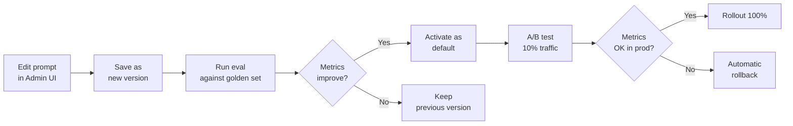

# 03 — Prompt Engineering & Management

> **Project:** Legal Ai Ar | **Category:** Prompt Engineering
> **Status:** Not defined — all items are new
> **Last updated:** May 2026

---

## 1. Description

The quality of Legal Ai Ar's answers depends directly on how prompts are designed, versioned, and managed. In the legal domain, a poorly designed prompt can produce answers that omit sources, invent nonexistent articles, or mix repealed legislation with current legislation.

Prompt Engineering for Legal Ai Ar is not just "writing good prompts" but a complete management system: versioning, testing, evaluation, centralized registry, and domain-specific anti-hallucination strategies for the Argentine legal domain.

---

## 2. Technical Decisions

### 2.1 Prompt storage

| Alternative | Pros | Cons | Decision |
|---|---|---|---|
| **Hardcoded in code** | Simple. Type-safe. Refactorable. | Changing a prompt requires a deploy. No A/B testing. Hard for non-devs. | Discarded |
| **Configuration files (YAML/JSON)** | Versioned in Git. Editable without recompiling. Easy to read. | Requires a deploy to apply changes. No management UI. | **Chosen for system prompts** |
| **Database (Prompt Registry)** | Hot changes. Full history. Native A/B testing. Management UI. | Additional complexity. Risk of untested prompts in production. | **Chosen for dynamic templates** |
| **Prompt management platform (PromptLayer, Humanloop)** | Professional UI. Integrated evaluation. Collaboration. | External service. Cost. Third-party dependency. Sensitive legal data on an external platform. | Discarded (sensitive data) |

**Hybrid decision:**
- **System prompts** (agent personality and rules): YAML files in the repo, versioned with Git
- **Prompt templates** (query templates, formatting, few-shot): Prompt Registry in Azure SQL, hot-editable with an admin UI

### 2.2 Structure of a legal system prompt

> The `system_prompt` body stays in Spanish: it is agent prompt content (the end-user contact layer). The YAML structure is in English.

```yaml
# prompts/agents/normativo.yaml
agent: normativo
version: "1.2.0"
model: gpt-4o
temperature: 0.1
max_tokens: 4096

system_prompt: |
  # Rol
  Sos un asistente legal especializado en legislación argentina. Tu función es
  ayudar a abogados del estudio a encontrar, interpretar y analizar normas jurídicas.

  # Reglas de comportamiento
  1. SIEMPRE citá la fuente exacta: nombre de la norma, número, artículo y fecha.
  2. NUNCA inventes normas, artículos o números de ley. Si no encontrás la información,
     decí "No encontré esa norma en la base de conocimiento".
  3. Distinguí entre norma vigente y derogada/modificada. Siempre indicá el estado.
  4. Cuando un artículo fue modificado, mostrá la versión vigente y mencioná la
     modificación.
  5. Usá lenguaje técnico-jurídico pero accesible. El usuario es abogado.
  6. Si la consulta excede tu dominio (ej: cálculo de plazos), derivá al agente
     procesal.

  # Formato de respuesta
  - Respondé en español rioplatense.
  - Estructurá la respuesta: primero el análisis, luego las fuentes.
  - Cada cita debe incluir: [Nombre Norma, Nro., Art. X]
  - Al final, incluí el disclaimer legal estándar.

  # Contexto disponible
  Tenés acceso a las siguientes herramientas:
  - SearchLegalNorms: buscar normas por texto o filtros
  - GetArticle: obtener el texto de un artículo específico
  - GetAmendmentChain: ver qué normas modifican/derogan una norma

  # Disclaimer (obligatorio al final de cada respuesta)
  > Esta información es orientativa y no constituye asesoramiento legal profesional.
```

### 2.3 Few-shot examples

| Alternative | Pros | Cons | Decision |
|---|---|---|---|
| **Zero-shot** | Fewer tokens. Cheaper. More flexible. | Lower format consistency. The model may diverge from the expected style. | For simple queries |
| **Static few-shot** | Consistent format. The model imitates the examples. | Takes up context tokens. Fixed examples may not cover all cases. | **Chosen — 2-3 examples per agent** |
| **Dynamic few-shot** | Selects examples similar to the current query (via embedding). More relevant. | Additional complexity. Requires an example index. Extra latency. | Evaluated for the future |

**Decision:** Include 2-3 static few-shot examples in each system prompt, covering the most common query patterns. The examples are chosen to demonstrate: citation format, handling of a repealed norm, and an answer with multiple sources.

### 2.4 Structured Output

| Alternative | Pros | Cons | Decision |
|---|---|---|---|
| **Free text** | Flexible. Natural. | Hard to parse. Inconsistent citations. Cannot be rendered in a structured UI. | Discarded for agents |
| **JSON mode (Azure OpenAI)** | Guarantees valid JSON. Parseable. | Less natural for the user. Requires a schema definition. | **Chosen for internal answers** |
| **JSON Schema (response_format)** | JSON that complies with an exact schema. Automatic validation. | Only available in recent models. Less flexible. | **Chosen for tool responses** |
| **Structured Markdown** | Human-readable. Parseable with regex. Natural. | Less robust than JSON. Complex parsing for nested structures. | **Chosen for user-facing answers** |

**Decision per layer:**
- **User-facing answers:** Structured Markdown (readable, with headers and formatted citations)
- **Internal answers (tool → agent):** JSON with a defined schema
- **Router answers:** JSON Schema with `{ "agent": "normativo", "confidence": 0.92, "reasoning": "..." }`

---

## 3. Anti-Hallucination Strategies

### 3.1 Domain-specific strategies for the legal domain

| Strategy | Implementation | Expected impact |
|---|---|---|
| **Mandatory grounding** | System prompt: "Use ONLY information from the retrieved documents. NEVER invent data." | Reduces factual hallucinations |
| **Forced citation** | System prompt: "Every legal claim MUST have a citation in brackets [Ley X, Art. Y]" | Makes answers verifiable |
| **Post-answer verification** | Pipeline: extract citations from the answer → verify against the KB that they exist → flag if there are invented citations | Detects hallucinations in production |
| **Confidence scoring** | System prompt: "Indicate your confidence level: HIGH (norm in force found), MEDIUM (norm found but there may be updates), LOW (no direct source found)" | The user knows when to verify |
| **Explicit fallback** | System prompt: "If you do not find the norm in your tools, say 'I did not find this information in the knowledge base. I suggest consulting [SAIJ/InfoLEG] directly.'" | Avoids fabrications |
| **Low temperature** | `temperature: 0.1` for legal agents | Reduces creativity, increases fidelity |
| **Retrieval threshold** | Do not pass documents with score < 0.3 to the LLM | Prevents the LLM from "inventing" from irrelevant documents |

### 3.2 Citation verification prompt

> The verification prompt body is kept in Spanish because it grades Spanish legal answers (LLM prompt content). The output JSON keys are in English.

```yaml
# prompts/verification/citation_check.yaml
version: "1.0.0"
model: gpt-4o-mini  # Economical model for verification
temperature: 0.0

system_prompt: |
  Tu tarea es verificar si las citas legales en una respuesta son correctas.

  Para cada cita [Norma, Art. X]:
  1. ¿Existe en los documentos proporcionados? (SÍ/NO)
  2. ¿El contenido citado coincide con el texto del documento? (SÍ/NO/PARCIAL)
  3. ¿La norma está vigente? (SÍ/NO/MODIFICADA)

  Respondé en JSON:
  {
    "citations": [
      { "citation": "[Ley 20744, Art. 245]", "exists": true, "accurate": true, "inForce": true },
      { "citation": "[Ley 99999, Art. 1]", "exists": false, "accurate": false, "inForce": null }
    ],
    "hallucinationDetected": false,
    "confidence": 0.95
  }
```

---

## 4. Prompt Registry

### 4.1 Table schema

```sql
CREATE TABLE PromptTemplate (
    Id INT PRIMARY KEY IDENTITY,
    Name NVARCHAR(100) NOT NULL,           -- e.g., "query_rewrite_regulatory"
    Category NVARCHAR(50) NOT NULL,         -- system | user | few_shot | verification
    AgentId NVARCHAR(50),                   -- normativo | jurisprudencial | procesal | null (shared)
    Version NVARCHAR(20) NOT NULL,          -- semver: "1.2.0"
    TemplateContent NVARCHAR(MAX) NOT NULL, -- the prompt with placeholders {variable}
    Variables NVARCHAR(MAX),                 -- JSON: ["query", "context", "history"]
    TargetModel NVARCHAR(50),               -- gpt-4o | gpt-4o-mini
    Temperature DECIMAL(3,2),
    IsActive BIT DEFAULT 1,
    IsDefault BIT DEFAULT 0,               -- default active version
    EvalMetrics NVARCHAR(MAX),             -- JSON: evaluation results
    CreatedBy NVARCHAR(100),
    CreatedAt DATETIME2 DEFAULT GETUTCDATE(),
    UpdatedAt DATETIME2
);

CREATE INDEX IX_PromptTemplate_Lookup
ON PromptTemplate(Name, AgentId, IsActive, IsDefault);
```

### 4.2 Prompt update flow



---

## 5. Prompt A/B Testing

### 5.1 Implementation

```csharp
// Pseudo-code for prompt selection with A/B testing
public async Task<PromptTemplate> GetActivePrompt(string name, string agentId)
{
    var templates = await _db.PromptTemplates
        .Where(p => p.Name == name
                 && p.AgentId == agentId
                 && p.IsActive)
        .ToListAsync();

    var defaultTemplate = templates.First(t => t.IsDefault);
    var experimentTemplate = templates.FirstOrDefault(t => !t.IsDefault);

    if (experimentTemplate == null)
        return defaultTemplate;

    // 10% of traffic goes to the experiment
    return Random.Shared.NextDouble() < 0.10
        ? experimentTemplate
        : defaultTemplate;
}
```

### 5.2 Metrics per variant

| Metric | How it is measured | Target |
|---|---|---|
| Faithfulness | % of citations verified as correct | ≥ 95% |
| User satisfaction | Thumbs up / (thumbs up + thumbs down) | ≥ 80% |
| Response relevance | LLM-as-judge score (1-5) | ≥ 4.0 |
| P50 Latency | Time to first token | < 1.5s |
| Tokens consumed | Average per answer | Baseline ± 20% |

---

## 6. Concrete Example: Regulatory Agent Prompt

### Query: "¿Qué dice la ley sobre licencia por maternidad?"

**System prompt** (from YAML, 800 tokens):
```
[Role + Rules + Format + Tools + Disclaimer]
```

**Few-shot example 1** (350 tokens) — agent prompt content, kept in Spanish:
```
USUARIO: ¿Cuánto dura el período de prueba?
ASISTENTE: Según la Ley de Contrato de Trabajo (Ley 20.744), el período de prueba
está regulado en el **artículo 92 bis**, que establece:

El contrato de trabajo por tiempo indeterminado se entenderá celebrado a prueba
durante los primeros **3 meses** de vigencia.

**Puntos clave:**
- Durante el período de prueba, cualquiera de las partes puede extinguir la relación
  sin expresión de causa y sin obligación de indemnizar.
- El empleador debe registrar al trabajador desde el primer día.
- El uso abusivo del período de prueba genera derecho a indemnización.

**Fuentes:** [Ley 20.744, Art. 92 bis] | [Ley 25.877, Art. 2 - modificación 2004]

> *Esta información es orientativa y no constituye asesoramiento legal profesional.*
```

**Retrieved context** (from RAG, ~2000 tokens):
```
[Documents retrieved by Hybrid Search + Graph Enrichment]
```

**User query** (variable):
```
¿Qué dice la ley sobre licencia por maternidad?
```

---

## 7. Items Pending Definition

- [ ] Write complete system prompts for the 3 agents (regulatory, case law, procedural)
- [ ] Write the router system prompt (intent classification)
- [ ] Write the orchestrator system prompt (multi-agent synthesis)
- [ ] Define 3 few-shot examples per agent, covering frequent patterns
- [ ] Create the PromptTemplate table in the DB with an EF Core migration
- [ ] Design an admin UI for prompt management
- [ ] Implement an automatic prompt evaluation pipeline against the golden set
- [ ] Define automatic rollback criteria (degradation threshold)
- [ ] Document a style guide for writing legal prompts
- [ ] Evaluate structured output with JSON Schema for internal agent answers

---

## 8. References

- [OpenAI — Prompt Engineering Guide](https://platform.openai.com/docs/guides/prompt-engineering)
- [Anthropic — Prompt Engineering Guide](https://docs.anthropic.com/en/docs/build-with-claude/prompt-engineering/overview)
- [Azure OpenAI — Structured Outputs](https://learn.microsoft.com/en-us/azure/ai-services/openai/how-to/structured-outputs)
- [Semantic Kernel — Prompt Templates](https://learn.microsoft.com/en-us/semantic-kernel/concepts/prompts/)

---

*03 — Prompt Engineering & Management — Legal Ai Ar*
