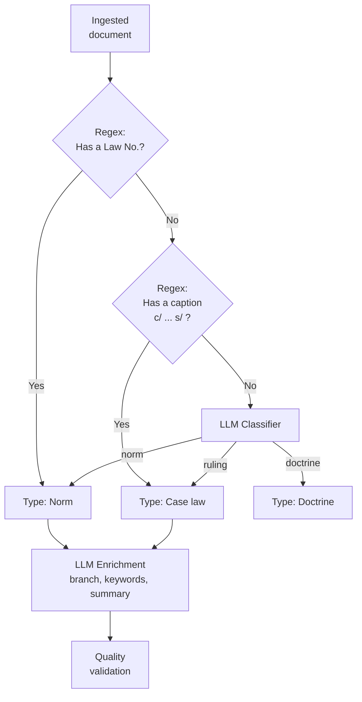
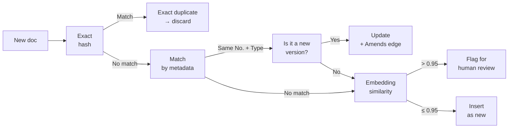

# 04 — Document Ingestion & Processing

> **Project:** Legal Ai Ar | **Category:** Document Ingestion & Processing
> **Status:** Partially defined (7-step pipeline in F00-W01)
> **Last updated:** May 2026

---

## 1. Description

The legal KB is fed by unstructured and semi-structured documents from official Argentine sources (SAIJ, InfoLEG, Official Gazette) and manual upload. The ingestion pipeline transforms these documents into structured data, enriched with metadata, embeddings, and relationships in the legal graph.

This document defines the enrichment techniques that go beyond the base 7-step pipeline already defined in F00-W01: automatic classification, legal NER, LLM metadata enrichment, deduplication, and quality validation.

---

## 2. Technical Decisions

### 2.1 Text extraction

| Alternative | Pros | Cons | Decision |
|---|---|---|---|
| **Regex + HTML parsing** | Fast. No cost. Works for well-structured web sources. | Fragile: breaks if the HTML changes. Useless for PDFs. | For web sources (SAIJ, InfoLEG) |
| **Azure Document Intelligence** | High-quality OCR. Extracts tables, structure. Detects layout. Supports scanned PDFs. | Cost per page ($1.50/1000 pages). Latency ~5s per page. | **Chosen for PDFs** |
| **Apache Tika** | Open source. Supports many formats. | Lower OCR quality. No layout detection. No table extraction. | Discarded |
| **PyMuPDF / pdfplumber** | Fast. Free. Good for native (non-scanned) PDFs. | No OCR. Does not detect complex tables. Not natively available in .NET. | Fallback for simple PDFs |

**Decision:** Web sources with HTML parsing + regex (SAIJ, InfoLEG have a stable structure). PDFs with Azure Document Intelligence (Official Gazette, manual documents, scanned court filings).

### 2.2 LLM Metadata Enrichment

| Alternative | Pros | Cons | Decision |
|---|---|---|---|
| **Manual metadata** | Precise. Controlled. | Does not scale. Requires a human operator for each document. | Only for corrections |
| **Regex + heuristics** | Fast. Free. Deterministic. | Fragile for non-standard text. Does not understand context. | First layer |
| **LLM enrichment (GPT-4o-mini)** | Understands context. Extracts complex metadata (topic, branch, keywords). Handles non-standard text. | Cost per document. Possible LLM error. | **Chosen as the second layer** |
| **Fine-tuned NER model** | Fast at inference. Specialized. No API cost. | Requires training data. Fine-tuning cost. Model maintenance. | Evaluated for the future |

**Layered decision:**
1. **Layer 1 — Regex/heuristics:** Extract obvious structured fields (law number, date, issuing body) from the source's HTML/metadata
2. **Layer 2 — LLM enrichment:** For fields requiring comprehension (law branch, topic keywords, headnote, classification)

### 2.3 Enrichment prompt

> The prompt instructions stay in Spanish (LLM prompt content); the output JSON keys are in English to match the data model.

```yaml
# prompts/ingestion/metadata_enrichment.yaml
version: "1.0.0"
model: gpt-4o-mini
temperature: 0.0

system_prompt: |
  Sos un clasificador de documentos legales argentinos. Tu tarea es extraer
  metadata estructurada del siguiente documento.

  Respondé SOLO con el JSON solicitado, sin texto adicional.

user_template: |
  DOCUMENTO:
  Tipo: {document_type}
  Texto (primeros 2000 chars): {truncated_text}

  Extraé la siguiente metadata en JSON:
  {
    "lawBranch": "civil|penal|laboral|comercial|administrativo|constitucional|tributario|procesal|ambiental|otro",
    "subBranch": "string - especificación dentro de la rama",
    "topicKeywords": ["string", "string", "..."], // 3-8 voces temáticas (descriptores)
    "summary": "string - resumen de 2-3 oraciones del contenido",
    "mentionedEntities": ["string"], // organismos, tribunales, empresas mencionadas
    "referencedNorms": [
      { "type": "ley|decreto|resolución", "number": "string", "articles": ["string"] }
    ],
    "jurisdiction": "nacional|provincial|caba|municipal",
    "province": "string|null",
    "relevance": "alta|media|baja" // relevancia para práctica jurídica general
  }
```

### 2.4 Legal NER (Named Entity Recognition)

| Entity | Examples | Extraction method |
|---|---|---|
| **Norm** | "Ley 20.744", "Decreto 1694/06", "Resolución 34/2024" | Regex: `(Ley\|Decreto\|Resolución)\s+[\d.]+(/\d+)?` + LLM for variants |
| **Article** | "art. 245", "artículo 14 bis", "arts. 232 a 235" | Regex: `art[íi]?culo?s?\s*\.?\s*[\d]+` + LLM for ranges |
| **Court** | "CSJN", "Cámara Nacional de Apelaciones del Trabajo", "Juzgado Nac. Civil 42" | LLM (too many variants for regex) |
| **Judge** | "Dr. Lorenzetti", "Juez Maqueda" | LLM |
| **Legal date** | "B.O. 15/03/2024", "vigente desde el 1° de enero de 2025" | Regex + LLM |
| **Jurisdiction** | "jurisdicción nacional", "provincia de Buenos Aires" | LLM |
| **Procedural party** | "González, Juan c/ OSDE s/ amparo" | Regex for captions: `\w+ c/ \w+ s/ \w+` |

### 2.5 Automatic classification



---

## 3. Deduplication and Consolidation

### 3.1 Strategy

| Scenario | How it is detected | Action |
|---|---|---|
| **Exact duplicate norm** | Same law number + same issuing body | Keep the most recent, mark as duplicate |
| **Amended version** | Same number, different date. Or an explicit reference "modifícase el art. X de la Ley Y" | Create an `Amends` edge in the graph. Mark affected articles as amended. Keep both versions with a validity flag |
| **Consolidated text** | InfoLEG provides consolidated text; SAIJ provides original text | Prefer consolidated text. Keep the original as a backup in Blob |
| **Duplicate ruling** | Same caption + same court + same date | Merge: keep the most complete record |
| **Near-duplicate** | Embedding similarity > 0.95 + similar metadata | Flag for human review |

### 3.2 Dedup pipeline



---

## 4. Post-Ingestion Quality Validation

### 4.1 Automatic checks

| Check | What it validates | Action if it fails |
|---|---|---|
| **Metadata completeness** | Does it have type, number, date, branch, validity? | Send to the enrichment queue |
| **Minimum text** | Does the extracted text have > 100 characters? | Flag as a possible OCR error |
| **Date consistency** | Is the publication date plausible? (not in the future, not before 1853) | Flag for review |
| **Embedding generated** | Was the embedding generated correctly? | Retry. If it fails 3 times → dead letter queue |
| **Detected relationships** | Did the graph builder find at least 1 relationship? | OK if it is an original norm. Warning if it is a ruling with no cited norms |
| **Citation format** | Do the referenced norms have a valid format? | Normalize with regex |
| **Coherent validity** | If marked as in force, is there no `Repeals` edge pointing to it? | Reconcile with the graph |

### 4.2 Quality score

```
quality_score = (
    0.25 * metadata_completeness +     # 0-1: required fields present
    0.20 * text_quality +              # 0-1: long enough, no OCR garbage
    0.20 * embedding_generated +       # 0 or 1
    0.15 * detected_relationships +    # 0-1: at least 1 relationship
    0.10 * date_consistency +          # 0 or 1
    0.10 * coherent_validity           # 0 or 1
)

# Threshold: score < 0.6 → human review queue
```

---

## 5. Document Versioning

### 5.1 Legal versioning strategy

In Argentine law, norms are amended frequently but the original text has historical value (to know which law was in force on a given date). The versioning strategy must support temporal queries.

| Field | Type | Purpose |
|---|---|---|
| `VersionId` | INT | Unique identifier of the version |
| `LegalNormId` | INT FK | Norm it belongs to |
| `VersionText` | NVARCHAR(MAX) | Text of this version |
| `ValidFrom` | DATE | From when this version is in force |
| `ValidTo` | DATE NULL | Until when it was in force (NULL = in force) |
| `AmendingNormId` | INT FK NULL | Which norm produced this version |
| `OriginalBlobUrl` | NVARCHAR(500) | Link to the original document in Blob |

### 5.2 Temporal query

```sql
-- What did art. 245 of the LCT say in 2003? (before Ley 25.877)
SELECT av.VersionText, av.ValidFrom, av.ValidTo
FROM ArticleVersion av
JOIN Article a ON av.ArticleId = a.Id
JOIN LegalNorm n ON a.LegalNormId = n.Id
WHERE n.NormNumber = '20744'
  AND a.ArticleNumber = '245'
  AND av.ValidFrom <= '2003-06-15'
  AND (av.ValidTo IS NULL OR av.ValidTo > '2003-06-15');
```

---

## 6. Concrete Example: Official Gazette ingestion

**Document:** Ley 27.742 (Ley Bases y Puntos de Partida para la Libertad de los Argentinos)

### Full pipeline

```
1. COLLECT:
   Timer Trigger (daily 8am) → scrape boletinoficial.gob.ar
   Detects new publication: Ley 27.742 of 08/07/2024
   Downloads HTML → queue-raw-documents

2. PARSE:
   HTML parsing → extracts the articulated text
   Regex: "LEY N° 27.742" → type=ley, number=27742
   Regex: publication date → 08/07/2024
   Detects 238 articles → parses each one

3. ENRICH (LLM):
   GPT-4o-mini analyzes the first 2000 chars:
   → branch: "administrativo, laboral, comercial" (multidisciplinary)
   → keywords: ["reforma del estado", "desregulación", "empleo público", "privatizaciones"]
   → summary: "Ley ómnibus de reforma del estado que modifica múltiples normas..."
   → referencedNorms: [Ley 20.744, Ley 24.013, Ley 11.683, ...]

4. CLASSIFY:
   NER detects: 47 referenced norms, 12 organizations, 238 articles
   Classification: national norm, multiple branches, high relevance

5. DEDUPLICATE:
   Hash check: no previous version exists
   Metadata check: there is no Ley 27.742 in the DB
   → Insert as new

6. STORE + EMBED:
   SQL insert: 1 LegalNorm + 238 Article + 15 Clause
   Blob: original PDF
   Embeddings: 238 chunks (1 per article) with contextual retrieval
   AI Search: push to idx-legal-norms + idx-articles

7. GRAPH:
   The Graph Builder analyzes the text → detects 47 edges:
   - "Modifícase el art. 245 de la Ley 20.744" → Amends edge
   - "Derógase la Ley 14.250 en lo pertinente" → Repeals edge
   - etc.

8. VALIDATE:
   Quality score: 0.92 (all checks pass)
   238/238 embeddings generated ✓
   47/47 relationships created ✓
```

---

## 7. Items Pending Definition

- [ ] Define source-specific parsers (SAIJ HTML, InfoLEG HTML, Official Gazette PDF)
- [ ] Implement the metadata enrichment prompt and calibrate it with 50 test documents
- [ ] Define the full list of NER entities to extract
- [ ] Implement the dedup pipeline with hash + metadata + embedding similarity
- [ ] Create the ArticleVersion table for temporal versioning
- [ ] Define the quality-score threshold and the dead letter queue policy
- [ ] Design an ingestion administration UI (queue, errors, statistics)
- [ ] Define the periodic re-ingestion policy (weekly? monthly?) to update validity
- [ ] Evaluate Azure Document Intelligence vs open source alternatives for OCR
- [ ] Create integration tests for each source parser

---

## 8. References

- [Azure Document Intelligence](https://learn.microsoft.com/en-us/azure/ai-services/document-intelligence/)
- [Azure Functions — Queue Trigger](https://learn.microsoft.com/en-us/azure/azure-functions/functions-bindings-storage-queue-trigger)
- [Contextual Retrieval — Anthropic](https://www.anthropic.com/news/contextual-retrieval)
- [SAIJ — Sistema Argentino de Información Jurídica](http://www.saij.gob.ar)
- [InfoLEG — Información Legislativa](http://www.infoleg.gob.ar)

---

*04 — Document Ingestion & Processing — Legal Ai Ar*
