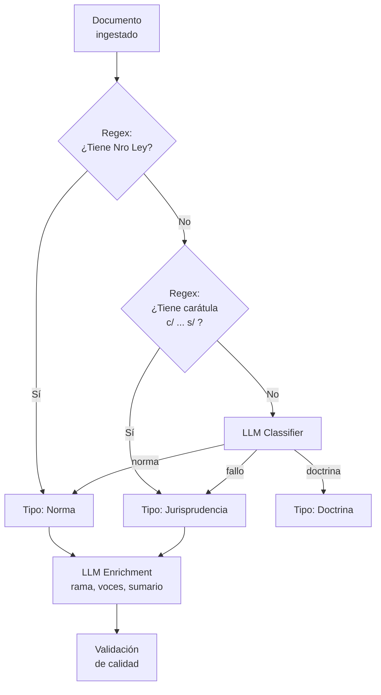
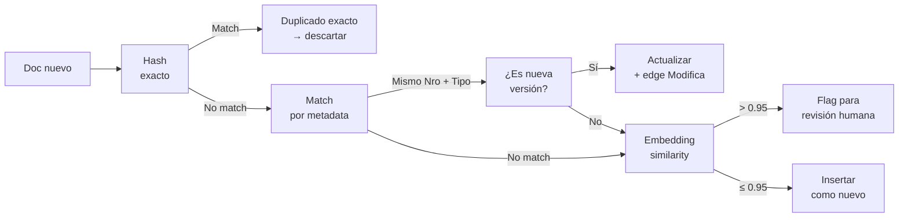

# 04 — Ingesta & Procesamiento de Documentos

> **Proyecto:** Legal Ai Ar | **Categoría:** Document Ingestion & Processing
> **Estado:** Parcialmente definido (pipeline de 7 pasos en F00-W01)
> **Última actualización:** Mayo 2026

---

## 1. Descripción

La KB legal se alimenta de documentos no estructurados y semi-estructurados provenientes de fuentes oficiales argentinas (SAIJ, InfoLEG, Boletín Oficial) y carga manual. El pipeline de ingesta transforma estos documentos en datos estructurados, enriquecidos con metadata, embeddings y relaciones en el grafo legal.

Este documento define las técnicas de enriquecimiento que van más allá del pipeline base de 7 pasos ya definido en F00-W01: clasificación automática, NER legal, metadata enrichment con LLM, deduplicación y validación de calidad.

---

## 2. Decisiones Técnicas

### 2.1 Extracción de texto

| Alternativa | Pros | Contras | Decisión |
|---|---|---|---|
| **Regex + HTML parsing** | Rápido. Sin costo. Funciona para fuentes web bien estructuradas. | Frágil: se rompe si cambia el HTML. No sirve para PDFs. | Para fuentes web (SAIJ, InfoLEG) |
| **Azure Document Intelligence** | OCR de alta calidad. Extrae tablas, estructura. Detecta layout. Soporta PDFs escaneados. | Costo por página ($1.50/1000 páginas). Latencia ~5s por página. | **Elegido para PDFs** |
| **Apache Tika** | Open source. Soporta muchos formatos. | Menor calidad OCR. Sin detección de layout. Sin extracción de tablas. | Descartado |
| **PyMuPDF / pdfplumber** | Rápido. Gratis. Bueno para PDFs nativos (no escaneados). | No hace OCR. No detecta tablas complejas. No disponible en .NET nativo. | Fallback para PDFs simples |

**Decisión:** Fuentes web con HTML parsing + regex (SAIJ, InfoLEG tienen estructura estable). PDFs con Azure Document Intelligence (Boletín Oficial, documentos manuales, escritos judiciales escaneados).

### 2.2 Metadata Enrichment con LLM

| Alternativa | Pros | Contras | Decisión |
|---|---|---|---|
| **Metadata manual** | Precisa. Controlada. | No escala. Requiere operador humano para cada documento. | Solo para correcciones |
| **Regex + heurísticas** | Rápido. Gratis. Determinístico. | Frágil para texto no estandarizado. No entiende contexto. | Primera capa |
| **LLM enrichment (GPT-4o-mini)** | Entiende contexto. Extrae metadata compleja (tema, rama, voces). Maneja texto no estandarizado. | Costo por documento. Posible error del LLM. | **Elegido como segunda capa** |
| **Modelo NER fine-tuned** | Rápido en inferencia. Especializado. Sin costo de API. | Requiere datos de entrenamiento. Costo de fine-tuning. Mantenimiento del modelo. | Evaluado para futuro |

**Decisión en capas:**
1. **Capa 1 — Regex/heurísticas:** Extraer campos estructurados obvios (número de ley, fecha, órgano emisor) del HTML/metadata de la fuente
2. **Capa 2 — LLM enrichment:** Para campos que requieren comprensión (rama del derecho, voces temáticas, sumario, clasificación)

### 2.3 Prompt de enrichment

```yaml
# prompts/ingestion/metadata_enrichment.yaml
version: "1.0.0"
model: gpt-4o-mini
temperature: 0.0

system_prompt: |
  Sos un clasificador de documentos legales argentinos. Tu tarea es extraer 
  metadata estructurada del siguiente documento.

  Respondé SOLO con el JSON solicitado, sin texto adicional.

user_template: |
  DOCUMENTO:
  Tipo: {tipo_documento}
  Texto (primeros 2000 chars): {texto_truncado}

  Extraé la siguiente metadata en JSON:
  {
    "ramaDelDerecho": "civil|penal|laboral|comercial|administrativo|constitucional|tributario|procesal|ambiental|otro",
    "subrama": "string - especificación dentro de la rama",
    "vocesTematicas": ["string", "string", "..."], // 3-8 voces temáticas (descriptores)
    "sumario": "string - resumen de 2-3 oraciones del contenido",
    "entidadesMencionadas": ["string"], // organismos, tribunales, empresas mencionadas
    "normasReferenciadas": [
      { "tipo": "ley|decreto|resolución", "numero": "string", "articulos": ["string"] }
    ],
    "jurisdiccion": "nacional|provincial|caba|municipal",
    "provincia": "string|null",
    "relevancia": "alta|media|baja" // relevancia para práctica jurídica general
  }
```

### 2.4 NER Legal (Named Entity Recognition)

| Entidad | Ejemplos | Método de extracción |
|---|---|---|
| **Norma** | "Ley 20.744", "Decreto 1694/06", "Resolución 34/2024" | Regex: `(Ley\|Decreto\|Resolución)\s+[\d.]+(/\d+)?` + LLM para variantes |
| **Artículo** | "art. 245", "artículo 14 bis", "arts. 232 a 235" | Regex: `art[íi]?culo?s?\s*\.?\s*[\d]+` + LLM para rangos |
| **Tribunal** | "CSJN", "Cámara Nacional de Apelaciones del Trabajo", "Juzgado Nac. Civil 42" | LLM (demasiadas variantes para regex) |
| **Magistrado** | "Dr. Lorenzetti", "Juez Maqueda" | LLM |
| **Fecha legal** | "B.O. 15/03/2024", "vigente desde el 1° de enero de 2025" | Regex + LLM |
| **Jurisdicción** | "jurisdicción nacional", "provincia de Buenos Aires" | LLM |
| **Parte procesal** | "González, Juan c/ OSDE s/ amparo" | Regex para carátulas: `\w+ c/ \w+ s/ \w+` |

### 2.5 Clasificación automática



---

## 3. Deduplicación y Consolidación

### 3.1 Estrategia

| Escenario | Cómo se detecta | Acción |
|---|---|---|
| **Norma exacta duplicada** | Mismo número de ley + mismo órgano emisor | Mantener la más reciente, marcar duplicado |
| **Versión modificada** | Mismo número, distinta fecha. O referencia explícita "modifícase el art. X de la Ley Y" | Crear edge `Modifica` en el grafo. Marcar artículos afectados como modificados. Mantener ambas versiones con flag de vigencia |
| **Texto consolidado** | InfoLEG provee texto consolidado; SAIJ provee texto original | Preferir texto consolidado. Guardar original como respaldo en Blob |
| **Fallo duplicado** | Misma carátula + mismo tribunal + misma fecha | Merge: mantener el registro más completo |
| **Near-duplicate** | Embedding similarity > 0.95 + metadata similar | Flag para revisión humana |

### 3.2 Dedup pipeline



---

## 4. Validación de Calidad Post-Ingesta

### 4.1 Checks automáticos

| Check | Qué valida | Acción si falla |
|---|---|---|
| **Completitud de metadata** | ¿Tiene tipo, número, fecha, rama, vigencia? | Enviar a cola de enriquecimiento |
| **Texto mínimo** | ¿El texto extraído tiene > 100 caracteres? | Flag como posible error de OCR |
| **Consistencia de fechas** | ¿La fecha de publicación es plausible? (no futura, no anterior a 1853) | Flag para revisión |
| **Embedding generado** | ¿Se generó el embedding correctamente? | Reintentar. Si falla 3 veces → dead letter queue |
| **Relaciones detectadas** | ¿El graph builder encontró al menos 1 relación? | OK si es norma originaria. Warning si es fallo sin normas citadas |
| **Formato de citación** | ¿Las normas referenciadas tienen formato válido? | Normalizar con regex |
| **Vigencia coherente** | Si está marcada como vigente, ¿no hay edge de Deroga apuntando a ella? | Reconciliar con el grafo |

### 4.2 Score de calidad

```
score_calidad = (
    0.25 * completitud_metadata +     # 0-1: campos obligatorios presentes
    0.20 * calidad_texto +             # 0-1: largo suficiente, sin basura OCR
    0.20 * embedding_generado +        # 0 o 1
    0.15 * relaciones_detectadas +     # 0-1: al menos 1 relación
    0.10 * consistencia_fechas +       # 0 o 1
    0.10 * vigencia_coherente          # 0 o 1
)

# Threshold: score < 0.6 → cola de revisión humana
```

---

## 5. Versionado de Documentos

### 5.1 Estrategia de versionado legal

En el derecho argentino, las normas se modifican frecuentemente pero el texto original tiene valor histórico (para saber qué ley regía en una fecha determinada). La estrategia de versionado debe soportar consultas temporales.

| Campo | Tipo | Propósito |
|---|---|---|
| `VersionId` | INT | Identificador único de la versión |
| `NormaId` | INT FK | Norma a la que pertenece |
| `TextoVersion` | NVARCHAR(MAX) | Texto de esta versión |
| `FechaVigenciaDesde` | DATE | Desde cuándo rige esta versión |
| `FechaVigenciaHasta` | DATE NULL | Hasta cuándo rigió (NULL = vigente) |
| `NormaModificadoraId` | INT FK NULL | Qué norma generó esta versión |
| `UrlBlobOriginal` | NVARCHAR(500) | Link al documento original en Blob |

### 5.2 Consulta temporal

```sql
-- ¿Qué decía el art. 245 de la LCT en 2003? (antes de la Ley 25.877)
SELECT av.TextoVersion, av.FechaVigenciaDesde, av.FechaVigenciaHasta
FROM ArticuloVersion av
JOIN Articulo a ON av.ArticuloId = a.Id
JOIN NormaJuridica n ON a.NormaId = n.Id
WHERE n.NumeroNorma = '20744'
  AND a.NumeroArticulo = '245'
  AND av.FechaVigenciaDesde <= '2003-06-15'
  AND (av.FechaVigenciaHasta IS NULL OR av.FechaVigenciaHasta > '2003-06-15');
```

---

## 6. Ejemplo Concreto: Ingesta del Boletín Oficial

**Documento:** Ley 27.742 (Ley Bases y Puntos de Partida para la Libertad de los Argentinos)

### Pipeline completo

```
1. RECOLECTAR:
   Timer Trigger (diario 8am) → scrape boletinoficial.gob.ar
   Detecta nueva publicación: Ley 27.742 del 08/07/2024
   Descarga HTML → queue-raw-documents

2. PARSEAR:
   HTML parsing → extrae texto articulado
   Regex: "LEY N° 27.742" → tipo=ley, numero=27742
   Regex: fecha de publicación → 08/07/2024
   Detecta 238 artículos → parsea cada uno

3. ENRIQUECER (LLM):
   GPT-4o-mini analiza primeros 2000 chars:
   → rama: "administrativo, laboral, comercial" (multidisciplinaria)
   → voces: ["reforma del estado", "desregulación", "empleo público", "privatizaciones"]
   → sumario: "Ley ómnibus de reforma del estado que modifica múltiples normas..."
   → normasReferenciadas: [Ley 20.744, Ley 24.013, Ley 11.683, ...]

4. CLASIFICAR:
   NER detecta: 47 normas referenciadas, 12 organismos, 238 artículos
   Clasificación: norma nacional, multiple ramas, alta relevancia

5. DEDUPLICAR:
   Hash check: no existe versión previa
   Metadata check: no hay Ley 27.742 en la DB
   → Insertar como nueva

6. ALMACENAR + EMBEBER:
   SQL insert: 1 NormaJuridica + 238 Articulo + 15 Inciso
   Blob: PDF original
   Embeddings: 238 chunks (1 por artículo) con contextual retrieval
   AI Search: push a idx-normas + idx-articulos

7. GRAFIFICAR:
   Graph Builder analiza texto → detecta 47 edges:
   - "Modifícase el art. 245 de la Ley 20.744" → edge Modifica
   - "Derógase la Ley 14.250 en lo pertinente" → edge Deroga
   - etc.

8. VALIDAR:
   Score de calidad: 0.92 (todos los checks pasan)
   238/238 embeddings generados ✓
   47/47 relaciones creadas ✓
```

---

## 7. Ítems Pendientes de Definición

- [ ] Definir parsers específicos por fuente (SAIJ HTML, InfoLEG HTML, BO PDF)
- [ ] Implementar prompt de metadata enrichment y calibrar con 50 documentos de prueba
- [ ] Definir el listado completo de entidades NER a extraer
- [ ] Implementar dedup pipeline con hash + metadata + embedding similarity
- [ ] Crear tabla ArticuloVersion para versionado temporal
- [ ] Definir threshold de score de calidad y política de dead letter queue
- [ ] Diseñar UI de administración de ingesta (cola, errores, estadísticas)
- [ ] Definir política de re-ingesta periódica (¿semanal? ¿mensual?) para actualizar vigencias
- [ ] Evaluar Azure Document Intelligence vs alternativas open source para OCR
- [ ] Crear tests de integración para cada parser de fuente

---

## 8. Referencias

- [Azure Document Intelligence](https://learn.microsoft.com/en-us/azure/ai-services/document-intelligence/)
- [Azure Functions — Queue Trigger](https://learn.microsoft.com/en-us/azure/azure-functions/functions-bindings-storage-queue-trigger)
- [Contextual Retrieval — Anthropic](https://www.anthropic.com/news/contextual-retrieval)
- [SAIJ — Sistema Argentino de Información Jurídica](http://www.saij.gob.ar)
- [InfoLEG — Información Legislativa](http://www.infoleg.gob.ar)

---

*04 — Ingesta & Procesamiento de Documentos — Legal Ai Ar*
