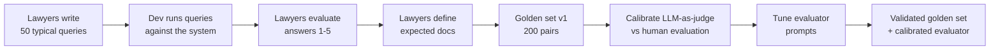
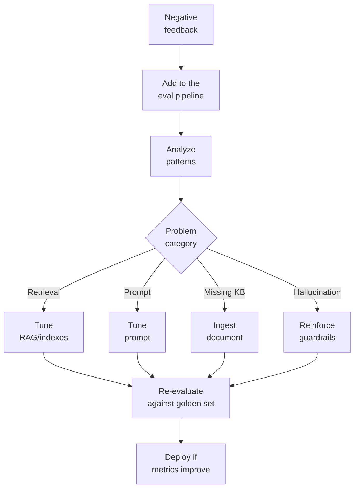
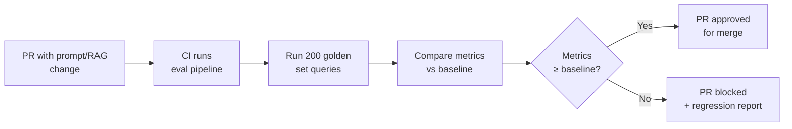

# 05 — AI Evaluation & Quality

> **Project:** Legal Ai Ar | **Category:** AI Evaluation & Quality
> **Status:** Not defined — all items are new
> **Last updated:** May 2026

---

## 1. Description

Without an evaluation framework, it is impossible to know whether changes in RAG, prompts, or agents improve or worsen the answers. In the legal domain, an undetected degradation can lead to answers with repealed norms, invented citations, or erroneous interpretations.

This document defines how to build a legal golden set, which metrics to use, how to implement LLM-as-judge, and how to close the human feedback loop for continuous improvement.

---

## 2. Technical Decisions

### 2.1 Evaluation framework

| Alternative | Pros | Cons | Decision |
|---|---|---|---|
| **Manual evaluation** | High precision. Lawyers evaluate directly. | Does not scale. Slow. Subjective. Cannot run in CI. | For the initial golden set |
| **LLM-as-Judge** | Scales. Automatable. Reproducible. Can run in CI/CD. | The evaluating LLM can also be wrong. API cost. | **Chosen as primary evaluation** |
| **Automatic metrics (ROUGE, BLEU)** | Fast. No cost. Deterministic. | Do not measure legal quality. A correct summary with different words scores low. | Only as a complement |
| **RAGAS framework** | Complete framework for RAG eval. Proven metrics. | Python-only (no .NET). Requires adaptation to the legal domain. | Inspiration for metrics |
| **Custom eval pipeline** | Full control. Legal-specific metrics (validity, citation, jurisdiction). | More development effort. | **Chosen — inspired by RAGAS** |

**Rationale:** A custom pipeline inspired by RAGAS but adapted to the legal domain, with an LLM-as-Judge as the primary evaluator and periodic human validation to calibrate the evaluator.

### 2.2 Metrics

| Metric | What it measures | How it is calculated | Target |
|---|---|---|---|
| **Faithfulness** | Is the answer faithful to the retrieved documents? | LLM-as-judge verifies each claim against the context | ≥ 0.95 |
| **Answer Relevance** | Is the answer relevant to the question? | LLM-as-judge: score 1-5 | ≥ 4.0 |
| **Context Precision** | Are the retrieved documents precise? | % of docs in top-5 that are relevant | ≥ 0.70 |
| **Context Recall** | Were all the necessary docs retrieved? | % of expected docs that appear in top-10 | ≥ 0.90 |
| **Citation Accuracy** | Are the citations real and correct? | Verify each [Ley X, Art. Y] against the KB | ≥ 0.98 |
| **Validity Accuracy** | Is it correctly indicated whether the norm is in force? | Verify in-force/repealed flag against the DB | 1.00 |
| **Hallucination Rate** | % of answers with at least 1 invented fact | LLM-as-judge + citation verification | ≤ 0.02 |
| **E2E Latency** | Time from query to complete answer | Application Insights P95 | < 5s |
| **Cost per query** | Tokens consumed * price per token | Token usage logging | < $0.05 |

---

## 3. Legal Golden Set

### 3.1 Structure

> JSON keys in English; legal-domain values stay in Spanish (queries, expected answer phrases, evaluator notes).

```json
{
  "id": "GS-LAB-001",
  "category": "laboral",
  "subCategory": "despido",
  "query": "¿Qué indemnización corresponde por despido sin causa con 8 años de antigüedad?",
  "expectedDocuments": [
    { "type": "norma", "ref": "Ley 20.744, Art. 245", "relevance": 3 },
    { "type": "norma", "ref": "Ley 25.877, Art. 5", "relevance": 3 },
    { "type": "norma", "ref": "Ley 20.744, Art. 232", "relevance": 2 },
    { "type": "jurisprudencia", "ref": "Vizzoti c/ AMSA - CSJN", "relevance": 3 }
  ],
  "expectedAnswerContains": [
    "un mes de sueldo por cada año de servicio",
    "fracción mayor de tres meses",
    "mejor remuneración mensual normal y habitual",
    "tope indemnizatorio"
  ],
  "expectedAnswerExcludes": [
    "artículos que no existen",
    "normas derogadas sin aclaración"
  ],
  "evaluatorNotes": "La respuesta debe mencionar tanto el cálculo base (art. 245) como el tope (Vizzoti). Debe distinguir entre texto vigente y original.",
  "createdBy": "Dr. García - Abogado laboralista",
  "createdDate": "2026-05-01"
}
```

### 3.2 Golden set distribution

| Law branch | Number of queries | Priority |
|---|---|---|
| Labor | 50 | High (firm's core) |
| Civil and Commercial | 40 | High |
| Criminal | 30 | Medium |
| Administrative | 25 | Medium |
| Procedural | 25 | High (cross-cutting) |
| Constitutional | 15 | Medium |
| Tax | 15 | Low |
| **Total** | **200** | — |

### 3.3 Construction process



---

## 4. LLM-as-Judge

### 4.1 Evaluator prompt

> The evaluator prompt instructions are kept in Spanish (LLM prompt content); the output JSON keys are in English.

```yaml
# prompts/evaluation/judge_faithfulness.yaml
version: "1.0.0"
model: gpt-4o
temperature: 0.0

system_prompt: |
  Sos un evaluador experto en derecho argentino. Tu tarea es evaluar si una
  respuesta de un asistente legal es fiel a los documentos de contexto proporcionados.

  Para cada afirmación en la respuesta:
  1. ¿Está soportada por el contexto? (supported / not_supported / partially_supported)
  2. ¿La cita es correcta? (correct / incorrect / missing)
  3. ¿La información de vigencia es correcta? (correct / incorrect / not_mentioned)

user_template: |
  PREGUNTA: {query}

  CONTEXTO (documentos recuperados):
  {context}

  RESPUESTA DEL ASISTENTE:
  {response}

  Evaluá la respuesta y respondé en JSON:
  {
    "claims": [
      {
        "claim": "texto de la afirmación",
        "supported": "supported|not_supported|partially_supported",
        "citationCorrect": true|false|null,
        "validityCorrect": true|false|null,
        "explanation": "breve explicación"
      }
    ],
    "faithfulnessScore": 0.0-1.0,
    "citationAccuracy": 0.0-1.0,
    "overallQuality": 1-5,
    "issues": ["lista de problemas detectados"]
  }
```

### 4.2 Evaluator calibration

To ensure the LLM-as-judge is reliable, it is calibrated against human evaluation:

| Calibration metric | What it measures | Target |
|---|---|---|
| **Cohen's Kappa** | LLM-judge vs human agreement on classifications | ≥ 0.75 |
| **Score correlation** | Pearson correlation between LLM and human scores | ≥ 0.85 |
| **False negative rate** | % of hallucinations the LLM-judge does not detect | ≤ 0.05 |

---

## 5. Human-in-the-Loop Feedback

### 5.1 User feedback

| Feedback type | UI | What is captured |
|---|---|---|
| **Thumbs up/down** | Buttons on each answer | Binary satisfaction |
| **Reason** (if thumbs down) | Dropdown (UI labels, in Spanish): "Incorrecto", "Incompleto", "Norma derogada", "Cita inventada", "No entendió la pregunta", "Otro" | Problem categorization |
| **Correction** (optional) | TextArea: "La respuesta correcta es..." | User ground truth |

### 5.2 Feedback schema

```sql
CREATE TABLE ResponseFeedback (
    Id INT PRIMARY KEY IDENTITY,
    ConversationId INT FK,
    MessageId INT FK,
    UserId INT FK,
    Rating BIT NOT NULL,                    -- 1=positive, 0=negative
    Reason NVARCHAR(50),                    -- problem category
    Correction NVARCHAR(MAX),              -- user free text
    OriginalQuery NVARCHAR(MAX),
    EvaluatedResponse NVARCHAR(MAX),
    RetrievedContext NVARCHAR(MAX),         -- JSON of docs used
    AgentId NVARCHAR(50),
    PromptVersion NVARCHAR(20),
    CreatedAt DATETIME2 DEFAULT GETUTCDATE()
);
```

### 5.3 Improvement loop



---

## 6. Regression Testing

### 6.1 CI/CD evaluation pipeline



### 6.2 Drift monitoring

| Drift signal | How it is detected | Action |
|---|---|---|
| **Quality drift** | Faithfulness score drops > 5% over a 7-day window | Alert + prompt review |
| **Latency drift** | P95 rises > 30% vs baseline | Alert + pipeline review |
| **Cost drift** | Average cost/query rises > 20% | Alert + token usage review |
| **Satisfaction drift** | Thumbs up rate drops > 10% | Alert + feedback analysis |
| **Coverage drift** | % of queries with no results rises > 5% | Alert + verify ingestion |

---

## 7. Cost Tracking

### 7.1 Budget per component

| Component | Model | Estimated cost | Monthly budget |
|---|---|---|---|
| Agents (answers) | GPT-4o | ~$0.03/query | $150 (5000 queries) |
| Query rewriting | GPT-4o-mini | ~$0.002/query | $10 |
| LLM re-ranking | GPT-4o-mini | ~$0.003/query | $15 |
| Metadata enrichment | GPT-4o-mini | ~$0.005/doc | $25 (5000 docs/month) |
| Contextual retrieval | GPT-4o-mini | ~$0.003/chunk | $30 (10000 chunks) |
| Embeddings | text-embedding-3-large | ~$0.0001/chunk | $5 |
| LLM-as-judge (eval) | GPT-4o | ~$0.05/eval | $10 (200 evals/month) |
| AI Search | — | $250/month (S1) | $250 |
| **Estimated total** | — | — | **~$495/month** |

---

## 8. Items Pending Definition

- [ ] Build golden set v1 with the law firm (200 query-doc pairs)
- [ ] Implement the automated evaluation pipeline (.NET or Python script)
- [ ] Write the LLM-as-judge prompt and calibrate vs human evaluation
- [ ] Implement the ResponseFeedback table and feedback UI
- [ ] Define the metrics baseline with the first version of the system
- [ ] Configure drift alerts in Application Insights
- [ ] Integrate the eval pipeline into CI/CD (GitHub Actions)
- [ ] Define the human review frequency (weekly? monthly?)
- [ ] Create a quality metrics dashboard per agent
- [ ] Establish quality SLAs (minimum acceptable metrics)

---

## 9. References

- [RAGAS — RAG Assessment Framework](https://docs.ragas.io/)
- [LLM-as-Judge — Research](https://arxiv.org/abs/2306.05685)
- [Azure Monitor — Application Insights](https://learn.microsoft.com/en-us/azure/azure-monitor/app/app-insights-overview)
- [OpenAI Evals](https://github.com/openai/evals)

---

*05 — AI Evaluation & Quality — Legal Ai Ar*
