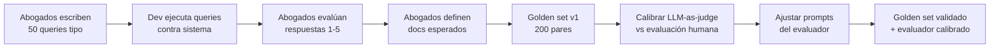
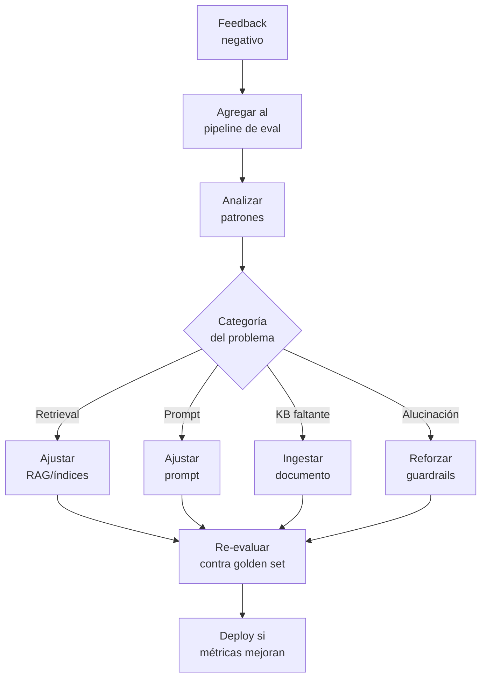
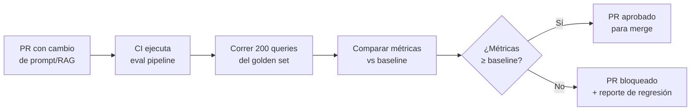

# 05 — Evaluación & Calidad de IA

> **Proyecto:** Legal Ai Ar | **Categoría:** AI Evaluation & Quality
> **Estado:** No definido — todos los ítems son nuevos
> **Última actualización:** Mayo 2026

---

## 1. Descripción

Sin un framework de evaluación, es imposible saber si los cambios en RAG, prompts o agentes mejoran o empeoran las respuestas. En el dominio legal, una degradación no detectada puede llevar a respuestas con normas derogadas, citas inventadas, o interpretaciones erróneas.

Este documento define cómo construir un golden set legal, qué métricas usar, cómo implementar LLM-as-judge, y cómo cerrar el loop de feedback humano para mejora continua.

---

## 2. Decisiones Técnicas

### 2.1 Framework de evaluación

| Alternativa | Pros | Contras | Decisión |
|---|---|---|---|
| **Evaluación manual** | Alta precisión. Abogados evalúan directamente. | No escala. Lento. Subjetivo. No se puede correr en CI. | Para golden set inicial |
| **LLM-as-Judge** | Escala. Automatizable. Reproducible. Puede correr en CI/CD. | El LLM evaluador también puede equivocarse. Costo de API. | **Elegido como evaluación primaria** |
| **Métricas automáticas (ROUGE, BLEU)** | Rápido. Sin costo. Determinístico. | No miden calidad legal. Un resumen con palabras distintas pero correcto scores bajo. | Solo como complemento |
| **RAGAS framework** | Framework completo para eval de RAG. Métricas probadas. | Python-only (no .NET). Requiere adaptación al dominio legal. | Inspiración para métricas |
| **Custom eval pipeline** | Control total. Métricas específicas legales (vigencia, citación, jurisdicción). | Más esfuerzo de desarrollo. | **Elegido — inspirado en RAGAS** |

**Justificación:** Un pipeline custom inspirado en RAGAS pero adaptado al dominio legal, con un LLM-as-Judge como evaluador principal y validación humana periódica para calibrar al evaluador.

### 2.2 Métricas

| Métrica | Qué mide | Cómo se calcula | Target |
|---|---|---|---|
| **Faithfulness** | ¿La respuesta es fiel a los documentos recuperados? | LLM-as-judge verifica cada afirmación contra el contexto | ≥ 0.95 |
| **Answer Relevance** | ¿La respuesta es relevante a la pregunta? | LLM-as-judge: score 1-5 | ≥ 4.0 |
| **Context Precision** | ¿Los documentos recuperados son precisos? | % de docs en top-5 que son relevantes | ≥ 0.70 |
| **Context Recall** | ¿Se recuperaron todos los docs necesarios? | % de docs esperados que aparecen en top-10 | ≥ 0.90 |
| **Citation Accuracy** | ¿Las citas son reales y correctas? | Verificar cada [Ley X, Art. Y] contra la KB | ≥ 0.98 |
| **Vigencia Accuracy** | ¿Se indica correctamente si la norma está vigente? | Verificar flag vigente/derogada contra la DB | 1.00 |
| **Hallucination Rate** | % de respuestas con al menos 1 dato inventado | LLM-as-judge + verificación de citas | ≤ 0.02 |
| **Latencia E2E** | Tiempo desde query hasta respuesta completa | Application Insights P95 | < 5s |
| **Costo por query** | Tokens consumidos * precio por token | Logging de token usage | < $0.05 |

---

## 3. Golden Set Legal

### 3.1 Estructura

```json
{
  "id": "GS-LAB-001",
  "categoria": "laboral",
  "subcategoria": "despido",
  "query": "¿Qué indemnización corresponde por despido sin causa con 8 años de antigüedad?",
  "expected_documents": [
    { "tipo": "norma", "ref": "Ley 20.744, Art. 245", "relevance": 3 },
    { "tipo": "norma", "ref": "Ley 25.877, Art. 5", "relevance": 3 },
    { "tipo": "norma", "ref": "Ley 20.744, Art. 232", "relevance": 2 },
    { "tipo": "jurisprudencia", "ref": "Vizzoti c/ AMSA - CSJN", "relevance": 3 }
  ],
  "expected_answer_contains": [
    "un mes de sueldo por cada año de servicio",
    "fracción mayor de tres meses",
    "mejor remuneración mensual normal y habitual",
    "tope indemnizatorio"
  ],
  "expected_answer_excludes": [
    "artículos que no existen",
    "normas derogadas sin aclaración"
  ],
  "evaluator_notes": "La respuesta debe mencionar tanto el cálculo base (art. 245) como el tope (Vizzoti). Debe distinguir entre texto vigente y original.",
  "created_by": "Dr. García - Abogado laboralista",
  "created_date": "2026-05-01"
}
```

### 3.2 Distribución del golden set

| Rama del derecho | Cantidad de queries | Prioridad |
|---|---|---|
| Laboral | 50 | Alta (core del estudio) |
| Civil y Comercial | 40 | Alta |
| Penal | 30 | Media |
| Administrativo | 25 | Media |
| Procesal | 25 | Alta (cross-cutting) |
| Constitucional | 15 | Media |
| Tributario | 15 | Baja |
| **Total** | **200** | — |

### 3.3 Proceso de construcción



---

## 4. LLM-as-Judge

### 4.1 Prompt del evaluador

```yaml
# prompts/evaluation/judge_faithfulness.yaml
version: "1.0.0"
model: gpt-4o
temperature: 0.0

system_prompt: |
  Sos un evaluador experto en derecho argentino. Tu tarea es evaluar si una 
  respuesta de un asistente legal es fiel a los documentos de contexto proporcionados.

  Para cada afirmación en la respuesta:
  1. ¿Está soportada por el contexto? (supported / not_supported / partially_supported)
  2. ¿La cita es correcta? (correct / incorrect / missing)
  3. ¿La información de vigencia es correcta? (correct / incorrect / not_mentioned)

user_template: |
  PREGUNTA: {query}
  
  CONTEXTO (documentos recuperados):
  {context}
  
  RESPUESTA DEL ASISTENTE:
  {response}
  
  Evaluá la respuesta y respondé en JSON:
  {
    "claims": [
      {
        "claim": "texto de la afirmación",
        "supported": "supported|not_supported|partially_supported",
        "citation_correct": true|false|null,
        "vigencia_correct": true|false|null,
        "explanation": "breve explicación"
      }
    ],
    "faithfulness_score": 0.0-1.0,
    "citation_accuracy": 0.0-1.0,
    "overall_quality": 1-5,
    "issues": ["lista de problemas detectados"]
  }
```

### 4.2 Calibración del evaluador

Para asegurar que el LLM-as-judge es confiable, se calibra contra evaluación humana:

| Métrica de calibración | Qué mide | Target |
|---|---|---|
| **Cohen's Kappa** | Acuerdo LLM-judge vs humano en clasificaciones | ≥ 0.75 |
| **Score correlation** | Correlación de Pearson entre scores LLM y humano | ≥ 0.85 |
| **False negative rate** | % de alucinaciones que el LLM-judge no detecta | ≤ 0.05 |

---

## 5. Human-in-the-Loop Feedback

### 5.1 Feedback del usuario

| Tipo de feedback | UI | Qué se captura |
|---|---|---|
| **Thumbs up/down** | Botones en cada respuesta | Satisfacción binaria |
| **Motivo** (si thumbs down) | Dropdown: "Incorrecto", "Incompleto", "Norma derogada", "Cita inventada", "No entendió la pregunta", "Otro" | Categorización del problema |
| **Corrección** (opcional) | TextArea: "La respuesta correcta es..." | Ground truth del usuario |

### 5.2 Schema de feedback

```sql
CREATE TABLE FeedbackRespuesta (
    Id INT PRIMARY KEY IDENTITY,
    ConversacionId INT FK,
    MensajeId INT FK,
    UsuarioId INT FK,
    Rating BIT NOT NULL,                    -- 1=positivo, 0=negativo
    Motivo NVARCHAR(50),                    -- categoría del problema
    Correccion NVARCHAR(MAX),              -- texto libre del usuario
    QueryOriginal NVARCHAR(MAX),
    RespuestaEvaluada NVARCHAR(MAX),
    ContextoRecuperado NVARCHAR(MAX),       -- JSON de docs usados
    AgenteId NVARCHAR(50),
    PromptVersion NVARCHAR(20),
    FechaCreacion DATETIME2 DEFAULT GETUTCDATE()
);
```

### 5.3 Loop de mejora



---

## 6. Regression Testing

### 6.1 Pipeline CI/CD de evaluación



### 6.2 Monitoreo de drift

| Señal de drift | Cómo se detecta | Acción |
|---|---|---|
| **Drift de calidad** | Faithfulness score baja > 5% en ventana de 7 días | Alerta + revisión de prompts |
| **Drift de latencia** | P95 sube > 30% vs baseline | Alerta + revisión de pipeline |
| **Drift de costo** | Costo promedio/query sube > 20% | Alerta + revisión de token usage |
| **Drift de satisfacción** | Thumbs up rate baja > 10% | Alerta + análisis de feedback |
| **Drift de cobertura** | % de queries sin resultados sube > 5% | Alerta + verificar ingesta |

---

## 7. Cost Tracking

### 7.1 Presupuesto por componente

| Componente | Modelo | Costo estimado | Budget mensual |
|---|---|---|---|
| Agentes (respuestas) | GPT-4o | ~$0.03/query | $150 (5000 queries) |
| Query rewriting | GPT-4o-mini | ~$0.002/query | $10 |
| LLM re-ranking | GPT-4o-mini | ~$0.003/query | $15 |
| Metadata enrichment | GPT-4o-mini | ~$0.005/doc | $25 (5000 docs/mes) |
| Contextual retrieval | GPT-4o-mini | ~$0.003/chunk | $30 (10000 chunks) |
| Embeddings | text-embedding-3-large | ~$0.0001/chunk | $5 |
| LLM-as-judge (eval) | GPT-4o | ~$0.05/eval | $10 (200 evals/mes) |
| AI Search | — | $250/mes (S1) | $250 |
| **Total estimado** | — | — | **~$495/mes** |

---

## 8. Ítems Pendientes de Definición

- [ ] Construir golden set v1 con el estudio de abogados (200 pares query-docs)
- [ ] Implementar pipeline de evaluación automatizada (script .NET o Python)
- [ ] Escribir prompt del LLM-as-judge y calibrar vs evaluación humana
- [ ] Implementar tabla FeedbackRespuesta y UI de feedback
- [ ] Definir baseline de métricas con la primera versión del sistema
- [ ] Configurar alertas de drift en Application Insights
- [ ] Integrar eval pipeline en CI/CD (GitHub Actions)
- [ ] Definir frecuencia de revisión humana (¿semanal? ¿mensual?)
- [ ] Crear dashboard de métricas de calidad por agente
- [ ] Establecer SLAs de calidad (métricas mínimas aceptables)

---

## 9. Referencias

- [RAGAS — RAG Assessment Framework](https://docs.ragas.io/)
- [LLM-as-Judge — Research](https://arxiv.org/abs/2306.05685)
- [Azure Monitor — Application Insights](https://learn.microsoft.com/en-us/azure/azure-monitor/app/app-insights-overview)
- [OpenAI Evals](https://github.com/openai/evals)

---

*05 — Evaluación & Calidad de IA — Legal Ai Ar*
