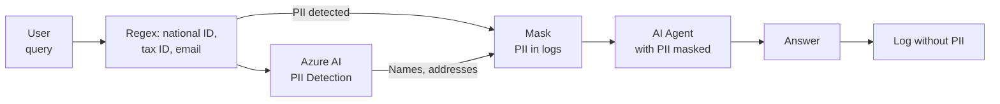

# 06 — AI Security & Compliance

> **Project:** Legal Ai Ar | **Category:** AI Security & Compliance
> **Status:** Partially defined (audit log + Entra ID in F00-W01)
> **Last updated:** May 2026

---

## 1. Description

A tax-legal AI system handles particularly sensitive information: confidential client data, working papers and deliverables per project, advisory strategies and positions, information covered by professional secrecy. Security measures must be stricter than in a generic AI application.

This document defines the AI-specific security layers: content filtering, PII detection, data sovereignty, rate limiting, responsible AI practices, and the obligations of client confidentiality and professional secrecy.

---

## 2. Technical Decisions

### 2.1 Content Filtering

| Alternative | Pros | Cons | Decision |
|---|---|---|---|
| **Azure OpenAI Content Safety (built-in)** | Integrated. No additional cost. Filters hate, violence, sexual, self-harm. Configurable per category. | Does not filter inappropriate legal content (e.g., out-of-scope answers). Not customizable to the domain. | **Chosen as the base layer** |
| **Custom content filter (pre-prompt)** | Customizable to the legal domain. Can filter out-of-scope queries. | Cost of an additional LLM call. Extra latency. | **Chosen as an additional layer** |
| **Guardrails library (NeMo)** | Guardrails framework. Definable rails. Input/output filtering. | Python-only. Additional complexity. External dependency. | Discarded (not .NET) |

**Decision:** Two content-filtering layers:
1. **Azure OpenAI Content Safety:** Built-in filters for general inappropriate content (medium configuration)
2. **Custom scope guard:** System prompt + pre-routing validation that rejects non-legal queries

### 2.2 PII detection and protection

| Sensitive data | Where it may appear | Protection |
|---|---|---|
| **Client names** | User queries, project documents | Not sent to the LLM unless necessary for the query. Anonymization in logs. |
| **National ID / Tax ID (CUIT/CUIL)** | Client and project data | Never included in the RAG context. Masked in logs. |
| **Financial / banking data** | Working papers, client documents | Excluded from the public-KB ingestion pipeline. Stored only in the project workspace. |
| **Advisory strategy / tax position** | Conversations with agents, deliverables | Encrypted at-rest (Azure SQL TDE). Not used as training data. |
| **Personal data of individuals** | Client documents | Automatic anonymization where not needed: replace names with initials. |

### 2.3 PII detection implementation

| Alternative | Pros | Cons | Decision |
|---|---|---|---|
| **Azure AI Language — PII Detection** | Managed service. Detects names, national ID, emails, etc. Supports Spanish. | Cost per request. Latency ~200ms. | **Chosen for input** |
| **Regex patterns** | Fast. Free. Deterministic. | Only detects fixed patterns (national ID, tax ID, email). Does not detect proper names. | Complement |
| **SpaCy NER** | Good for proper names in Spanish. Open source. | Requires model deployment. Not native .NET. | Discarded |

**PII pipeline:**



---

## 3. Client Confidentiality & Professional Secrecy

### 3.1 Framework

PwC tax-legal work is bound by professional secrecy and client-confidentiality duties (the professional codes of ethics and the engagement terms with each client). Information a client shares for an engagement is confidential and may only be accessed by the members of that project/workspace. The professional-privilege regime for matriculated lawyers (Ley 23.187) applies to the legal professionals where relevant.

### 3.2 Implications for Legal Ai Ar

| Obligation | Implementation |
|---|---|
| **Client data cannot leave the system** | Azure OpenAI with data residency in the contracted region. No opt-in to Azure OpenAI abuse monitoring with client data. |
| **Prompts with confidential project data cannot be used to train models** | Azure OpenAI: data is not used for training (opt-out confirmed by Azure). |
| **Per-project restricted access** | RBAC: each member only sees the projects/workspaces they belong to (`ProjectMember`). Admin can see all. Internal-KB items are confidential per project. |
| **Access traceability** | AuditLog records every query that involves confidential project data. |
| **Right to be forgotten** | Ability to delete all information of a project/client from the system (soft delete + scheduled purge). |
| **Limited retention** | Conversations with agents are retained for the period defined by the practice (configurable, default 2 years). |

### 3.3 Azure OpenAI configuration for sensitive data

```json
// Recommended configuration for sensitive legal data
{
  "data_residency": "same-region",         // Data processed in the same region as the resource
  "abuse_monitoring": "opt-out-approved",   // Prompts are not retained for abuse review
  "content_filtering": "custom",            // Custom filters
  "customer_managed_key": true,             // Encryption with the customer's key
  "private_endpoint": true,                 // Access only via private link (no public internet)
  "diagnostic_logs": "enabled"              // Usage logging (without prompt content)
}
```

---

## 4. Rate Limiting & Abuse Prevention

### 4.1 Limits per layer

| Layer | Limit | Implementation |
|---|---|---|
| **Per user** | 100 queries/hour, 500/day | .NET middleware with a sliding window |
| **Per session** | 50 messages per conversation | Count in the Conversation table |
| **Per agent** | 10 tool calls per query | Circuit breaker in Semantic Kernel |
| **Token budget per query** | Max 8K input tokens + 4K output | OpenAI API max_tokens + prompt truncation |
| **Daily token budget (global)** | $50/day (configurable) | Monitor in Application Insights with an alert |
| **Ingestion** | 1000 docs/hour | Queue throttling in Azure Functions |

### 4.2 Rate-limiting response

> The `message` value is end-user facing, so it stays in Spanish; the JSON keys are in English.

```json
// Response when the limit is reached
{
  "error": "rate_limit_exceeded",
  "message": "Has alcanzado el límite de consultas por hora (100). Podés continuar en {minutes_remaining} minutos.",
  "retry_after_seconds": 1800,
  "current_usage": { "hour": 100, "day": 320 },
  "limits": { "hour": 100, "day": 500 }
}
```

---

## 5. Responsible AI Practices

### 5.1 Principles for Legal Ai Ar

| Principle | Implementation |
|---|---|
| **Transparency** | The user always knows they are talking to AI. Answers include a disclaimer. Sources are cited and verifiable. |
| **Human oversight** | Legal Ai Ar is an assistant, not a replacement for the professional. Advisory decisions are made by the professional. The system does not file submissions or commit a position on its own. |
| **Fairness** | The agents do not discriminate by client type, industry, or jurisdiction. Answers are periodically evaluated for bias. |
| **Privacy** | Client data protected by professional secrecy and per-project confidentiality. PII detected and masked. Training opt-out confirmed. |
| **Security** | Content filtering. Scope guardrails. Rate limiting. Full audit logging. |
| **Reliability** | Quality metrics monitored. Fallback when the system cannot answer with confidence. Circuit breakers to avoid degradation. |

### 5.2 Legal disclaimer

Every agent answer includes at the end (end-user facing content, kept in Spanish):

```markdown
---
> **Aviso legal:** Esta información es generada por un sistema de inteligencia
> artificial y tiene carácter orientativo. No constituye asesoramiento legal o
> impositivo profesional ni reemplaza la opinión de un profesional habilitado.
> Verificá siempre las fuentes citadas y consultá con el profesional responsable
> del proyecto para tu caso particular. La información legal e impositiva puede
> haber cambiado después de la última actualización de la base de conocimiento
> ({fecha_ultima_ingesta}).
```

---

## 6. Data Residency and Data Sovereignty

### 6.1 Requirements

| Requirement | Implementation |
|---|---|
| **Data in Argentina / LATAM** | Azure region: Brazil South (closest with all services). Alternative: East US 2 if Brazil South does not have Azure OpenAI available. |
| **Data never leaves the region** | Private endpoints for all services. No cross-region replication. |
| **Ley 25.326 (Personal Data Protection)** | Registration of databases with AAIP. Informed consent. Right of access and deletion. |
| **Confidential client data** | Client documents and working papers are restricted-access. Only the authorized members of each project/workspace can access them. |

---

## 7. Items Pending Definition

- [ ] Configure Azure OpenAI with a private endpoint and abuse-monitoring opt-out
- [ ] Implement the PII detection pipeline (Azure AI Language + regex)
- [ ] Define the conversation retention policy with the practice
- [ ] Implement rate-limiting middleware in .NET
- [ ] Design the soft delete + purge mechanism for the right to be forgotten
- [ ] Define the final Azure region (Brazil South vs East US 2) based on service availability
- [ ] Evaluate the need to register the database with AAIP (Ley 25.326)
- [ ] Implement RBAC at the project/workspace level (member only sees their projects; `ProjectMember`)
- [ ] Define the Azure OpenAI Content Safety filters (levels per category)
- [ ] Create an AI security incident runbook (data breach, dangerous hallucination)

---

## 8. References

- [Azure OpenAI — Data Privacy](https://learn.microsoft.com/en-us/legal/cognitive-services/openai/data-privacy)
- [Azure AI Language — PII Detection](https://learn.microsoft.com/en-us/azure/ai-services/language-service/personally-identifiable-information/overview)
- [Ley 25.326 — Personal Data Protection](http://www.infoleg.gob.ar/infolegInternet/anexos/60000-64999/64790/norma.htm)
- [Ley 23.187 — Practice of Law](http://www.saij.gob.ar/)
- [Azure OpenAI — Content Filtering](https://learn.microsoft.com/en-us/azure/ai-services/openai/concepts/content-filter)
- [Microsoft Responsible AI Principles](https://www.microsoft.com/en-us/ai/responsible-ai)

---

*06 — AI Security & Compliance — Legal Ai Ar*
