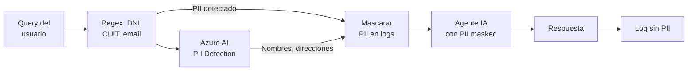

# 06 — Seguridad & Compliance IA

> **Proyecto:** Legal Ai Ar | **Categoría:** AI Security & Compliance
> **Estado:** Parcialmente definido (audit log + Entra ID en F00-W01)
> **Última actualización:** Mayo 2026

---

## 1. Descripción

Un sistema de IA legal maneja información particularmente sensible: datos de expedientes judiciales, estrategias legales de clientes, información privilegiada protegida por el secreto profesional abogado-cliente. Las medidas de seguridad deben ser más estrictas que en una aplicación de IA genérica.

Este documento define las capas de seguridad específicas para la componente de IA: content filtering, detección de PII, soberanía de datos, rate limiting, prácticas de IA responsable, y las obligaciones legales del secreto profesional.

---

## 2. Decisiones Técnicas

### 2.1 Content Filtering

| Alternativa | Pros | Contras | Decisión |
|---|---|---|---|
| **Azure OpenAI Content Safety (built-in)** | Integrado. Sin costo adicional. Filtra hate, violence, sexual, self-harm. Configurable por categoría. | No filtra contenido legal inapropiado (ej: respuestas fuera de scope). No es customizable a dominio. | **Elegido como capa base** |
| **Custom content filter (pre-prompt)** | Customizable al dominio legal. Puede filtrar consultas fuera de scope. | Costo de LLM call adicional. Latencia extra. | **Elegido como capa adicional** |
| **Guardrails library (NeMo)** | Framework de guardrails. Rails definibles. Input/output filtering. | Python-only. Complejidad adicional. Dependencia externa. | Descartado (no .NET) |

**Decisión:** Dos capas de content filtering:
1. **Azure OpenAI Content Safety:** Filtros built-in para contenido inapropiado general (configuración media)
2. **Scope guard custom:** System prompt + validación pre-routing que rechaza consultas no legales

### 2.2 Detección y protección de PII

| Dato sensible | Dónde puede aparecer | Protección |
|---|---|---|
| **Nombres de clientes** | Queries del usuario, expedientes | No se envían a LLM salvo que sea necesario para la consulta. Anonymización en logs. |
| **DNI / CUIT** | Datos de expedientes | Nunca se incluyen en el contexto RAG. Masked en logs. |
| **Datos bancarios** | Expedientes civiles/laborales | Excluidos del pipeline de ingesta. No se indexan. |
| **Estrategia legal** | Conversaciones con agentes | Encriptadas at-rest (Azure SQL TDE). No se usan como training data. |
| **Carátulas con menores** | Jurisprudencia de familia | Anonimización automática: reemplazo de nombres por iniciales. |

### 2.3 Implementación de PII detection

| Alternativa | Pros | Contras | Decisión |
|---|---|---|---|
| **Azure AI Language — PII Detection** | Servicio managed. Detecta nombres, DNI, emails, etc. Soporta español. | Costo por request. Latencia ~200ms. | **Elegido para input** |
| **Regex patterns** | Rápido. Gratis. Determinístico. | Solo detecta patrones fijos (DNI, CUIT, email). No detecta nombres propios. | Complemento |
| **SpaCy NER** | Bueno para nombres propios en español. Open source. | Requiere deploy de modelo. No .NET nativo. | Descartado |

**Pipeline de PII:**



---

## 3. Secreto Profesional Abogado-Cliente

### 3.1 Marco legal

El secreto profesional del abogado está protegido por la Ley 23.187 (Ejercicio de la Abogacía) y los códigos de ética profesional. Toda información que un cliente comparte con su abogado está protegida y no puede ser revelada.

### 3.2 Implicancias para Legal Ai Ar

| Obligación | Implementación |
|---|---|
| **Los datos del cliente no pueden salir del sistema** | Azure OpenAI con data residency en la región contratada. No opt-in a Azure OpenAI abuse monitoring con datos del cliente. |
| **Los prompts con datos de expedientes no pueden usarse para entrenar modelos** | Azure OpenAI: datos no se usan para training (opt-out confirmado por Azure). |
| **Acceso restringido por caso** | RBAC: cada abogado solo ve los expedientes que tiene asignados. Admin puede ver todos. |
| **Trazabilidad de acceso** | AuditLog registra toda consulta que involucre datos de expedientes. |
| **Derecho al olvido** | Capacidad de eliminar toda la información de un expediente/cliente del sistema (soft delete + purge programado). |
| **Retención limitada** | Conversaciones con agentes se retienen por el período que defina el estudio (configurable, default 2 años). |

### 3.3 Configuración de Azure OpenAI para datos sensibles

```json
// Configuración recomendada para datos legales sensibles
{
  "data_residency": "same-region",         // Datos procesados en la misma región del recurso
  "abuse_monitoring": "opt-out-approved",   // No se retienen prompts para revisión de abuso
  "content_filtering": "custom",            // Filtros customizados
  "customer_managed_key": true,             // Encriptación con clave del cliente
  "private_endpoint": true,                 // Acceso solo via private link (sin internet público)
  "diagnostic_logs": "enabled"              // Logging de uso (sin contenido de prompts)
}
```

---

## 4. Rate Limiting & Abuse Prevention

### 4.1 Límites por capa

| Capa | Límite | Implementación |
|---|---|---|
| **Por usuario** | 100 queries/hora, 500/día | Middleware .NET con sliding window |
| **Por sesión** | 50 mensajes por conversación | Conteo en tabla Conversacion |
| **Por agente** | 10 tool calls por query | Circuit breaker en Semantic Kernel |
| **Token budget por query** | Max 8K tokens de input + 4K de output | OpenAI API max_tokens + prompt truncation |
| **Token budget diario (global)** | $50/día (configurable) | Monitor en Application Insights con alerta |
| **Ingesta** | 1000 docs/hora | Queue throttling en Azure Functions |

### 4.2 Respuesta al rate limiting

```json
// Respuesta cuando se alcanza el límite
{
  "error": "rate_limit_exceeded",
  "message": "Has alcanzado el límite de consultas por hora (100). Podés continuar en {minutes_remaining} minutos.",
  "retry_after_seconds": 1800,
  "current_usage": { "hour": 100, "day": 320 },
  "limits": { "hour": 100, "day": 500 }
}
```

---

## 5. Responsible AI Practices

### 5.1 Principios para Legal Ai Ar

| Principio | Implementación |
|---|---|
| **Transparencia** | El usuario siempre sabe que está hablando con IA. Las respuestas incluyen disclaimer. Las fuentes son citadas y verificables. |
| **Supervisión humana** | Legal Ai Ar es un asistente, no reemplaza al abogado. Las decisiones legales las toma el profesional. El sistema no realiza presentaciones judiciales automáticas. |
| **Equidad** | Los agentes no discriminan por tipo de causa, parte procesal, o jurisdicción. Se evalúa periódicamente si hay sesgos en las respuestas. |
| **Privacidad** | Datos de clientes protegidos por secreto profesional. PII detectado y masked. Opt-out de training confirmado. |
| **Seguridad** | Content filtering. Guardrails de scope. Rate limiting. Audit logging completo. |
| **Confiabilidad** | Métricas de calidad monitoreadas. Fallback cuando el sistema no puede responder con confianza. Circuit breakers para evitar degradación. |

### 5.2 Disclaimer legal

Toda respuesta de un agente incluye al final:

```markdown
---
> **Aviso legal:** Esta información es generada por un sistema de inteligencia 
> artificial y tiene carácter orientativo. No constituye asesoramiento legal 
> profesional ni reemplaza la opinión de un abogado matriculado. Verificá 
> siempre las fuentes citadas y consultá con un profesional para tu caso 
> particular. La información legal puede haber cambiado después de la última 
> actualización de la base de conocimiento ({fecha_ultima_ingesta}).
```

---

## 6. Data Residency y Soberanía de Datos

### 6.1 Requisitos

| Requisito | Implementación |
|---|---|
| **Datos en Argentina / LATAM** | Azure region: Brazil South (más cercana con todos los servicios). Alternativa: East US 2 si Brazil South no tiene Azure OpenAI disponible. |
| **Datos nunca salen de la región** | Private endpoints para todos los servicios. No replicación cross-region. |
| **Ley 25.326 (Protección de Datos Personales)** | Registro de bases de datos ante AAIP. Consentimiento informado. Derecho de acceso y supresión. |
| **Datos judiciales** | Los datos de expedientes judiciales son de acceso restringido por ley. Solo usuarios autorizados del estudio pueden acceder. |

---

## 7. Ítems Pendientes de Definición

- [ ] Configurar Azure OpenAI con private endpoint y opt-out de abuse monitoring
- [ ] Implementar pipeline de PII detection (Azure AI Language + regex)
- [ ] Definir política de retención de conversaciones con el estudio
- [ ] Implementar rate limiting middleware en .NET
- [ ] Diseñar el mecanismo de soft delete + purge para derecho al olvido
- [ ] Definir la región Azure final (Brazil South vs East US 2) según disponibilidad de servicios
- [ ] Evaluar necesidad de registro de base de datos ante AAIP (Ley 25.326)
- [ ] Implementar RBAC a nivel de expediente (abogado solo ve sus casos)
- [ ] Definir los filtros de Content Safety de Azure OpenAI (niveles por categoría)
- [ ] Crear runbook de incidentes de seguridad de IA (breach de datos, alucinación peligrosa)

---

## 8. Referencias

- [Azure OpenAI — Data Privacy](https://learn.microsoft.com/en-us/legal/cognitive-services/openai/data-privacy)
- [Azure AI Language — PII Detection](https://learn.microsoft.com/en-us/azure/ai-services/language-service/personally-identifiable-information/overview)
- [Ley 25.326 — Protección de Datos Personales](http://www.infoleg.gob.ar/infolegInternet/anexos/60000-64999/64790/norma.htm)
- [Ley 23.187 — Ejercicio de la Abogacía](http://www.saij.gob.ar/)
- [Azure OpenAI — Content Filtering](https://learn.microsoft.com/en-us/azure/ai-services/openai/concepts/content-filter)
- [Microsoft Responsible AI Principles](https://www.microsoft.com/en-us/ai/responsible-ai)

---

*06 — Seguridad & Compliance IA — Legal Ai Ar*
