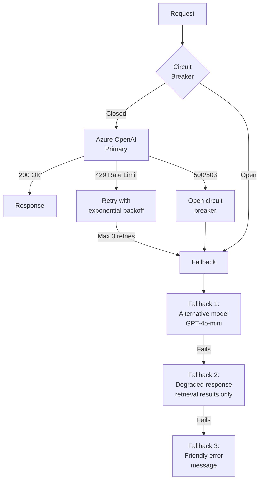
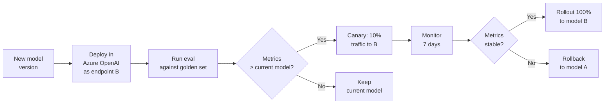

# 07 — Observability & LLMOps

> **Project:** Legal Ai Ar | **Category:** Observability & LLM Operations
> **Status:** Partially defined (Application Insights + Serilog in F00-W01)
> **Last updated:** May 2026

---

## 1. Description

Operating an AI system in production requires specific observability that goes beyond traditional APM: tracing of agent chains, token consumption monitoring, quality degradation detection, and caching and resilience strategies for the LLM APIs.

LLMOps (LLM Operations) is the discipline that covers the operational lifecycle of language models in production: deploy, monitoring, versioning, fallback, and cost optimization.

---

## 2. Technical Decisions

### 2.1 Observability stack

| Alternative | Pros | Cons | Decision |
|---|---|---|---|
| **Application Insights + Serilog** | Already in the stack. Native Azure. Distributed tracing. Alerts. Dashboards. | No native LLM concepts (tokens, prompts, completions). Requires custom telemetry. | **Chosen as the base** |
| **LangSmith / LangFuse** | Designed for LLM observability. Chain tracing. Prompt versioning. Integrated eval. | External service. Sensitive data outside Azure. Additional cost. Python-first. | Discarded (sensitive data) |
| **OpenTelemetry + custom exporter** | Open standard. Semantic conventions for GenAI (draft). Portable. | The GenAI conventions are draft (not stable). More manual setup. | **Chosen as the instrumentation layer** |
| **Semantic Kernel Telemetry** | Built-in in SK. Emits traces of planning, tool calls, completions. Compatible with OpenTelemetry. | Only covers the SK layer, not the full pipeline. | **Chosen — integrates with App Insights** |

**Decision:** OpenTelemetry as the instrumentation standard → Application Insights as the backend → Semantic Kernel telemetry as the source of agent traces. Custom metrics for token usage and quality.

### 2.2 Distributed tracing structure

```mermaid
flowchart TB
    subgraph "Trace: user-query-12345"
        A[Span: HTTP Request<br/>POST /api/chat] --> B[Span: Router<br/>classify intent]
        B --> C[Span: Regulatory Agent<br/>process query]
        C --> D[Span: Query Rewrite<br/>LLM call #1]
        D --> E[Span: Hybrid Search<br/>AI Search call]
        E --> F[Span: Graph Enrichment<br/>SQL Graph query]
        F --> G[Span: LLM Re-rank<br/>LLM call #2]
        G --> H[Span: Generate Response<br/>LLM call #3]
        H --> I[Span: Citation Verify<br/>LLM call #4]
        I --> J[Span: HTTP Response<br/>SSE stream]
    end
```



### 2.3 Custom metrics for LLM

```csharp
// Pseudo-code for custom telemetry
public class LlmTelemetry
{
    private static readonly Meter s_meter = new("Legal Ai Ar.LLM");

    // Counters
    private static readonly Counter<long> s_tokensInput =
        s_meter.CreateCounter<long>("llm.tokens.input", "tokens");
    private static readonly Counter<long> s_tokensOutput =
        s_meter.CreateCounter<long>("llm.tokens.output", "tokens");
    private static readonly Counter<long> s_llmCalls =
        s_meter.CreateCounter<long>("llm.calls.total");

    // Histograms
    private static readonly Histogram<double> s_latency =
        s_meter.CreateHistogram<double>("llm.latency", "ms");
    private static readonly Histogram<double> s_costPerQuery =
        s_meter.CreateHistogram<double>("llm.cost.per_query", "usd");

    // Gauges via UpDownCounter
    private static readonly UpDownCounter<long> s_activeRequests =
        s_meter.CreateUpDownCounter<long>("llm.requests.active");

    public void RecordCompletion(string model, string agent, int inputTokens,
                                  int outputTokens, double latencyMs)
    {
        var tags = new TagList
        {
            { "model", model },
            { "agent", agent }
        };
        s_tokensInput.Add(inputTokens, tags);
        s_tokensOutput.Add(outputTokens, tags);
        s_llmCalls.Add(1, tags);
        s_latency.Record(latencyMs, tags);

        var cost = CalculateCost(model, inputTokens, outputTokens);
        s_costPerQuery.Record(cost, tags);
    }
}
```

---

## 3. Semantic Caching

### 3.1 Strategy

| Alternative | Pros | Cons | Decision |
|---|---|---|---|
| **No cache** | Simple. Always fresh data. | High cost: same query = same tokens. Unnecessary latency. | Discarded |
| **Exact cache (key = query hash)** | Simple. Fast. Deterministic. | Only matches identical queries. "¿Qué dice el art 245?" ≠ "Art. 245 LCT?" | Insufficient alone |
| **Semantic cache (key = embedding)** | Similar queries share the cache. High hit rate. | Requires an embedding of each query ($). Risk of serving an incorrect answer for a similar but different query. | **Chosen with a high threshold** |
| **Azure Redis + semantic** | Redis as the store. Embedding similarity for matching. Configurable TTL. | Additional service. | Evaluated — use Table Storage first |

**Decision:** Semantic cache with Azure Table Storage. Embedding of the query → look up in the cache with cosine similarity > 0.95. TTL of 24h for search results, 1h for agent answers (the KB may update).

### 3.2 What is cached and what is not

| Operation | Cache? | TTL | Rationale |
|---|---|---|---|
| Query embedding | Yes | 7 days | Same text = same embedding always |
| Hybrid Search results | Yes | 24h | The indexes update daily |
| Graph enrichment | Yes | 24h | The graph changes only with ingestion |
| LLM query rewrite | Yes | 7 days | Same query = same rewrite |
| LLM response (agent) | Yes (semantic) | 1h | May depend on updated context |
| LLM re-ranking | No | — | Depends on the retrieved context |

---

## 4. Resilience: Fallback & Circuit Breaker

### 4.1 Resilience patterns



### 4.2 Configuration with Polly (.NET)

```csharp
// Pseudo-configuration of resilience with Polly v8
services.AddHttpClient("AzureOpenAI")
    .AddResilienceHandler("llm-pipeline", builder =>
    {
        // Retry with exponential backoff for 429
        builder.AddRetry(new RetryStrategyOptions<HttpResponseMessage>
        {
            MaxRetryAttempts = 3,
            Delay = TimeSpan.FromSeconds(2),
            BackoffType = DelayBackoffType.Exponential,
            ShouldHandle = new PredicateBuilder<HttpResponseMessage>()
                .HandleResult(r => r.StatusCode == HttpStatusCode.TooManyRequests)
        });

        // Circuit breaker for server errors
        builder.AddCircuitBreaker(new CircuitBreakerStrategyOptions<HttpResponseMessage>
        {
            FailureRatio = 0.5,
            MinimumThroughput = 10,
            SamplingDuration = TimeSpan.FromSeconds(30),
            BreakDuration = TimeSpan.FromSeconds(60)
        });

        // Global timeout
        builder.AddTimeout(TimeSpan.FromSeconds(30));
    });
```

---

## 5. Model Versioning & A/B Deploy

### 5.1 Model versioning strategy

| Aspect | Strategy |
|---|---|
| **Main model** | GPT-4o (pinned version, e.g., `2024-08-06`) |
| **Economical model** | GPT-4o-mini for auxiliary tasks (rewrite, classify, enrich) |
| **Update** | Do not update automatically. Test the new version against the golden set before migrating. |
| **Rollback** | Keep the previous deployment active in Azure OpenAI. Endpoint switch via config (not deploy). |

### 5.2 Model update flow



---

## 6. Dashboards

### 6.1 Operational dashboard (Application Insights)

| Panel | Metrics | Granularity |
|---|---|---|
| **LLM Usage** | Tokens in/out per model, calls/min, accumulated cost | 1 min |
| **Latency** | P50/P95/P99 per agent, per operation (search, rewrite, response) | 5 min |
| **Errors** | Rate of 429, 500, timeouts. Circuit breaker state. | 1 min |
| **Quality** | Faithfulness score, citation accuracy, thumbs up rate | 1 hour |
| **Cache** | Hit rate, miss rate, cache size | 5 min |
| **Ingestion** | Docs processed/hour, errors, dead letter queue size | 15 min |

### 6.2 Alerts

| Alert | Condition | Severity | Action |
|---|---|---|---|
| High error rate | > 5% of requests with errors in 5 min | Critical | PagerDuty → on-call |
| Cost spike | Daily spend > 150% of the average | High | Email to tech lead |
| Latency degradation | P95 > 8s for 10 min | High | Investigate + consider fallback |
| Circuit breaker open | Any circuit breaker opens | Critical | Check Azure OpenAI status |
| Quality drop | Faithfulness < 0.90 over a 4h window | Medium | Review recent changes |
| Cache miss spike | Hit rate < 50% for 1h | Low | Check TTLs and warming |

---

## 7. Items Pending Definition

- [ ] Implement custom telemetry for LLM calls (tokens, latency, cost)
- [ ] Configure Semantic Kernel telemetry with OpenTelemetry → App Insights
- [ ] Implement semantic caching with Table Storage
- [ ] Configure Polly for retry + circuit breaker in the Azure OpenAI HttpClient
- [ ] Create dashboards in Application Insights (LLM Usage, Latency, Errors, Quality)
- [ ] Define alerts and routing (email, Teams, PagerDuty)
- [ ] Implement the canary deploy pipeline for model changes
- [ ] Define the log retention policy (30 days? 90 days?)
- [ ] Evaluate whether to add Azure Redis Cache for high-volume semantic caching
- [ ] Create an LLM incident troubleshooting runbook

---

## 8. References

- [OpenTelemetry — Semantic Conventions for GenAI](https://opentelemetry.io/docs/specs/semconv/gen-ai/)
- [Semantic Kernel — Telemetry](https://learn.microsoft.com/en-us/semantic-kernel/concepts/enterprise-readiness/observability/)
- [Polly v8 — Resilience Pipelines](https://www.thepollyproject.org/)
- [Application Insights — Custom Metrics](https://learn.microsoft.com/en-us/azure/azure-monitor/app/api-custom-events-metrics)

---

*07 — Observability & LLMOps — Legal Ai Ar*
